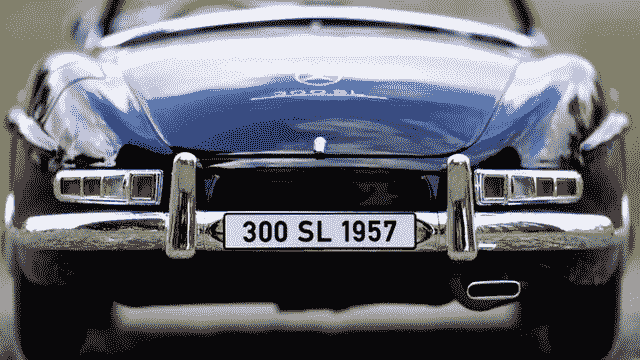
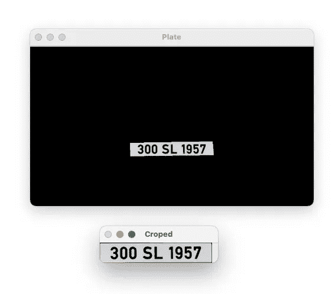

# 用 OpenCV-Python 实现车牌检测

> 原文：<https://medium.com/mlearning-ai/license-plate-detection-with-opencv-python-e14ff6f9f2de?source=collection_archive---------2----------------------->

在这篇博文中，我们将使用 OpenCV 做一个小项目。在这个项目中，我将尝试解释我们如何从车辆图像中检测出车辆的牌照。博客帖子的内容如下:

*   为什么要检测车牌？
*   关于车牌检测的代码部分
*   代码审查和解释
*   摘要

你可以跟着我学习和复习更多像这样的计算机视觉应用。我们开始吧。

您可以关注我的 GitHub 个人资料，了解与应用程序相关的代码以及更多内容。

github:[https://github.com/keremkargin0](https://github.com/keremkargin0)

## 为什么要检测车牌？



车牌检测已经成为最近最流行的应用之一。你可能想知道为什么我们要检测车牌。这也是我为什么要说这个项目可以在哪里实施的原因。

例如，当向进入停车场的车辆开罚单时，可以在停车场中使用牌照检测。在这种情况下，当车辆来到栅栏前时，它们的车牌被读取，属于该车牌的车票从系统中创建。在属于相关牌照的车辆在停车场期间，该票证可用于计算费用支付过程。

除此之外，我们可能在某个地区寻找属于某个牌照的车辆。为了做到这一点，让我们假设我们也有监控所有路径的摄像机。通过检测经过摄像头的每辆车的牌照并将其保存在一个列表中，如果该车辆与被搜索车辆的牌照相匹配，就可以直接跟踪该车辆。

我试图通过与你们分享我想到的几个例子来使这个问题更容易理解。让我们现在开始写代码。然后我会一一描述所有的步骤。

## 关于车牌检测的代码部分

License Plate Detection

## 代码审查和解释

在这一节中，我将尝试解释它的含义以及在编写分步代码时的用法。

*   首先，我们导入将在整个项目中使用的必要库。

```
cv2, numpy, pytesseract (to be able to read text in image), imutils
```

*   在我们的项目中，我们读取想要检测车牌的车辆的图像，并将其保存为**车牌**变量。

```
Here cv2.imread function is used.
```

*   由于我们将对图像进行一些操作，我们首先将图像从 bgr 转换为灰度格式。

```
We apply COLOR_BGR2GRAY using the cv2.cvtColor function.
```

*   我们对灰度格式的图像进行过滤处理。

```
In this section, we are using the bilateralFilter. So we do the softening process to the image. You can adjust the softening rate by changing the values here.
```

*   我们正在检测过滤图像中的角点。在这里，我们应用了上面的过滤过程，以使角点确定得更准确，并突出显示车牌。我们保存其角被检测为边缘的图像。

```
We use the **Canny** function to find corners. As an argument, it takes the image whose corners will be found, and the minimum and maximum threshold values. Threshold values are as I have adjusted properly to find the corners. By changing these values, you can observe how the corner finding rate changes.
```

*   我们需要用找到的角在视觉上找到轮廓。因此，在下一步中，我们将裁剪图像以确定车牌所在的区域。

```
We use cv2.findContours function to find contours. It takes as argument the image whose contours will be found and in addition to it, 2 experimentally accepted arguments. One of them is cv2.RETR_TREE and the other is cv2.CHAIN_APPROX_SIMPLE. You can always use these arguments in the same way.
```

*   我们用找到的轮廓在视觉上捕捉适当的轮廓。为此，我们将使用 imutils 库。

```
The imutils.grab_contours function captures the contours.
```

*   找到合适的轮廓后，我们需要列出我们捕捉到的轮廓。因为我们实际上在找一个带盘子的长方形盒子。在这一点上，我们将尝试通过查看我们捕捉到的轮廓来找到这个矩形。作为寻找矩形时的一个重要点，我们应该知道我们寻找的是一个接一个定位的轮廓。如果这些连续的点形成一个矩形，我们可以说板块在这里。

```
We will use the sorted function to sort the contours. It takes the captured **contours** as arguments, by what the contours will be sorted, and whether to sort from largest to smallest or largest to largest. If we say reverse = True, it sorts the entered values in reverse order, ie from greater to less.
```

*   我们编写一个 for 循环，在我们要寻找的轮廓内找到一个 4 边闭合的形状。在写这个之前，我们定义一个名为 screen 的变量。因为我们很快就会在 for 循环中使用它。

```
We will look at every element of the **cnts** variable. Epsilon is an empirically proven value, so you can always use it that way. We start looking for a shape from contours with the approxPolyDP function. The argument True at the end of the function is given because it is a closed shape. We save these values in approx. If we get a situation equal to 4 in approx, congratulations we have found the plate. As a result of this situation, we can break the cycle.
```

*   我们将对我们检测到的该板区域应用遮蔽过程。

```
We create a canvas called mask that is the same size as the image.
```

*   我们要在画布上画一幅画，叫做这个面具。我们希望在屏幕变量中保存板的区域绘制该图。它将坐标信息保存在屏幕变量中。

```
While doing this drawing, we use the function cv2.drawContours. We turn the plate area white. All remaining areas will be black.
```

*   我们将把印版区域中的文本粘贴到这个轮廓区域。

```
We do this with the function cv2.bitwise_and.
```

*   我们正在做一些操作来裁剪板块区域。
*   因此，使用*pytesseract 库，我们从视觉上读取图像中的版材信息并将其打印为文本。*

```
*For this, we use the image_to_string function from the pytesseract library. As an argument, it takes the visual that the text will be read and the language in which this text is to be read. I choose Turkish language to try here. If you want to try it in your own language, you may need to download it additionally. English language is automatically included in the Pytesseract library. You can also do many operations in the English language.*
```

*   *最后，我们将这个图版作为文本打印在屏幕上。我们在屏幕上显示车牌图像。*

**

*Detected Plate*

## *摘要*

*因此，我们需要看到一辆特定牌照的车辆。当这个条件被满足时，我们在执行一些操作如过滤、遮蔽、确定这个视觉的轮廓之后，使用从视觉中读取文本的功能。因此，我们可以读取车辆的牌照，并在屏幕上以文本形式打印出来。我希望这份申请对你有用。别忘了继续关注下一个应用。*

*在做这些应用的时候，我受到了下面链接中的课程的启发。*

*[计算机视觉课程](https://www.udemy.com/course/opencv-a-ztm-uygulamalarla-goruntu-isleme-2019-18-saat/)*