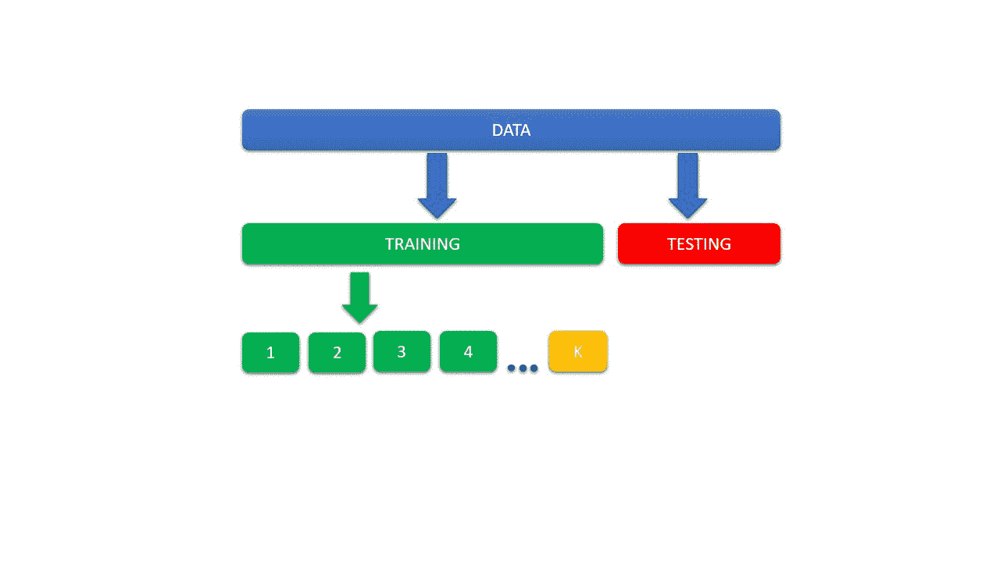
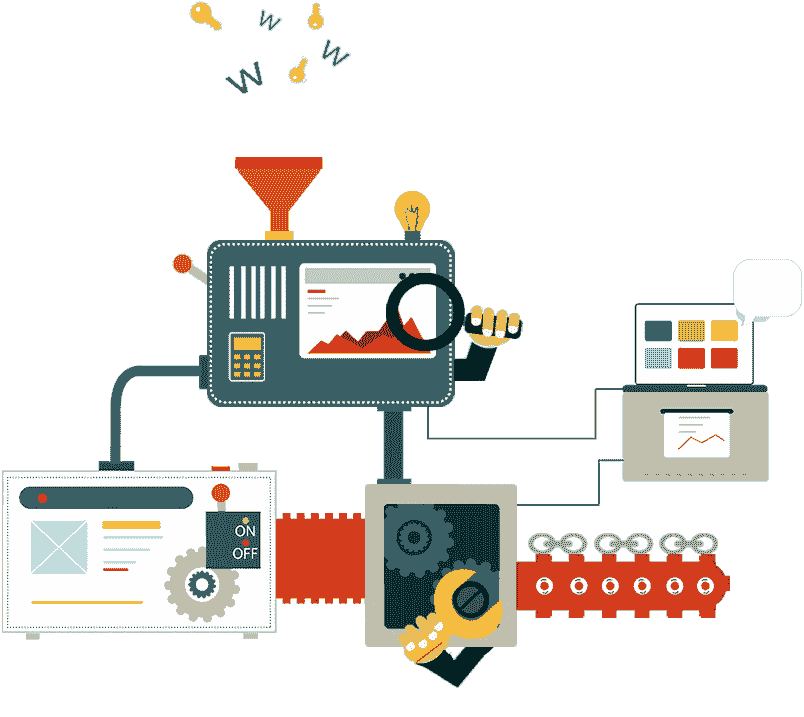

# 数据科学项目的生命周期！

> 原文：<https://medium.com/mlearning-ai/life-cycle-of-data-science-projects-a4739f6e2419?source=collection_archive---------0----------------------->

## 从收集数据到模型部署(端到端)

## 1.数据收集

数据收集是数据科学生命周期项目的第一步。这是生命周期中最重要的事情之一。数据可以从各种地方获取，如互联网、公司数据、数据库等等…

## 2.探索性数据分析

收集完数据后，我们需要做探索性的数据分析。这是可视化、总结和解释隐藏在行和列特性中的信息的方式。

## 3.特征工程

**a .处理缺失值:**缺失值是你在做特征工程/数据准备时看到的最常见的问题之一。价值缺失的主要原因是人为错误和数据隐私等…

**b .处理重复数据:**通常我们必须删除数据集中的重复数据，因为这可能会导致过度拟合问题。

**c .处理异常值:**由于大多数机器学习和深度学习算法都很敏感，因此可能需要较长的训练时间，这也给我们带来了不太准确的模型和较差的结果。

**d .处理分类特征:**由于算法不理解分类数据，我们需要将其转换成数值。

**e .处理不平衡数据:**当一个或多个类别与其他类别相比在训练数据中具有非常低的比例/概率时，就会出现不平衡。如果我们不处理不平衡的数据，我们的模型给我们的预测性能很差，特别是对于少数民族。

## 4.特征缩放

在执行了特征工程部分之后，我们需要进行特征缩放。要素缩放的目标是将所有数据缩小到相同的比例，因为每个要素可能在不同的范围内变化。

## 5.特征选择

特征选择用于移除不相关和不必要的特征。通过使用特征选择，我们可以只使用对模型预测重要的重要特征。

## 6.列车测试分离

我们将数据分为训练和测试，以避免模型过度拟合，并观察模型的表现。

## 7.模型创建

我们将在一组训练数据上训练一个模型，为它提供一个机器学习算法，它可以从这些数据中学习并预测未来的数据。

## 8.超参数调谐

超参数用于选择学习模型的最佳参数，使我们的模型能够有效地解决数据科学问题。

## 9.模型部署

模型部署是数据科学生命周期项目的最后一个阶段。构建数据科学模型的主要目标是解决一个问题，而数据科学模型只有在生产并被消费者积极使用时才能做到。

请随时留下您的评论、建议或任何错误。😊

**帮我接通:**[**LinkedIn**](https://www.linkedin.com/in/sagar-dhandare-a401271a3/)**|**[**GitHub**](https://github.com/SagarDhandare)**|**[**邮箱**](mailto: sagardhandare3@gmail.com)

**快乐学习！！！^_^**