# 里纳尔格-克莱姆法则

> 原文：<https://medium.com/mlearning-ai/linalg-cramers-rule-637fb4d1dc77?source=collection_archive---------5----------------------->

克莱姆法则，用几何学解释——3 蓝 1 棕

## 克莱姆法则是什么？

克莱姆法则是一种使用**行列式**到**求解方程组**的方法，这些方程组的变量与**的方程数量相同。**

假设我们有这样一个方程组:

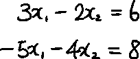

我们可以用矩阵和向量来表示。

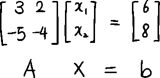

我们可以从定义一个新的矩阵 Aᵢ(b 开始，这可以通过用向量 b 代替矩阵 a 的 iᵗʰ列来实现

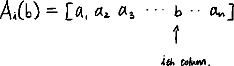

克莱姆法则:当矩阵 a 可逆时，解 x 可以表示为 xᵢ:

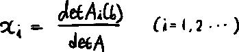

举个例子，

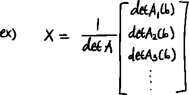

所以使用我们的例子，我们首先需要检查行列式是否不为 0。

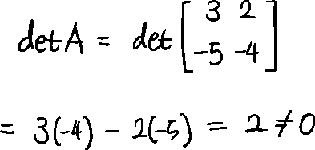

calculating the determinant

现在我们知道我们的矩阵 A 是可逆矩阵。

新定义的矩阵 Aᵢ(b)会是这样的:

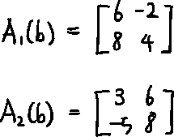

每个矩阵的行列式为:

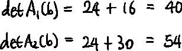

解决方案是:

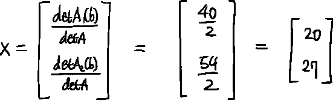

## 为什么这个规则是这样的？

利用行列式，我们可以更好地理解克莱姆法则。

假设我们有，

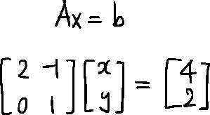

我们想找到匹配的向量 x。

转换(应用矩阵 A)前的初始状态如下所示:

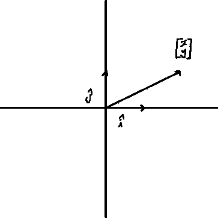

这里，我们要用一种特殊的方式来表示向量 x 的 x 和 y 坐标，用平行四边形。

<y-coordinate></y-coordinate>

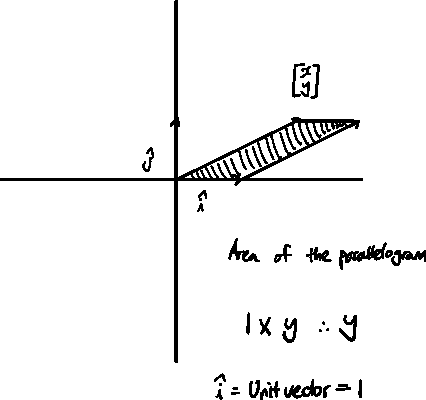

我们可以说向量 x 的 y 坐标正好是 y，但是平行四边形的这个面积也可以表示向量 x(变换前)的 y 坐标，因为它乘以了单位向量 i-hat(长度= 1)。

<x-coordinate></x-coordinate>

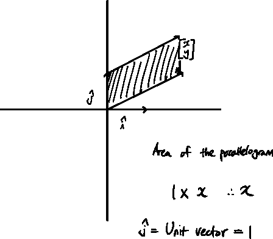

我们可以说，向量 x 的 x 坐标正好是 x，但平行四边形的这个面积也可以表示向量 x(变换前)的 x 坐标，因为它乘以了单位向量 j-hat(长度= 1)。

**如果我们在这里应用线性变换会怎么样？**

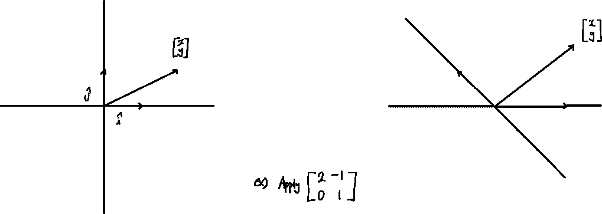

<y-coordinate></y-coordinate>

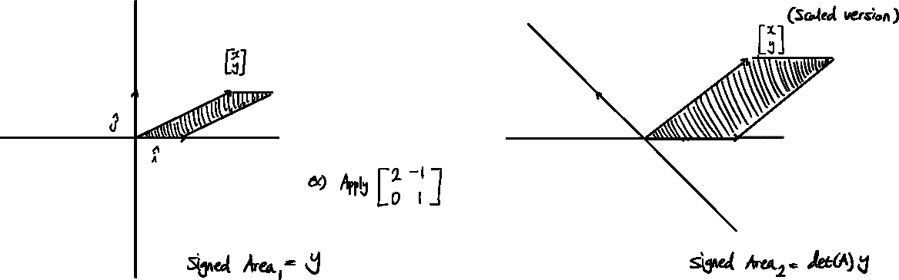

行列式告诉我们系统改变了多少。平行四边形的面积也会改变，改变的量是行列式的量。

所以新的平行四边形是:det(A) * y

所以 y 坐标可以写成:

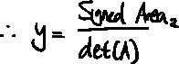

为了计算带符号的 Area₂，我们可以计算缩放的 i-hat 和缩放的向量 x 的 j-hat 着陆位置之间的行列式。所以我们要找的矢量 x 的最终 y 坐标应该是这样的:

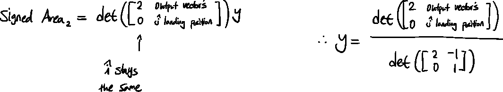

<x-coordinate></x-coordinate>

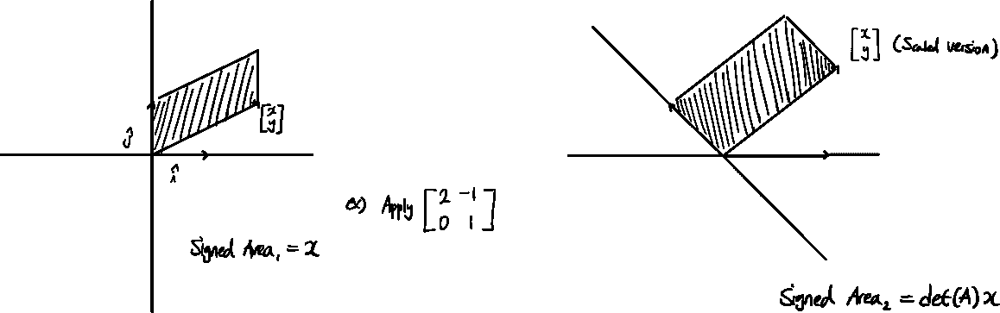

行列式告诉我们系统改变了多少。平行四边形的面积也会改变，改变的量是行列式的量。

所以新的平行四边形是:det(A) * x

所以 y 坐标可以写成:

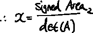

为了计算带符号的 Area₂，我们可以计算缩放向量的 i-hat 着陆位置和缩放的 j-hat 之间的行列式。所以我们要找的向量 x 的最终 x 坐标应该是这样的:

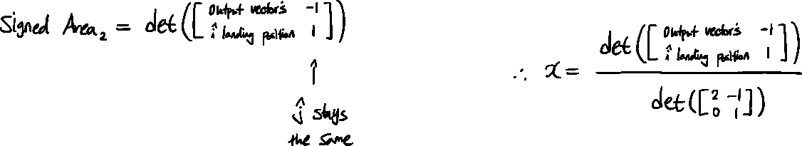

**结论**

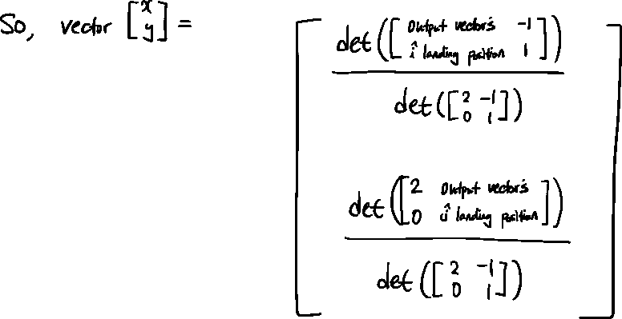

这与以下内容相同:

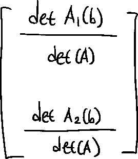

现在我们知道克莱姆法则在几何上是如何工作的了。

 [## Mlearning.ai 提交建议

### 如何成为 Mlearning.ai 上的作家

medium.com](/mlearning-ai/mlearning-ai-submission-suggestions-b51e2b130bfb)