# 线性乘积

> 原文：<https://medium.com/mlearning-ai/linalg-cross-product-e2c98cbbf792?source=collection_archive---------5----------------------->

交叉产品—3 蓝色 1 棕色

## 交叉产品的洞察力

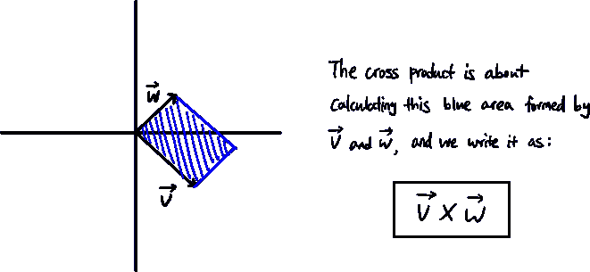

平行四边形的面积就是这两个向量的“叉积”的大小。

当矢量 v 在矢量 w 的右侧时，叉积的大小变为**正**。当矢量 v 在矢量 w 的左侧时，幅度变为**负**。

*   这意味着在叉积中顺序很重要。

如果我们交换向量 v 和向量 w，这个值就会变成之前值的负数。

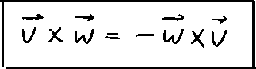

## 如何计算叉积的大小

注意，我们以前见过一个类似的术语，行列式。

对于 2d 叉积，把向量 v 的坐标写成矩阵的第一列，把向量 w 的坐标写成矩阵的第二列，然后计算行列式。

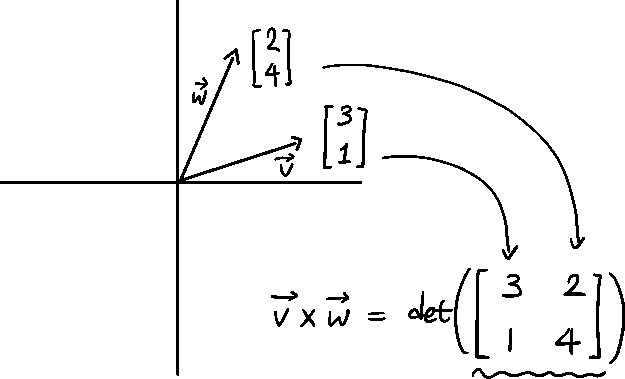

为什么？

这是因为制作的**矩阵也是线性变换**。目标是知道平行四边形的面积，在我们进行线性变换之前，i-hat 和 j-hat 形成的平行四边形的面积为 1，因为这些向量是单位向量(1 x 1)。

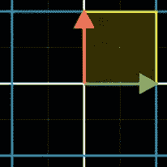

before linear transformation(1 x 1 unit square), image from 3Blue1Brown youtube

而经过线性变换后，那个区域自然会变成我们想要的样子。检查正方形区域是否翻转，因为它决定了值是正还是负。

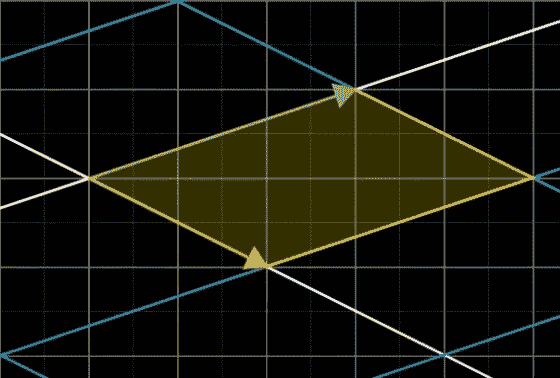

after linear transformation, image from 3Blue1Brown youtube

## 叉积大小的特征

自然地，当两个向量相互垂直时，叉积的大小最大。

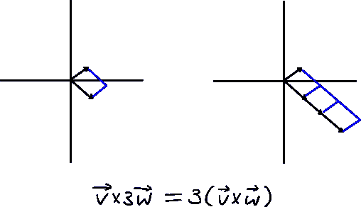

如果一个向量被缩放，总的值也会被缩放这个量。

## 那么什么是叉积呢？

请注意，我们一直使用术语“叉积的大小”，而不是叉积本身。因为我们一直在讨论的蓝色区域，不是叉积。这是叉积的大小。

**叉积是两个向量相乘得到的向量输出。**

矢量有大小和方向。到目前为止，我们讨论的蓝色区域决定了输出向量的大小。

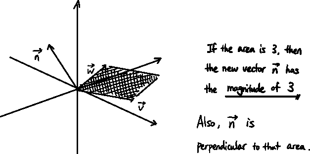

new vector n is the cross product of vector v and w

但是用什么方式呢？

有两个向量垂直于这个区域。

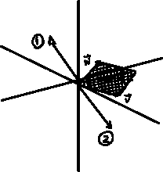

two different directions

既然我们用行列式确定了叉积的大小，我们就用“右手定则”来定义叉积的方向。

## 右手法则

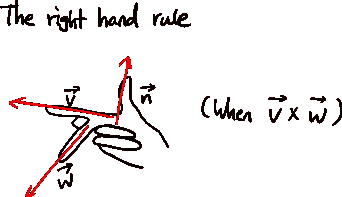

我们可以用右手确定叉积向量 n 的方向。

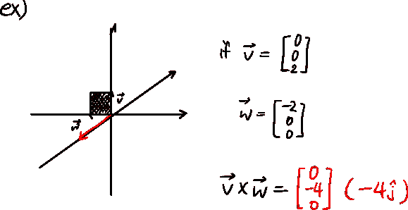

## 如何计算叉积？

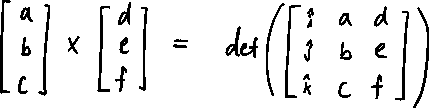 [## Mlearning.ai 提交建议

### 如何成为 Mlearning.ai 上的作家

medium.com](/mlearning-ai/mlearning-ai-submission-suggestions-b51e2b130bfb)