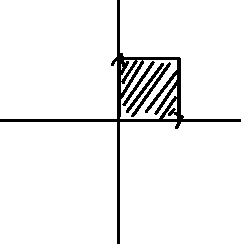
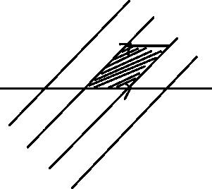
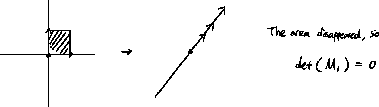
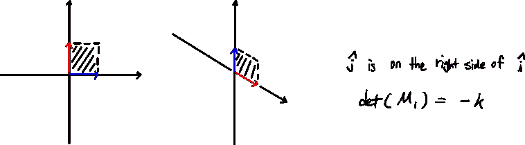
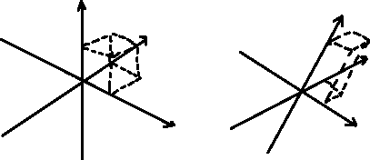
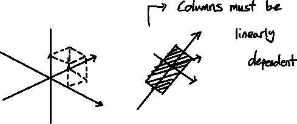
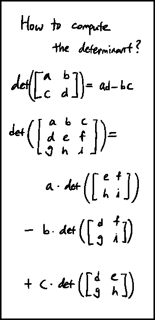

# 线性行列式

> 原文：<https://medium.com/mlearning-ai/linalg-determinant-ebd679d90019?source=collection_archive---------5----------------------->

行列式——3 蓝色 1 棕色

## 什么是行列式？

当完成某个线性变换时，

正方形的面积会改变…

但是到了**多少**？

这是行列式。一个变换(矩阵)的行列式是某一区域的变化量。

某种变换可以把一个平面挤压成一条线(或一个点)。

行列式可以有负值。这是方向颠倒的时候。

这在 3d 中是一样的；

这里，由于我们拉伸了 1×1×1 的立方体，所以这个变换的行列式等于拉伸立方体的体积(sry 为差图)。

如果 det(M) = 0，

## 计算行列式

 [## Mlearning.ai 提交建议

### 如何成为 Mlearning.ai 上的作家

medium.com](/mlearning-ai/mlearning-ai-submission-suggestions-b51e2b130bfb)