# 线性积—点积

> 原文：<https://medium.com/mlearning-ai/linalg-dot-product-101f548b23c2?source=collection_archive---------4----------------------->

点积和对偶性—3 蓝色 1 棕色

## 点积

点积是向量相乘的一种方式。那么我们如何计算点积呢？在数值视图中，如果你有两个相同维度的向量，你将所有的坐标配对，相乘，然后相加。

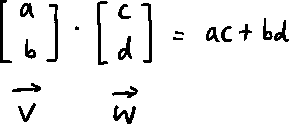

在几何观点中，两个向量 v 和 w 的点积可以说是 w 投影到 v 上的长度乘以 v 的长度。

在这里，顺序并不重要。

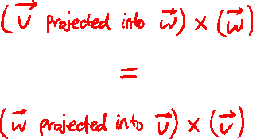

## 点积和矢量方向

计算点积时有三种情况:点积有正值、负值和零值时。让我们从几何学的角度来看这个问题。

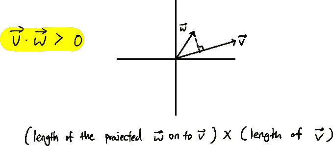

When the value is positive

当两个向量有类似的方向时，就像上面的例子，两个向量的点积变成正的。

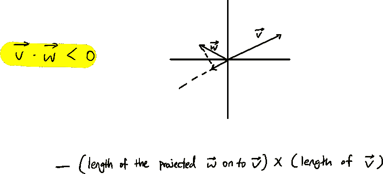

When the value is negative

当一个向量有相反的方向时，就像上面的例子，我们在数值前面加一个负号。所以可以说，如果两个向量的点积为负值，那么这两个向量方向相反。

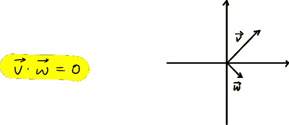

When the value is zero

当一个矢量与另一个矢量垂直时，也就是说，投影到矢量 v 上的矢量 w 变成了一个零矢量，那么点积就是零。

## 连接两个视图

我们看了关于点积的两种观点。一种是将坐标配对、相乘并相加的数值视图，另一种是几何视图，它将点积定义为某个向量的投影与另一个向量的乘积。

当用数值的观点看点积时，它使用两个向量，并输出某个值。在上一篇文章中，我们看到了接收一个向量，并返回一个数字(维数减少了)

**1×2 矩阵(线性变换)就是这个。**

我们将通过 5 个步骤证明点积的计算与矢量投影相同。

1.  保持原点不变，沿对角线放置一条线。想象有一个单位向量 u，我们可以把那些橙色的点想象成以原点为根的向量。

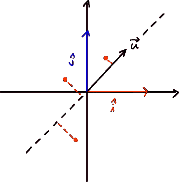

2.我们可以将点投影到对角线上，对角线以向量 u 为基向量(1d)。这意味着我们将二维平面转换成一维直线。这可以表示为 1×2 矩阵。

mystery matrix(1 x 2)

3.神秘矩阵代表 I 帽和 j 帽的着陆点。正如我们在矩阵乘法中看到的，

我们可以看到这种转换遵循转换后的 i-hat 和 j-hat，并对它们进行缩放。

所以为了找出变换后的向量的走向，我们必须遵循 i-hat 和 j-hat 的走向。

4.让我们用紫色画一条对称线。

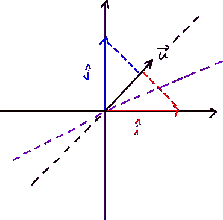

purple line of symmetry

那么这种转变会是什么样的呢？i-hat 和 j-hat 投影到向量 u 时会落在哪里？

**因为我们画了一条对称线，所以投影到向量 u 的 i-hat 会和向量 u 投影到 i-hat 的值一样。类似地，投影到向量 u 的 j-hat 将具有与投影到 j-hat 的向量 u 相同的值。**

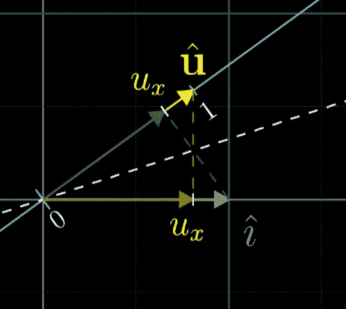

image from 3blue1brown

所以 i-hat 落在向量 u 的 x 坐标上，j-hat 落在向量 u 的 y 坐标上。

5.所以神秘的转变会是:

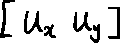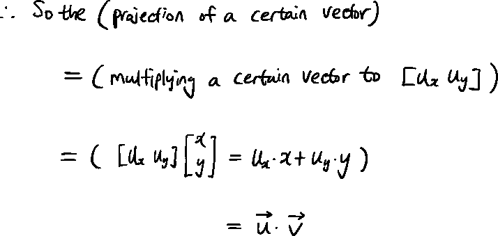

## 结论

所以，点积是一种有用的方法，可以找出向量的方向，理解投影。

> 然而，如果我们深入研究，我们会发现，任何时候，只要有一个线性变换，它的输出空间是一条数轴，那么这个变换就会有一个相应的向量。
> 
> 此外，应用该变换与用相应的矢量进行点积是一样的。

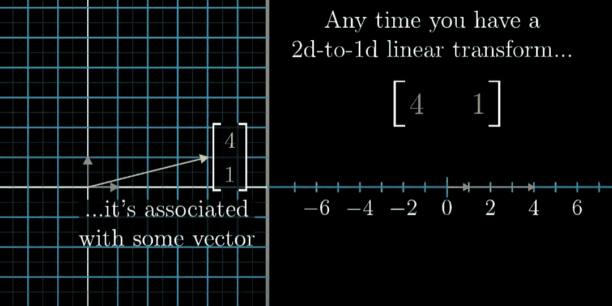

Image from 3Blue1Brown

 [## Mlearning.ai 提交建议

### 如何成为 Mlearning.ai 上的作家

medium.com](/mlearning-ai/mlearning-ai-submission-suggestions-b51e2b130bfb)