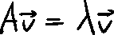
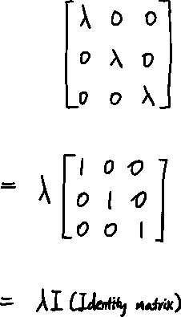
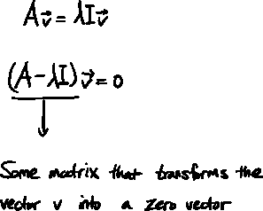
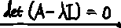
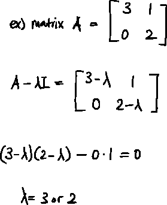
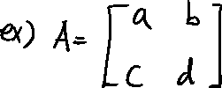
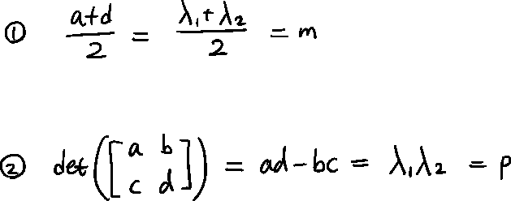
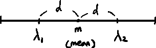
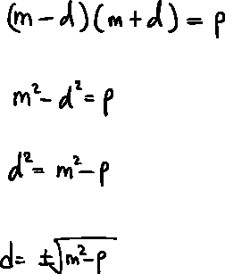
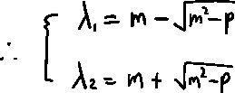

# 线性——特征向量和特征值

> 原文：<https://medium.com/mlearning-ai/linalg-eigenvectors-and-eigenvalues-c037dbe7c0ce?source=collection_archive---------3----------------------->

特征向量和特征值+计算特征值的快速技巧— 3Blue1Brown

## **定义**

特征向量:一个向量，当被一个给定的算子运算时，它给出自身的标量倍数。

特征值:一组特殊的标量值，代表在一些线性变换中特征向量被拉伸或压缩的程度。

*   请注意，特征值可以是负数。

## 计算特征值

根据特征向量的定义，由矩阵 A 线性变换的向量 v 应该给出与向量 v 被某个标量λ缩放相同的结果。

由于我们通过标量λ进行缩放，因此我们可以将λ重写为:

那么公式应该是这样的:

“某个矩阵”将作为一个线性变换，将空间压缩成一条线或一个点。这意味着:

现在让我们用一个例子来计算一下。

现在我们有了特征值。还要注意不能有特征值。例如，在旋转之后，没有一个向量停留在它们的原始跨度上。

## 快速计算技术

对于 2×2 矩阵，有一种更简单的方法来计算特征值。

假设我们有这样的矩阵 A:

我们可以使用这些事实来容易地计算特征值(λ是特征值):

因为我们知道这两个特征值的平均值，所以我们可以这样表示它们:

这可以这样写下来:

所以，

 [## Mlearning.ai 提交建议

### 如何成为 Mlearning.ai 上的作家

medium.com](/mlearning-ai/mlearning-ai-submission-suggestions-b51e2b130bfb)