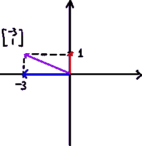
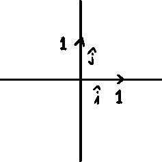
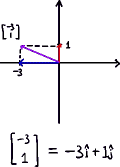
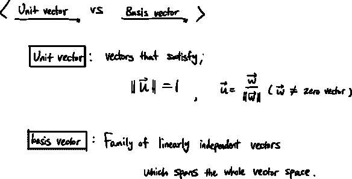
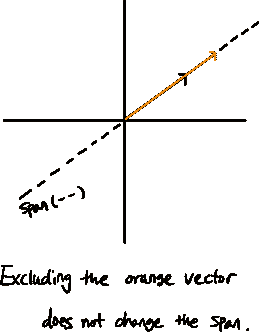
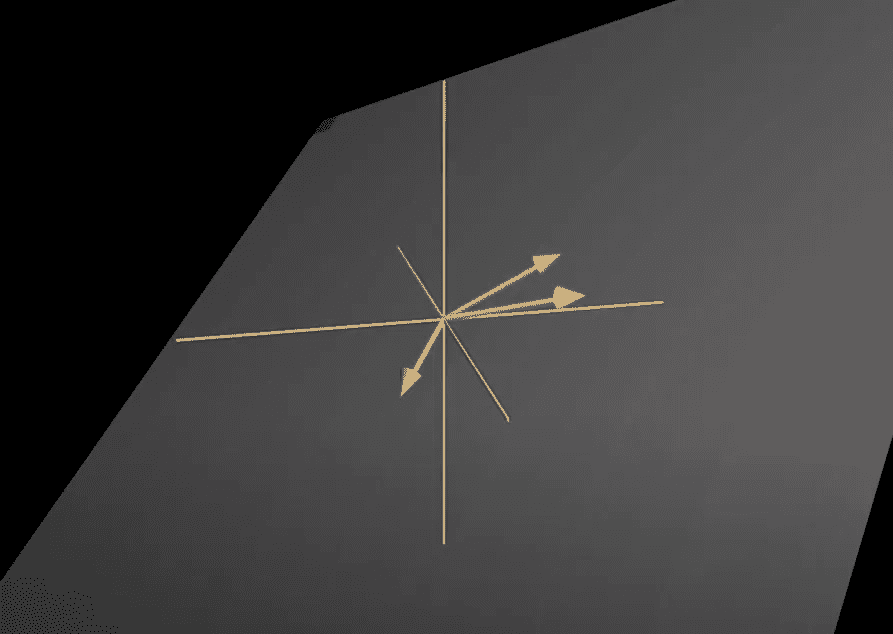
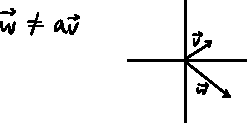

# 线性组合、跨度和基本向量

> 原文：<https://medium.com/mlearning-ai/linalg-linear-combinations-span-and-basis-vectors-678df700ff6?source=collection_archive---------3----------------------->

基本矢量概念—3 蓝色 1 棕色

## 使用基的向量表示

现在，想象我们在 xy 坐标系中有一个矢量。

我们用这两个数字来描述一个矢量。表示矢量在坐标系中的位置的两个数字。

xy 坐标系中有两个特殊的向量，i-hat 和 j-hat，它们的长度都是 1。这些是“单位向量”，单位向量的长度总是为 1。

i-hat 和 j-hat 也称为 xy 坐标系的“基本向量”。

现在我们知道了基本向量，我们可以将紫色向量分解为红色和蓝色两个向量的和。

此外，我们的红色和蓝色向量是基本向量的**缩放版本，i-hat 和 j-hat** 。

因此，紫色矢量可以说是两个缩放基矢量的**和。**

我们的紫色向量会像这样。

像这样，我们可以用基来表示系统中的任何向量，所有向量都是两个尺度基向量的和。

## 单位向量与基向量

单位向量和基向量可能会混淆，它们肯定是不同的。单位向量只是长度为 1 的向量，基向量是给定空间的基，也就是说，我们可以通过对基向量进行缩放和相加来达到给定空间中的任意一点。基本向量的长度不一定是 1。

现在我们知道了单位向量和基向量的区别。但是在基向量的定义中有一些不熟悉的概念，比如‘跨度’和‘线性无关’。

## 线性组合和跨度

我们看到，两个缩放的基向量之和可以表示 xy 坐标系中的每一点。像这样，如果你缩放两个向量，然后把它们加在一起，这叫做两个向量的“线性组合”。

由两个给定向量的线性组合构成的所有可能向量的集合就是这两个向量的“跨度”。

二维空间中某些两个向量的跨度大多是二维空间本身，但也有例外:当两个向量为零向量(只是原点)时，以及两个向量线性相关时。

## 线性相关

如果我们可以排除一个向量，并仍然得到相同的跨度，我们可以说，该向量是'线性依赖于'另一个向量。这意味着一个向量已经在其他向量的范围内。这也意味着线性无关的向量不会给跨度增加额外的维度。

我们也可以在 3D 空间中看到这一点:

image from 3Blue1Brown youtube

这里，虽然我们有 3 个通常会跨越整个 3D 空间的向量，但是因为红色向量线性依赖于粉色向量，所以这三个向量跨越了一个 2D 平面。

相反的是线性无关。

 [## Mlearning.ai 提交建议

### 如何成为 Mlearning.ai 上的作家

medium.com](/mlearning-ai/mlearning-ai-submission-suggestions-b51e2b130bfb)