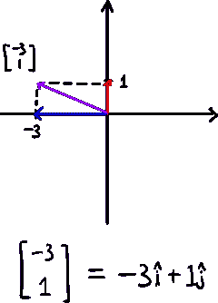
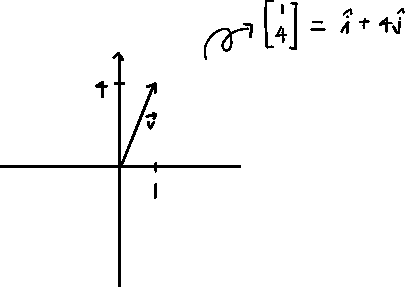
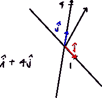
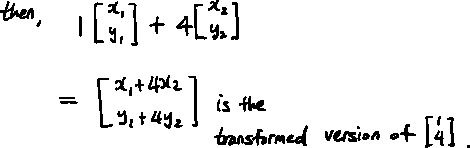
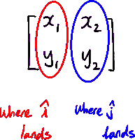
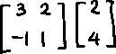
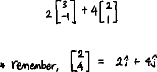
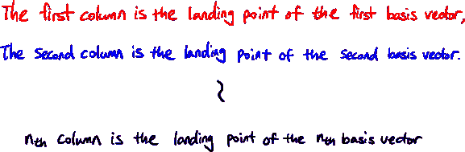
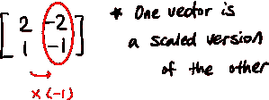
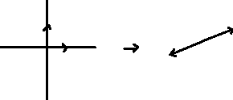

# 线性变换和矩阵

> 原文：<https://medium.com/mlearning-ai/linalg-linear-transformations-and-matrices-186d3d1743c6?source=collection_archive---------1----------------------->

作为空间变换的矩阵——3 蓝色 1 棕色

## 线性转换

> “矩阵是线性变换”

这是我们今天学到的最重要的概念。在我们深入探讨之前，让我们看看什么是线性变换。

当满足两个条件时，我们称空间变换为“线性的”:

1.  变换后，每条线仍必须是线性的
2.  原点应该保持不变

## 理解概念(步骤 1)

在上一篇文章中，我们了解到一个向量可以用基本向量来表示。

即使经过线性变换，也总是如此。

表示是相同的，但是我们只需要知道转换后的 i-hat 和 j-hat 的位置。

在这里，i-hat 和 j-hat 与原始系统相比处于不同的位置。我们只需要知道转换后的 i-hat 和 j-hat 在原系统中的位置。

让我们用上面的例子向量。假设变形的 I 形帽降落在 y₁and 的 x₁，变形的 j 形帽降落在 y₂.的 x₂

## 理解概念(步骤 2)

i-hat 和 j-hat 的这些“着陆点”通常被写成 2×2 矩阵。

所以当我们看到一个矩阵乘以一个向量时，

这意味着我们**变换基本向量**，**缩放向量**，然后**将这两个向量**相加。

同样对于 nᵗʰ维度，

## 线性相关情况

一些矩阵可能如下所示:

如果我们像这样变换我们的基向量，基向量看起来会像这样:

这将跨度压缩到一个更低的维度。

## 结论

所以，要点是这样的:

**当你看一个矩阵时，把它们看作是空间的变换。**

 [## Mlearning.ai 提交建议

### 如何成为 Mlearning.ai 上的作家

medium.com](/mlearning-ai/mlearning-ai-submission-suggestions-b51e2b130bfb)