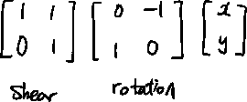
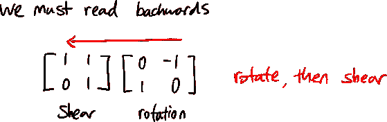
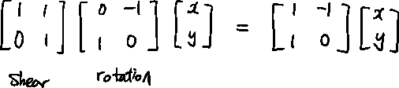
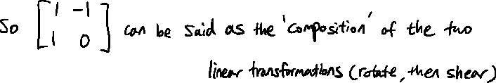
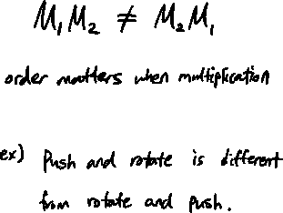
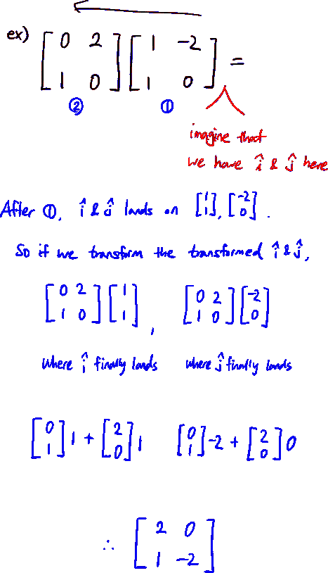

# 线性矩阵乘法

> 原文：<https://medium.com/mlearning-ai/linalg-matrix-multiplication-12950867cdab?source=collection_archive---------2----------------------->

矩阵乘法合成— 3Blue1Brown

> 这些变换的合成或混合就是矩阵乘法。

## 概念大纲

当我第一次遇到这个概念时，我想到了一句话:“目的证明手段是正确的”。我们来看一些矩阵。

这里，我们将按照书写的顺序旋转和剪切矢量。注意我们要跟着 i-hat 和 j-hat 落地的地方走，就像之前的帖子一样。

如果我们通过这 2 个步骤的过程，i-hat 和 j-hat 将被旋转和剪切，并在那里着陆。但是，我们可以直接将 i-hat 和 j-hat 移动到着陆点，而不需要经过这两步流程。

因为效果是一样的。

最终产品(i-hat & j-hat 的落点)是一样的，我们把 2 步挤成了 1 步。

我们应该记住的是这里的秩序很重要。

## 计算矩阵乘法

 [## Mlearning.ai 提交建议

### 如何成为 Mlearning.ai 上的作家

medium.com](/mlearning-ai/mlearning-ai-submission-suggestions-b51e2b130bfb)