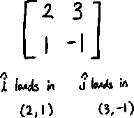
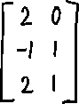
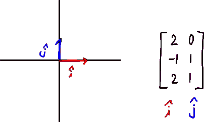
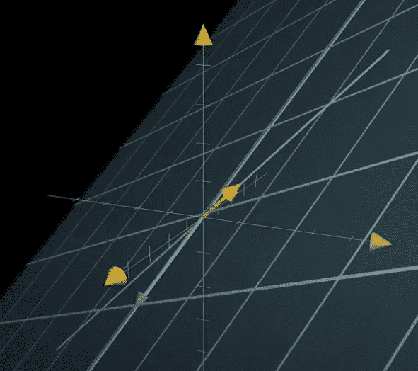
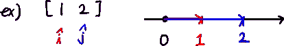

# 线性-尺寸之间的转换

> 原文：<https://medium.com/mlearning-ai/linalg-transformation-between-dimensions-61086ac241f9?source=collection_archive---------4----------------------->

作为维度间转换的非正方形矩阵—3 蓝色 1 棕色

## 非方阵

到目前为止，我们知道 xy 坐标平面中的 2×2 矩阵充当线性变换，调整基向量 i-hat 和 j-hat 的着陆位置。每个数字表示 i-hat 和 j-hat 的位置。

但是我们如何解释像 3 x 2 矩阵这样的矩阵呢？3×2 矩阵如何变换系统？

基本流程是一样的。我们只需要将 i-hat 和 j-hat 移动到指定的着陆点。

让我们通过一个例子来看看这一点。

当我们看到一个 3×2 的矩阵时，由于两列表示输入空间有两个基向量，所以原始状态应该是这样的。

现在我们移动 i-hat 和 j-hat。

Image from 3Blue1Brown

如果我们看到结果，系统转换成 3d。虽然系统是 3d 的，但是列空间是 2d 的，并且在转换之后是满秩的，因为输入维度(2 列)和列空间的维度(2d 平面)是相同的。

结果，3×2 矩阵将 2d 空间映射到 3d 空间，但是它是满秩的。

让我们看另一个例子。这次是 1×n 矩阵。这意味着我们将 n 维空间映射成一条线(有 n 个基向量，而输出的列空间是 1d)。

1 x 2 matrix

因此，如果我们对某个向量进行这种转换，列空间的秩将为 1。

 [## Mlearning.ai 提交建议

### 如何成为 Mlearning.ai 上的作家

medium.com](/mlearning-ai/mlearning-ai-submission-suggestions-b51e2b130bfb)