# LINALG —了解叉积

> 原文：<https://medium.com/mlearning-ai/linalg-understanding-cross-products-c368ffda0c0e?source=collection_archive---------4----------------------->

线性变换下的叉积——3 蓝色 1 棕色

## 叉积计算

我们可以这样计算叉积，就像我们之前看到的那样。

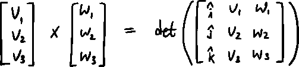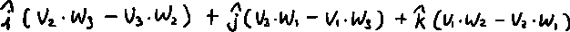

但是为什么呢？

为什么我们要这样计算叉积？

此外，我们还将通过证明来了解为什么叉积公式符合几何直觉。

## 公式和几何直觉

首先，让我们这样来考虑这个计算；

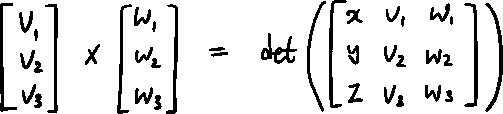

那么，现在我们知道这可以作为一个函数。结果因输入向量而异。

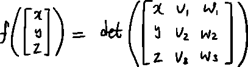

这是一个函数，它给出了三个向量形成的平行六面体的体积的结果。

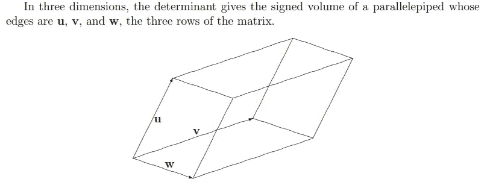

from Math 122 Calculus III, Clark Univ.

因为行列式只有 1 个值作为输出，所以我们可以将此视为 3d(矩阵)到 1d(平行六面体的体积)的线性转换。

现在，正如我们之前看到的，我们可以这样重新表示它；

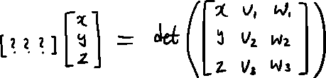

3d -> 1d linear transformation

这里出现了我们之前讨论过的二元性。

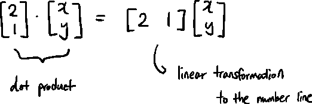

Recap of duality

利用对偶，我们可以把它表示为两个向量的点积，我们现在把这个神秘的向量称为向量 p。

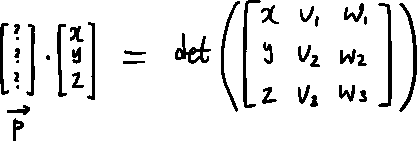

现在我们要找到这个向量 p。

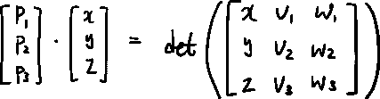

根据之前的计算方法，我们可以看出；

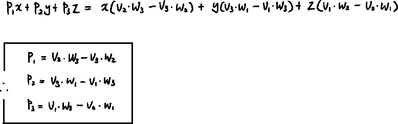

## 为什么叉积公式符合几何直觉的证明

主要问题是这样的:

> 什么向量 p
> 
> 具有使向量 p 和向量 x y z 的点积
> 
> 平行六面体的体积由向量 v，w 和 x，y，z 定义
> 
> 具有相同的价值？

要形象地表现这个问题，我觉得应该是这样的:

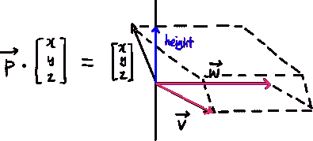

我们想知道平行六面体的体积。如果我们用向量 v 和 w，我们已经知道了基底面积。

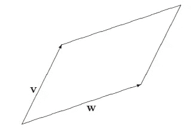

from Math 122 Calculus III, Clark Univ.

**我们只需要高度。**

为了得到高度，我们可以把向量 x，y，z 投影到一个向量上，这个向量同时垂直于向量 v 和向量 w。

让我们把它投影到垂直于平行四边形的单位向量上，并把这个向量命名为 u。

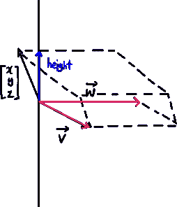

投影矢量对我们来说似乎是一个熟悉的概念。没错，我们在复习点积的时候看到了这一点。如果向量 p 上点缀着其他向量，这意味着我们把向量 p 投影到那个向量上，然后把投影的长度乘以其他向量的长度。

所以我们可以把我们的身高写为:

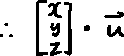

所以平行六面体的体积(det(M))可以写成:

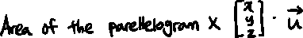

这和:

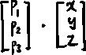

所以向量 p 应该是:

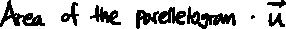

**所以现在证明了向量 p 具有平行四边形面积的大小，并且垂直于向量 v 和向量 w，这和叉积的那些特征完全一样。**

*   到目前为止，这是我对视频的理解，如果有任何需要改进或错误的地方，请告诉我。

 [## Mlearning.ai 提交建议

### 如何成为 Mlearning.ai 上的作家

medium.com](/mlearning-ai/mlearning-ai-submission-suggestions-b51e2b130bfb)