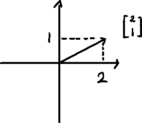
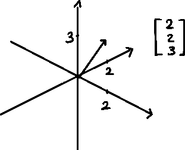
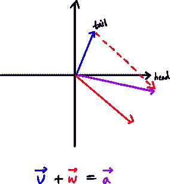
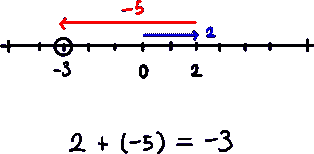
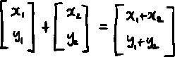
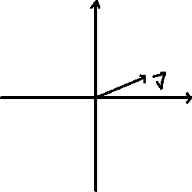
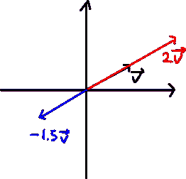

# 线性向量

> 原文：<https://medium.com/mlearning-ai/linalg-vectors-5d738f41a5c7?source=collection_archive---------5----------------------->

基本矢量运算—3 蓝色 1 棕色

## 向量

什么是向量？

矢量是既有大小又有方向的物体/量。更容易想象一个箭头，它的根在坐标系的原点。

与物理中向量可以在系统中的任何地方不同，在线性代数中，我们几乎总是会遇到在原点有根的向量。

每对数字(例如 x，y 值)都有一个对应的向量，并且每个向量都有一对对应的数字。

在 3d 中；

## 向量加法

1.  将第二个向量移动到第一个向量的尾部。
2.  将第一个向量的尾部与第二个向量的头部链接起来。

如果你沿着第一个向量，然后以正确的体积向第二个向量的方向行进，你自然会得到结果。

我们可以用数轴演示矢量加法。

当我们想到数字加法时，我们可以这样理解这个概念。向量相加应该是一样的，只要跟着向量走，落点应该就是结果。

数字表示如下:

## 向量缩放

如果我们有一个向量 v，我们可以拉伸或收缩这个向量。

我们称之为“伸缩”。我们在对矢量进行缩放，缩放量称为“标量”。如果标量为负，向量的方向会翻转到相反的方向。

 [## Mlearning.ai 提交建议

### 如何成为 Mlearning.ai 上的作家

medium.com](/mlearning-ai/mlearning-ai-submission-suggestions-b51e2b130bfb)