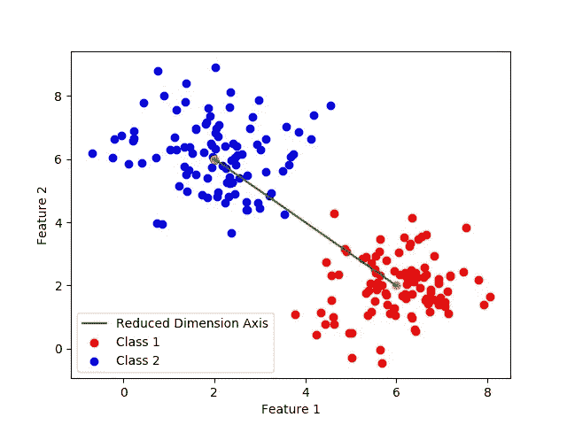
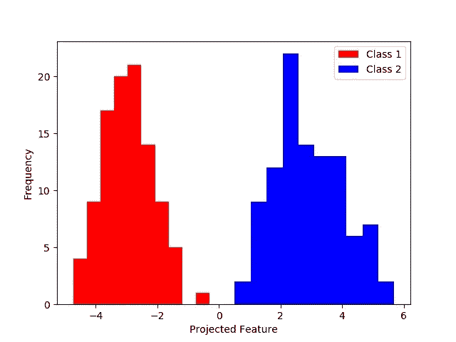
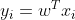
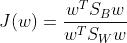
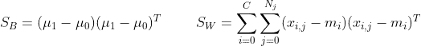
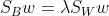

# 线性判别分析(LDA)，最大类分离！

> 原文：<https://medium.com/mlearning-ai/linear-discriminant-analysis-lda-maximum-class-separation-1c3e2f66d846?source=collection_archive---------1----------------------->

今天我们要讲一个有监督的降维方法，目的是最大化类间距离！


Photo by [Andreas](https://unsplash.com/@imwlf?utm_source=medium&utm_medium=referral) on [Unsplash](https://unsplash.com?utm_source=medium&utm_medium=referral)

线性判别分析就是寻找一个低维空间，将数据投影到该空间，以便为算法提供更有意义的数据。

LDA 也可以用于分类，但是在本文中，我将主要关注用于数据转换和降维的 LDA。

如上所述，Fisher 的线性判别式是关于最大化类分离，因此使其成为监督学习问题。与 PCA 不同，PCA 是一种用于保持最大方差的无监督降维方法。



LDA 通过最大化表示为 S_b 的类间方差同时最小化表示为 S_W 的类内方差来实现这一目标。最小化各个类内方差的原因是缩小特征空间中的类跨度，使得投影特征更具代表性。

与 PCA 不同，LDA 的维数限制为 C - 1，这意味着您只能投影到比数据集中的类数量少的维空间。

在下图中，绘制了直方图，因为投影要素是一维的，所以可以在直方图中绘制这些要素。



可以看出，通过例如引入阈值或其他方法来区分这两个类别，可以在投影特征空间中容易地将这两个类别分开。如前所述，LDA 可以用于分类，可能非常适合这个问题。

# 数学！

这一部分包含了使这种转换成为可能的数学基础。

如果你对数学不感兴趣，或者说不在乎，你可以跳过数学，因为 LDA 在不同的图书馆都是公开的。

我假设你喜欢理解 LDA 的基本原理，因为你没有跳过。

因此，我们试图解决的主要问题是找到一个投影矩阵(w ),它将高维 X 投影到低维 y。这可以用下面的等式来表示。



如理论中所述，我们试图最大化 S_B 类之间的分散，同时最小化 S_W 类内的分散，从数学上讲，我们可以将此公式化为投影分散之间的比率，如下式所示:



其中，S_B 和 S_W 由下式给出:



这基本上是均值的差异和方差的总和，其中 C 是类的数量，N_j 是类 j 中的实例数量，在我们有 2 个类的情况下，SW 成为 2x2 矩阵。

因此，试图实现的总体目标是最大化 J(w)项，为了最大化给定的某个变量(w ),我们对 J(w)相对于 w 求导，并将导数设置为 0，以便找到极值，即在这种特定情况下的最大值。

我们将 J(w)相对于 w 求导，以找到最大化 J 的解。



找到对应于最大特征值的特征向量是将数据投影到其上的理想超平面，以获得最大的类分离和最小的类内方差。我知道如果你对数学不熟悉，这可能会有点混乱，但特征值背后的直觉是选择方差最大的方向，因此将数据投影到具有尽可能多的方差的低维中，以保持类之间的分离。

## 履行

如果你跳过了数学或者继续阅读，不要担心。Sklearn 已经将所有这些魔法实现到他们的机器学习库中，让每个人都可以在你的下一个机器学习项目中轻松实现和使用 LDA。

首先，您将从拟合数据模型开始，创建矩阵以减少训练数据的维度(并最终进行测试)。

```
import numpy as np
from sklearn.discriminant_analysis import LinearDiscriminantAnalysis as LDAX_train = ...     # Data in shape of (n_instances, n_features)
y_train = ...     # Labels in shape of (n_instances, 1)dim = 1      # Projecting onto 1D space, remeber MAX (n_classes - 1)model = LDA(n_components = dim)  # Projecting onto 1D spacemodel.fit(X, y)
```

当模型已经被拟合时，使用例如 pickle 保存模型可能是有利的。以便您可以加载您的模型并使用它来减少新数据点的维度。为了转换您的数据，您只需使用模型的内置转换方法。

```
Train_reduced = model.transform(X_train)
Test_reduced = model.transform(X_test)
```

如果您对在项目中使用 LDA 作为分类器感兴趣，只需使用内置的 predict 方法。这个方法使用上面已经训练好的模型。

```
preds = model.predict(X_test)    #You don't need to transform first
```

这是 LDA 的基本实现，用于数据的转换和分类。其他真正重要的考虑是调查模型的降维性能。降低数据的维度通常需要付出代价，即丢失数据中的信息。如果您丢失了太多的数据差异，这可能会损害您的整体准确性。然而，放弃你的方差的一小部分(也许是由噪音引起的？)可以大大提高您的性能，这样分类器就不会过度适应数据中的噪声。你放弃了多少方差的概述可以用解释的方差比来表示。该比率说明每个组成部分的差异有多大，以百分比表示，可通过以下方式实现:

```
EVR = model.explained_variance_ratio_
for idx, R in enumerate(EVR):
    print("Component {}: {}% var".format(idx+1, np.round(R*100,2)))>> Component 1: 100.0% var
```

这是一个非常重要的研究指标，因为如果你只解释了 40%的方差，你就丢失了数据中大约 60%的信息。如果有多个类，可以有更多的组件，每个组件描述不同百分比的数据。

## 最后备注:

LDA 的一个经常被忽略的假设是，该算法假设数据是正态分布的(高斯)，因此 mu 和 sigma 的最大似然估计量是样本均值和样本方差。然而，这种假设并不总是可靠的，不要担心算法会工作得很好。但是如果数据不是近似正态分布的，分类器的性能可能会降低。

解决这个问题的一种方法是使用例如 Box-Cox 变换或另一种幂变换来变换数据。我最终会写一篇关于未来的文章，但现在，我把这个术语留给你。

接下来是: [Box-Cox 变换](https://mgudik.medium.com/box-cox-transformation-an-effective-method-to-improve-robustness-of-your-model-a2a3014c7997)

就这些了，如果有任何意见或建议，请随时联系我。感谢您的阅读…

## 来源:

*   模式识别和机器学习，2006，Christopher M. Bishop

[](https://scikit-learn.org/stable/modules/generated/sklearn.discriminant_analysis.LinearDiscriminantAnalysis.html) [## sklearn.discriminant _ analysis。线性判别分析-sci kit-学习 0.24.1 文档

### 线性判别分析一种具有线性判决边界的分类器，通过拟合类条件生成…

scikit-learn.org](https://scikit-learn.org/stable/modules/generated/sklearn.discriminant_analysis.LinearDiscriminantAnalysis.html) [](https://scikit-learn.org/stable/modules/lda_qda.html) [## 1.2.线性和二次判别分析- scikit-learn 0.24.1 文档

### 线性判别分析(Linear Discriminant Analysis)和二次判别分析…

scikit-learn.org](https://scikit-learn.org/stable/modules/lda_qda.html)