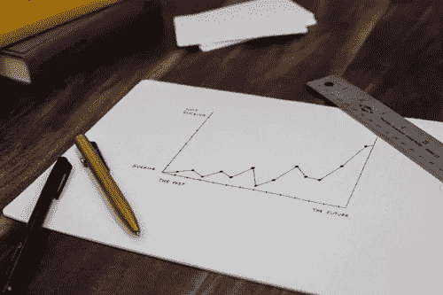
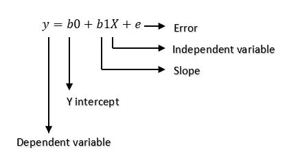
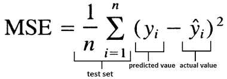
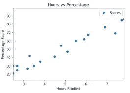
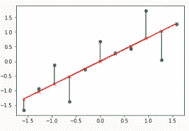
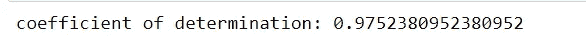
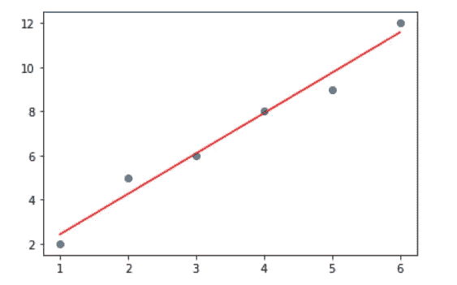

# 线性回归算法

> 原文：<https://medium.com/mlearning-ai/linear-regression-algorithm-6e44c90fb704?source=collection_archive---------2----------------------->



photo by [Isaac Smith](https://unsplash.com/@isaacmsmith) on Unsplash

线性回归是统计学和机器学习中最著名和最容易理解的算法之一。在进行线性回归之前，让我们先了解什么是回归。

# 什么是回归？

回归属于监督学习范畴。回归的主要目标是构建一个有效的模型，从一组属性变量中预测相关属性。当输出变量为实数或连续值时，即工资、分数、体重等，使用回归问题。它试图从几个点收集的数据中画出最合适的直线。

# 常见的回归类型

以下是常见的回归类型。

1.  线性回归
2.  多项式回归
3.  支持向量回归
4.  决策树回归
5.  随机森林回归

# 什么是线性回归？

线性回归是一种因变量与自变量具有线性关系的回归技术。线性回归的主要目标是考虑给定的数据点，并绘制出尽可能符合数据的趋势线。

假设我们有一个数据集，其中包含有关 X 和 Y 之间关系的信息。对 X 和 Y 进行了多次观察并记录下来。这将是我们的训练数据。我们的目标是设计一个模型，如果提供了 X 值，它可以预测 Y 值。使用训练数据，获得将给出最小误差的回归线。这个线性方程然后被用于应用新的数据。也就是说，如果我们给定 X 作为输入，我们的模型应该能够以最小的误差预测 Y。

线性回归模型由以下等式表示:



线性回归通常使用均方差(MSE)来计算模型的误差。



# 线性回归是如何工作的？

让我们考虑学生学习的时间和分数之间的关系；回归分析可以帮助我们理解这种联系。回归分析将为我们提供一种关系，这种关系可以可视化为图表，以便对您的数据进行预测。

回归分析的目标是根据数据创建一条趋势线。这样我们就可以确定除了学习时间之外的其他因素是否会影响学生的成绩，比如压力水平等。在考虑这一点之前，我们需要查看这些因素和属性，并确定它们之间是否存在相关性。然后可以使用线性回归来绘制趋势线，该趋势线可以用于确认或否认属性之间的关系。



# 我们如何确定最符合数据的直线？

如果预测值和观察值大致相同，则认为该线是最佳拟合线。简而言之，数据点与直线的距离之和最小，则它是最佳拟合直线。

这条线也称为回归线，误差也称为残差，如下所示。它可以通过从数据点到回归线的垂直线来可视化。



在这种情况下，误差是该点与所选直线的和(平均值或标准差)。

# 模型性能

模型建立后，我们需要检查预测值与实际数据之间的差异，如果差异不多，则认为是一个好模型。下面是一个度量工具，我们可以用它来计算模型中的误差。

## r-平方(R2)分数:


在哪里

总平方和(TSS):衡量一个数据集如何围绕一个平均值变化。TSS 告诉我们因变量的变化。

TSS =σ(Y—均值[Y])2

残差平方和(RSS):实际 Y 和预测 Y 之间的平方差之和。RSS 告诉我们有多少因变量的变化是我们的模型无法解释的。

RSS =σ(Y—f[Y])2

(TSS-RSS)测量通过执行回归解释的响应中的变化量。

R2 分数可以用来检查所有回归模型的性能。

# 一个简单的线性回归例子:

```
import numpy as np
from sklearn.linear_model import LinearRegression
x = np.array([1, 2, 3, 4, 5, 6]).reshape((-1, 1))
y = np.array([2, 5, 6, 8, 9, 12])
model = LinearRegression()
model.fit(x, y)
Y_pred = model.predict(x)
r_sq = model.score(x, y)
print('coefficient of determination:', r_sq)
```



```
plt.scatter(x, y)
plt.plot(x, Y_pred, color=’red’)
plt.show()
```



链接到回归项目:

[](https://varshithagudimalla.medium.com/how-is-a-machine-learning-project-done-19ae24f78632) [## 一个机器学习项目是怎么做的？？

### 6 个步骤

varshithagudimalla.medium.com](https://varshithagudimalla.medium.com/how-is-a-machine-learning-project-done-19ae24f78632)