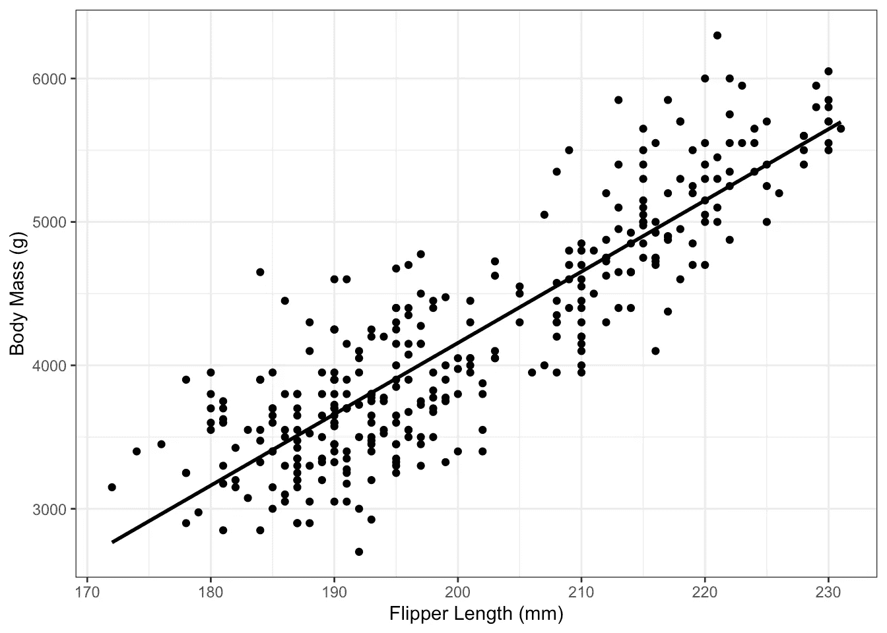
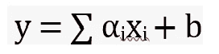

# 线性回归及其能力

> 原文：<https://medium.com/mlearning-ai/linear-regression-and-its-capabilities-ce6bccd7b92c?source=collection_archive---------3----------------------->

## 80%的人倾向于忘记线性回归的基础知识

linear relationship between body mass and flipper length

## 线性回归在 ML 中的应用及其能力

我们大多数人都已经学习了线性回归，但我们往往会忘记所有算法中最基本和最简单的算法。

在这个故事中，我们将探索线性回归，了解线性回归算法的假设，线性回归的数据准备，不同的训练技术和线性回归在机器学习中的应用。

让我们开始吧…

**什么是线性回归？**

线性回归在属性(输入变量)和目标变量之间建立了线性关系。目标是找到最佳拟合线(/平面/超平面)。关系方程的形式是，

linear equation

x 代表**输入特征向量**，而 **α是向量系数**。 **b(偏置)决定了坐标空间中关系的线性位移**。

现在让我们理解线性回归算法对输入数据变量(特征)所做的假设

**线性回归的数据假设**

1.  **线性假设**:假设输出/目标属性与输入属性具有线性关系。换句话说，它认为输入和输出要素之间预先存在线性关系
2.  **无噪声**:算法认为数据无噪声。
3.  **无共线性**:假设输入属性之间没有相关性或相关性最小。(当一个属性的变化影响到另一个属性的值时，它们被认为是相关的)
4.  **高斯分布**:当输入和输出属性为高斯分布时，线性回归表现更好
5.  **相同标度输入:**假设输入属于相同的参考标度，比如标准化为 0-1 或围绕平均值标准化
6.  [**同方差:**](https://www.statisticshowto.com/homoscedasticity/) 残差的方差(实际值和预测值之间的差异)在所有观测值中是相似的，并且与输入要素本身无关。

(为什么 homoscedasticity 很重要？)

使用线性回归模型时，必须检查上述假设。我们可以应用诸如 [**box-cox**](https://www.isixsigma.com/tools-templates/normality/making-data-normal-using-box-cox-power-transformation/) **或对数变换**用于高斯分布， [**标准化或归一化**](https://scikit-learn.org/stable/modules/generated/sklearn.preprocessing.StandardScaler.html) 用于重新缩放。

消除共线性很重要，否则算法会更加强调相关属性，增加过度拟合的机会。

线性回归主要根据输入属性的数量分为简单线性回归(1 个输入属性)和多元线性回归(多个输入)

然而，基于用于拟合算法的训练方法，以各种形式研究线性回归。它们是什么？让我们来找出…

**线性回归的训练技巧**

线性回归是研究最多的算法，有许多技术来拟合方程的系数。有 4 个最受欢迎的，我们将讨论

1.  **统计**:使用简单线性回归时，统计可用于估计系数。计算统计测量值，如平均值、标准偏差、相关性和协方差。
2.  **普通最小二乘法**:程序寻求最小化残差平方和(残差是真实值和预测值之间的差值)。[线性代数](https://machinelearningmastery.com/solve-linear-regression-using-linear-algebra/)用于寻找最佳拟合。然而，这种技术要求所有的输入数据都适合内存
3.  [**梯度下降**](https://www.analyticsvidhya.com/blog/2021/03/understanding-gradient-descent-algorithm/) :梯度下降算法试图通过基于梯度(斜率)逐渐更新系数来最小化误差。当适合大型数据集时，它是有效的。

loss minimization using Gradient descent

4.**正则化**:正则化技术试图最小化残差的平方以及线性回归的复杂性。有两种方法:套索回归(L1) |岭回归(L2) ( [*了解更多*](https://towardsdatascience.com/ridge-and-lasso-regression-a-complete-guide-with-python-scikit-learn-e20e34bcbf0b) )。

> 既然我们已经了解了线性回归的基本假设和用于拟合系数的技术。让我们了解机器学习的实际应用，以及如何使用 Python 应用这些应用

**线性回归在 ML 中是如何使用的？？**

让我们使用[链接](https://colab.research.google.com/drive/1rLhGiRq1ICxiDldxhCsQaPFkwZqtBTFZ?usp=sharing)中的一个例子快速探究线性回归中使用的各种指标(在桌面环境中打开该链接以便更好地查看)

一些度量和模型选择方法，如 [AIC(阿凯克信息标准)和 BIC(贝叶斯信息标准)](https://machinelearningmastery.com/probabilistic-model-selection-measures/)在上面的链接中进行了探讨。

线性回归主要用于理解变量之间的关联。它还用于检查变量之间的相关性。

## **结论**

线性回归是最简单的机器学习算法，多年来已经得到了非常彻底的研究。这是一个功能有限的简单模型。然而，我们经常倾向于忽略模型带来的简单性，尤其是在理解概念方面。

通过这篇文章，我试图帮助你回忆或学习线性回归的一些基本概念。

如果我能帮助你理解至少一个概念，我会认为我的工作已经完成。

不要忘记表达你对❤的支持，并关注更多有趣的博客！！

 [## Mlearning.ai 提交建议

### 如何成为 Mlearning.ai 上的作家

medium.com](/mlearning-ai/mlearning-ai-submission-suggestions-b51e2b130bfb)