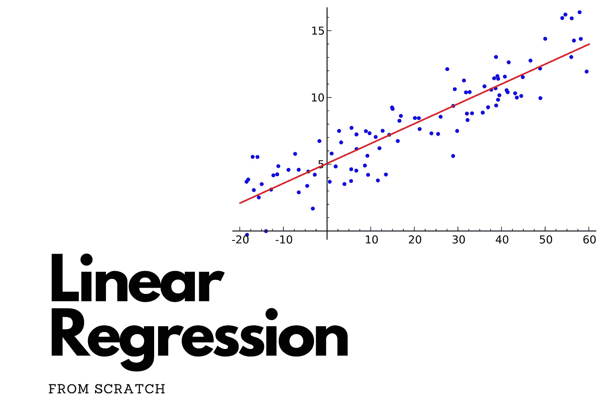
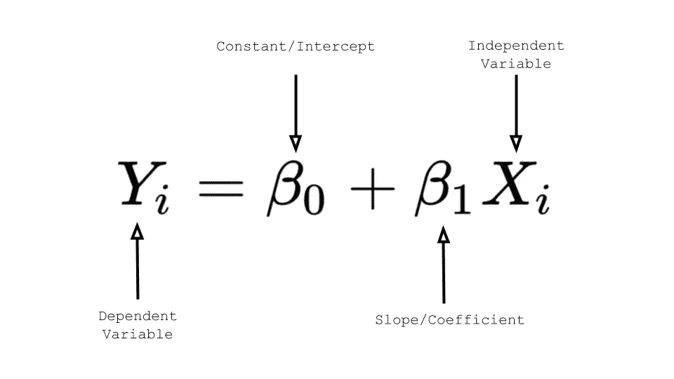
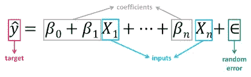

# 线性回归基础

> 原文：<https://medium.com/mlearning-ai/linear-regression-basics-aaa37daf09d6?source=collection_archive---------12----------------------->

# 介绍

在这篇文章中，我将谈论回归分析/机器学习中最关键的技术之一，称为线性回归。根据[维基百科](https://en.wikipedia.org/wiki/Regression_analysis)，回归分析被定义为一组统计过程，用于估计因变量和自变量之间的关系强度。假设因变量和自变量之间呈线性关系，试图估计这种关系强度的过程称为线性回归。简而言之，在线性回归中，我们试图估计自变量(也称为特征)和因变量(也称为目标变量)之间的关系，假设它们之间存在线性关系。

# 线性回归的假设

有五个与线性回归模型相关的假设:

1.  线性:自变量和因变量的均值之间的关系是线性的。
2.  同方差:残差的方差对于自变量的任何值都是相同的。
3.  独立性:观测值相互独立。
4.  正态性:因变量和自变量的任何固定值都是正态分布的。
5.  无自相关:自变量的当前值和过去值之间不应有相关性。

接下来，我们谈谈线性回归的基础知识。

# 线性回归基础

在本节中，我们将讨论线性回归背后的数学原理。当我们只有一个独立变量时，它被称为简单线性回归或单变量线性回归，它由下式给出:

Simple Linear Regression

上式中， *y1* 代表目标(因变量)， *xi* 代表自变量，𝜷 *1* 代表自变量的权重或系数，𝜷 *0* 代表偏项或简单来说，线性方程的截距。

如果我们有两个以上的自变量，那么线性回归称为多元线性回归。上述方程也可以推广到多元线性回归。它是由，

Multivariate Linear Regression

# 结论

因此，在本文中，我们讨论了线性回归的基础。如果您想深入了解线性回归，并在数据集上从头开始查看它的实现，您可以在这里[这样做](https://keepingupwithdatascience.wordpress.com/2022/01/23/linear-regression-in-machine-learning-from-scratch/)。

我希望你能发现我的帖子内容丰富。我定期在我的博客上发布数据科学内容。如果你想和我联系，请随时通过 [LinkedIn](https://www.linkedin.com/in/chitwanmanchanda/) 联系我。感谢阅读，快乐学习！！！！

 [## Mlearning.ai 提交建议

### 如何成为 Mlearning.ai 上的作家

medium.com](/mlearning-ai/mlearning-ai-submission-suggestions-b51e2b130bfb)