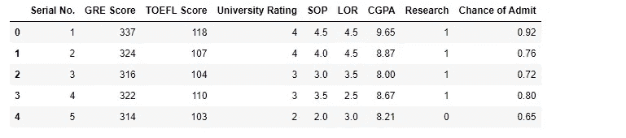
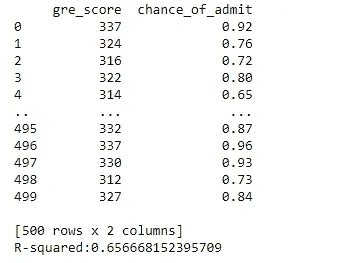
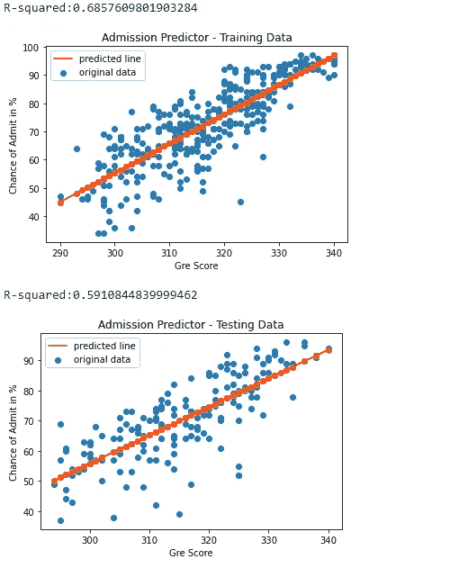

# 简单线性回归 python 中从头开始的 GRE 录取预测

> 原文：<https://medium.com/mlearning-ai/linear-regression-gre-admission-predictor-801b0cfee409?source=collection_archive---------4----------------------->

# **简介**

线性回归是一种回归分析形式，它使用 y = (m*x) + c 公式，这是一个斜率截距公式，其中 m =斜率，x =自变量，y =因变量，c 是常数。这是一种预测分析，然而，线性回归的问题是它只有一个因变量和一个自变量。

总是 x 轴是自变量，y 轴是因变量。我们需要检查数据集，看数据集中的任何两列之间是否存在任何关联，以检查我们是否可以应用线性回归模型。

*   获取 Github 的完整代码:[https://Github . com/durveshshah/Machine-Learning/blob/main/Linear % 20 regression % 20 using % 20 dataset . ipynb](https://github.com/durveshshah/Machine-Learning/blob/main/Linear%20Regression%20using%20Dataset.ipynb)

**GRE 录取预测器**

在我们的案例中，有许多不同的栏目，但我决定将 GRE 分数和录取机会作为我们的主要特征。你可以选择任意两列。对于多元线性回归，我们需要两个或更多的自变量。

下一步是数据清理，所以我只检查了空值和缺失值。我做的下一步是给每个列标题添加一个下划线，以便更容易阅读我们的数据集。

最后，通过使用公式 y = (m*x) + c，我画出了预测线和图表，你可以在下面的图片中看到。

Dataframe

Final Dataframe

# 输出—已解释

# **R 平方的概念**

r 平方是数据点与拟合预测线接近程度的实际比例。

r 平方始终介于 0 和 1 之间，其中 0 表示模型完全不适合，1 表示模型 100%适合。r 平方值越高，模型越有可能准确。

在我的例子中，训练集的 R 平方值是 0.6857609801903284，相当于**68.57%**，根据我们的数据集，这相对来说还不错。这也很大程度上取决于我们的数据集。测试集的 R 平方值为 0.5910844839999462，相当于 **59.10 %。**

不要忘记在 Github 上关注我，并支持新的和额外的内容。

Github 简介:[https://github.com/durveshshah](https://github.com/durveshshah)

谢谢你

 [## Mlearning.ai 提交建议

### 如何成为 Mlearning.ai 上的作家

medium.com](/mlearning-ai/mlearning-ai-submission-suggestions-b51e2b130bfb) 

🟠 [**成为作家**](https://medium.com/mlearning-ai/mlearning-ai-submission-suggestions-b51e2b130bfb https://medium.com/mlearning-ai/mlearning-ai-submission-suggestions-b51e2b130bfb)