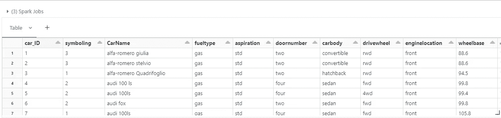
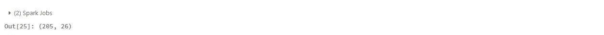
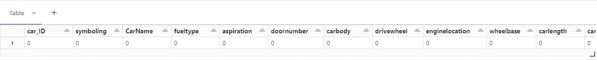
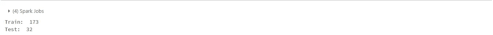
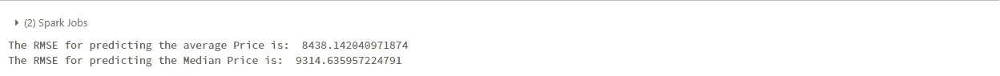
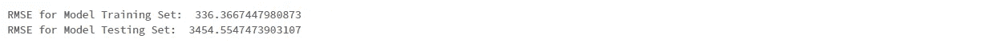

# Pyspark 中带数据块的线性回归

> 原文：<https://medium.com/mlearning-ai/linear-regression-in-pyspark-with-databricks-ba923d2ab156?source=collection_archive---------3----------------------->

Photo by [Markus Spiske](https://unsplash.com/@markusspiske?utm_source=medium&utm_medium=referral) on [Unsplash](https://unsplash.com?utm_source=medium&utm_medium=referral)

大家好，

在这篇文章中，让我们深入探讨如何在 pyspark 的数据砖中执行一个基本的线性回归任务。

> 查看如何设置自己的 databricks 社区版进行实验。

 [## 如何使用数据砖社区版？

### 在这篇文章中，你将学习如何获得你的数据砖社区版！

medium.com](/mlearning-ai/how-to-use-data-bricks-community-edition-9b899a2c0f40) 

对于这个实验，我使用了一个汽车价格预测数据集，数据可以从[这里](https://raw.githubusercontent.com/rohandawar/Databricks/main/data/CarPrice_Assignment.csv)下载。

我已经下载了数据，并使用文件>上传数据到 DBFS 和浏览数据集上传到数据块。

***问题陈述:*** 一家中国汽车公司吉利汽车渴望进入美国市场，在那里设立制造厂，在当地生产汽车，与美国和欧洲的同行竞争。他们与一家汽车咨询公司签订了合同，以了解汽车定价所依赖的因素。具体来说，他们希望了解影响美国市场汽车定价的因素，因为这些因素可能与中国市场非常不同。公司想知道:

*   哪些变量在预测汽车价格时很重要？
*   根据各种市场调查，这家咨询公司收集了美国市场上不同类型汽车的大型数据集。
*   你需要用可用的独立变量来模拟汽车的价格。它将被管理层用来理解价格是如何随自变量变化的。他们可以相应地操纵汽车的设计、商业策略等。以满足一定的价格水平。此外，该模型将是管理层了解新市场定价动态的好方法。

请注意，在这篇文章中，我只会尝试建模的数据，请让我知道在回应，如果你想让我涵盖 EDA 以及。

1.  让我们从导入必要的库开始。(*我倾向于在单个单元中导入库，这有助于更好地理解代码*)。

Code for Importing the Libraries

2.让我们读取数据。

Code for reading the data

Sample Outut for display of the data

3.接下来，让我们看看数据的形状

Code for checking the shape of the dataframe

Sample output

数据集由 206 行和 26 列组成。

3.让我们检查空值，现在 pyspark 中没有直接的方法，就像在 pandas 中一样，但是找到了一个有趣的方法来找到空值，为此感谢 google:)

Code for checking the null values in a pyspark dataframe

Sample output for NULL checking

因此，数据集是干净的，不存在空值。

4.接下来是训练，测试分割，它将帮助我们保留一组看不见的数据，用于我们的评估目的。

Code for train & test split

Sample output showing the shape of training & testing dataframe

5.让我们创建一些基线模型，通常使用平均值/中值，以检查我们的天真模型是否比它们更好。

Code for calculating the mean & median Price & adding the same as column

Code for Calculating RMSE & R2 for baseline models

Sample evaluation metric for baseline model

基线 RMSE 非常大。

6.通过快速浏览数据，我看到数据集由分类和数字列组成，因此我们将借助 StingIndexer & OneHotEncoding 来处理分类特性。

Code for Pre-processing Categorical Variables

6.我们需要提出的最后一个转换是 VectorAssembler，因为 spark ML 期望特性 a 是 vectors。

Code for Pre-processing (Vector Assembler)

> 看看我对重要性转换的解释

 [## Pyspark 中不可或缺的一个转换——vector assembler

### 大家好！

medium.com](/mlearning-ai/one-transformation-we-cannot-model-without-in-pyspark-vectorassembler-a36f58f9ed3b) 

7.现在，我们都准备好开始建模了，在这个实验中，我决定使用管道，因为这将帮助我无缝转换测试数据。

8.为了设置管道，我首先定义我希望转换发生的阶段，作为最后一个阶段，我将添加线性回归模型。

Code for model initiation & pipeline creation

9.让我们根据训练数据训练模型，并保存模型以备将来使用。

Code for pipeline fit & saving the model

10.让我们加载模型并转换训练/测试集，以便为训练集生成预测

Code for loading the saved model & performing transformations on train & test data

11.它的评估时间，所以看起来我们的模型，从基线上表现得好一点，但仍然有改进的余地。

Code for evaluation for train & test dataframes

Sample output for RMSE from training & test dataframes

这个实验的整个笔记本可以在我的 github [这里](https://github.com/rohandawar/Databricks)找到。

*敬请关注更多此类内容！下一集再见！！快乐学习！如果你喜欢，你读什么关注我* [*linkedIN*](https://www.linkedin.com/in/rohandawar/)

参考资料:

*   [矢量装配器](https://spark.apache.org/docs/3.1.3/api/python/reference/api/pyspark.ml.feature.VectorAssembler.html)的文档
*   [StringIndexer](https://spark.apache.org/docs/latest/api/python/reference/api/pyspark.ml.feature.StringIndexer.html) 的文档
*   [OneHotEncoding](https://spark.apache.org/docs/3.1.1/api/python/reference/api/pyspark.ml.feature.OneHotEncoder.html) 的文档
*   [回归评估器](https://spark.apache.org/docs/latest/api/python/reference/api/pyspark.ml.evaluation.RegressionEvaluator.html)的文档
*   [线性回归](https://spark.apache.org/docs/latest/api/python/reference/api/pyspark.ml.regression.LinearRegression.html)的文档

 [## Mlearning.ai 提交建议

### 如何成为 Mlearning.ai 上的作家

medium.com](/mlearning-ai/mlearning-ai-submission-suggestions-b51e2b130bfb)