# 统计学和机器学习中的线性回归

> 原文：<https://medium.com/mlearning-ai/linear-regression-in-statistics-and-machine-learning-5407b7de7a9e?source=collection_archive---------3----------------------->

在统计学中，**线性回归**是一种对标量响应(标签或因变量)和一个或多个探索变量(特征或响应或自变量)之间的关系进行建模的线性方法。一个解释变量的情况称为**简单线性回归**。对于一个以上的解释变量或响应，这个过程被称为**多元线性回归**。

在线性回归中，使用线性预测函数对关系进行建模，该预测函数的未知模型参数根据数据进行估计。这种模型被称为线性模型。

最常见的是，给定解释变量(响应或预测)值的响应的条件均值被假定为这些值的仿射函数；不太常见的是，使用条件中位数或其他分位数。与所有形式的回归分析一样，线性回归侧重于给定预测值时响应的条件概率分布。

# 线性回归假设

线性回归模型可以由下面的等式表示

*   *Y* 是预测值
*   θ ₀是偏差项。
*   *θ* ₁,…， *θ* ₙ为模型参数
*   *x* ₁、 *x* ₂,…、 *x* ₙ为特征值。

上述假设也可以表示为

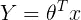

在哪里

*   *θ* 是模型的参数向量，包括偏差项 *θ* ₀
*   *x* 是 *x* ₀ =1 的特征向量

# **线性回归假设:**

1.  **外生性弱**。这实质上意味着预测变量 *x* 可以被视为固定值，而不是随机变量。例如，这意味着预测变量被假定为无误差的，也就是说，没有被测量误差污染。
2.  **线性度**。这意味着响应变量的平均值是参数(回归系数)和预测变量的线性组合。响应和特征变量之间的关系应该是线性的。可以使用散点图测试线性假设。如下所示，第一张图表示线性相关变量，而第二张图和第三张图中的变量很可能是非线性的。因此，第一张图将使用线性回归给出更好的预测。

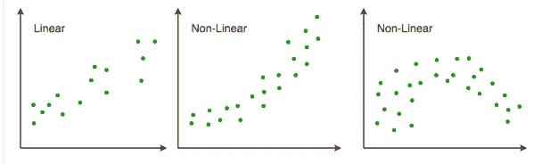

Linear and Nonlinear data

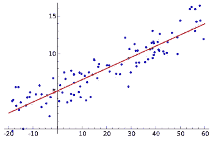

Example of [S](https://en.wikipedia.org/wiki/Simple_linear_regression)imple linear regression, which has one independent variable

**3。很少或没有多重共线性**:假设数据中很少或没有多重共线性。当要素(或独立变量)彼此不独立时，会出现多重共线性。

**4。很少或没有自相关**:另一个假设是数据中很少或没有自相关。当残差不是相互独立的时，就会出现自相关。你可以参考[这里的](https://en.wikipedia.org/wiki/Autocorrelation#Regression_analysis)来深入了解这个话题。

**5。同方差**:同方差描述了一种情况，其中误差项(即自变量和因变量之间关系中的“噪声”或随机扰动)在所有自变量的值上都是相同的。如下所示，图 1 具有同方差性，而图 2 具有异方差性。

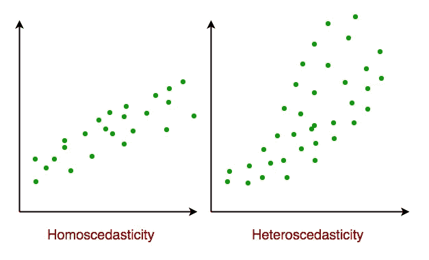

Homoscedasticity and Heteroscedasticity

## 6.正规化

线性模型的扩展称为正则化方法。这些方法寻求最小化训练数据上模型的平方误差的总和(使用普通的最小二乘法),并且降低模型的复杂性(如模型中所有系数总和的数量或绝对大小)。

线性回归正则化过程的两个常见示例是:

*   [套索回归](https://en.wikipedia.org/wiki/Lasso_(statistics)):修改普通最小二乘法，使系数的绝对和最小化(称为 L1 正则化)。
*   [岭回归](https://en.wikipedia.org/wiki/Tikhonov_regularization):修改普通最小二乘法，使系数的绝对平方和最小化(称为 L2 正则化)。

当输入值中存在共线性且普通最小二乘法会过度拟合训练数据时，这些方法非常有效。

## 7.梯度下降

当有一个或多个输入时，您可以通过迭代最小化训练数据上的模型误差来使用优化系数值的过程。

这种操作称为梯度下降，从每个系数的随机值开始。计算每对输入和输出值的误差平方和。学习率被用作比例因子，并且系数朝着最小化误差的方向被更新。重复该过程，直到达到最小平方和误差，或者不可能进一步改进。

使用这种方法时，您必须选择一个学习率(alpha)参数，该参数决定了在过程的每次迭代中要采取的改进步骤的大小。

梯度下降通常使用线性回归模型来教授，因为它相对容易理解。实际上，当您的数据集无论是行数还是列数都非常大，可能无法容纳在内存中时，这是非常有用的。

## 8.**去除噪声:**

线性回归假设您的输入和输出变量没有噪声。考虑使用数据清理操作，以便更好地暴露和澄清数据中的信号。这对于输出变量非常重要，如果可能的话，您希望移除输出变量(y)中的异常值。

## 9.**高斯分布:**

如果输入和输出变量具有高斯分布，线性回归将做出更可靠的预测。对变量使用变换(如 log 或 BoxCox)可能会有一些好处，使它们的分布看起来更像高斯分布。

## 10.**重新调整输入**:

如果使用标准化或规范化重新调整输入变量，线性回归通常会做出更可靠的预测。

# 评估模型的性能

1.  **RMSE 和 R 得分或决定系数:**

我们将使用均方根误差( **RMSE** )和决定系数( **R** 得分)来评估我们的模型。

**RMSE** 是残差平方和的平均值的平方根。

**R** 得分或**决定系数**解释了通过使用最小二乘回归可以将因变量的总方差减少多少。

**2。残差图:**

每个线性回归模型都应该在所有残差图上进行验证。这种回归图直接引导我们从正确的方程形式开始。您可能也会对之前关于回归的文章感兴趣。

残差分析通常用图形来完成。下面是我们通常会看到的两类图表:

**a .分位数图:**这种类型的图形是评估残差的分布是否正态。该图介于残差分位数的实际分布和完全正态分布残差之间。如果图形完全覆盖在对角线上，则残差是正态分布的。下图是近似正态分布残差的示意图。

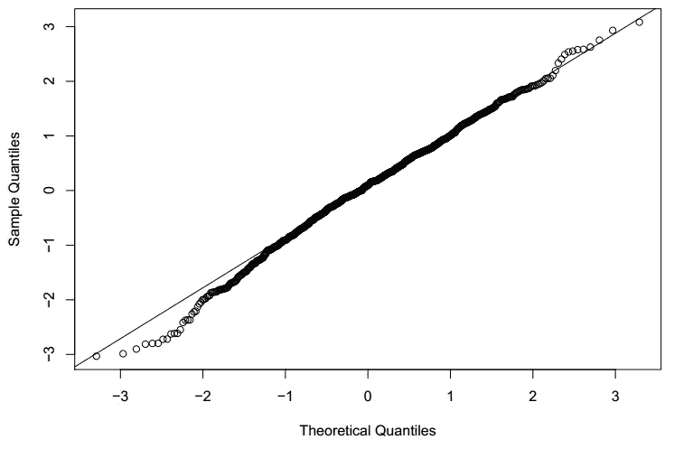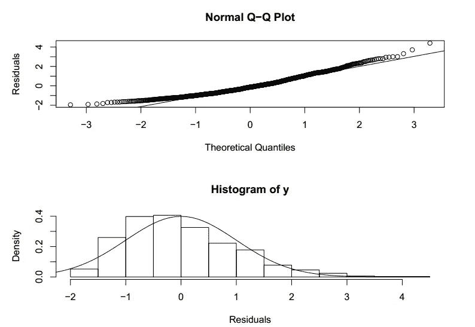

**b .散点图及其对残差的解释:**这种类型的图表用于评估模型假设，如恒定方差和线性，并识别潜在的异常值。下面是完美残差分布的散点图。

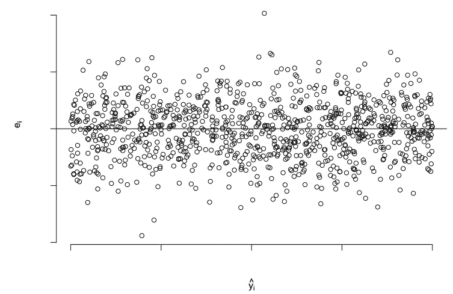

Scatter plot with perfect residual distribution

让我们试着想象一个方差不等的残差分布散点图。

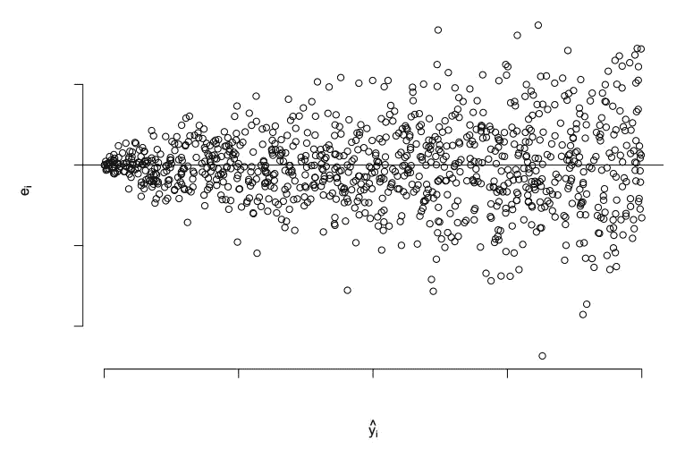

Graph with residual normal distribution being clearly violated

如果曲线是这样的，残差可以包含在水平带中(并且残差在带内或多或少以随机方式波动)，则没有明显的模型缺陷。

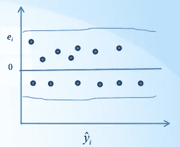

Plot with no obvious model defects.

该图是这样的，残差可以包含在一个向外开口的漏斗中，那么这种模式表明误差的方差不是常数，而是 y 的增函数。

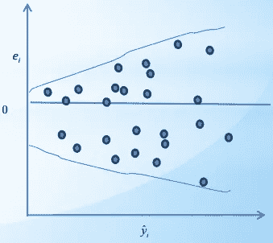

The variance of errors increasing with y

这些图是这样的，残差可以容纳在一个向内打开的漏斗中，那么这种模式表明误差的方差不是常数，而是 y 的减函数。

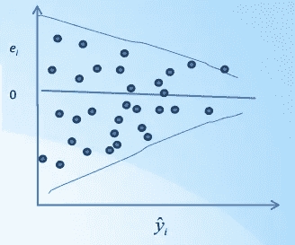

The variance of errors decreasing with y

如果曲线是这样的，残差可以容纳在双弓形内，那么这样的模式指示误差的方差不是常数，而是 y 是 0 和 1 之间的比例。那么 y 可能是二项式分布。接近 0.5 的二项式比例的方差比接近 0 或 1 的更大。所以假设 y 和 X 之间的关系是非线性的。处理这种方差不等的通常方法是对解释变量、研究变量进行适当的变换，或者使用加权最小二乘法。在实践中，研究变量的变换通常被用来稳定方差。

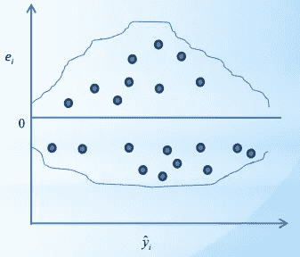

inequality of variances

如果曲线是这样的，残差包含在曲线内，那么它表明非线性。y 和 X 之间的假定关系是非线性的。这也可能意味着模型中需要一些其他的解释变量。例如，平方误差项可能是必要的。在这些情况下，解释变量和/或研究变量的转换也可能是有帮助的。

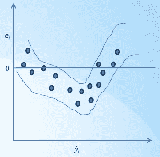

Non-Linear relationship with residuals and y

# **线性回归应用:**

线性回归广泛应用于生物、行为和社会科学中，以描述变量之间可能的关系。它是这些学科中使用的最重要的工具之一。线性回归在机器学习等人工智能领域发挥着重要作用。线性回归算法由于其相对简单和众所周知的特性而成为基本的监督机器学习算法之一。

# 优点和缺点:

线性回归的主要优点是它的简单性、可解释性、科学可接受性和广泛的可用性。线性回归是许多问题的首选方法。分析师可以将线性回归与变量记录、转换或分段等技术结合使用。

它的主要缺点是许多现实世界的现象根本不符合线性模型的假设；在这些情况下，很难或不可能用线性回归产生有用的结果。

线性回归在统计软件包和商业智能工具中广泛使用。

通过 [Linkedin](https://www.linkedin.com/in/sureshhp/) 和 [Medium](https://hpsuresh12345.medium.com/about) 与我联系，获取新文章和博客。

— — — * — — — * — — — * — — — * — — — * — — — * — — — * —

*“培养学习的热情。如果你这样做了，你将永远不会停止成长*

— — — * — — — * — — — * — — — * — — — * — — — * — — — * —