# 线性回归:简单的普通最小二乘法

> 原文：<https://medium.com/mlearning-ai/linear-regression-ordinary-least-squares-in-a-nutshell-c2e0d7ed260f?source=collection_archive---------0----------------------->

大家好！

在我上一篇[文章](/mlearning-ai/a-gentle-introduction-to-linear-regression-the-dart-way-9750214e6fa2?source=friends_link&sk=e199d8f5b0bb71c97525be2ee7f5819b)中，我用 [ml_algo](https://github.com/gyrdym/ml_algo) 库解释了线性回归的基础。如果你没有读过或者对这个话题不熟悉，请熟悉我的[帖子](/mlearning-ai/a-gentle-introduction-to-linear-regression-the-dart-way-9750214e6fa2?source=friends_link&sk=e199d8f5b0bb71c97525be2ee7f5819b)。

我提到过有几种方法可以找到预测线的系数。它们都是基于一个叫做“普通最小二乘法”的概念。

为了理解这个概念，让我们使用我以前的[文章](/mlearning-ai/a-gentle-introduction-to-linear-regression-the-dart-way-9750214e6fa2?source=friends_link&sk=e199d8f5b0bb71c97525be2ee7f5819b)中的例子。

我们有一个小数据集:

让我们用线性方程组的方式来写它:

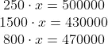

记住，我们的数据偏离原点:

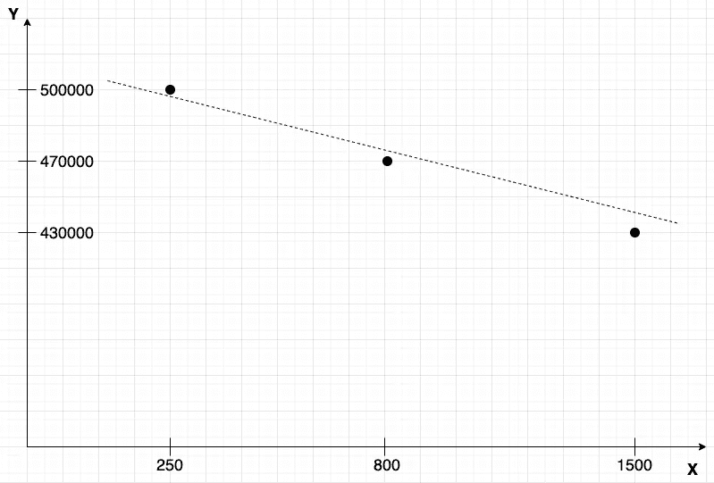

这意味着我们必须通过向特征矩阵添加新列并向系数矩阵的开头添加新值来考虑偏差项:

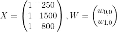

特征矩阵的第一列中的术语“1”来自线的等式:

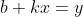

其中:

*   “b”是我们的偏差，我们记为“w_0_0”
*   “k”是我们的系数，我们记为“w_1_0”
*   “y”是我们的结果

我们可以用下面的方式重写这个等式:

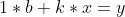

请注意偏差项，你可以看到“1”——它是偏差的一个值，它总是 1。这就是为什么我们用 1 填充矩阵 X。

让我们重写前面提到的线性方程组，考虑偏差项:

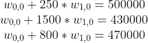

接下来，我们应该想出求系数 w0 _ 0 和 w1 _ 0 的算法，它们是被称为“预测直线方程”的谜题的最后一部分。我们怎样才能找到他们？

例如，我们可以对系数做一些最好的猜测，用它代替未知项 w0 _ 0 和 w1 _ 0，并以某种方式将实际结果与预测结果进行比较。

假设 10 和 20 是 w0 _ 0 和 w1 _ 0 系数的最佳猜测值。让我们用它们代替 w_0_0 和 w_1_0 变量:

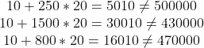

如我们所见，我们离实际结果还很远。

看来，我们最好的猜测根本不是最好的，真遗憾。让我们重复上述步骤，对系数进行更多的随机猜测。

经过数百天毫无结果的尝试，我们意识到应该有一个更聪明的方法来找到系数。我们不仅要直观地评估预测结果和实际结果之间的差异，还要通过两者相减来进行比较，并将相减的结果视为“我们的预测与实际值之间的差距”，或者简单地称为“误差”:

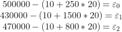

因此，我们可以为上面系统中的每一行推断出一个共同的模式:

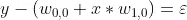

在哪里

*   y 是我们的实际结果(价格)
*   w0 0 是我们的偏差系数
*   w1 _ 0 是我们的特征系数

老实说，误差是负数还是正数并不重要，我们只对误差的绝对值感兴趣。让我们考虑这一点，重写模式:

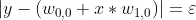

让我们做一个替换:

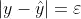

在哪里

*   带帽子的 y 是我们预测的结果

嗯，这看起来像是某个 3d 图形的方程式。我们来画一下:

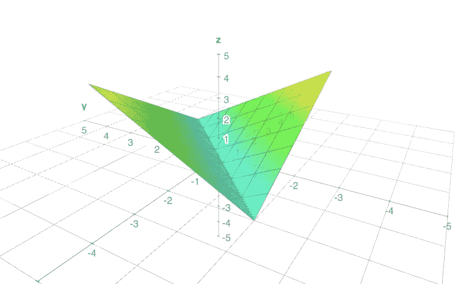

这让我想起一张对折的纸。

显然，我们应该找到这样的 w_0_0 和 w_1_0，使得我们的“z”坐标(也就是我们的误差)等于 0(这是一条“折叠”线)。很符合逻辑，不是吗？我们需要最小化误差，也就是最小化“z”坐标。

怎样才能有效做到最小化？从数学的角度来看，我们可以找到极值点(在我们的例子中是最小值)，在这里*切线*(或者在我们的例子中是切面)接触曲线(或者在我们的例子中是曲面)。要找到这样一条线，只需要得到函数的全局最小点的导数。在这一点上，我们的导数总是等于零。

为什么是最小点？因为我们只关心找到尽可能小的误差。

让我们对 3d 表面进行 2d 投影，并尝试绘制切线:

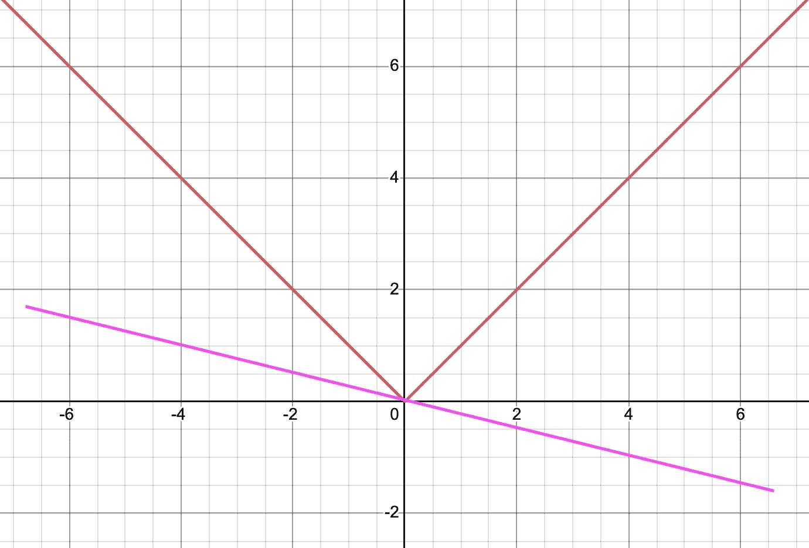

粉色线是我们的切线。等等，这是唯一可能的切线吗？如果我们画出以下内容会怎么样:

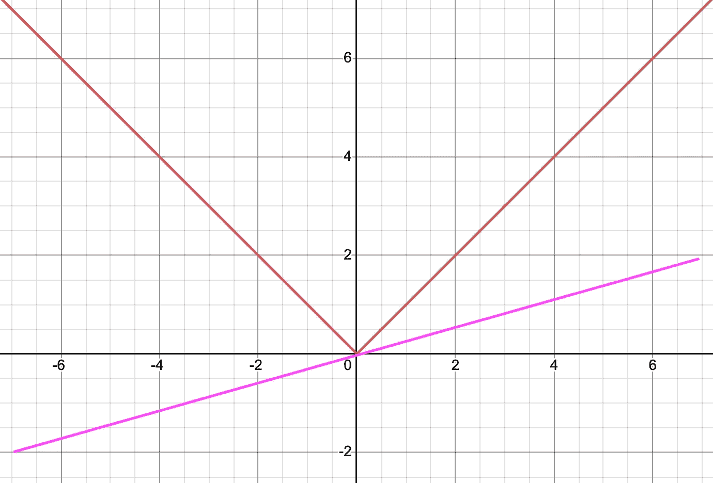

看起来我们可以在这个函数的最小点画出无限多条切线，这意味着导数在我们的例子中没有定义。最好选择另一个功能。

首先，让我们问自己:我们如何消除负面价值真的重要吗，它改变了什么吗？显然不是。我们可以简单地用*平方误差*代替绝对误差:

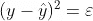

效果是一样的，但是函数现在有了导数。我们来看剧情:

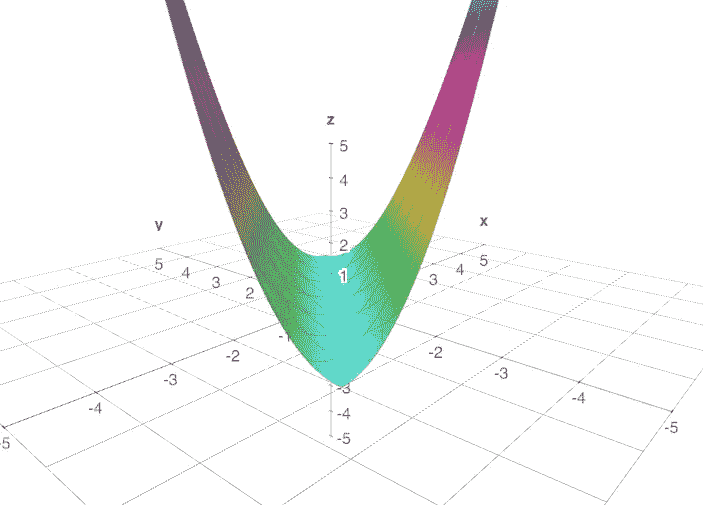

从几何角度来看，我们只能在全局极小点处画一条切线。太好了，平方误差是我们最好的选择。

现在找到合适的 w0 _ 0 和 w1 _ 0 要容易得多，因为我们有一个误差函数要最小化，所以我们有一个运动方向。

恭喜，我们刚刚推断出普通最小二乘法的目标函数！让我们再看一遍函数并记住它:

这是统计学和机器学习最重要的事情之一。普通最小二乘法的主要目标是最小化“y”和“带帽子的 y”项之间的平方差。

你可以问我，如何把这个函数应用到实际的数据集上？要在多个数据点的上下文中使用该函数，我们应该找到数据集每个点的平方差，并将所有结果相加。让我们用 10 和 20 作为 w_0_0 和 w_1_0 的值:

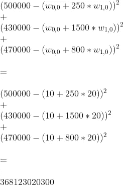

一旦我们找到最小可能的平方误差，这意味着我们达到了我们的目标，我们可以使用 w0 _ 0 和 w1 _ 0 系数进行预测。

目前为止的误差是 368123020300，太多了。我们一定要提高我们的 w0 _ 0 和 w1 _ 0 系数的值。有几种方法可以找到最佳值，其中之一是[我们的平方误差](/mlearning-ai/ordinary-least-squares-closed-form-solution-the-dart-way-d7c0ee0e0d02?source=friends_link&sk=9ba5a9da7fd3160b28c450ff6dc446a4)的闭式解。

差不多就是这样，

感谢您的阅读！

 [## Mlearning.ai 提交建议

### 如何成为 Mlearning.ai 上的作家

medium.com](/mlearning-ai/mlearning-ai-submission-suggestions-b51e2b130bfb)