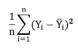
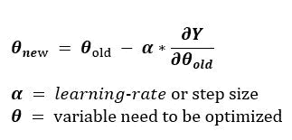
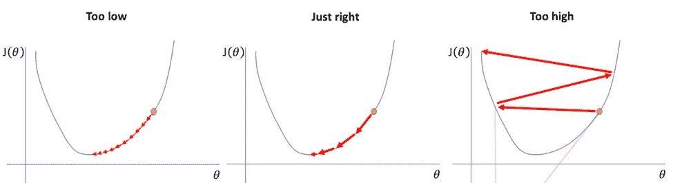
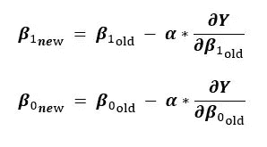

# 线性回归:第二部分(梯度下降)

> 原文：<https://medium.com/mlearning-ai/linear-regression-part-2-gradient-descent-7d4ff9d81520?source=collection_archive---------3----------------------->

读者你好，希望你做得很好！！

在我之前的文章中，我写了关于使用 OLS 的线性回归。

下面是它的链接:[https://medium . com/@ pradhyumn . 16 jics 040/linear-regression-using-ols-481 D6 daf 1 f 8](/@pradhyumn.16jics040/linear-regression-using-ols-481d6daf1f8)

数学就像一个由很多工具组成的盒子，其中一个就是著名的算法:

# ***1。定义:-***

***梯度**:表示输出相对于输入的变化。Is 是曲线在给定点的斜率(任意点 x1 处的 dy/dx)。*

***下降**:向下的意思。*

****梯度下降*** 是一种迭代优化算法，帮助我们找到函数的最小值。它在不同的领域有许多应用，但这里我们主要关注 ML，因此该算法帮助我们最小化模型的成本函数。*

*在我们继续之前，让我们先了解一下函数。*

# ***2。功能:-***

*函数是一组各有一个输出的输入之间的关系。*

****举例:***y = f(u，w)，y 是输入 u 和 w 映射的输出*

*你一定听说过 ***凸&凹功能*** 。凹函数用在我们必须寻找函数最大值的地方。*

*但我们的重点是最小化，所以要应用梯度下降，函数需要在本质上是凸的，而且是可微的。*

****可微函数*** *是那些对其定义域(所有可能输入的集合)中的每一点都有导数的函数。**

***可微的例子:** y = x + 2x - 6*

***不可微的例子:** y = | x |*

****凸函数*** *是二阶导数(f''(x))为> 0 的那些。**

**

**Convex has one minima but non-convex has two**

*我们也可以将梯度下降应用于非凸函数，但问题是很难找到全局最小值，我们经常会停留在任何局部最小值，可能永远也找不到全局最小值。*

# *3.数学:-*

*到目前为止，我们知道我们必须最小化成本函数，线性回归的成本函数是均方误差(MSE ),数学上表示为*

**

*MSE (Yi is actual and Y-hat is predicted value)*

*为了简单起见，让我们取一个自变量 X，所以我们最终得到这个方程: **Y =** **β0 + β1*X，** (β0 =截距，β1 = X 的系数)*

***梯度下降方程:***

**

*Gradient Descent Eq.*

> *对于人类来说，通过查看图表，更容易说出我们应该向哪个方向移动，向下还是向上，以达到最小值，但机器将如何计算出。这就是导数帮助我们的地方，在每一点，我们计算导数，调整方程的参数，向负斜率的方向移动。*

***第一步:**将方程(β0，β1)的参数初始化为 0。*

***步骤 2:** 选择一个学习率/步长，它不能太低，否则这个过程会比 Internet Explorer 慢，也不能太高，否则这个参数会像猴子一样从图中的一端跳到另一端。*

**

*Different step-size impact*

***第三步:**现在计算∂Y/∂β0 & ∂Y/∂β1.给出的 y w r tβ0 和β1 的偏导数*

***第四步:**将这些值输入梯度下降方程，得到新值。*

**

*New values of parameters*

***步骤 5:** 重复步骤 3 & 4，直到我们的代价函数值变得很低或者接近 0。最后的β0 & β1 的值是我们的优化值，我们在线性回归方程中使用这些值来生成预测。*

*在多个独立变量的情况下，相同的过程适用于它们的所有系数，实际上我们使用矩阵(numpy)来实现这些步骤，这使得过程足够快。*

***希望你从帖子中学到了。感谢阅读。祝您愉快！！***

***快乐编码！！***

* [## Mlearning.ai 提交建议

### 如何成为 Mlearning.ai 上的作家

medium.com](/mlearning-ai/mlearning-ai-submission-suggestions-b51e2b130bfb)*