# 线性回归——简单举例说明！！

> 原文：<https://medium.com/mlearning-ai/linear-regression-simple-explanation-with-example-fba51b2c181d?source=collection_archive---------0----------------------->

我试图用最简单的方法和例子来解释线性回归。

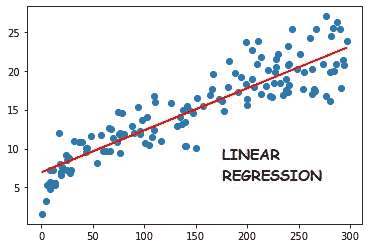

Typical Linear Regression plot

回归被定义为一种试图确定两个或多个相关变量之间关系的统计方法。它用于在给定其他变量(也称为预测变量)的值的情况下，预测一个变量(也称为因变量)的值。

回归算法属于监督学习方法，其中历史数据被标记并用于确定输出变量的值。

如果两个数值变量是线性相关的，那么它们的相关系数值将介于-1 和 1 之间。当我们希望使用这种关系根据一个变量(因变量)的值来预测另一个变量(预测变量)的值时，我们使用线性回归。

基于预测变量的数量，有两种类型的线性回归。：

1.  **简单线性回归**:只用一个预测变量来预测因变量的值。

**直线方程:y = c + mx (** 只有一个预测变量 **x** 带系数 **m)**

**2。多元线性回归**:多个预测变量用于预测因变量的值。

**直线方程:y = c + m1x1+ m2x2 + m3x3 … + mixi (** 多预测变量 x1，x2 … xi)。( **m1，m2 … mi** 是各自的系数 **)**

# **最佳拟合线:**

我们知道散点图用于查看两个数值变量之间的相互关系，如果存在线性关系，我们通常会尝试拟合直线。但是我们不能称任何线为最佳拟合线。

我们的数据包含因变量(用 **y** 表示)和自变量(用 **X** 表示)的一组值，最佳拟合线是误差项的**残差平方和**最小的线。什么是错误术语？让我们找出答案。

所以会有一个由我们的线给出的‘y’值(我们称之为 y_pred)和一个已经存在于我们的数据中的‘y’值(我们称之为 y_true)。y_true 和 y_pred 之间的差异给出了误差项(e)。每个 X 和 y 值都有一个误差项。

这个误差项可以是正的，也可以是负的。所以我们取所有误差项的平方并求和。这称为误差项的**残差平方和**。

**因此，线性回归的目的是找到给定 X 和 y 变量的最佳拟合线，使得误差的残差平方和最小**。在数学术语中，RSS 是我们需要最小化的成本函数。有几种最小化技术，但最常用的是梯度下降法。

# **线性回归的假设:**

为了使用线性回归进行预测，有一些相关的假设:

1.  X 和 y 之间存在线性关系。
2.  误差项服从正态分布。
3.  误差项是相互独立的。
4.  误差项具有恒定的方差，也就是说，它们表现出同方差性。

注意，这里没有关于 X 和 y 分布的假设。

这些假设适用于简单线性回归和多元线性回归。然而，当涉及到多元线性回归时，还有一些需要考虑的问题，我们将在举例时讨论。

让我们用一个例子来更好地理解整个线性回归概念。

我采用了易于理解的医疗费用数据集，我们将在 python 中构建一个线性回归模型，用于使用给定的属性或变量集预测医疗费用。

首先，我们导入必要的库:

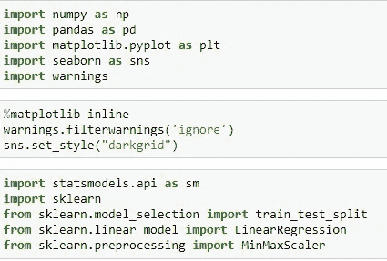

Necessary libraries imported

然后我们加载数据帧作为 df。让我们看看我们的数据是什么样的。

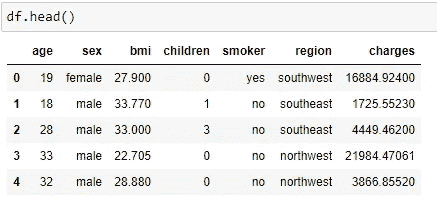

First five rows of our data

这里我们可以看到，年龄、性别、体重指数、儿童、吸烟者和地区等各列构成了我们的预测变量(X ),费用是我们的因变量(y)

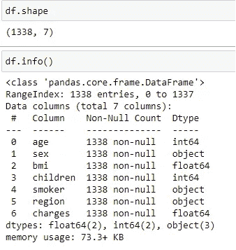

Basic analysis

对我们的数据的基本分析表明，数据是干净的，没有丢失的值。然而，线性回归对异常值很敏感，因为异常值会影响 RSS 功能。所以我们需要确保没有异常值。

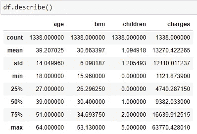

Outliers analysis

数据似乎不错，所有的价值似乎都是真实的。

我对这些数据进行了探索性数据分析(EDA)。在此过程中，我添加了两个分类列，即年龄组和身体质量指数组(分组基于世卫组织标准—[https://www . euro . who . int/en/health-topics/disease-prevention/nutrition/a-healthy-life style/body-mass-index-BMI](https://www.euro.who.int/en/health-topics/disease-prevention/nutrition/a-healthy-lifestyle/body-mass-index-bmi)。)

这些是我发现的重要推论:

1.  吸烟者往往有较高的体重指数。
2.  **60+男性往往 bmi 较高。**
3.  **肥胖和超重的人 bmi 较高。**
4.  **西南地区 bmi 值高的人群较多。**
5.  **一般来说，肥胖和 bmi 会随着年龄的增长而增加。**

我们将进行回归分析。

让我们使用热图来看看我们的数据 df 的变量是如何关联的。

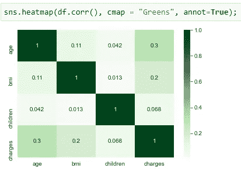

Heatmap showing correlations for data variables

这里我们可以看到，由于我们的数据包含分类变量，因此并非所有变量都被捕获。我们需要首先对这些变量进行编码，以便在我们的模型构建过程中使用它们。为此，我们使用 sklearn 库中的标签编码器和预处理包。

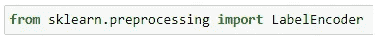

我们对以下分类变量进行编码:“性别”、“身体质量指数群体”、“年龄群体”、“吸烟者”、“地区”。

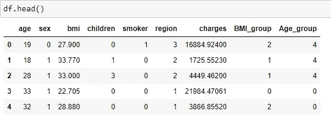

Data frame after encoding categorical variables

回归分析最重要的部分之一是将数据分成训练集和测试集。训练集将是我们有标签的历史数据，我们将使用这些数据来训练我们的模型。然后，测试数据用于使用我们基于列车数据建立的模型进行预测。

我们使用 sklearn 库中的 train_test_split 方法将数据帧 df 分为 df_train(包含 70%的数据)和 df_test(包含 30%的数据)。

现在，重要的一步是缩放数据。为什么要缩放？缩放有助于简化数据的可视化，最重要的是有助于梯度下降法更快地实现基础成本函数的最小值。有两种缩放方法:

数据标准化，我们将平均值= 0，标准差= 1 的数据标准化。

MinMaxScaling，转换全部数据，使所有值都落在 min。0 和最大值。一

这里我们使用 sklearn 库中的 MinMaxScaler 来使用 MinMaxScaling。

请注意，我们只对训练数据执行缩放。

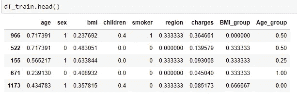

Train data after scaling

# **建立模型:**

现在让我们使用热图来看看我们的预测变量是如何与因变量相关联的。

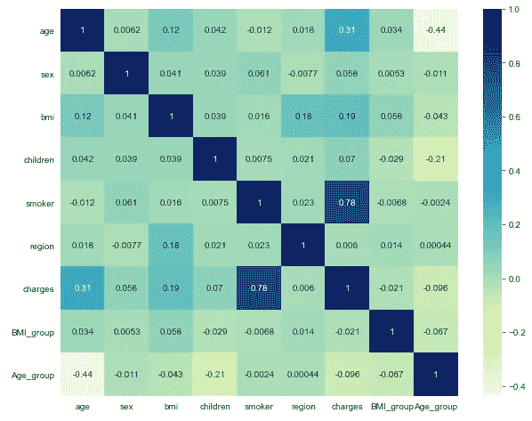

Heatmap showing correlation between data variables

我们可以看到变量“吸烟者”与变量“费用”的相关性最高，为 0.78。然后是“年龄”、“体重指数”等。

**简单线性回归:**目前我们知道，简单线性回归有一个预测变量，用来预测因变量的值。因此，我们使用“吸烟者”变量建立一个简单的线性回归模型。

这里我们使用 statsmodels.api 库来构建模型。

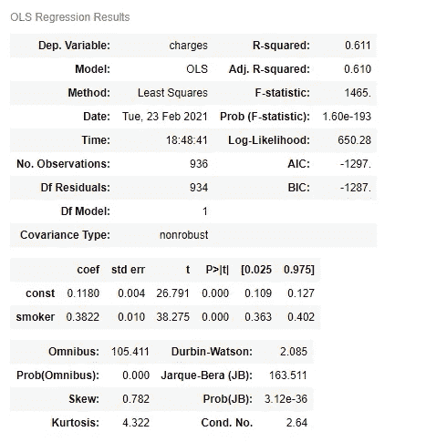

Statistical Results of Simple Linear Regression model

现在让我们了解一些统计基础知识。

**R** - **平方** ( **R2** )是一个统计量，表示回归模型中自变量解释的因变量方差的比例。它随着变量数量的增加而增加。

**调整后的 R** - **平方**是对 **R** - **平方**的修改版本，用于调整回归模型中不重要的预测值。我们将在多元线性回归中说明它的意义。

**p 值**表示自变量的显著性。值越低，该变量的意义越大。

**F-统计量和 Prob(F-统计量)**表示整体模型拟合度。F-statistic 值应该很高，Prob(F-statistic_)值应该理想地接近零。这意味着很好的模型拟合。

如果我们可以看到上面的统计数据，R 平方值为 0.61，这意味着因变量方差的 61%由自变量解释。常数和吸烟者的 p 值为 0。f 统计量，两个值都是理想值。**这是一个很好的模型，模型方程:**

**费用= 0.1180 + 0.3822*(吸烟者)**

现在让我们看看这个模型是否验证了线性回归的假设。

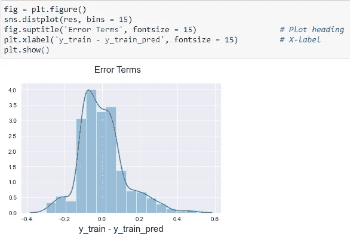

Plot of error terms

我们看到，通过从实际 y_train 值中减去训练数据的预测值而获得的误差项遵循正态分布。

**多元线性回归:**即使我们得到了一个只有一个预测变量的好模型，让我们看看是否可以通过添加更多的变量来建立一个更好的模型。

现在，让我们在“吸烟者”变量之后，添加与我们的目标变量“费用”相关的下一个变量“年龄”，相关性为 0.31。

Statistics after adding age variable

我们看到，R 平方增加了，调整后的 R 平方也增加了。“年龄”的 p 值为 0，模型的 F 统计显示了良好的值。

这意味着“年龄”是我们模型的一个重要变量。

现在让我们再增加一个变量“bmi”。

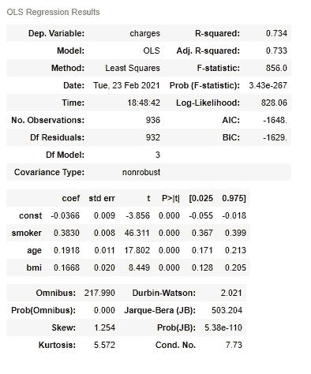

Statistics after adding bmi variable

我们看到，R 平方增加了，调整后的 R 平方也增加了。bmi '再次具有 0 p 值，并且模型的 F 统计显示了良好的值。

这意味着“bmi”是我们模型的一个重要变量。

我们说过多元线性回归还有一些额外的考虑。它们是模型复杂性、多重共线性和特征选择。

**模型复杂性:**当您增加模型中的变量数量时，您的 R 平方将保持不变或增加。但是如果增加的变量微不足道呢？还增加了不必要的变量，使得模型庞大而复杂。也可能发生这样的情况，您的模型学习训练数据非常好，它对训练数据完全准确，但对测试数据给出不准确的结果。这被称为**过拟合**。为了解决这个问题，我们使用调整的 R 平方测量，惩罚无关紧要的变量的增加。这意味着，当我们在模型中加入任何无关紧要的变量时，调整后的 R 平方值就会减小。

**多重共线性:**如果一个或多个变量之间存在相关关系，这种现象称为多重共线性。这影响了模型的推断和解释部分(统计)。系数可能在数值和符号上摇摆。但是多重共线性不会影响整体预测和模型拟合。因此，虽然我们的模型可以很好地处理一定量的多重共线性，但我们需要在必要时解决多重共线性。 **VIF(方差膨胀因子)**是解决多重共线性的好措施。

## **VIF = 1/ (1 - R 平方)**

VIF > 10 是高的，不可接受的。

VIF > 5 需要检查。

VIF < 5 acceptable.

As a thumb rule we can drop the variables that are highly correlated with others.

**特征选择:**可以称为选择建立模型所需变量的一种方法。有许多方法可以做到这一点。手动或自动、向前或向后、组合或平衡方法等。

**继续我们的模型构建**，到目前为止，我们不需要担心过度拟合，因为我们的变量数量较少。我们将逐步选择特征变量。但是随着变量数量的增加，我们需要寻找多重共线性。

为此，我们使用 sklearn 库中的 variance_inflation_factor。

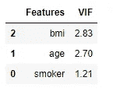

VIF values for independent variables

所有数值似乎都在验收标准范围内。

现在让我们再添加一个变量‘孩子’。

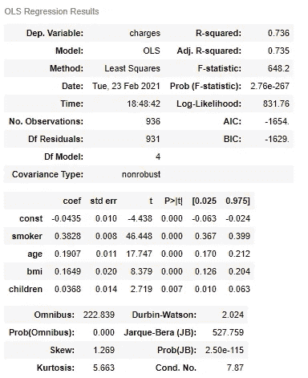

Statistics after adding children variable

我们看到，R 平方值增加到 0.736，调整后的 R 平方值增加到 0.735。预测变量的 p 值表明它们迄今为止是显著的。F 统计值也是可以接受的。到目前为止，我们的模型运行良好。让我们看看 VIF。

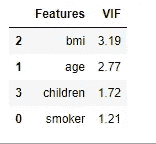

VIF values for predictor variables

到目前为止，VIF 值也在可接受的范围内。

如果我们加入另一个变量会发生什么？让我们添加“性别”变量。

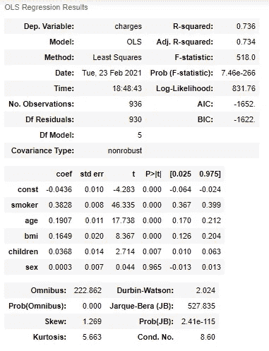

Statistics after adding sex variable

现在我们观察到“性别”变量的 p 值很高。调整后的 R 平方值也略有下降。所以‘性别’变量并不显著。

还要注意，其他变量与我们的目标变量相关性很低或没有相关性。所以我们到此为止。

因此，我们的最终模型由以下预测变量及其系数组成，如下所示:

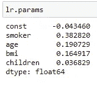

Final predictor variables and their co-efficients

所以我们的模型准备好了。现在让我们检查测试数据的预测。

我们找到 y_pred，然后计算误差项(y_test-y_pred)并绘制误差项。

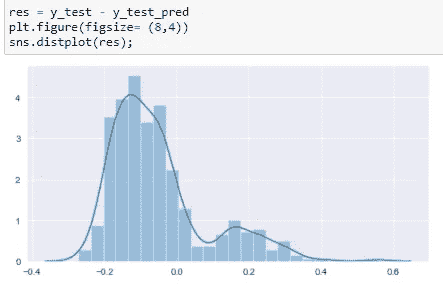

Error terms plot for test data

所以我们最终得出结论，线性回归假设得到了验证。

我们从零开始理解线性回归，先建立简单的线性回归模型，再建立多元线性回归模型。

我试图用最简单的方式解释这些概念，这样每个阅读这篇文章的人都能理解线性回归是如何工作的。

谢谢你。

***可以在 LinkedIn 上联系我:***[***https://www.linkedin.com/in/pathakpuja/***](https://www.linkedin.com/in/pathakpuja/)

***请访问我的 GitHub 简介获取 python 代码:***[***https://github.com/pujappathak***](https://github.com/pujappathak)

如果你喜欢我的文章，请随时评论并给出你的反馈。