# 线性回归:数字土壤制图的最终指南

> 原文：<https://medium.com/mlearning-ai/linear-regression-the-ultimate-guide-to-digital-soil-mapping-30c6d892473f?source=collection_archive---------2----------------------->

## 机器学习|农业

## 利用线性回归和克里金法的力量，让人类向未来农业迈进一步

在本系列的第一部分中，我们看到了如何通过组合训练数据、变量并将其传递给**预测模型**来为我们提供数字化的 3D 土壤地图。第一个也是最常用的预测模型是 ***线性回归。***

> 回归是一种统计方法，它找出一个输出变量(因变量)和一个或多个输入变量(自变量)之间的关系

他们通过在观察数据的图上拟合一条线来描述这种关系。线性回归模型拟合直线，而逻辑和非线性回归模型拟合曲线。当有一个因变量和一个自变量时，就是**简单线性回归**。而当有一个因变量但有多个自变量时，就是**多元线性回归**。

线性回归的方程为: ***Y = MX + C*** ，其中

Y =因变量(待预测)

M =直线的斜率

X =独立变量/预测值(Y 值所依赖的变量)

C = Y 截距(拟合直线与 Y 轴相交的点)

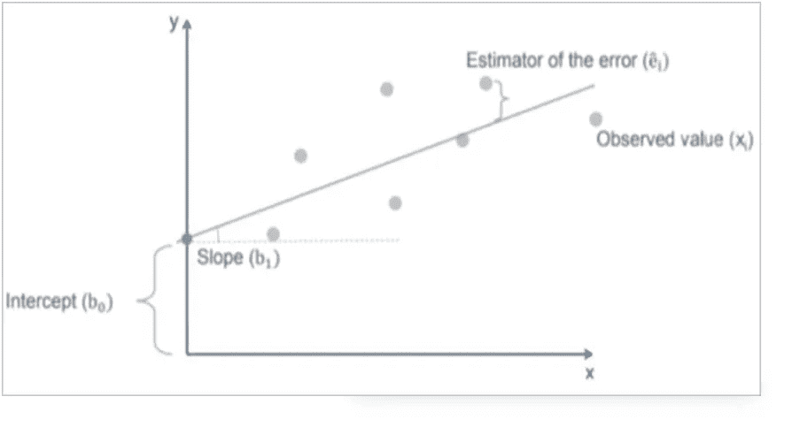

现在让我们用一个例子来理解一下。假设给我们 20 英亩的土地，分成 1 英亩的块，我们有每个 1 英亩块中石灰石的数量数据。现在，我们想知道每块土地上土壤的 pH 值，这样我们就可以选择合适的作物来种植。

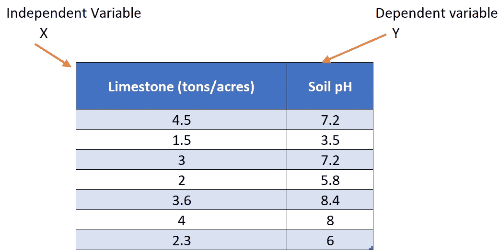

一种方法当然是从每个地块收集土壤样本并在实验室进行测试。但是这个过程既费时又费钱。一个更聪明的方法是测试一些区块(比如 7 个区块)的土壤 pH 值，然后利用回归分析建立石灰石数量和 pH 值之间的关系模型。

对上述数据进行回归将得到以下最佳拟合线:

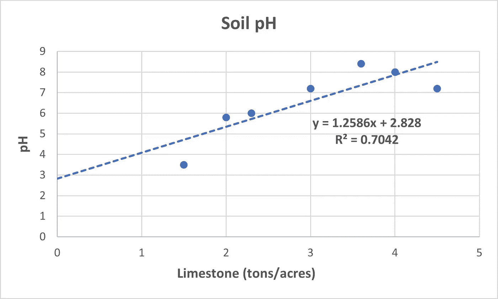

Fig 1.

因此，对于该数据，pH 值和石灰石之间的关系为

**pH = (1.26 *石灰石)+ 2.8**

通过代入相应的石灰石值，该方程可进一步用于预测未经测试的 acre-block 的近似 pH 值。

## 解释回归线:

将上述方程与线性回归方程进行比较，我们看到斜率“M”为 1.26，截距“C”为 2.8。基于此，可以做出以下两个推论

1.  石灰石量每变化一个单位，pH 值平均变化 1.26 ，其他变量保持不变。保持其他变量不变是至关重要的，因为它允许我们评估每个变量对因变量的影响。
2.  由于截距为 2.8(即最佳拟合线与 Y 轴相交的点是 2.8)，所以它告诉我们**如果存在 0 石灰石，那么土壤的 pH 值将是 2.8**

这是关于线性回归的。

当有多个预测变量时，我们称之为多元线性回归。那样的话，方程就变成了…

***y = c+m₁x₁+m₂x₂+…+mₙxₙ***

现在你可能想知道我们如何得到这条最佳拟合线？获得最佳拟合线的方法有很多，即**最小二乘法、梯度下降法、奇异值分解法**等等。为了保持这篇文章的简短，我们将只讨论最广泛使用的最小二乘法。如果你想了解其他技术，请在评论中告诉我，我会尽可能用最简单的方式解释它们。

# 最小二乘回归

考虑具有多个点的散点图。现在，如果我们画一条直线，我们将不能精确地覆盖所有的点。如图 1 所示，一些数据点位于直线上，而一些位于回归线之上/之下。因此，**对于给定石灰石值的相应 pH 值，实际 pH 值和回归线**预测的 pH 值之间可能存在微小差异。这被称为“**误差**，它总是出现在回归中，因为我们强迫一条直线通过所有的数据点。

因此，使用最小二乘法获得一条回归线，该回归线通过数据点，使得它们之间的**误差尽可能小**。并且结果线被认为是“最佳拟合”。使用术语“最小二乘法”是因为这条线是通过计算误差平方和并使其尽可能小而画出的。

我们可以通过从数据集中的实际值中减去从函数中得到的值来找出数据点的误差。

***预测值-实际值***

但是这些误差是每个单独数据点的，为了估计我们模型中的总误差，我们取所有这些单独误差的平均值，这被称为**偏差**。

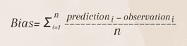

回归线总是有一个“误差”项，因为在现实生活中，自变量永远不是因变量的完美预测值。“误差”这个术语告诉你你对这个公式有多确定。**越大，回归线越不确定。**

**为什么最小二乘误差中的‘平方’？**

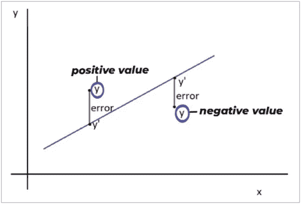

由于误差=预测值-实际值，位于回归线下方的点将具有负误差值，而位于回归线上方的点将具有正误差值。如果我们只取“最小误差之和”而不是“最小平方误差之和”，在计算过程中，正负误差会相互抵消，从而无法得到最佳拟合线。平方使所有误差为正。

# 模型评估

拟合线性回归模型后，我们需要确定模型与数据的拟合程度。它在解释因变量的变化方面做得有多好(如果有的话)？

有许多参数(在运行回归分析时作为输出获得)用于评估模型，但主要的是 **R 平方**和**均方根误差(RMSE)** 。

**R** :自变量 X 解释因变量 Y 变化的程度(或)数据与最佳拟合线的接近程度。

R 的值从 0 到 1 不等。当 R 值趋于 1 时，模型更精确，当 R 值趋于 0 时，模型指示更高的残差(误差)。

在图 1 中，我们得到的 R 值为 0.7042 ie。该模型解释了 70.42%的由石灰石量引起的 pH 变化。回归模型考虑的变化越多，数据点就越接近拟合线。

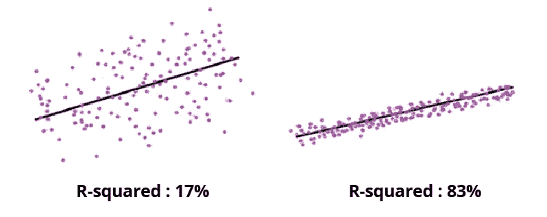

Source: [www.knowledgehut.com](http://www.knowledgehut.com)

***较高的 R 值代表观察数据和拟合值之间的差异较小。***

然而，情况并非总是如此。R 平方值小不一定是问题，R 平方值大也不一定好！

**RMSE:** 显示预测值与实测值的差距。数学上，RMSE 是:

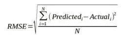

# 回归克里金法

回到我们寻找每英亩地块的 pH 值的例子，实际上，不是一块地中的所有土壤都具有相同的 pH 值。即使在一块地中，不同点之间的 pH 值也会不断变化。我们将该区域划分为若干块，这只能给我们一个粗略的 pH 值估计。但是**为了获得详细的 3D 地图，我们必须考虑测试位置的纬度、经度和 pH 值数据**。这被称为克里金法。这是一个将表面拟合到三维空间的地统计过程:纬度、经度和感兴趣的变量。

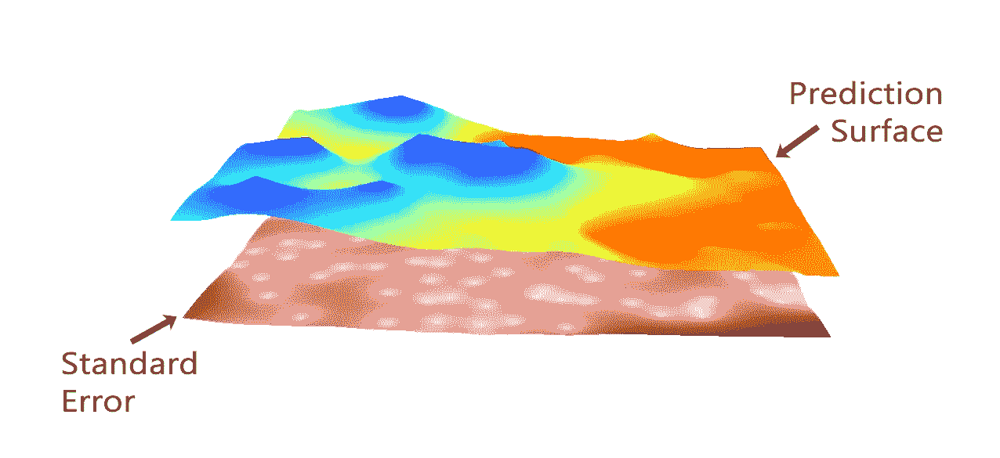

Source: gisgeography.com

引用本系列前一篇文章[中的话，“克里金法基于简单的地理定律:*一切事物都与其他事物相关，但近处的事物比远处的事物更相关”*](/@alfiaquraishi30/the-ultimate-guide-to-digital-soil-mapping-an-introduction-caf0803d635b)

因此，最简单的克里金法是通过对整个数据集进行平均(简单克里金法)或对邻近点进行加权平均(普通克里金法，距离较近的点比距离较远的点权重更大)来计算 A 点的感兴趣值。

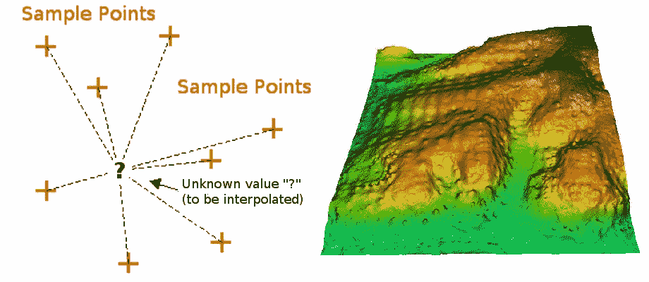

Source: gisresources.com

克里金法本身纯粹是一种地质统计学方法。通过与回归相结合，我们可以使它变得更好，从而建立一个混合的地质统计学-机器学习模型。在这种情况下，克里金法不是使用采样位置的值，而是使用辅助数据(预测值)回归的残差来进行克里金法。

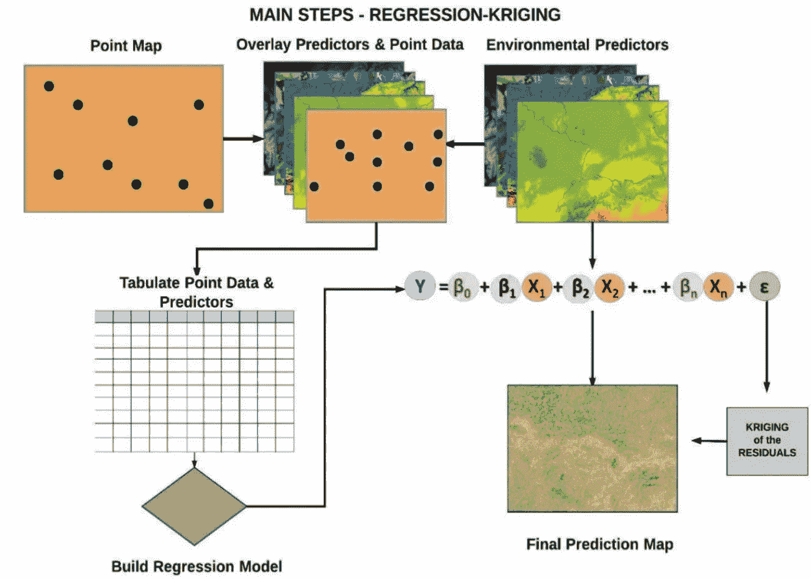

## 回归克里金法的步骤:

1.  通过将点数据与因变量和环境因素/预测因子叠加来创建地图。叠加任务可以在 R、ArcGIS、SAGA GIS 中完成。以表格形式提取预测数据。

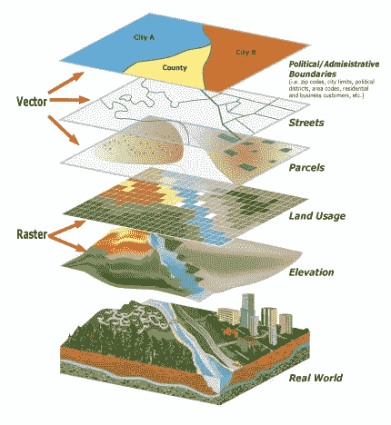

Source: cms.sbcounty.gov

2.使用因变量和预测值建立多元线性回归(MLR)模型。

3.根据 p 值排除不重要的预测因素(在确定受抚养人价值时不发挥重要作用的预测因素)。

4.使用回归残差的克里格法。

5.将回归结果和克里金法结果结合起来生成最终预测。

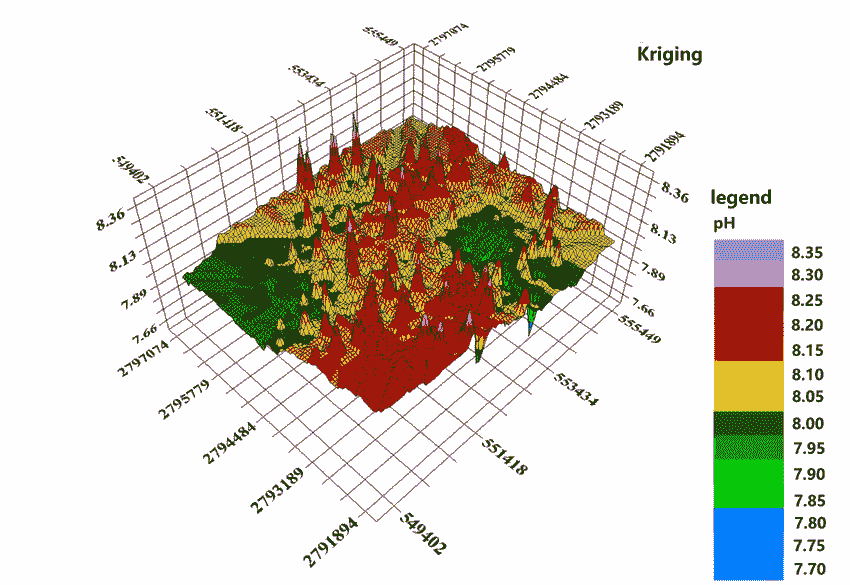

希望这篇文章已经让你对回归在 DSM 中的应用有了一个大概的了解。在下一篇文章中，我们将讨论另一种叫做**随机森林**的机器学习算法。我欢迎在下面的评论中提出反馈和建设性的批评，或者你可以通过 alfiyaquraishi02@gmail.com 联系我

 [## Mlearning.ai 提交建议

### 如何成为 Mlearning.ai 上的作家

medium.com](/mlearning-ai/mlearning-ai-submission-suggestions-b51e2b130bfb)