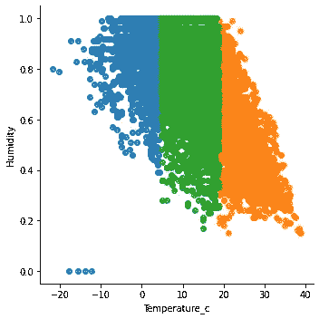

# 线性回归 vs 岭回归 vs 套索回归

> 原文：<https://medium.com/mlearning-ai/linear-regression-vs-ridge-regression-vs-lasso-regression-467d0df39cc9?source=collection_archive---------0----------------------->

## 包含 Python 和 Scikit 的完整代码示例——了解



```
**Table of contents:**Linear Regression vs Ridge Regression vs Lasso Regression
Loading dataset and Exploratory Data Analysis
   Description
   Rain
   Humidity
   Wind Speed
   Wind Bearing
   Visibility
   Pressure
Simple Linear Regression
Ridge Regression…
```