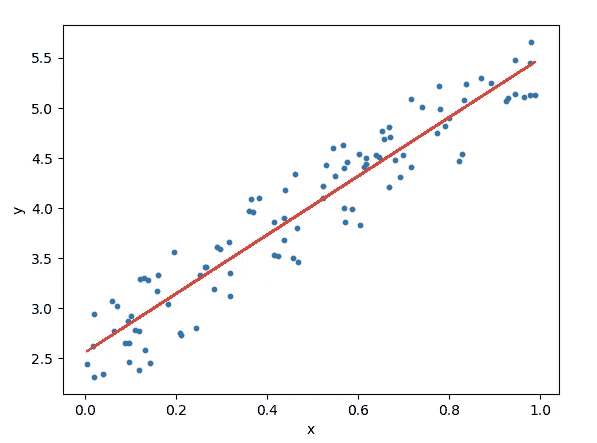
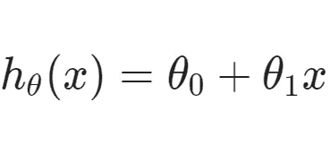
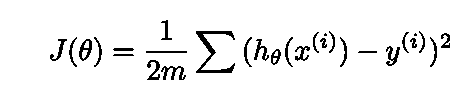
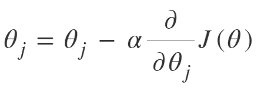
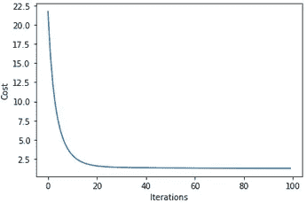
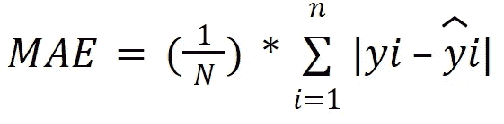
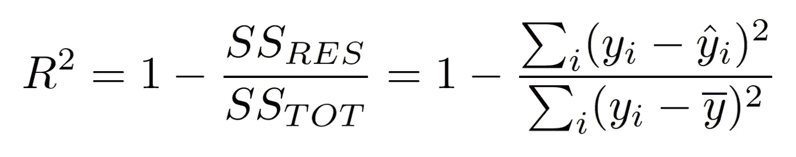

# 从零开始梯度下降的线性回归

> 原文：<https://medium.com/mlearning-ai/linear-regression-with-gradient-descent-from-scratch-ef3cb1dc0c6f?source=collection_archive---------7----------------------->

当有人想了解机器学习时，线性回归是最常用的算法之一。Python 提供了一个方便的库来实现线性回归，比如 Scikit-learn。然而，如果我们试图从零开始实现线性回归，以便深入了解它是如何工作的，这将是很好的。

在这个故事中，我们将从 Python 中的梯度下降优化开始稍微深入一点线性回归。

**线性回归**

一种监督学习方法，可以对连续变量进行建模，并基于这些变量进行预测。换句话说，我们可以绘制一个散点图，其中 X 为自变量，Y 为因变量，最佳拟合线称为回归线。

Image 1\. Linear Regression (Source: [vitalflux](https://vitalflux.com/linear-regression-hypothesis-testing-examples/))

在数学形式中，它可以表示为:

Linear regression equation

其中 X 是自变量，Y 是因变量。我们可以看到方程是一条直线的方程。是的，我们的目标是找到数据的最佳拟合线。但是我们如何知道一条线是否最适合数据呢？

为了做到这一点，我们将使用**成本函数**来找出实际数据和线之间的误差。正如我们在图 1 中看到的，这条线在数据方面存在误差。

Cost function

成本函数方程将计算我们的线在数据方面产生了多少误差。我们的目标是找到最小的误差，或者换句话说，我们的目标是找到最小的成本函数。为了做到这一点，我们可以玩它的系数值。在这个例子中，我们将使用**梯度下降**来改变系数值，使得成本函数最小化。

Gradient descent function

> “知识的目的是行动，而不是知识。”——亚里士多德

**实现**

在这个特定的实现中，我们将使用来自 Kaggle 的数据，即[车辆数据集](https://www.kaggle.com/datasets/nehalbirla/vehicle-dataset-from-cardekho?datasetId=33080&sortBy=voteCount&select=car+data.csv)。这是使用过的车辆数据集，包含 5 个离散变量和 4 个连续变量。我们的目标是根据年份、当前价格、行驶公里数、燃料类型、卖方类型、变速器和车主变量来预测二手车的价格。在我们将数据输入线性回归方程之前，我们需要对它们进行预处理，以便模型能够以适当的方式消化它们。这些预处理步骤包括**离群点剔除**、离散变量的**一键编码**和连续变量的**标准化**。

在我们完成预处理步骤并将数据分成训练和测试数据之后，下一步是将数据输入线性回归。

Linear Regression with Gradient Descent

上面的函数只是我们之前讨论过的等式的代码版本。该函数取一些参数，这些参数是作为自变量的 **X** ，作为因变量的 **Y** ，以及用于梯度下降的**学习率**和**迭代**。换句话说，学习率表明我们想要相对于成本函数更新梯度下降多少。学习率越大，每次迭代的步长就越大(图 2)。

Image 2\. Gradient Descent (Source: [IBM](https://www.ibm.com/cloud/learn/gradient-descent))

在这个实验中，我们将使用学习率= 0.1，迭代次数= 100。模型训练是通过使用下面的代码完成的。我们还可以使用代码的最后两行绘制模型的损耗曲线。

Model training and plot loss curve

Loss curve

从损失曲线中，我们可以看到，由于我们的成本最小化，我们的模型学习得很好。我们可以推断我们的学习速度和迭代非常适合我们的问题和数据。

在我们训练我们的模型之后，下一步是用测试数据评估它们。我们将使用**平均绝对误差**和 **R** 。

Mean Absoulte Error (MAE)

**MAE** 是一种简单的评估方法，计算模型给出的关于数据的绝对误差。该结果将给出预测值与实际值偏差的绝对值。

R² (R-squared)

**R** 量化模型捕获的因变量的变化量。r 通过计算所有错误预测的平方和除以目标变量平均值的平方和来获得这些值。如果我们的 R 值接近 1，我们的模型就能做出准确的预测。对于这两个评估，我们将从 scikit-learn 导入函数。

我们分别在 **1.2315** 和 **0.8747** 得到了我们测试数据的 **MAE** ad **R** 的结果。通过使用学习率= 0.1 和迭代次数= 100，这产生了良好的结果。然而，我们可以通过调整它们来玩得更多。

希望这个故事能帮助你更多的理解线性回归和梯度下降。继续学习，感谢阅读！

所有的代码都可以在我的 GitHub 上找到。

 [## Mlearning.ai 提交建议

### 如何成为 Mlearning.ai 上的作家

medium.com](/mlearning-ai/mlearning-ai-submission-suggestions-b51e2b130bfb)