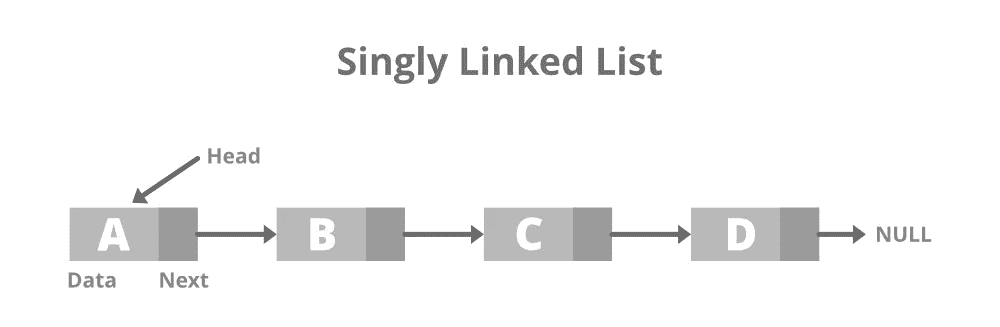
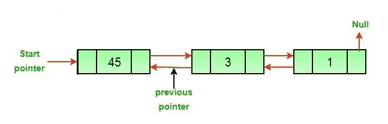
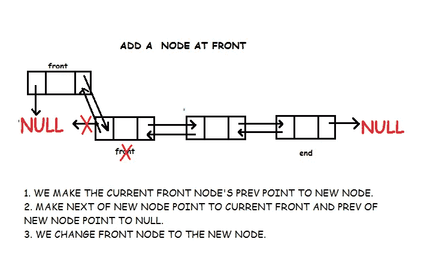
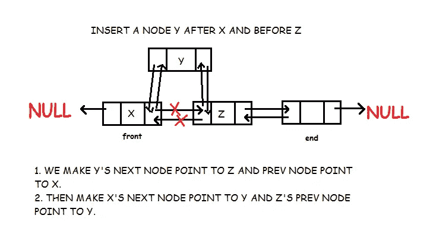
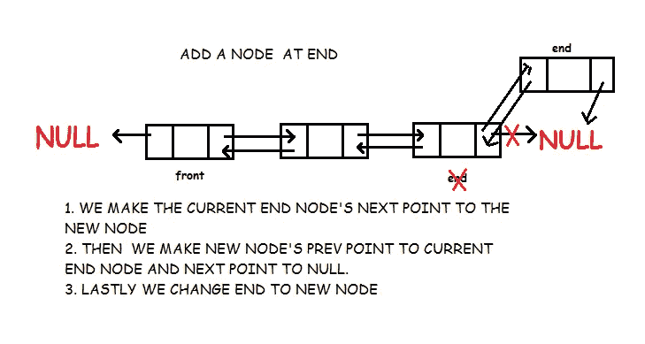
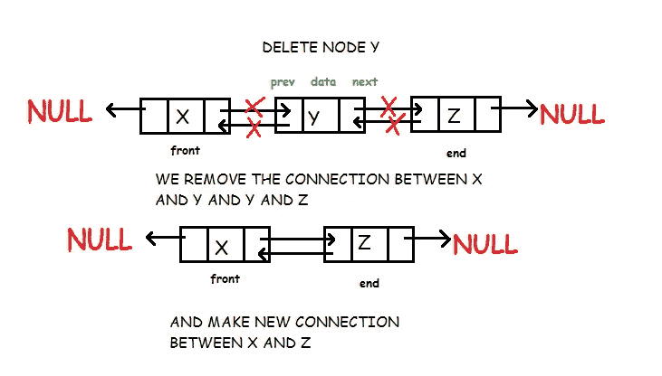
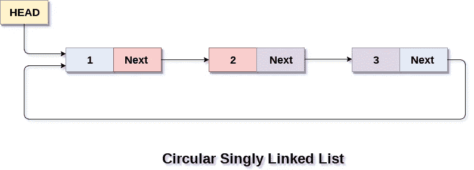

# 链表

> 原文：<https://medium.com/mlearning-ai/linked-list-570dee38406f?source=collection_archive---------10----------------------->

## **链表**

**’“链表是一系列数据结构，通过节点间的链接连接在一起。”**

链表是相互关联的链接序列，每个链接包含另一个链接的链接地址。

**链表**是继**数组**之后被广泛使用的数据结构。

**链接**——链表的每个链接都可以存储一个数据。

**下一个**——链表的每个链接都包含一个指向下一个链接的链接地址。

**链表**——链表包含第一个链接到下一个链接的连接链接。

# 链表表示法


## 链表的类型

**单链表**—导航仅向前。

**双向链表**—向前和向后导航。

**循环链表**—链接第一个元素作为下一个元素，第一个元素链接到最后一个元素作为上一个元素。

**基本操作**

*   **插入**——我们可以在链表的前端、末端或任何地方添加一个节点。
*   **删除**——您可以从链表的前端、末端或任何地方删除一个节点。
*   **显示**—显示完整的链表。
*   **搜索**——从链表的前端、末端或任意位置搜索特定节点。

# **单链表**



**单链表**是一种*单向的链表，*只能单向遍历。即头部到最后一个节点(尾部)。

**声明链表:**

```
struct node{
    int data;
    struct node *next;
 };
```

**创建节点:**

```
struct node{
    int data;
    struct node *next;
 };
node createNode(){
    temp = (node)malloc(sizeof(struct node)); 
    temp->next = NULL;
    return temp;
}
```

**malloc()** 用于在 C 中分配单个内存块，它在头文件 **Stdlib.h** 中可用。

**sizeof()** 用于确定 c 语言中一个元素的字节大小，用于在向 **malloc** 发送参数时确定每个节点的大小。

**遍历条件到链表:**

```
node p;
p = head;
while(p != NULL){
    p = p->next;
}
```

**在列表中插入一个节点:-**

*   我们可以在链表中添加一个节点

```
node addNode(node head, int value){node temp,p;temp = createNode();data = value and next pointing to NULL.temp->data = value;if(head == NULL){head = temp;}else{p  = head;while(p->next != NULL){p = p->next;}p->next = temp;}return head;}
```

**显示链表:-**

*   我们可以显示链表

```
void display() {struct node *current = head;if(head == NULL) {printf(“List is empty\n”);return;}printf(“Adding nodes to the end of the list: \n”);while(current != NULL) {printf(“%d “, current->data);current = current->next;}printf(“\n”);}
```

**删除链表:-**

*   我们可以删除链表中的节点

```
void deleteNode(struct Node* head, int key){struct Node *temp ,*head, *prev;if (temp != NULL && temp->data == key) {struct Node*head = temp->next;free(temp);return;}while (temp != NULL && temp->data != key) {prev = temp;temp = temp->next;}if (temp == NULL)return;prev->next = temp->next;free(temp);}
```

# **双向链表**

双向链表是一种链表，其中每个节点除了存储其数据之外，还有两个链接。第一个链接指向列表中的上一个节点，第二个链接指向列表中的下一个节点。



**前一个**存储前一个节点的地址

**Data** 是负责存储我们要在列表中处理的数据的字段

**Next** 存储下一个节点的地址

**优点**:-很容易向后和向前访问遍历列表。

**双向链表的实现**

```
struct node
{
	int data;     	
	node *prev;  	
	node *next; 	
};
```

**对双向链表的操作**

**在双向链表的开头插入数据**



```
void Doubly_Linked_List_add_front(int d)
{

	node *temp;
	temp = new node();
	temp->data = d;
	temp->prev = NULL;
	temp->next = front
	if(front == NULL)
		end = temp;

	else
		front->prev = temp;

	front = temp;
}
```

**在双向链表中的节点前插入数据**



```
void Doubly_Linked_List_add_before(node *n, int d)
{
	node *temp;
	temp = new node();
	temp->data = d;
	temp->next = n;
	temp->prev = n->prev;
	n->prev = temp;

	if(n->prev == NULL)
		front = temp;
}
```

**在双向链表中的一个节点后插入数据**

```
void Doubly_Linked_List_add_after(node *n, int d)
{
	node *temp;
	temp = new node();
	temp->data = d;
	temp->prev = n;
	temp->next = n->next;
	n->next = temp;

	if(n->next == NULL)
		end = temp;
}
```

**在双向链表的末尾插入数据**



```
void Doubly_Linked_List :: add_end(int d)
{

	node *temp;
	temp = new node();
	temp->data = d;
	temp->prev = end;
	temp->next = NULL;
	if(end == NULL)
		front = temp;
	else
		end->next = temp;	
	end = temp;
}
```

**删除双向链表中的一个节点**



```
void Doubly_Linked_List_delete_node(node *n)
{	
	if(n->prev == NULL)
	{
		front = n->next; 
		front->prev = NULL;
	}

	else if(n->next == NULL)
	{
		end = n->prev; 
		end->next = NULL;
	}
	else
	{
		n->prev->next = n->next;
		n->next->prev = n->prev;
	}

	delete(n);			
}
```

**双向链表中的向前遍历**

```
void Doubly_Linked_List_forward_traverse()
{
	node *p;
	p = front;
	while(p != NULL)
	{
		p->data;
		p = p->next;
	}
}
```

**双向链表中的向后遍历**

```
void Doubly_Linked_List_backward_traverse()
{
	node *p;
	p = end;
	while(p != NULL)
	{
		p->data;
		p = p->prev;
	}
}
```

# **循环链表**

循环链表是**最后一个节点指向第一个节点的链表。换句话说，这个链表的变体在末尾没有空元素**



**循环链表操作**

**在循环链表的开头插入**

```
void insertAtBeginning(int value)
{
    struct Node *newNode;
    newNode = (struct Node*)malloc(sizeof(struct Node));
    newNode -> data = value;
    if(head == NULL)
    {
       head = newNode;
       newNode -> next = head;
    }
    else
    {
       struct Node *temp = head;
       while(temp -> next != head)
          temp = temp -> next;
       newNode -> next = head;
       head = newNode;
       temp -> next = head;
    }
    printf("\nInsertion success!!!");
}
```

**在双向链表的末尾插入**

```
void insertAtEnd(int value)
{
   struct Node *newNode;
   newNode = (struct Node*)malloc(sizeof(struct Node));
   newNode -> data = value;
   if(head == NULL)
   {
      head = newNode;
      newNode -> next = head;
   }
   else
   {
      struct Node *temp = head;
      while(temp -> next != head)
         temp = temp -> next;
      temp -> next = newNode;
      newNode -> next = head;
   }
   printf("\nInsertion success!!!");   
}
```

**在循环链表中的节点后插入**

```
void insertAfter(int value, int location)
{
   struct Node *newNode;
   newNode = (struct Node*)malloc(sizeof(struct Node));
   newNode -> data = value;
   if(head == NULL)
   {      
      head = newNode;
      newNode -> next = head;
   }
   else
   {
      struct Node *temp = head;
      while(temp -> data != location)
      {
         if(temp -> next == head)
         {
            printf("Given node is not found in the list!!!");
            goto EndFunction;
         }
         else
         {
            temp = temp -> next;
         }
      }
      newNode -> next = temp -> next;
      temp -> next = newNode;
      printf("\nInsertion success!!!");
   }
   EndFunction:
}
```

**显示循环链表**

```
void display()
{
   if(head == NULL)
      printf("\nList is Empty!!!");
   else
   {
      struct Node *temp = head;
      printf("\nList elements are: \n");
      while(temp -> next != head)
      {
         printf("%d ---> ",temp -> data);
      }
      printf("%d ---> %d", temp -> data, head -> data);
   }
}
```

**删除循环链表中的开头**

```
void deleteBeginning()
{
   if(head == NULL)
      printf("List is Empty!!! Deletion not possible!!!");
   else
   {
      struct Node *temp = head;
      if(temp -> next == head)
      {
         head = NULL;
         free(temp);
      }
      else{
         head = head -> next;
         free(temp);
      }
      printf("\nDeletion success!!!");
   }
}
```

**在循环链表的末尾删除**

```
void deleteEnd()
{
   if(head == NULL)
      printf("List is Empty!!! Deletion not possible!!!");
   else
   {
      struct Node *temp1 = head, temp2;
      if(temp1 -> next == head)
      {
         head = NULL;
         free(temp1);
      }
      else{
         while(temp1 -> next != head){
            temp2 = temp1;
            temp1 = temp1 -> next;
         }
         temp2 -> next = head;
         free(temp1);
      }
      printf("\nDeletion success!!!");
   }
}
```

**删除循环链表中选中的位置**

```
void deleteSpecific(int delValue)
{
   if(head == NULL)
      printf("List is Empty!!! Deletion not possible!!!");
   else
   {
      struct Node *temp1 = head, temp2;
      while(temp1 -> data != delValue)
      {
         if(temp1 -> next == head)
         {
            printf("\nGiven node is not found in the list!!!");
            goto FuctionEnd;
         }
         else
         {
            temp2 = temp1;
            temp1 = temp1 -> next;
         }
      }
      if(temp1 -> next == head){
         head = NULL;
         free(temp1);
      }
      else{
         if(temp1 == head)
         {
            temp2 = head;
            while(temp2 -> next != head)
               temp2 = temp2 -> next;
            head = head -> next;
            temp2 -> next = head;
            free(temp1);
         }
         else
         {
            if(temp1 -> next == head)
            {
               temp2 -> next = head;
            }
            else
            {
               temp2 -> next = temp1 -> next;
            }   
            free(temp1);
         }
      }
      printf("\nDeletion success!!!");
   }
   }
```

**链表的应用**

1.  ***图像查看器*** —上一张和下一张图像链接在一起，因此可以通过下一张和上一张按钮访问。

3.  *****音乐播放器*** —音乐播放器中的歌曲链接到上一首和下一首歌曲。您可以从列表的开头或结尾播放歌曲。**

**感谢你阅读我的博客，我希望你学到了新的东西，并喜欢它。关注更多此类信息丰富的博客，并给予👏还有评论，它给了我写更多博客的鼓励祝你有美好的一天！！！**

**[](/mlearning-ai/mlearning-ai-submission-suggestions-b51e2b130bfb) [## Mlearning.ai 提交建议

### 如何成为 Mlearning.ai 上的作家

medium.com](/mlearning-ai/mlearning-ai-submission-suggestions-b51e2b130bfb) 

🔵 [**成为作家**](/mlearning-ai/mlearning-ai-submission-suggestions-b51e2b130bfb)**