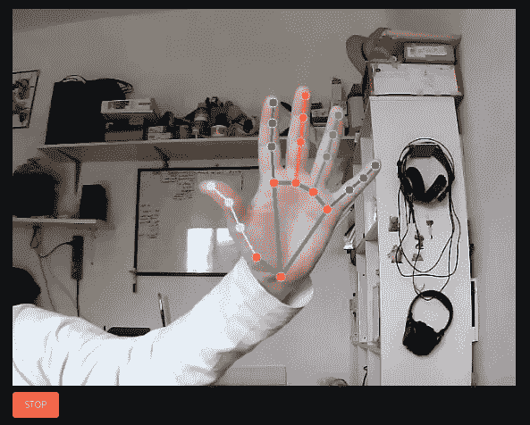
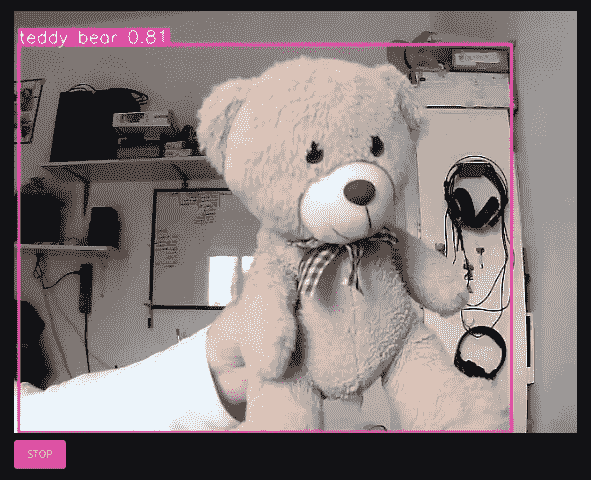

# 带 Streamlit 的实时网络摄像头

> 原文：<https://medium.com/mlearning-ai/live-webcam-with-streamlit-f32bf68945a4?source=collection_archive---------0----------------------->

## 一个用于手部跟踪和其他实时视觉任务的 web 演示应用程序

Streamlit 是一个非常好的创建网络演示的工具:今天我们很好地看到了 T2 的 streamlit-webrtc 库，它可以从浏览器获得一个网络摄像头组件(也可以在移动设备上，我在 Android 和 Chrome 上测试过)。



Hand tracking [demo](https://share.streamlit.io/nicolalandro/hand_tracking_streamlit/main/app.py)

深度学习有一些有趣的实时视觉任务，特别是本文重点关注的[手跟踪](https://z-uo.medium.com/hand-tracking-with-opencv-and-mediapipe-on-python-991dfae615d6)和[物体检测](/ml-research-lab/what-is-object-detection-51f9d872ece7)。

## 手跟踪

我选择 [Mediapipe](https://google.github.io/mediapipe/solutions/hands) 作为实现实时手部跟踪的库，所以我用下面的代码创建了一个 Streamlit 演示( [full repo](https://github.com/nicolalandro/hand_tracking_streamlit) 和 [demo](https://share.streamlit.io/nicolalandro/hand_tracking_streamlit/main/app.py) )，我将一步一步地解释:

我们首先需要定义我们的进口:

```
import cv2
import numpy as np
import av
import mediapipe as mp
from streamlit_webrtc import webrtc_streamer, WebRtcMode, RTCConfiguration
```

我们可以通过创建一个使用网络摄像头的虚拟工作流应用程序来继续:

```
mp_drawing = mp.solutions.drawing_utils
mp_drawing_styles = mp.solutions.drawing_styles
mp_hands = mp.solutions.hands
hands = mp_hands.Hands(
    model_complexity=0,
    min_detection_confidence=0.5,
    min_tracking_confidence=0.5
)RTC_CONFIGURATION = RTCConfiguration(
    {"iceServers": [{"urls": ["stun:stun.l.google.com:19302"]}]}
)webrtc_ctx = webrtc_streamer(
    key="TEST",
    mode=WebRtcMode.SENDRECV,
    rtc_configuration=RTC_CONFIGURATION,
    media_stream_constraints={"video": True, "audio": False},
    async_processing=True,
)
```

我们也只需要 *webrtc_streamer* 指令，但是当我们在远程服务器上部署它时，我们也需要指定 iceServer(参见[本期](https://github.com/whitphx/streamlit-webrtc/issues/832))。

现在，我们可以定义虚拟图像处理类(VideoProcessor ),它返回相同的图像而不进行处理:

```
class VideoProcessor:
    def recv(self, frame):
        img = frame.to_ndarray(format="bgr24") # img = process(img) return av.VideoFrame.from_ndarray(img, format="bgr24")webrtc_ctx = webrtc_streamer(
    key="WYH",
    mode=WebRtcMode.SENDRECV,
    rtc_configuration=RTC_CONFIGURATION,
    media_stream_constraints={"video": True, "audio": False},
    video_processor_factory=VideoProcessor,
    async_processing=True,
)
```

现在我们可以实现 process 函数来获得完整的代码( **app.py** ):

```
import cv2
import numpy as np
import av
import mediapipe as mp
from streamlit_webrtc import webrtc_streamer, WebRtcMode, RTCConfigurationmp_drawing = mp.solutions.drawing_utils
mp_drawing_styles = mp.solutions.drawing_styles
mp_hands = mp.solutions.hands
hands = mp_hands.Hands(
    model_complexity=0,
    min_detection_confidence=0.5,
    min_tracking_confidence=0.5
)def process(image):
    image.flags.writeable = False
    image = cv2.cvtColor(image, cv2.COLOR_BGR2RGB)
    results = hands.process(image)# Draw the hand annotations on the image.
    image.flags.writeable = True
    image = cv2.cvtColor(image, cv2.COLOR_RGB2BGR)
    if results.multi_hand_landmarks:
      for hand_landmarks in results.multi_hand_landmarks:
        mp_drawing.draw_landmarks(
            image,
            hand_landmarks,
            mp_hands.HAND_CONNECTIONS,
            mp_drawing_styles.get_default_hand_landmarks_style(),
            mp_drawing_styles.get_default_hand_connections_style())
    return cv2.flip(image, 1)RTC_CONFIGURATION = RTCConfiguration(
    {"iceServers": [{"urls": ["stun:stun.l.google.com:19302"]}]}
)class VideoProcessor:
    def recv(self, frame):
        img = frame.to_ndarray(format="bgr24")img = process(img)return av.VideoFrame.from_ndarray(img, format="bgr24")webrtc_ctx = webrtc_streamer(
    key="WYH",
    mode=WebRtcMode.SENDRECV,
    rtc_configuration=RTC_CONFIGURATION,
    media_stream_constraints={"video": True, "audio": False},
    video_processor_factory=VideoProcessor,
    async_processing=True,
)
```

## 在 Streamlit 上部署

web 演示可以在这个[链接](https://share.streamlit.io/nicolalandro/hand_tracking_streamlit/main/app.py)使用，我使用 [share.streamlit.io](https://share.streamlit.io/) 来部署它，这对公共 github 项目是免费的。

所以第一步提交 github 上的 conde，包括含有所需 python 库列表的 **requirements.txt** 文件

```
streamlit                             
streamlit_webrtc                                                           opencv-python                             
mediapipe==0.8.9.1
```

最后是包含我们需要的(ubuntu apt install)系统库列表的 **packages.txt** 文件:

```
python3-opencv
```

登录 [share.streamlit.io](https://share.streamlit.io/) 创建新应用并按照步骤操作，记住选择正确的回购和正确的 streamlit 应用名称。

手部追踪[试玩](https://share.streamlit.io/nicolalandro/hand_tracking_streamlit/main/app.py)上线！

## 目标检测

在对象检测的情况下，我做了同样的事情:用对象检测库( [yolov5](https://github.com/ultralytics/yolov5) )构建一个 streamlit 脚本，创建 requirements.txt 和 packages.txt，但为了获得在 streamlit 上部署的实时性，我必须缩小很多图像，因为它可以实时处理最大的图像，但使用了[共享的 GPU。](https://share.streamlit.io/)



Objecct Detection [demo](https://share.streamlit.io/nicolalandro/yolov5_streamlit/main)

完整的代码可以在[这里](https://github.com/nicolalandro/yolov5_streamlit)和[这里](https://share.streamlit.io/nicolalandro/yolov5_streamlit/main)找到。

## 结论

Streamlit 每天都在增长，更多的库的到来使 ti 更加强大和易于使用:是的，拥有一个完全定制的应用程序并不是一个好的选择，但用几行代码创建好的演示应用程序是可能的，我们也可以将其免费放到网上。

多亏了开源，这才成为可能！因此，使用它来创建您的美丽和创新的演示和分享！

[](/mlearning-ai/mlearning-ai-submission-suggestions-b51e2b130bfb) [## Mlearning.ai 提交建议

### 如何成为 Mlearning.ai 上的作家

medium.com](/mlearning-ai/mlearning-ai-submission-suggestions-b51e2b130bfb)