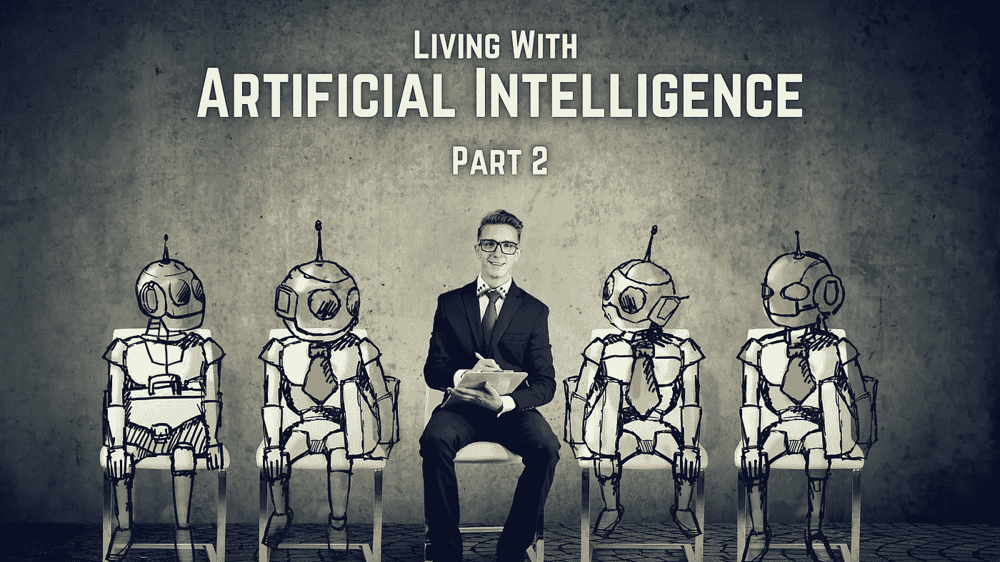
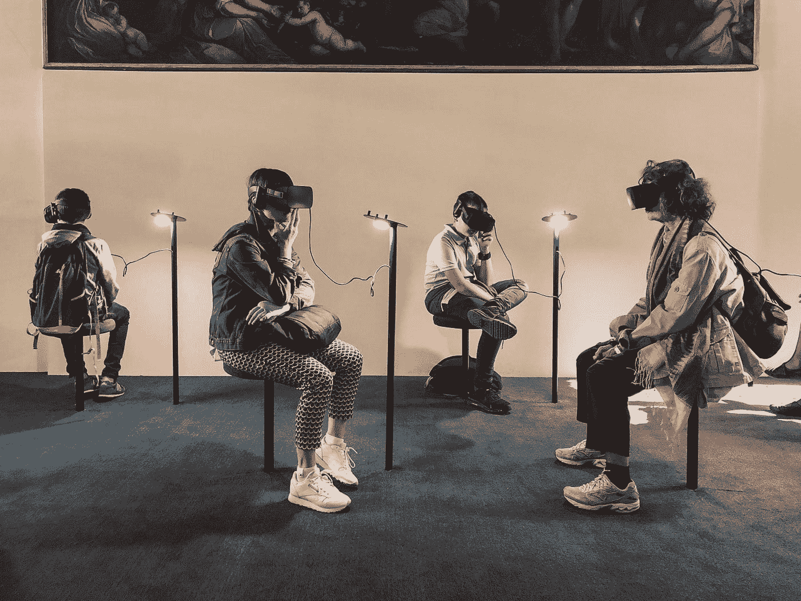

# 与人工智能一起生活|第 2 部分

> 原文：<https://medium.com/mlearning-ai/living-with-artificial-intelligence-part-2-4ec1f601780f?source=collection_archive---------8----------------------->

## BBC 里斯讲座，2021

**Source**: Author

我来了，继续我之前的博文。如果你还没有读过，那么我劝你看看这里的*。在之前的博客中，我们探讨了 BBC Reith 系列讲座第一和第二讲的观点，在这篇博客中，我们将继续讨论第三和第四讲。所以，没有任何进一步的麻烦，让我们开始吧！*

# *人工智能与经济*

**

*Photo by [Sebastian Herrmann](https://unsplash.com/@officestock?utm_source=medium&utm_medium=referral) on [Unsplash](https://unsplash.com?utm_source=medium&utm_medium=referral)*

*2021 年第三届 [*里斯讲座*](https://www.bbc.co.uk/programmes/m0012fnc) 在苏格兰爱丁堡 大学 [*举行。在这次演讲中，斯图尔特探索了工作的未来和人工智能提出的最令人担忧的问题之一:对就业的威胁。他还试图回答一个非常重要的问题，即“随着工作越来越多地由机器完成，经济将如何适应？”。*](https://www.ed.ac.uk/)*

## *第三届 Reith 讲座的关键见解*

*   *斯图亚特用 [*莱昂·巴格瑞特*](https://en.wikipedia.org/wiki/Leon_Bagrit)[*约翰·梅纳德·凯恩斯*](https://en.wikipedia.org/wiki/John_Maynard_Keynes) 和 [*亚里士多德*](https://en.wikipedia.org/wiki/Aristotle) 的预言搭建了舞台，所有这些基本上都归结为一个观点，即技术的进步将导致就业的终结。*
*   *本讲座中的讨论不仅考虑了当今存在的人工智能，还考虑了通用人工智能形式的人工智能(即，可以快速学习并在人类可以执行的所有任务中表现良好的机器)，因为这一直是人工智能问世以来的目标。*
*   *斯图尔特告诉观众两个术语， [*卢德谬误*](https://www.economicshelp.org/blog/6717/economics/the-luddite-fallacy/) (机器正在抢人的工作)，以及 [*劳动总量谬误*](https://en.wikipedia.org/wiki/Lump_of_labour_fallacy) (要做的工作量是固定的，所以如果机器做得多，人做得少)，并描述了在某个时间点，这两个概念是如何变得常见的。*
*   *尽管在过去 50 年中许多发达国家低技能工人的实际收入大幅下降，但斯图尔特强调，经济学家仍然非常不愿意承认任何群体都可能受到绝对伤害。*
*   *技术对就业的直接影响可以用倒 U 型曲线的概念来准确表示(由经济学家 [*詹姆士·贝森*](https://en.wikipedia.org/wiki/James_Bessen) 提出)。我们举个例子，把 X 当做一个新技术。首先，X 通过降低成本和增加需求来增加就业；随后，X 的进一步增加意味着一旦需求饱和，需要的人会越来越少。贝森对几个主要行业进行了分类，显示了这一模式。技术的间接影响，本质上可以定义为开发 X 所雇用的人。然而，这个数字将远远小于由于 X 而失业的人数，因为只有在这种情况下，成本才能下降。*
*   *在这里，斯图尔特提出了他的“财富效应”的想法。由于我们为某种服务/产品支付的费用减少，我们就有更多的钱花在其他事情上，从而增加了其他部门的需求和就业。经济学家试图衡量所有这些影响的相对大小，但结果是不确定的。*
*   *斯图尔特举了一些技术的例子，这些技术可能导致收入份额从劳动力向资本和最高层大幅转移。这些技术包括自动驾驶出租车或货车、将许多短时间互动任务自动化的语言理解机器、机器人流程自动化(可能会消除低级编程工作、基于计算机的文书工作等)。*
*   *在世界经济论坛主办的几次 zoom 研讨会上，两个对立的阵营就“工作的终结会是一件好事吗？”形成了。一个阵营同意凯恩斯关于全民基本收入(UBI)的观点。UBI 向每个成年人提供合理的收入，来源于税收，不管情况如何，允许人们以他们认为合适的方式度过他们的时间。第二个阵营持相反的观点。根据他们的观点，UBI 仅仅代表了对失败的承认。它假设大多数人没有任何经济价值可以贡献给社会。*
*   *根据斯图尔特的说法，不可避免的答案似乎是，人们将从事提供可以提供的人际服务，或者我们更愿意只由人类提供的服务。也就是说，如果我们不能再供给例行的体力劳动和例行的脑力劳动，我们仍然可以供给我们的人性。我们需要变得善于做人。当前人际关系职业的一些例子包括心理治疗师、执行教练、家庭教师、顾问、社会工作者、同伴和那些照顾儿童和老人的人。*
*   *在更广泛的意义上，斯图亚特说的是“完善生活本身的艺术”无论是在艺术、音乐、文学、交谈、园艺、烘焙还是电子游戏领域，人们可能比以往任何时候都更需要激励他人、赋予欣赏和创造能力的能力。*
*   *Stuart 在第三次演讲的结尾指出，我们还不知道如何以一致的、可预测的方式为彼此的生活增加价值，部分原因是因为每个人都是如此不同。这表明我们需要重新定位我们的教育系统和科学事业，不再关注物理世界，而是关注人类世界。如果成功的话，最终的结果将是一个值得生活的世界&如果没有这样的反思，我们将面临不可持续的社会经济失调。*

# *有益的人工智能和人类的未来*

**

*Photo by [Lucrezia Carnelos](https://unsplash.com/@ciabattespugnose?utm_source=medium&utm_medium=referral) on [Unsplash](https://unsplash.com?utm_source=medium&utm_medium=referral)*

*2021 年第四届瑞思讲座 在英国纽卡斯尔的 [*国家数据创新中心*](https://www.nicd.org.uk/) 举行。在这个讲座中，斯图尔特提出了人类控制超级强大的人工智能的前进道路。他主张放弃当前的人工智能“标准模型”，而是提出一个基于三个原则的新模型，其中主要的想法是，机器应该知道它们不知道人类的真正目标是什么。斯图尔特指出，在菜单、市场研究和民主等多种多样的现象中，已经发现了新模式的回声。根据他的说法，根据新模型设计的机器将对人类毕恭毕敬，行为谨慎，侵入性最小，最重要的是，愿意被关闭。*

## *第四次 Reith 讲座的关键见解*

*   *有人向斯图尔特指出，这些天来，在气候、政治，尤其是对人工智能的预测方面，有太多的厄运。斯图尔特设定了第四讲的目标，即通过解释如何永远保持对比我们强大得多的实体的权力来消除一些厄运，这些实体是我们无法智取的，他将此定义为“控制问题”。*
*   *为了解决这个问题，Stuart 带我们回到 AI 如何定义的核心。机器是智能的，因为它们的行为可以达到预期的目标。简而言之，我们为
    机器指定了一个要实现或优化的固定目标。现在困难来了:如果我们把错误的目标放入超级智能机器，我们就制造了一场注定会失败的冲突。为了达到指定的目标，机器不择手段。*
*   *在巴黎休假期间，斯图尔特想到我们应该建立一个人工智能系统，它知道人类不知道真正的目标，即使这是他们必须追求的。在接下来的几天里，他以三个原则的形式写下了这些想法，部分是为了遵从伟大的科幻作家*提出的机器人三定律*。***
*   ***第一个原则是，机器的唯一目标是最大限度地实现人类的偏好。这意味着机器将对人类完全无私，没有自己的目标，包括阿西莫夫第三定律所要求的自我保护。***
*   ***第二个原则是，机器最初不确定这些偏好是什么。这是新方法的核心。我们去除了错误的假设，即机器正在追求一个完全已知的固定目标。这个原则是我们控制超级智能人工智能的原因。***
*   ***第三个原则是，人类偏好的最终信息来源是人类行为。这里的“行为”是指我们所做的一切，包括我们所说的一切，以及我们没有做的一切。它还包括整个书面记录，因为我们写的大部分是关于人类做事情的。***
*   ***与阿西莫夫定律不同，这三个原则不是内置于人工智能系统中的定律，人工智能系统会参考这些定律来提供指导。它们是人工智能研究人员建立他们的人工智能系统应该解决的正式数学问题的指南。而形式问题应该具有这样的性质，如果 AI 系统解决了问题，结果将可证明对人类有利。***
*   ***我们想从这三个原则中得到的最重要的结果是，机器将总是允许我们关闭它，这是控制问题的关键。我们需要制定一个数学定理，将机器人允许自己关机的动机与其对人类偏好的不确定性直接联系起来。根据 Stuart 的说法，这个定理似乎对基本场景中的各种复杂情况都是可靠的。***
*   ***迄今为止的见解或多或少是从基本的双人辅助游戏中得出的，即涉及两个决策实体，一个是人类，另一个是机器人。但是，当我们超越基本的双人辅助游戏时，我们立即面临一个问题，“当机器的动作影响到不止一个人时，它应该如何决定？”。这个问题的答案很简单，也就是说，对于不止一个人，机器需要做出权衡。***
*   ***斯图尔特提供了许多例子来支持他所有的陈述。他通过提出我们与人工智能共存的本质来结束最后一堂课，假设我们已经解决了控制问题并开发了通用的、可证明有益的人工智能。他指出，一种可能性是，对人工智能日益增长的依赖导致我们变得
    虚弱和幼稚，就像电影 [*【瓦力*](https://en.wikipedia.org/wiki/WALL-E) 中的人类一样。***
*   **自主是人类的基本价值观，这意味着如果确保意味着人类失去自主，有益的人工智能系统就无法确保尽可能好的未来。为了让我们保留必要的自由意志的幻觉，机器可能必须避免使用它们的能力来预测我们的行为。**

> **我想对所有花时间阅读我的两部分博客的读者表示感谢。我真的希望你已经找到了你对人工智能的未来会如何的一些担忧的答案。再说一次，如果你还没有看完这篇由两部分组成的博客的前半部分，那么你可以在这里找到它。**

# **参考**

** [## 与人工智能一起生活|第 1 部分

### BBC 里斯讲座，2021

medium.com](/mlearning-ai/living-with-artificial-intelligence-part-1-371182e9935d)  [## BBC 广播 4 台-瑞斯讲座，斯图尔特·拉塞尔-与人工智能一起生活-第一集…

### 斯图尔特·拉塞尔全集-与人工智能一起生活

www.bbc.co.uk](https://www.bbc.co.uk/programmes/m001216k/episodes/guide) 

# 关于我的一点点👋

如果你没有兴趣认识作者，或者你已经认识我，你可以安全地跳过这一节。我保证这里没有隐藏的宝藏😆。

我是一个人工智能爱好者。如果你喜欢这个博客，请把你的手放在一起👏如果你想阅读更多基于人工智能的博客。

 [## Mlearning.ai 提交建议

### 如何成为 Mlearning.ai 上的作家

medium.com](/mlearning-ai/mlearning-ai-submission-suggestions-b51e2b130bfb) 

🔵 [**成为作家**](/mlearning-ai/mlearning-ai-submission-suggestions-b51e2b130bfb)**