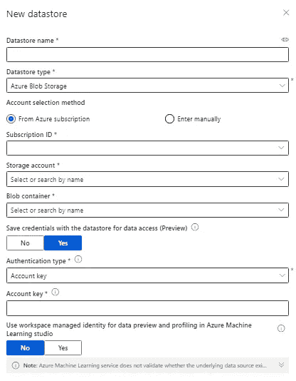

# 将 Json.gz 文件加载到 Azure ML 数据集

> 原文：<https://medium.com/mlearning-ai/load-json-gz-files-to-azure-ml-dataset-b7039ec9da34?source=collection_archive---------0----------------------->

一旦我们有了从 Azure Data Explorer (ADX)加载数据到 Azure ML 的需求，因为我们没有 Azure ML 和 ADX 之间的直接集成，我们面临一些挑战。我们在 ADX 中使用了连续导出功能，并将所有数据从 ADX 导出到 blob，以用于 ADX 的灾难发现目的。所以我们决定对 Azure ML 使用同样的方法。我们按照以下步骤来完成相同的，这将有助于只有当你的文件是在 json.gz 格式。你可以直接使用 json 是它的非压缩结构。

**创建数据集**

我们可以使用 Azure ML 上的创建数据集选项，并通过指定包含所有 json.gz 文件的存储容器的详细信息来创建新的数据集。



Create dataset

**创建解压缩数据集**

重复上述步骤，选择数据集到不同的容器保存解压缩文件。

**创建笔记本**

一旦数据集准备就绪，我们就可以用 python 创建一个新的笔记本，并开始编写代码来从 blob 存储中提取文件，并将其加载到数据集

现在让我们导入所需的库

```
from azureml.core import Workspace, Dataset, Datastorefrom azureml.data.dataset_factory import DataType
import gzip
import os
```

现在准备工作区对象，这将根据提供的详细信息创建工作区对象，这可用于从数据集创建数据集

```
subscription_id = ‘your-subscription-id’
resource_group = ‘your-resourcegroup-name’
workspace_name = ‘your-workspace-name’
workspace = Workspace(subscription_id, resource_group, workspace_name)
```

现在让我们创建用于处理的数据集

```
datastore = Datastore.get(workspace, ‘datastore’)
dest_datastore = Datastore.get(workspace, ‘datastore_unzip’)
```

现在我们想从 blob 存储中准备文件列表，为此我们使用通配符表达式从存储中获取文件。这里我们从 blob 容器中过滤所有的 json.gz 文件

```
datastore_paths = [(datastore, ‘/**.json.gz’)]
```

现在，我们使用上面步骤中的列表创建一个临时文件数据集，并将文件下载到集群中

```
qc_ds = Dataset.File.from_files(path=datastore_paths)
qc_ds.download(target_path=’.’, overwrite=True)
```

现在我们有了文件列表和所有下载的要处理的文件，现在我们将遍历文件列表并解压缩每个文件，然后文件名将被保存到单独的列表中。Azure ML 接受”。jsonl”文件。由于提取的文件已经在 jsonl 文件结构中，我们只需用“.”重命名该文件。jsonl”而不是“json.gz”

```
filelist = []
for singlePath in qc_ds.to_path():
  with gzip.open(“.” + singlePath, “r”) as f:
    data = f.read()
    fn = (“.” + singlePath.replace(“json.gz”, “jsonl”))
    tf = open(fn, “w”)
    tf.write(data.decode())
    tf.close()
filelist.append(os.path.abspath(fn))
```

现在我们已经有了提取的文件及其列表，所以让我们将这些文件上传到我们在第二步中创建的数据存储中。

```
dest_datastore.upload_files(filelist, overwrite=True)
```

一旦数据被提取并在数据存储中可用，数据集就可以使用这些数据进行进一步处理。

为了从数据存储区创建数据集，我们将通过筛选“*”来创建新的表格数据集。' jsonl '

```
tabl_ds = Dataset.Tabular.from_json_lines_files(path=(dest_datastore,’*.jsonl’))
tabl_ds = tabl_ds.register(workspace = workspace,name=’DS_Unzip’,description=’Decompressed Data’,create_new_version = True)
```

现在我们可以看到新的数据集，其中包含了从 json 中提取的所有数据