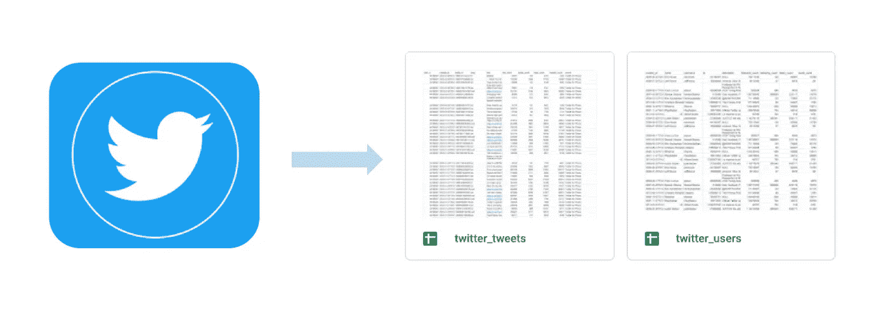

# 将 Twitter 数据加载到 Google Sheet 并实现自动化——启动一个简单的数据管道

> 原文：<https://medium.com/mlearning-ai/load-twitter-data-into-google-sheet-and-automate-it-start-a-simple-data-pipeline-cfb8ad7e350d?source=collection_archive---------4----------------------->

如何自动地和有计划地将 Twitter 上的数据摄取到一个表中。

数据源是机器学习、数据分析、数据可视化的基础。在数据周期的开始，有大量原始格式的数据源。每天，我们都参与丰富所有这些数据源。
作为数据…