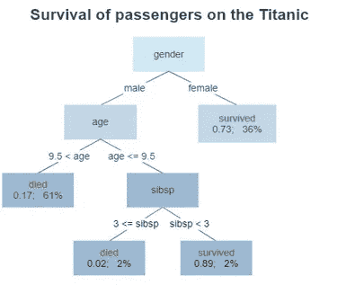
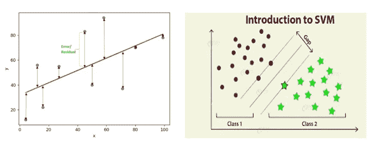
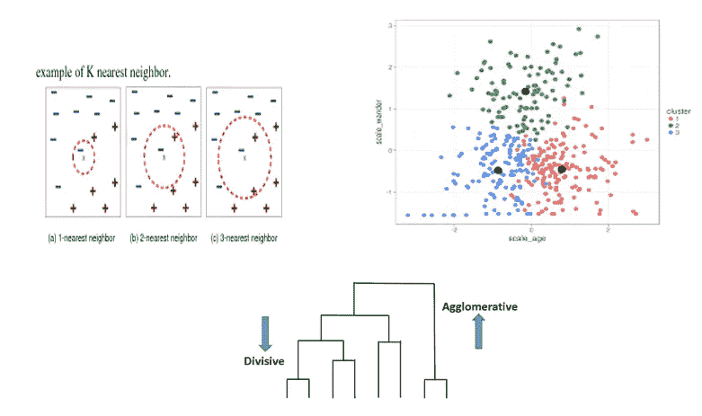
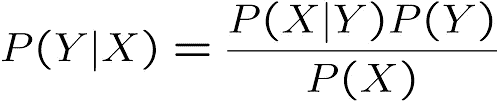

# 机器学习中的逻辑模型、几何模型和概率模型

> 原文：<https://medium.com/mlearning-ai/logical-vs-geometrical-vs-probabilistic-models-in-machine-learning-ae3a33e6be1e?source=collection_archive---------0----------------------->

M 机器学习就是使用正确的 ***特性*** 来构建正确的 ***模型*** 来完成正确的 ***任务*** 。

**特点:**机器学习的老黄牛。

**模型:**机器学习的输出。

**任务:**可以用机器学习解决的问题。

> 特性在很大程度上决定了 ML 应用程序的成功，因为一个模型的好坏取决于它的特性。

在这篇文章中，我们主要关注的是**车型*。让我们继续我们的造型 trip…✈️***

模型是机器学习中的核心概念，因为它们是为了解决给定任务而从数据中学习的东西。有各种各样的机器学习模型可用。这尤其是因为机器学习旨在解决的任务无处不在。我们看到的最常见的 3 组模型是:****几何*** 和 ***概率*** 模型。让我们仔细看看每一类模型。*

## ***逻辑模型***

***【逻辑】**因为这类模型很容易翻译成人类可以理解的*规则，比如。，*如果彩票= 1 那么 class = Y = spam。*这样的规则很容易排列成树形结构，我们称之为 ***特征树*** 。这种树的思想是使用特征迭代地划分实例空间。因此，树的叶子对应于实例空间中的矩形区域(或更一般的超矩形)，我们称之为实例空间段，或简称为段。根据我们正在解决的任务，我们可以用类别、概率、真实值等等来标记树叶。**

> **叶子标有类别的特征树通常称为 ***决策树*** 。**

**一个简单的逻辑模型如下所示:**

****

**Source — Wikipedia**

**显示泰坦尼克号上幸存乘客的树(“sibsp”是船上配偶或兄弟姐妹的数量)。叶子下面的数字显示了存活的概率和叶子中观察到的百分比。总结:如果你是(1)女性或(2)小于 9.5 岁的男性，且严格来说兄弟姐妹少于 3 个，那么你存活的机会很大。**

**为了更深入地理解逻辑模型，我们需要理解 ***概念学习*** 的概念，这将在我即将发表的博客中讨论。哇！我们只有两步之遥…不能再等了(๑ > ᴗ < ๑).)让我们快速深入我们的几何模型。**

## **几何模型**

**在学习什么是几何模型之前？它有哪些类型？，它们是如何工作的？等等。我们先来了解一下 ***究竟什么是“实例空间”？？*** 。**

> **一个**实例空间**是所有可能的或可描述的实例的集合，无论它们是否出现在我们的数据集中。通常这个集合有一些几何结构。例如，如果所有特征都是数字的，那么我们可以将每个特征用作笛卡尔坐标系中的坐标。**

*****几何模型/特征学习*** 是一种结合机器学习和计算机视觉解决视觉任务的技术。这些模型通过考虑实例空间的几何来定义相似性。这里，特征可以描述为二维(x 轴和 y 轴)或三维空间(x、y 和 z)中的点。即使特征本质上不是几何的，它们也可以以几何方式建模。然而，重要的是要记住，笛卡尔实例空间具有与特征一样多的坐标，可以是几十个、几百个、几千个甚至更多。这样的高维空间很难想象，但在机器学习中很常见。可能适用于更高维度空间的几何概念往往以“hyper-”为前缀:例如，一个无限维的决策边界被称为一个 ***超平面*** 。几何分类器的一个主要优点是，只要我们坚持二维或三维，它们就很容易可视化。**

**几何模型基本上有两种类型**

1.  **直接在实例空间中构建的几何模型，使用诸如线或平面的几何概念，用于分割实例空间，称为**线性模型**。**
2.  **使用距离作为度量来表示实例之间的相似性的几何模型被称为**基于距离的模型**。常用的距离度量有，****闵可夫斯基******曼哈顿******马哈拉诺比斯*** 。***

****线性模型****

**为了对实例进行分类，线性模型使用下面的等式， ***f(x) = a + bx*** ，如果 x 和 f(x)是标量，并且如果 x = (x1，.。。，xd)是一个向量，f (x)是一个标量，那么 f 的形式是 ***f(x) = a +b1x1 +。。。+bd xd*** = a + b x 其中 b = (b1，.。。，bd)。方程 f (x) = 0 定义了垂直于法向量 b 的 Rd 平面。**

**线性模型适用于所有预测任务，包括分类、概率估计和回归。比如说。,**

**a)花在学习上的时间与学生的分数**

**b)降雨量与农业产量**

**c)用电量与电费**

**d)自杀率与压力人群的数量**

**有不同的线性模型，如最小二乘法(一种数学回归分析)，支持向量机(使用超平面最好地分离两个或多个类别)。**

****

****Least Squares (left) and SVM (right)****

****基于距离的模型****

**机器学习中一个非常有用的几何概念是距离的概念。如果两个实例之间的距离很小，那么这些实例就其特征值而言是相似的，因此附近的实例将被期望接收相同的分类或属于相同的聚类。在笛卡尔坐标系中，距离可以用*欧几里德距离*来度量，欧几里德距离是沿着每个坐标的距离平方之和的平方根。**

**为了对新实例进行分类，我们从存储器中检索最相似的训练实例(即，与要分类的实例具有最小欧几里德距离的训练实例)，并简单地分配该训练实例的类别。这个分类器被称为 ***最近邻*** 分类器。这个简单而强大的主题存在着无穷无尽的变化:我们可以检索 k 个最相似的训练实例并进行投票(***k-nearest neighbor***)。**

**因此，我们可以使用一组邻近点的平均值作为这些点的代表性样本。假设我们想将数据分成 K 个簇，并且我们对数据应该如何进行簇有一个初步的猜测。然后，我们计算每个初始聚类的平均值，并将每个点重新分配给最近的聚类平均值。我们重复这两个步骤(计算聚类平均值并将点重新分配给聚类)，直到没有变化发生。这种叫做 ***的聚类算法，K-的意思是*** 。**

**另一种基于距离的聚类是 ***层次聚类*** ，这是一种构建聚类层次的算法。该算法从分配给它们自己的聚类的所有数据点开始。然后将两个最近的聚类合并成同一个聚类。最后，当只剩下一个簇时，该算法终止。**

****

****KNN (top-left), K-means (top-right) and Hierarchical clustering (bottom)****

**哇！我们离这里只有一箭之遥。下一个也是最后一个模型是概率模型。我们来看看它和其他两款有什么不同。**

## **概率模型**

**概率模型/方法基于概率理论，或随机性在预测未来事件中发挥作用的事实。**

**让 X 表示我们知道的变量，例如，我们实例的特征值；让 Y 表示我们感兴趣的目标变量，例如，实例的类。机器学习的关键问题是如何对 X 和 y 之间的关系进行建模。统计学家的方法是假设存在一些潜在的随机过程，根据定义良好但未知的概率分布来生成这些变量的值。**

**由于特定情况下 X 是已知的，但 Y 可能是未知的，因此我们对条件概率 P(Y |X)特别感兴趣，其中我们根据 X 来预测 Y 的值。朴素贝叶斯是概率模型的一个示例，它遵循贝叶斯定理。**

****

****Bayes Theorem****

**P(Y/X) =后验概率(给定证据假设为真的概率)**

**P(X/Y) =似然比(假设为真时看到证据的概率)**

**P(Y) =类先验概率(在任何证据出现之前，假设为真的概率)**

**P(X) =预测值先验概率(观察证据的概率)**

**我们现在对概率模型有了一些概念。在许多情况下，这是一个从数据中估计模型参数的问题，通常通过直接计数来实现。**

> ****注意:**基于模型的机器学习的目标是单一的建模框架应该支持广泛的模型。**

**呼呼..！！差不多到现在。我们终于到达了终点。在我的下一篇博客中，我们将会看到每一个算法(如上所述)是如何详细工作的。到那时， ***快乐学习机:)*****

** [## Mlearning.ai 提交建议

### 如何成为 Mlearning.ai 上的作家

medium.com](/mlearning-ai/mlearning-ai-submission-suggestions-b51e2b130bfb)**