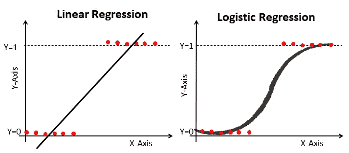
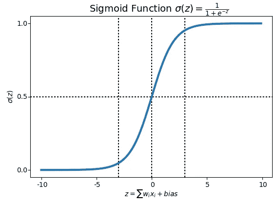
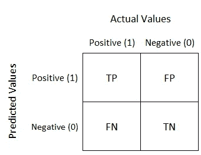
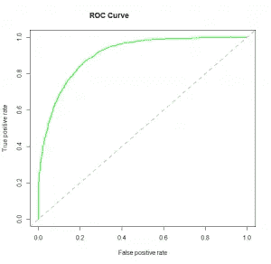

# 统计学和机器学习中的逻辑回归

> 原文：<https://medium.com/mlearning-ai/logistic-regression-60694a973bee?source=collection_archive---------2----------------------->

逻辑回归是一种用于分类问题的统计方法。在统计学中，**逻辑模型**(或**逻辑模型**)用于模拟某一类别或事件存在的概率，如通过/失败、赢/输、活着/死了或健康/生病。这可以结合起来为几类事件建模，例如确定图像中是否包含猫、狗、狮子等。图像中检测到的每个对象都将被分配一个介于 0 和 1 之间的概率，总和为 1。

Difference between linear regression and logistic regression

## 逻辑回归的类型:

1.  二元(如恶性肿瘤或良性肿瘤)
2.  多元线性函数失败类(如猫，狗或羊的)

我们可以将逻辑回归称为线性回归模型，但逻辑回归使用更复杂的成本函数，该成本函数可以定义为“ **Sigmoid 函数**”或也称为“逻辑函数”，而不是线性函数。逻辑回归的假设倾向于将成本函数限制在 0 和 1 之间。因此，线性函数不能表示它，因为它可以具有大于 1 或小于 0 的值，根据逻辑回归的假设，这是不可能的。

## 乙状结肠函数？

为了将预测值映射到概率，我们使用 Sigmoid 函数。该函数将任何实数值映射到 0 和 1 之间的另一个值。在机器学习中，我们使用 sigmoid 将预测映射到概率。

## 逻辑回归模型的性能:

要评估逻辑回归模型的性能，我们必须考虑几点。不管您将使用什么工具(SAS、R、Python ),始终要寻找:

1. **AIC(阿卡科信息标准)** —逻辑回归中调整后的 R 的类似度量是 AIC。AIC 是拟合的量度，它因模型系数的数量而惩罚模型。因此，我们总是偏好 AIC 值最小的模型。

2.**零偏差和剩余偏差** —零偏差表示模型预测的响应，只有截距。值越低，模型越好。剩余偏差表示通过添加独立变量的模型预测的响应。值越低，模型越好。

3.**混淆矩阵:**它只是实际值与预测值的表格表示。这有助于我们找到模型的准确性，避免过度拟合。它看起来是这样的:

*   **真阳性(TP):** 为正确预测的事件值。
*   **真阴性(TN):** 用于正确预测的无事件值。
*   **误报(FP):** 错误预测的事件值。(也称为“第一类错误”).
*   **假阴性(FN):** 错误预测的无事件值，(也称为“II 型错误”).
*   **准确性:**总体而言，分类器正确的频率如何？
    准确率=(TP+TN)/总量
*   **回忆:TP/TP+FN**
*   **误分类率:**总体来说，错的频率是多少？
    **误分类率=**(FP+FN)/合计
*   **“错误率”=**1-准确度
*   **【特异性】**= 1-假阳性率
*   **精度:**当它预测是的时候，它的正确率是多少？**精度=** TP/TP+FP
*   患病率:在我们的样本中,“是”的情况实际上出现的频率有多高？
    **患病率=** 实际是/总数

4. **ROC 曲线:**受试者操作特征(ROC)通过评估真阳性率(灵敏度)和假阳性率(1-特异性)之间的权衡，总结了模型的性能。对于绘制 ROC，建议假设 p > 0.5，因为我们更关心成功率。ROC 总结了 p > 0.5 所有可能值的预测能力。曲线下面积(AUC)被称为准确性指数(A)或一致性指数，是 ROC 曲线的完美性能指标。曲线下面积越高，模型的预测能力越好。下面是一个 ROC 曲线示例。完美预测模型的 ROC 有 TP 等于 1，FP 等于 0。这条曲线将触及图表的左上角。

**注:**对于模型性能，也可以考虑似然函数。之所以这样叫，是因为它选择的系数值能最大限度地解释观察到的数据。当其值接近 1 时，它表示拟合度良好，当其值接近 0 时，它表示数据拟合度较差。

*   **Cohen 的 Kappa:** 这本质上是一个衡量分类器的表现与它在偶然情况下的表现相比有多好的指标。换句话说，如果准确性和零错误率之间存在很大差异，则模型将具有高 Kappa 分数。
*   **F 评分:**这是真阳性率(召回率)和精度的加权平均值。

## 逻辑回归的优势:

这是一种广泛使用的技术，因为它非常高效，不需要太多的计算资源，可解释性强，不需要缩放输入要素，不需要任何调整，易于正则化，并且输出校准良好的预测概率。

当您移除与输出变量无关的属性以及彼此非常相似(相关)的属性时，逻辑回归的效果会更好。因此，特征工程在逻辑和线性回归的性能方面起着重要的作用。

由于它的简单性以及它可以相对容易和快速地实现的事实，逻辑回归也是一个很好的基线，您可以使用它来测量其他更复杂的算法的性能。

## 逻辑回归的缺点:

逻辑回归也不是最强大的算法之一，很容易被更复杂的算法超越。

同样，我们不能用逻辑回归来解决非线性问题，因为它的决策面是线性的。

对于与目标变量不相关且彼此非常相似或相关的独立变量，逻辑回归表现不佳。

通过 [Linkedin](https://www.linkedin.com/in/sureshhp/) 和 [Medium](https://hpsuresh12345.medium.com/about) 与我联系，获取新文章和博客。

— — — * — — — * — — — * — — — * — — — * — — — * — — — * —

*“培养学习的热情。如果你这样做了，你将永远不会停止成长”*

— — — * — — — * — — — * — — — * — — — * — — — * — — — * —