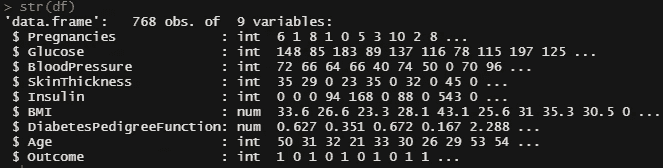
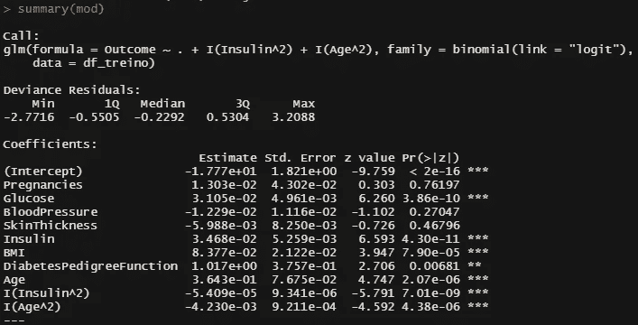
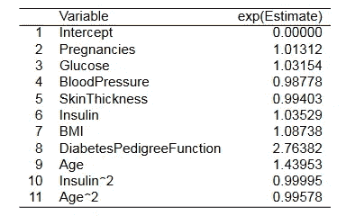
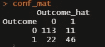

# 糖尿病数据的逻辑回归

> 原文：<https://medium.com/mlearning-ai/logistic-regression-for-diabetes-data-b2fb5ed1894d?source=collection_archive---------1----------------------->

## 如果你有一个二元结果，你不应该使用线性回归！

无意中尝试对某个问题使用线性回归是很常见的，但是数据科学家应该仔细理解所研究内容的本质。线性回归只适用于数值型和连续型的目标变量。

因此，对于二元结果，应该应用另一种方法。在本文中，我将展示如何训练一个简单的逻辑回归(这是一个[广义线性模型](https://en.wikipedia.org/wiki/Generalized_linear_model))来预测一名女性是否患有糖尿病，给定一组协变量。我们将使用 R 并导入 [tidyverse](https://www.tidyverse.org/) (用于一些数据操作工具)和 [broom](https://broom.tidymodels.org/) 。

**关于数据**

该数据集在 [Kaggle](https://www.kaggle.com/datasets/uciml/pima-indians-diabetes-database) 上获得，包含至少 21 岁的皮马印第安血统患者(仅限女性)的信息。

首先，我们来读数据。

结果变量识别女性是否患有糖尿病(等于 1)或不患有糖尿病(等于 0)。其他变量代表一些整体身体测量。

**零值插补**

在检查没有空值之后，我们发现这些列(葡萄糖、血压、皮肤厚度、胰岛素和身体质量指数)有一些零值。这没有任何意义(一个人不可能把血压测量为零！)

怎么处理那些诡异的零值？有很多估算数据的技术。我们将把它替换为由结果分隔的列的 theseparatedmean。

**训练模型**

逻辑回归是一个具有(当然)统计属性的统计模型，因此在训练和测试数据集中拆分数据不是非常必要，但在机器学习场景中，我们会拆分它。像这样:

现在，我们有一个包含 70%原始数据帧的训练数据集和一个包含 30%原始数据帧的测试数据集。

现在，我们可以训练我们的模型。我们将使用所有的协变量，并添加胰岛素和年龄的平方效应(选择这种组合是因为后来产生了有趣的结果)。为了训练模型，我们编写以下代码:

与线性回归不同，系数对目标变量有指数和乘法影响，保持其他一切不变(在本文中，我们将不详细解释系数)。我们可以将系数影响总结如下:

因此，糖尿病患者的糖尿病功能、年龄、怀孕和血糖是增加女性患糖尿病概率的最有影响的协变量。

**评估模型性能**

现在，让我们使用我们的测试数据集来检查训练模型的准确性。考虑到所有样本数据，准确度是正确预测类别的比例。重要的是要说，精度不是评价模型性能的唯一尺度。这里的其他指标更有趣，比如回忆。

该模型的精确度大约为 82%,这是相当高的。召回率大约为 68%,表明在样本事实上患有糖尿病的情况下，训练的模型对于检测糖尿病是适度敏感的。

**结论**

在这篇文章中，一个简单的逻辑回归模型被用来预测女性是否患有糖尿病。

插补方法只是使用平均值，但也可以使用其他更复杂的技术，如 [MICE(通过链式方程进行多重插补)。](https://cran.r-project.org/web/packages/miceRanger/vignettes/miceAlgorithm.html)

为了评估模型性能，我们考察了准确性和召回指标。

我会把我的信息留在这里！

> **Linkedin:**[https://www.linkedin.com/in/marcos-augusto-47o47/](https://www.linkedin.com/in/marcos-augusto-47o47/)
> **Github:**[https://github.com/MarcosAugusto47](https://github.com/MarcosAugusto47)

 [## Mlearning.ai 提交建议

### 如何成为 Mlearning.ai 上的作家

medium.com](/mlearning-ai/mlearning-ai-submission-suggestions-b51e2b130bfb)