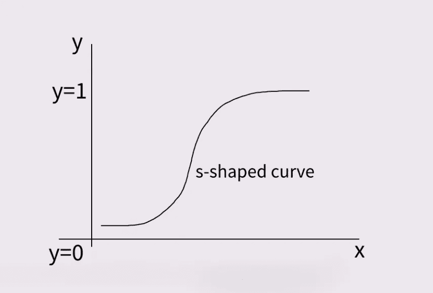

# 逻辑回归在 5 分钟内简单解释

> 原文：<https://medium.com/mlearning-ai/logistic-regression-simply-explained-in-5-minutes-7830559525fe?source=collection_archive---------3----------------------->

## 用 Python 代码简单而温和地介绍了逻辑回归&一个工作示例

Figure made by the author using [https://sketch.io/sketchpad/](https://sketch.io/sketchpad/)

大家好。感谢你对我的文章感兴趣。我们开始吧！

# 1.简短介绍