# 家禽物流

> 原文：<https://medium.com/mlearning-ai/logistics-in-poultry-e1575b38e314?source=collection_archive---------5----------------------->

## 预测鸟什么时候应该被送到屠宰场。

在这篇博文中，我想向大家介绍一个项目，在这个项目中，我被要求预测鸟类何时应该被送往屠宰场。确定发送时间的困难是基于屠宰场偏好的重量。这意味着我们需要知道鸟在到达时的体重，这并不容易，因为它们在旅途中不会增加甚至减少体重。然后是旅行本身，压力，以及任何其他可能从头到尾影响他们状态的因素。

这些数据是商业数据，所以我不能分享，但我会尽可能深入地研究我是如何分析的。这个项目并不容易，我相信还有很多需要改进的地方，但是让我们继续，带你完成这个项目。

```
remove(list = ls())
#### IMPORT DATA ####
library(readxl)
library(dplyr)
library(tidyr)
library(caret)
library(ggplot2)
library(skimr)
library(splines)data <- read_excel("DATA SET DATOS VIVO MATADERO 2019-20 marcjacobs.xlsx")
str(data)
glimpse(data)
skim(data)
```

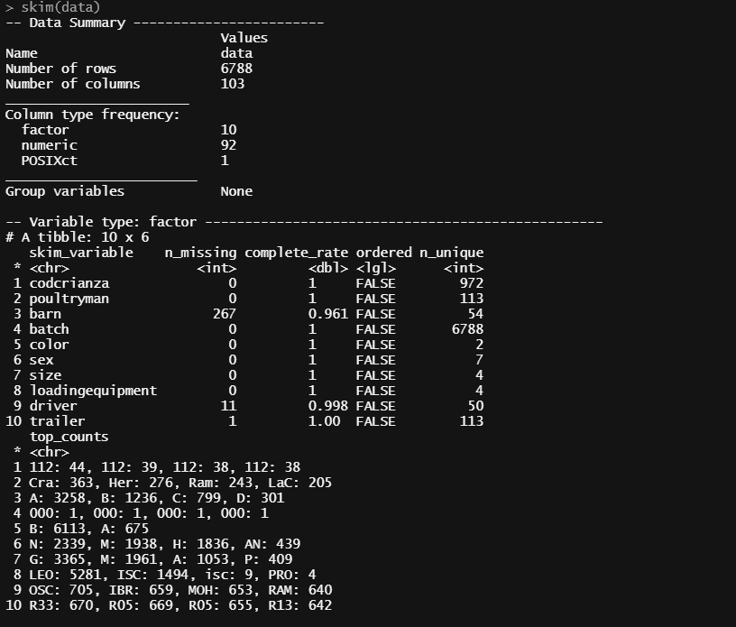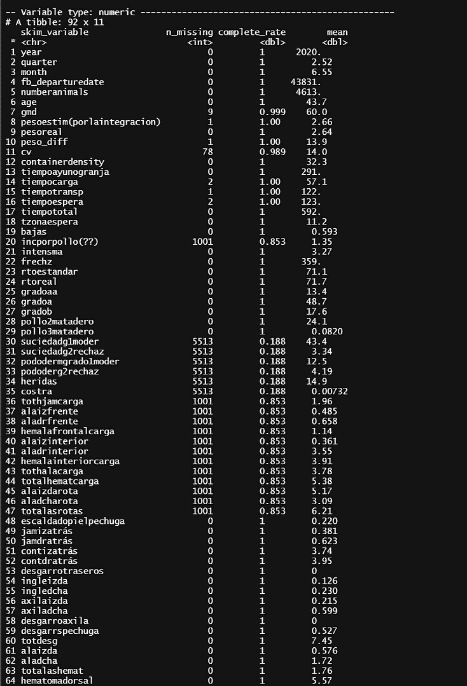

There are many columns in this dataset. The majority is in Spanish, since this project focused around slaughtering chickens in Spain. As you can see, a lot of data was collected in terms of variables. Hence, the strength of the dataset is not so much the number of rows, but the number of columns and the ability of those columns to mimic the ‘trajectory’ of the animals from birth to slaughter.

让我们讨论数据，并创建我需要的变量，以开始建立一个数据集来模拟该轨迹。我会:

1.  使所有列名小写。
2.  将所有字符变量重新编码为因子变量。
3.  删除 outiers。
4.  创建新变量。
5.  对数据进行子集划分。

```
names(data)<-tolower(names(data))data[sapply(data, is.character)]<-lapply(data[sapply(data, is.character)],as.factor)
str(data)data$gmd<-replace(data$gmd, data$gmd>600, NA)data$pesoestimBW<-data$`pesoestim(porlaintegracion)`*1000
data$pesorealBW<-data$pesoreal*1000
data$adg42<-data$day42/42
data$adg35<-data$day35/35
data$adg28<-data$day28/28
data$adg21<-data$day21/21
data$adg14<-data$day14/14
data$adg7<-data$day7/7
data$adg35_42<-(data$day42-data$day35)/7
data$adg28_35<-(data$day35-data$day28)/7
data$adg21_28<-(data$day28-data$day21)/7
data$adg14_21<-(data$day21-data$day14)/7
data$adg7_14<-(data$day14-data$day7)/7datasubset<-data%>%filter(size=='A')%>%filter(sex=='H' | sex=='N')%>%select(codcrianza, age, poultryman, batch, sex, size, year, month, pesorealBW, lineage, vaccine, feed, ranking, day7, day14, day21, day28, day35, day42)datasubset2<-data%>%filter(size=='A')%>%filter(sex=='H' | sex=='N')%>% select(codcrianza, age, poultryman, batch, sex, size, year, month, pesorealBW, lineage, vaccine, feed, ranking, day7, day14, day21, day28, day35, day42, adg7, adg7_14, adg14_21, adg21_28, adg28_35, adg35_42)
```

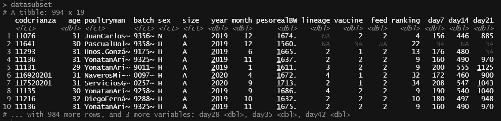

In the end, I have a dataset containing 19 columns showing me the weight of the animal over time. The, by far, most important outcome is **pesorealBW**. This is the bodyweight measured at the slaughterhouse, and this is the body weight you want to predict. The rest of the data are the columns that happen BEFORE we measure the animals at the slaughterhouse. There are also columns in the original dataset that are measured after, but they cannot play any role.

现在，预测*比索实际体重*很重要，但更重要的是他们应该达到的目标体重。因此，如果我们能确定动物的生长量，并能评估动物在运输过程中的损失，我们就能预测它们到达时的体重。

为了以更简单的方式连接列，我们需要从宽到长，删除没有 bodyweight 的行并添加一个时间变量。

```
datalong<-reshape2::melt(datasubset,value.name="bw",
                         id.vars=c("codcrianza","age", "poultryman",
                                   "batch", "size","sex", 
                                   "year", "month","lineage", 
                                   "vaccine", "feed", "ranking", 
                                   "pesorealBW"))datalong<-datalong%>%drop_na(bw)
table(is.na(datalong$bw))

datalong$time<-as.numeric(substring(datalong$variable,4))
datalong$variable<-NULL
```


And here we have it. The farms, and the animals they have. The data is on the farm level itself.

这个项目的焦点是一种特殊大小的特殊类型的鸟。这意味着他们还需要坚持特定的体重。由于其他鸟类不影响这种鸟类的生长，我需要再次对数据进行子集划分。我需要把年龄作为一个时间因素加进去，计算年龄和时间之间的差异并除以它，复制年龄并删除一些我不需要的变量。

但是，最重要的是，我将为能够以两种方式分析数据做好准备:

1.  使用屠宰前的体重来预测屠宰时的体重。
2.  包括屠宰时测量的重量，以建立由整批动物的体重、该批动物屠宰时的重量以及剩余动物的体重构成的代理生长曲线。

```
agesubset<-data%>%filter(size=='A')%>%filter(sex=='H' | sex=='N')%>% select(codcrianza, age, poultryman, batch, sex, size, year, month, pesorealBW, lineage, vaccine, feed, ranking)agesubset$time<-agesubset$age
agesubset$bw<-agesubset$pesorealBW
agesubset<-as.data.frame(agesubset)
combined<-merge(datalong, agesubset, all=TRUE)combined<-combined %>%arrange(batch, time)%>%
  group_by(batch)%>%
  filter(n() > 1)%>%
  mutate(
    timediff = time - lag(time),
    bwdiff = bw - lag(bw),
    adg = bwdiff/timediff)
combined<-as.data.frame(combined)combined<-combined%>%group_by(batch)%>%
  dplyr::mutate(B = ifelse(row_number() == 1, as.numeric(age), NA))
combined<-as.data.frame(combined)
combined$timediff<-ifelse(combined$time==7,combined$timediff==NA, combined$timediff)
combined$bwdiff<-ifelse(combined$time==7,combined$bwdiff==NA, combined$bwdiff)
combined$adg<-ifelse(combined$time==7,combined$adg==NA, combined$adg)
```

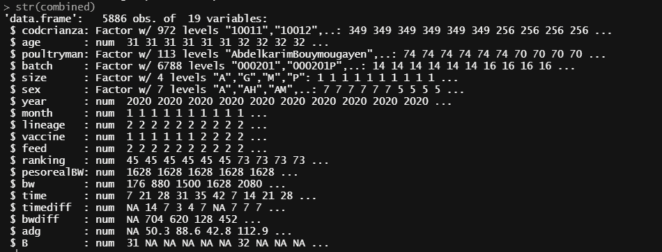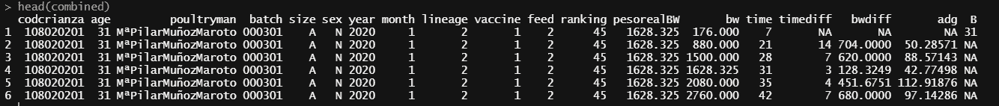

And what we have now, in long format, the the growth over time and the changes in bodyweight and average daily gain. More importantly, as you can see, I have integrated the bodyweight at slaughter in the growth curve of the batches.

从这个数据集开始，我们可以开始查看手头的数据。例如，我们可以问自己这样一个问题，屠宰时的体重是否在增长线上。请记住，不是所有的动物都被送到屠宰场，所以我们在农场层面上拥有的是生长轨迹和屠宰场的测量。这种比较当然是不可靠的，因为任何超出屠宰场的测量值都属于农场中没有被送去屠宰的动物。但是，我还是想看看屠宰厂的测量方法在哪里合适。

```
datalong%>%arrange(batch)%>%top_n(60, batch)%>%
  ggplot(., aes(x=time,group=batch))+ 
  geom_point(aes(y=bw), size=1.2) +
  geom_line(aes(y=bw))+
  geom_point(aes(x=age, y=pesorealBW), colour='red')+
  geom_smooth(aes(y=bw), method =lm,formula=y~ns(x,3), se = 
  FALSE,size = 0.5)+
  theme_minimal()+theme(legend.position = "none")+
facet_wrap(~batch)
```

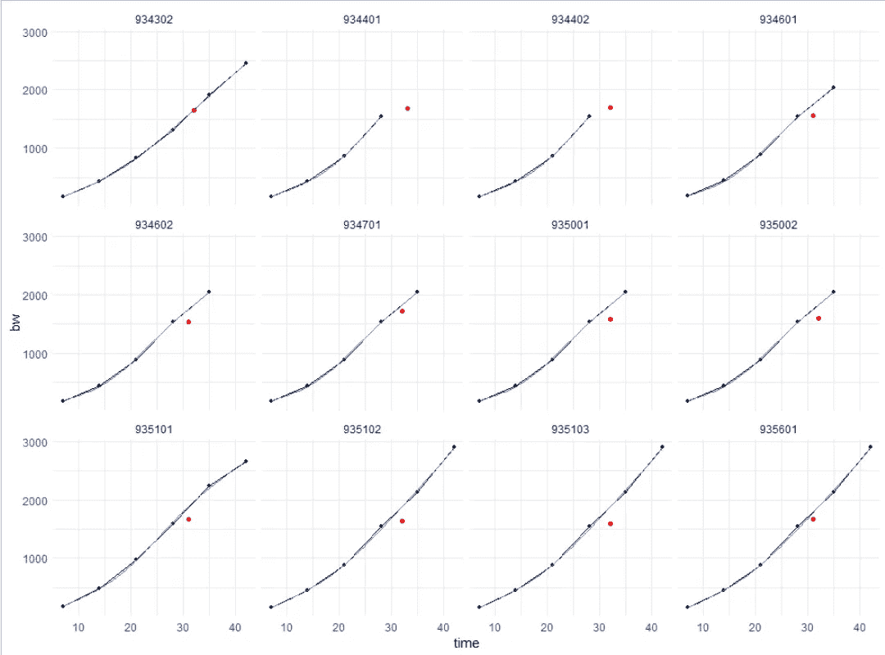

This plot clearly shows that the measurement at the slaughterhouse is not on the line, which is to be expected. Once birds are shipped to the slaughterhouse, their growth is no longer really under our control. They experience stress, do not eat and lose water. Hence why the red lines deviate from the curve. Then, there is of course the selection method itself, meaning that the birds not send could already be deviating.

如果我把红点和生长曲线连接起来会发生什么？

```
combined%>%drop_na(bw)%>%arrange(batch, time)%>%top_n(60, batch)%>%
  ggplot(., aes(x=time,group=batch))+ 
  geom_point(aes(y=bw), size=1.2) +
  geom_line(aes(y=bw))+
  geom_point(aes(x=age, y=pesorealBW), colour='red')+
  geom_smooth(aes(y=bw), method =lm,formula=y~ns(x,3), se = FALSE,size = 0.5)+
  theme_minimal()+theme(legend.position = "none")+
  facet_wrap(~batch)
```

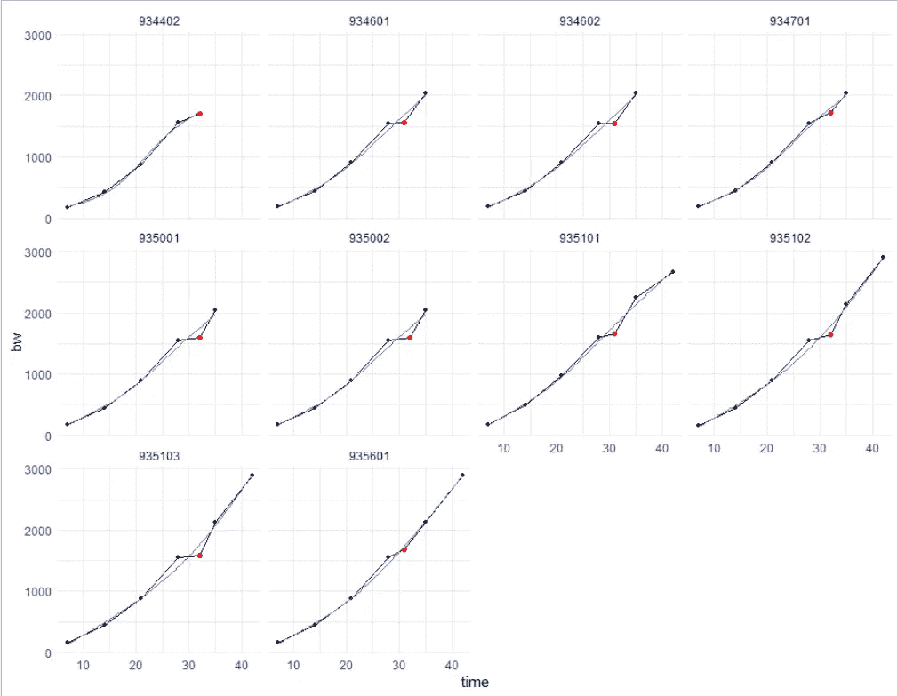

Clear as day to see that the bodyweight measured at the slaughterhouse truly does not fit within the trajectory anymore.

也许一个更好的指标是平均日增重，它是一个线性指标，由 x 时刻的体重或两个时间点之间的体重变化以及时间到期组成。下面，我想说明最后可行的平均日增重计算如何以及何时可能作为屠宰场的重量和农场的最后记录重量的函数。

```
combined%>%filter(time > 2 & time==age & adg > 0 & adg < 150 )%>%
  ggplot(., aes(x=as.factor(time), y=adg,group=time, colour=as.factor(time)))+
  geom_boxplot(aes(fill=as.factor(time), alpha=0.5)) + facet_wrap(~year + month) +  
  theme_bw()
```

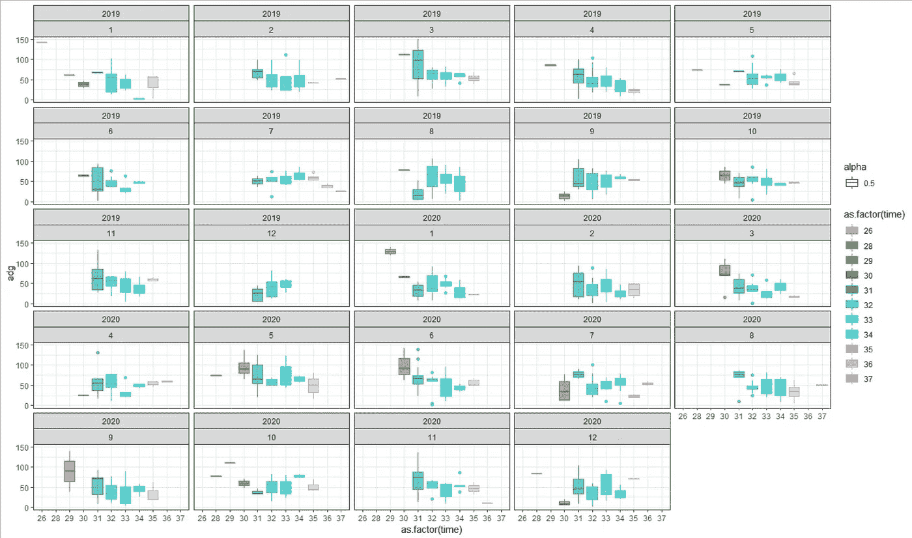

Majority of animals are sent to the slaughterhouse between 26 and 36 days of age, with the bulk between 30 en 34\. The average daily gain values are quite variable.

我们可以复制上面的情节，并通过放置动物的性别和它的血统来进一步划分它。

```
combined%>%filter(time > 2 & time==age & adg > 0 & adg < 150 )%>%
  ggplot(., aes(x=as.factor(time), y=adg,group=time, colour=as.factor(time)))+
  geom_boxplot(aes(fill=as.factor(time), alpha=0.5)) + facet_wrap(~sex+lineage) +  
  theme_bw()
```

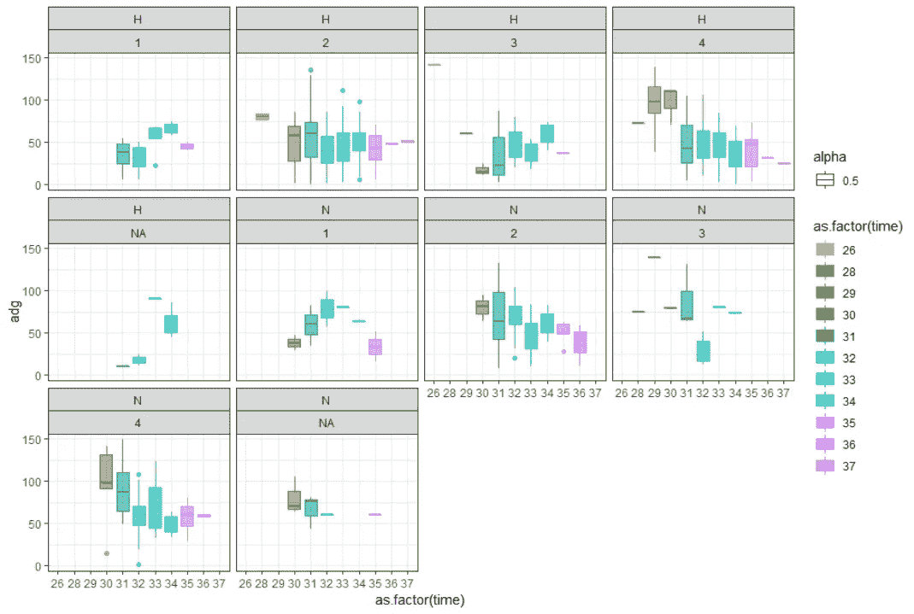

Does not directly reveal any big relationship.

这个数据集附带的东西之一是农场的排名。现在，这个排名并不真正客观，而是基于 feed 顾问对数据的看法。让我们看看这个排名值多少钱。

```
combined%>%filter(time > 2 & time==age & adg > 0 & adg < 150 )%>%
  ggplot(., aes(x=as.factor(time), y=adg,group=time, colour=as.factor(time)))+
  geom_boxplot(aes(fill=as.factor(time), alpha=0.5)) + facet_wrap(~ranking) +  
  theme_bw()
```

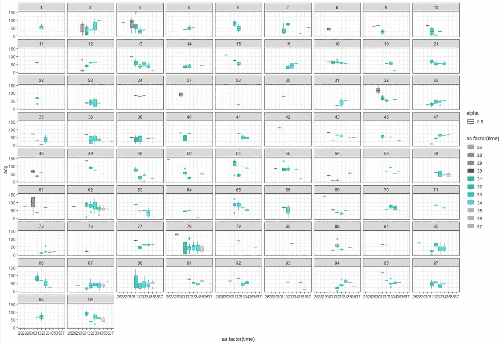

Splitting the data to this degree makes it almost impossible to see/say anything.

我们也可以看看疫苗。

```
combined%>%filter(time > 2 & time==age & adg > 0 & adg < 150 )%>%
  ggplot(., aes(x=as.factor(time), y=adg,group=time, colour=as.factor(time)))+
  geom_boxplot(aes(fill=as.factor(time)), alpha=0.5) + facet_wrap(~vaccine + feed) +  
  theme_bw()
```

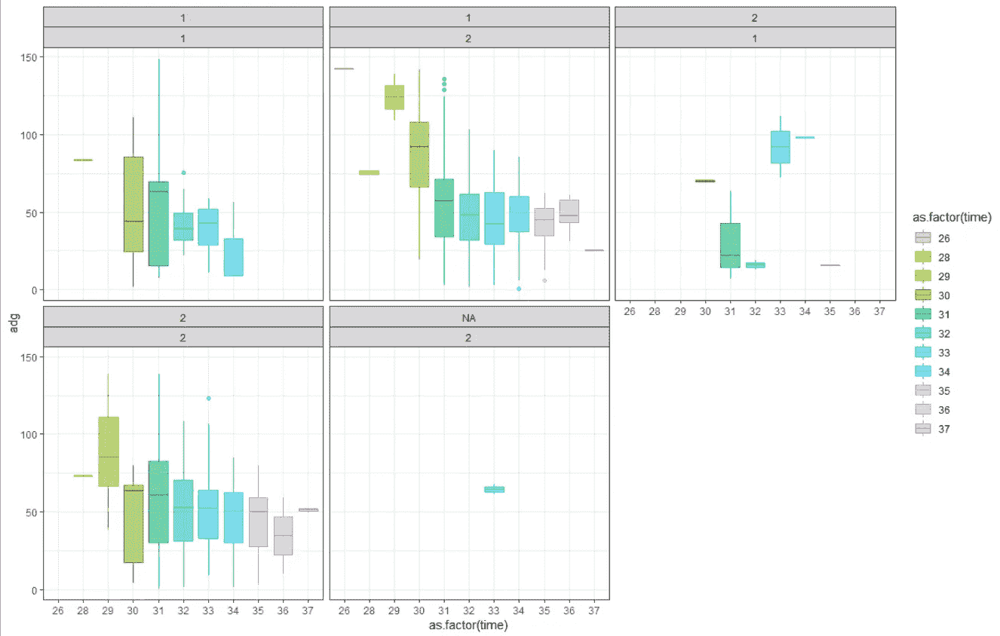

Once again, it seems that time is the biggest factor.

我们可以看一看批次。

```
combined%>%drop_na(bw)%>%arrange(batch,time)%>%top_n(60, batch)%>%
  ggplot(., aes(group=batch))+ 
  geom_point(aes(x=as.factor(time),y=adg), size=1.2) +
  geom_line(aes(x=as.factor(time),y=adg)) +
  theme_minimal()+theme(legend.position = "none")+
  facet_wrap(~batch)
```

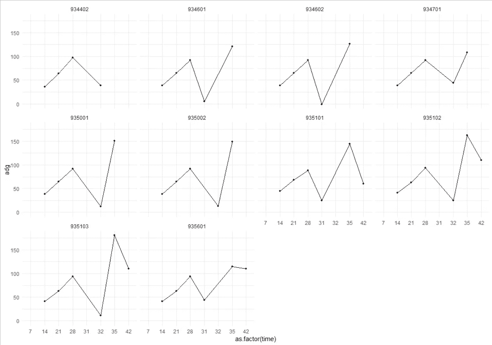

Average daily gain is definitely not a straightforward measurement, and seems to shift over time and per batch. Of course, we are measuring at a much more overarching level than one would normally like to, but that is just the way it is.

好了，我相信是时候开始看一些初步模型了。只是为了对数据有个感觉，以及我们最有可能做什么和最不可能做什么。因为我喜欢样条曲线，我将从第一个开始。记住，体重 *bw* 也包括屠宰时的重量！

```
model<-lm(bw~ns(age), data=datalong); summary(model);plot(model)
```

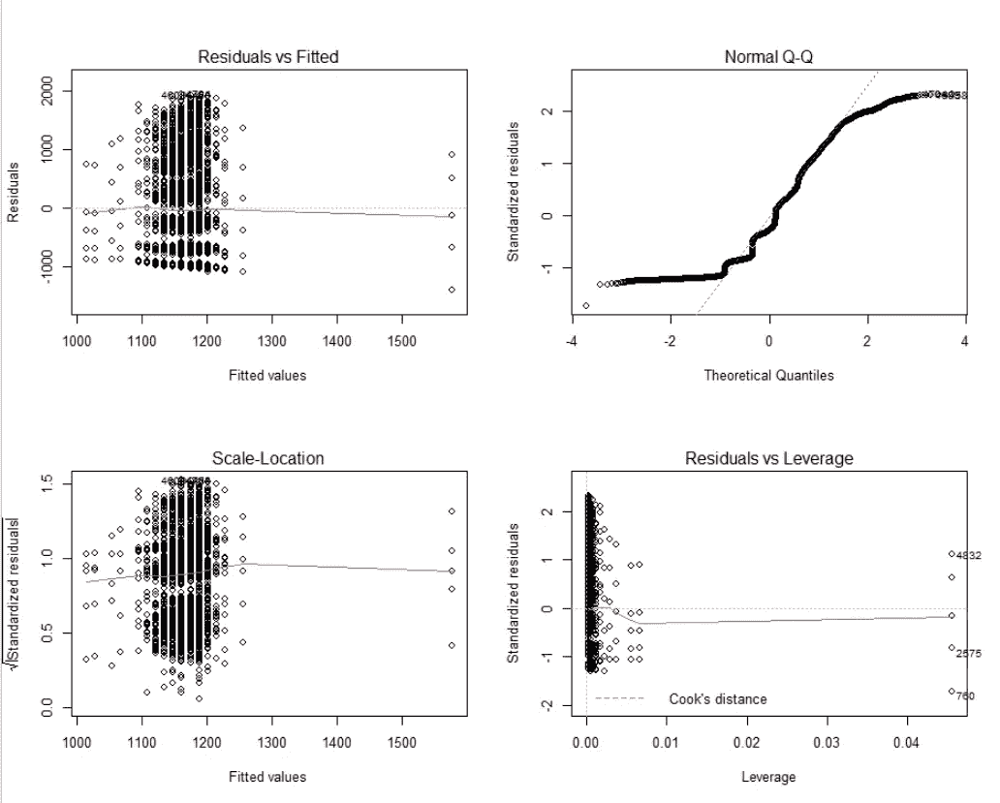

The tails of the distribution will prove to be difficult, as can be clearly shown by the Q-Q plot.

让我们添加其余的预测。

```
model2<-lm(bw~ns(age,3)+sex+feed+vaccine+lineage+year+month+ranking, 
           data=datalong);summary(model2);plot(model2)
```

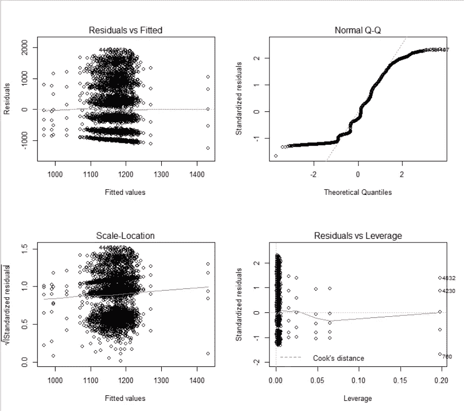

Not much better.

让我们看看是否可以通过观察第 7、14、21 和 28 天的体重、动物被送来时的年龄、性别和血统来预测屠宰时的体重。这是第二种尝试建立数据模型的方法。

```
model3<-lm(pesorealBW~day7+day14+day21+day28+age+sex+lineage, data=datasubset2)
summary(model3)
plot(model3)
```

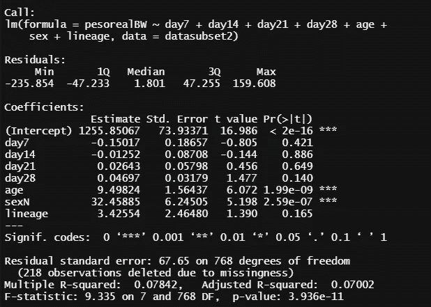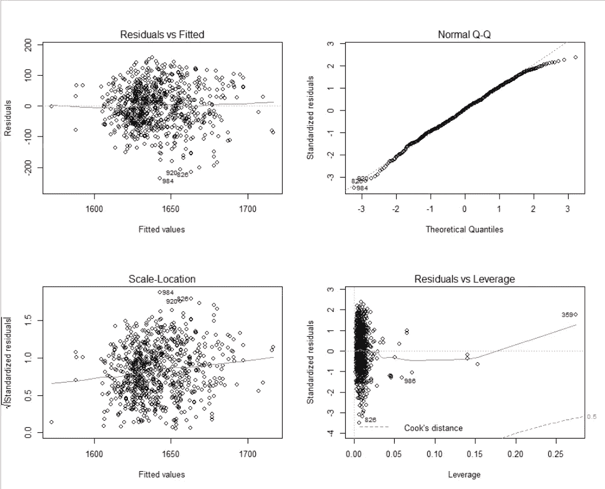

Looking good! Well, in terms of assumptions. In terms of predictions, we have no idea. But modelling the bodyweight at slaughter directly seems to be an easier way than to model the bodyweight as a growth curve.

如果我们缩小模型并使用生长，而不是实际体重，会怎么样？

```
model4<-lm(pesorealBW~adg7+adg7_14+adg14_21+age+sex, data=datasubset2)
summary(model4)
plot(model4)
```

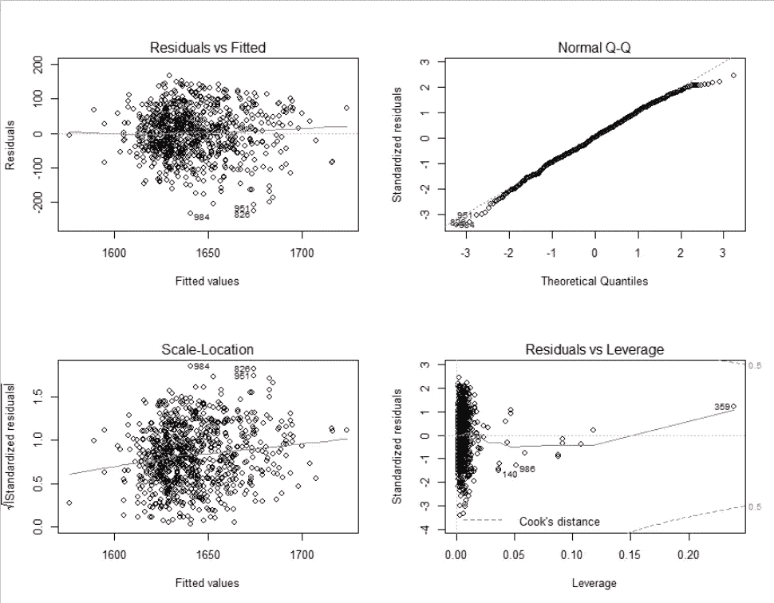

Looking even better, but in terms of residual error the model is a little bit worse.

让我们建立一个样条模型并预测体重(包括屠宰时的体重)，然后跟踪模型如何预测。

```
## Simple Spline Model
datalongcc<-datalong[complete.cases(datalong), ]
model5<-lm(bw~ns(time,3)+age+
            as.factor(vaccine)+
            as.factor(sex)+
            as.factor(lineage), data=datalongcc)
m5pred<-predict(model5)
m5values<-data.frame(obs=datalongcc$bw,
                     pred=m5pred,
                     batch=datalongcc$batch,
                     time=datalongcc$time,
                     pesorealbw=datalongcc$pesorealBW,
                     age=datalongcc$age,
                     sex=datalongcc$sex, 
                     year=datalongcc$year,
                     lineage=datalongcc$lineage,
                     month=datalongcc$month,
                     vaccine=datalongcc$vaccine,
                     feed=datalongcc$feed)
theme_set(theme_bw())
ggplot(m5values, aes(obs,pred,colour=sex, group=sex)) +
  geom_point(alpha=0.5) + 
  geom_smooth(method=lm, se=FALSE,linetype="dashed", size=0.5)+ 
  geom_abline(slope=1, linetype="dashed") +
  facet_wrap(~lineage) + theme_bw()
```

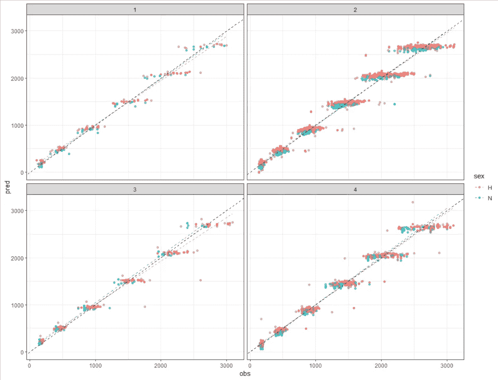

The predictions, per sex, follow the line but the residuals increase as weight increases. This is a natural phenomenon in growth modelling.

让我们将每一批的预测放在该批的生长曲线上，并在屠宰场测量体重。再次记住，我预测的体重包括屠宰时的体重。这意味着我现在正在看我是否能预测整个生长曲线，因此不仅看我是否能预测某一点的体重，还能预测动物应该被送去的时间。最后，整个练习的目标是动物应该以预先指定的重量到达屠宰场。

```
m5values%>%arrange(batch, time)%>%top_n(60, batch)%>%
  ggplot(., aes(x=time,group=batch))+ 
  geom_point(aes(y=obs), size=2, color="black") +
  geom_point(aes(y=pred), size=2, color="red") +
  geom_point(aes(y=pesorealbw, x=age), size=2, color="purple") +
  geom_line(aes(y=pred), color="red", linetype="dashed", size=0.5)+
  theme_minimal()+
  theme(legend.position = "none")+
  facet_wrap(~batch)
```

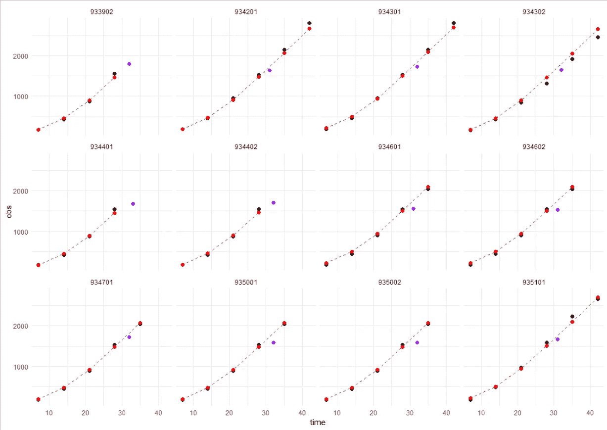

The black dots are the bodyweights measured at the farm, the purple is the bodyweight measured at the slaughterhouse and the red lines are the predictions coming from the model. As you can see, the predicted line does fall on the observed line at the farm, but it does not predict the bodyweight as measured at the slaughterhouse. This should not surprise too much, since the model was ment for predicting weight at slaughter.

但是首先，一个更复杂的模型，使用体重和其他变量来预测体重。尤其重要的是纳入排名。然而，我更喜欢建立一个没有排名的模型，因为排名是人为的，相当主观的测量。

```
combinedcc<-combined[ , -which(names(combined) %in% c("B"))];combinedcc<-combinedcc[complete.cases(combinedcc), ]
model6<-lm(bw~ns(time,4)+
             as.factor(vaccine)+
             as.factor(sex)+
             as.factor(lineage)+
             as.factor(feed) + 
             year + 
             month +
             ranking, data=combinedcc)
m6pred<-predict(model6)
m6values<-data.frame(obs=combinedcc$bw,
                      pred=m6pred,
                      batch=combinedcc$batch,
                      time=combinedcc$time,
                      pesorealbw=combinedcc$pesorealBW,
                      age=combinedcc$age,
                      sex=combinedcc$sex, 
                      year=combinedcc$year,
                      lineage=combinedcc$lineage,
                      month=combinedcc$month,
                      vaccine=combinedcc$vaccine,
                      feed=combinedcc$feed)
m6values%>%filter(time>2)%>%
  ggplot(., aes(obs,pred,colour=sex, group=sex)) +
  geom_point(alpha=0.5) + 
  geom_smooth(method=lm, se=FALSE,linetype="dashed", size=0.5)+ 
  geom_abline(slope=1, linetype="dashed") +
  facet_wrap(~lineage) + theme_bw()
```

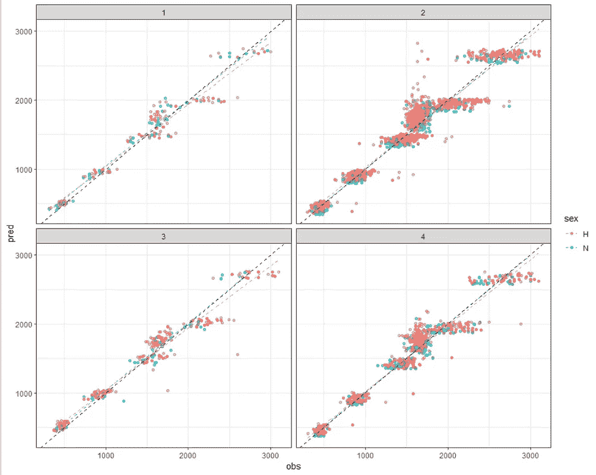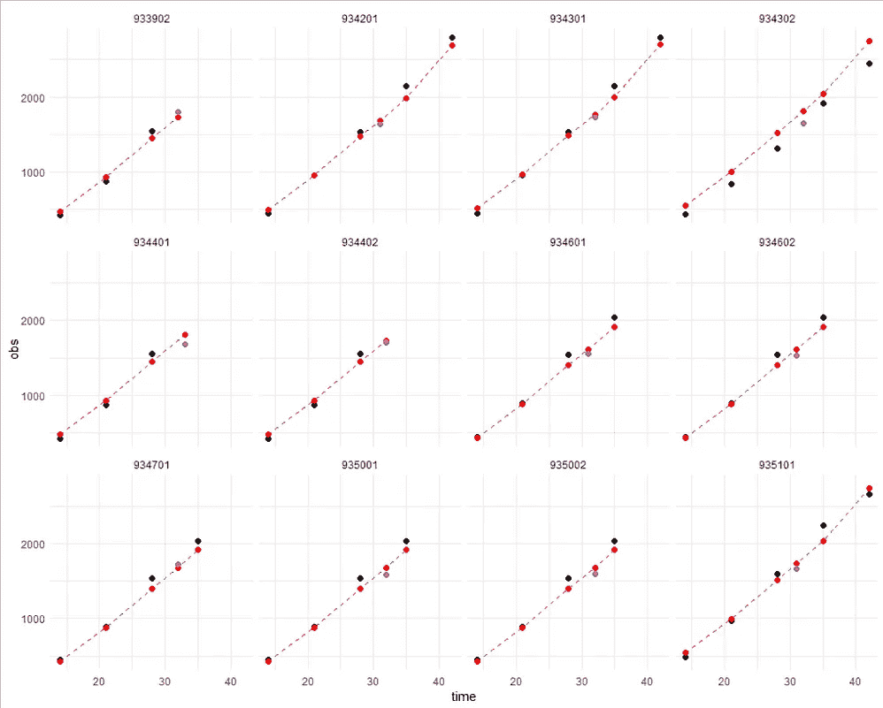

This model, looking at the left, is not very good at predicting, but if I look to the right I do see predictions that come dangerously close at the bodyweight at slaughter. In fact, the increase in residuals to the left seems to be a direct result of the model to focus somewhat more on slaughter weight. I did not specifically push the model to gravitate towards weight at slaughter, but it does seem to happen.

让我们更深入地研究并检查每个时间点和每个性别的残差。

```
m6values$diff<-m6values$pred-m6values$obs
m6values$diff<-replace(m6values$diff, which(m6values$time != m6values$age),NA)m6values%>%filter(time>2)%>%ggplot(., aes(x=diff, colour=as.factor(sex), fill=as.factor(sex)))+
  geom_density(alpha=0.5) + facet_wrap(~time)
```

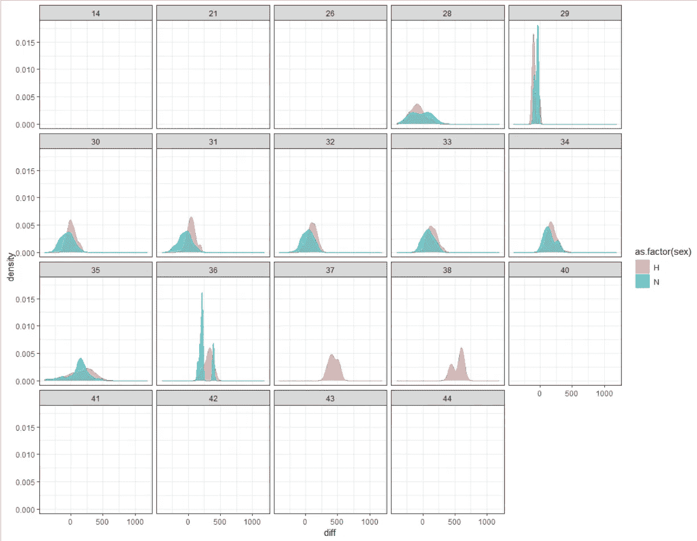

Residuals are quite big, in the vicinity of around 200 grams, which is too much.

残差的绘制略有不同，因为当数据稀疏或过时时，密度图往往会出现问题。

```
ggplot(m6values, aes(y=diff, colour=as.factor(sex), fill=as.factor(sex)))+
  geom_boxplot(alpha=0.5) + facet_wrap(~lineage)ggplot(m6values, aes(x=age, y=diff, colour=as.factor(sex), fill=as.factor(sex)))+
  geom_point(alpha=0.5) + facet_wrap(~lineage)
```

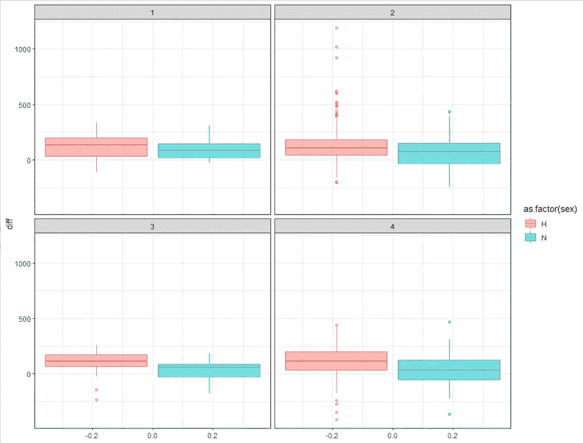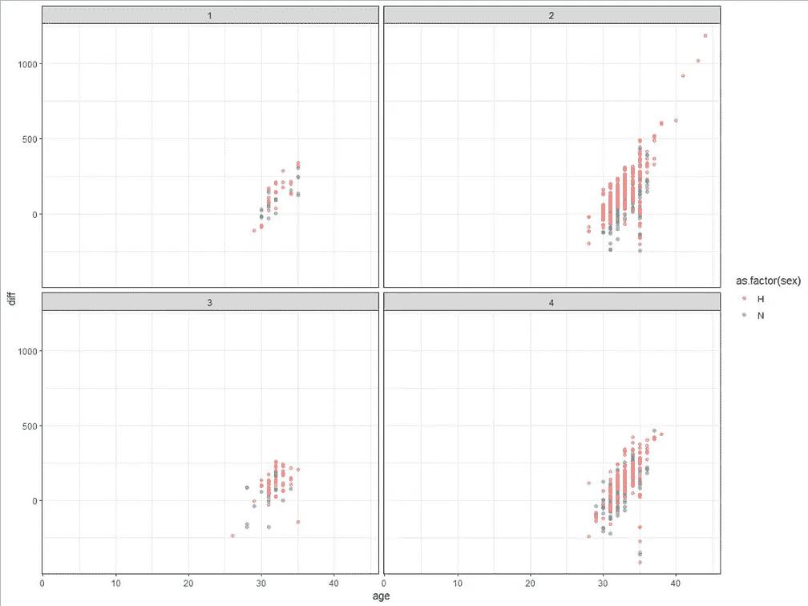

在这里，每个时间点和每个性别，我观察和预测的平均值/中间值之间的差异。如你所见，在某些年龄，我们很亲密。

```
print(m6values %>%
        filter(time>20 & time<43 & diff<500)%>%
        group_by(time, sex) %>% 
        dplyr::summarize(min = min(abs(diff)),
                         median = median(abs(diff)),
                         mean = mean(abs(diff)),
                         max = max(abs(diff))), n=100)
```

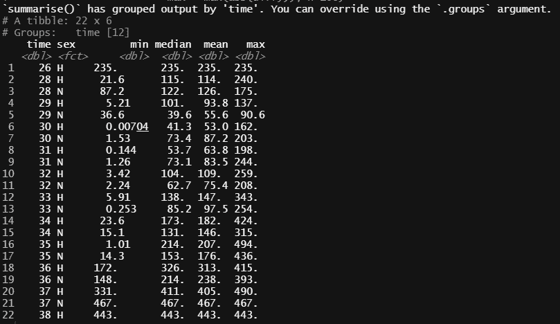

老实说，上面的模型没有让人失望，所以让我们使用 caret 包来扩展它们，在这个包中我们处理了像过度拟合这样的严重问题。

```
library(doParallel)
library(parallel)
set.seed(998)
cl <- makePSOCKcluster(4)
registerDoParallel(cl)

modeldata<-data%>%filter(size=='A')%>%filter(sex=='H' | sex=='N')%>%
  select(sex,year,batch, month,pesorealBW,
         lineage,vaccine,feed,ranking,adg7,adg7_14,adg14_21)
modeldata<-modeldata[complete.cases(modeldata), ]
dim(modeldata)inTraining <- createDataPartition(modeldata$pesorealBW, 
                                  p = .6, list = FALSE)
training <- modeldata[ inTraining,]
testing  <- modeldata[-inTraining,]
DataExplorer::plot_missing(training)
DataExplorer::plot_missing(testing)
```

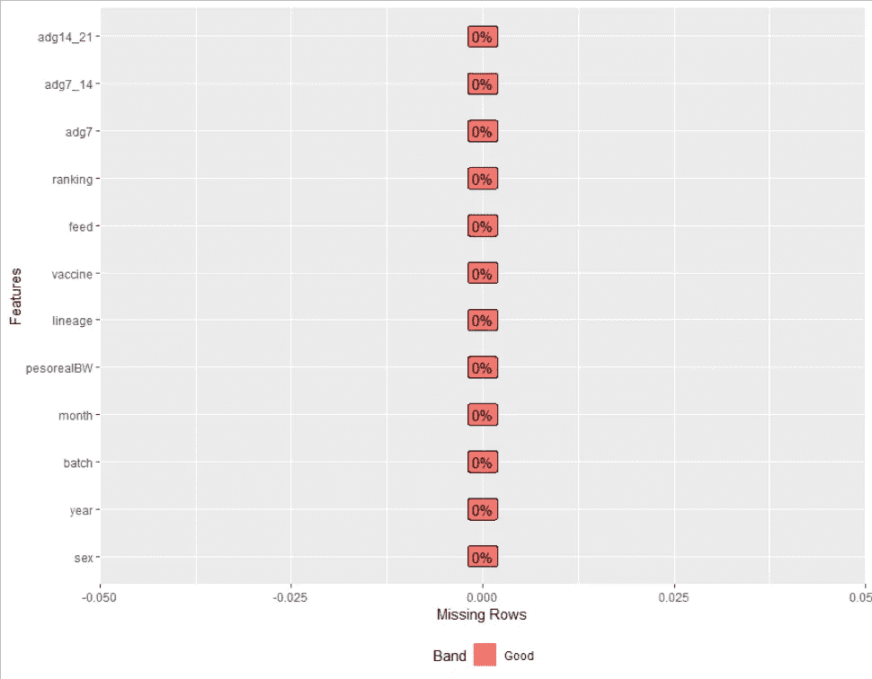

```
ggplot(training, aes(x=adg14_21,
                       y = adg7_14, 
                       color=pesorealBW))+ 
geom_point()ggplot(testing, aes(x=adg14_21,
                     y = adg7_14, 
                     color=pesorealBW))+ 
geom_point()
```

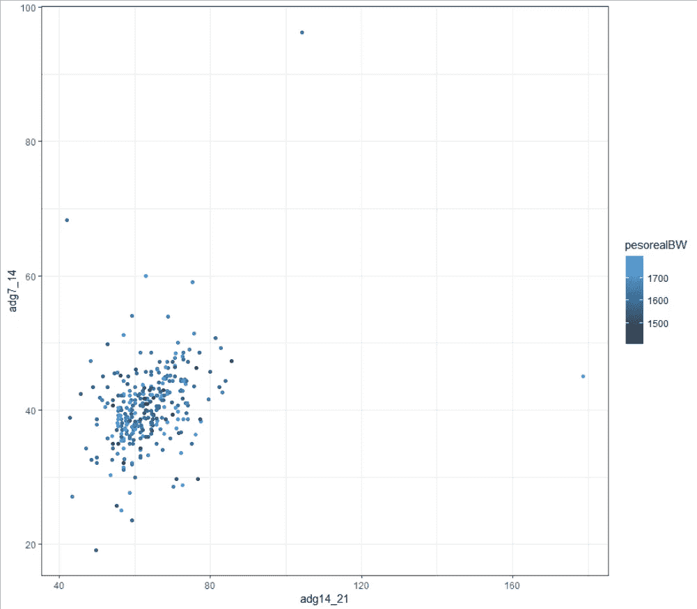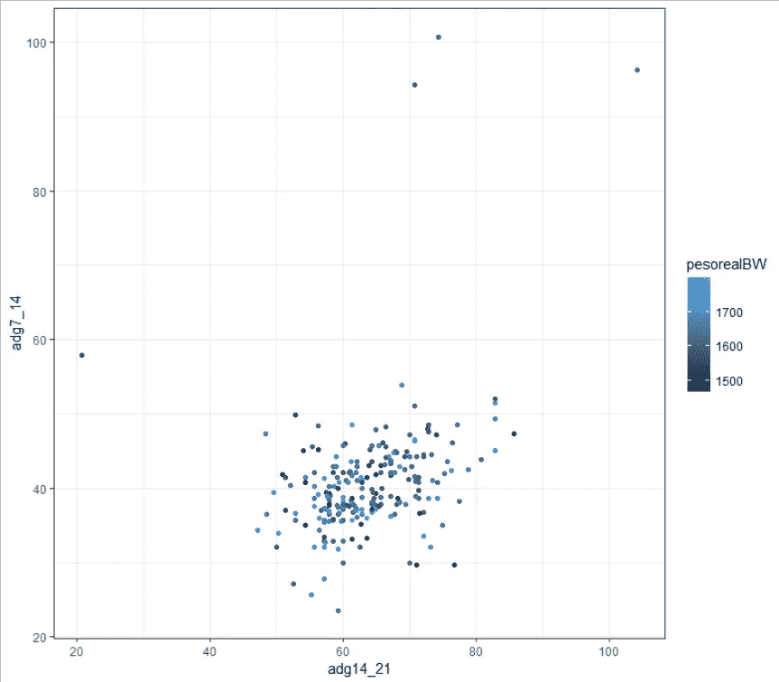

```
modeldatalong<-combined%>%
filter(size=='A')%>%
filter(sex=='H' | sex=='N')%>%
select(sex, year, month, bw, lineage, vaccine, feed, ranking, time, batch)modeldatalong<-modeldatalong[complete.cases(modeldatalong),]
dim(modeldatalong)modeldatalong$lineage<-as.factor(modeldatalong$lineage)
modeldatalong$vaccine<-as.factor(modeldatalong$vaccine)
modeldatalong$feed<-as.factor(modeldatalong$feed)inTraining <- createDataPartition(modeldatalong$bw, 
                                  p = .6, list = FALSE)
training <- modeldatalong[ inTraining,]
testing  <- modeldatalong[-inTraining,]DataExplorer::plot_missing(training)
DataExplorer::plot_missing(testing)
```

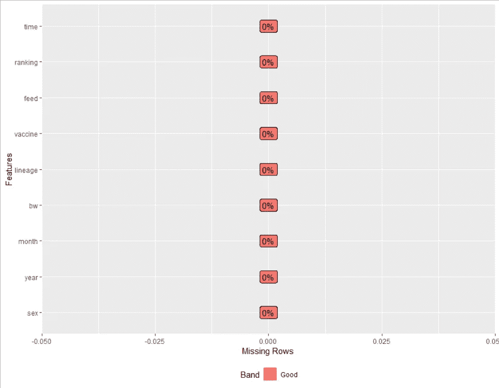

```
ggplot(training, aes(x=time,color=ranking, group=batch))+ 
  geom_line(aes(y=bw))+
  theme_bw()+
  theme(legend.position = "none")ggplot(testing, aes(x=time,color=ranking, group=batch))+ 
  geom_line(aes(y=bw))+
  theme_bw()+
  theme(legend.position = "none")
```

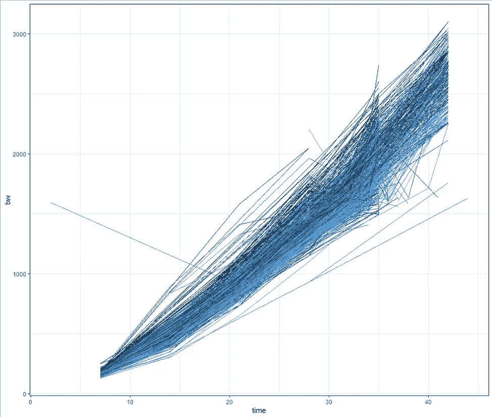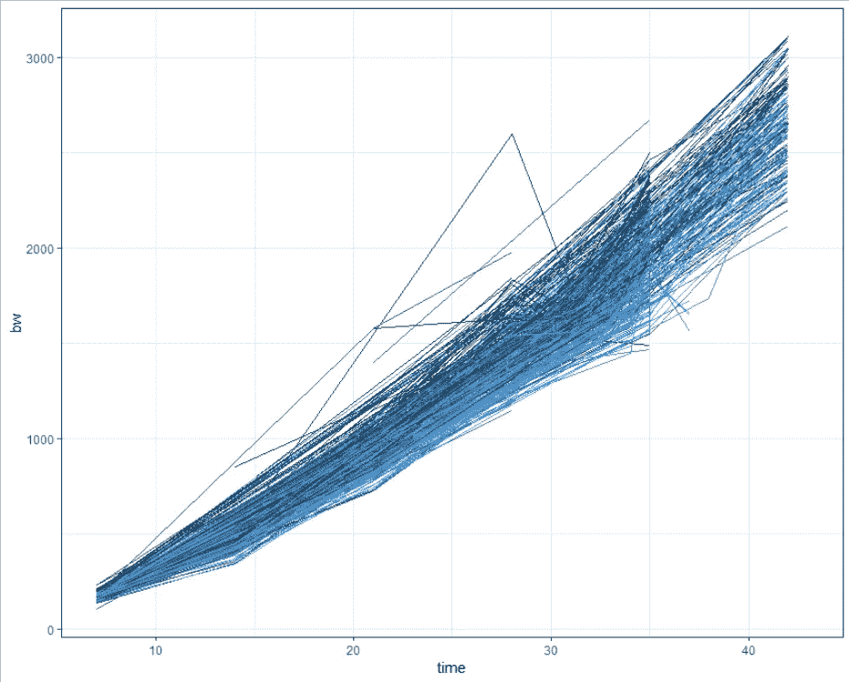

```
ggplot(training, aes(x=time,color=ranking, group=batch))+ 
  geom_line(aes(y=bw))+
  theme_bw()+
  theme(legend.position = "none")+
  facet_wrap(~sex)
```


测试和训练数据看起来都不错。所以，是时候重新开始建模了。我们将再次从增长模式开始。

```
tr <- trainControl(method = "repeatedcv",
                   number = 30,
                   repeats = 30)lm1 <- train(bw~ns(time,4)+
               as.factor(sex)+
               ns(time,4):as.factor(sex)+
               as.factor(lineage)+
               year + 
               month +
               ranking, data=training, 
             preProcess = c("center", "scale"),
             method = "lm", trControl = tr) plot(varImp(lm1))
lm1pred<-predict(lm1, testing)
saveRDS(lm1, "lm1.rds")lm1values<-data.frame(obs=testing$bw, 
                      pred=lm1pred,
                      sex=testing$sex,
                      time=testing$time,
                      year=testing$year,
                      lineage=testing$lineage,
                      month=testing$month,
                      vaccine=testing$vaccine,
                      feed=testing$feed)
lm1values$diff<-lm1values$y-lm1values$obs
lm1values$diff<-replace(lm1values$diff, which(lm1values$time != lm1values$age),NA)print(lm1values %>%
        filter(time>20 & time<43 & diff<500)%>%
        group_by(time, sex) %>% 
        dplyr::summarize(min = min(abs(diff)),
                         median = median(abs(diff)),
                         mean = mean(abs(diff)),
                         max = max(abs(diff))), n=100)
```

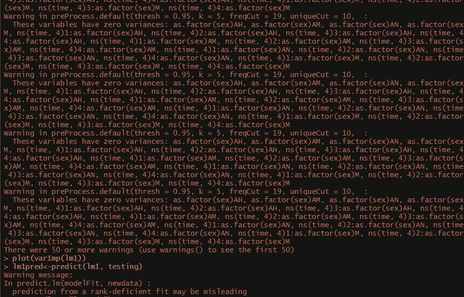

When you see issues like this, you already know that the rest will not be really beneficial to use. But, lets see where we end up anyhow.

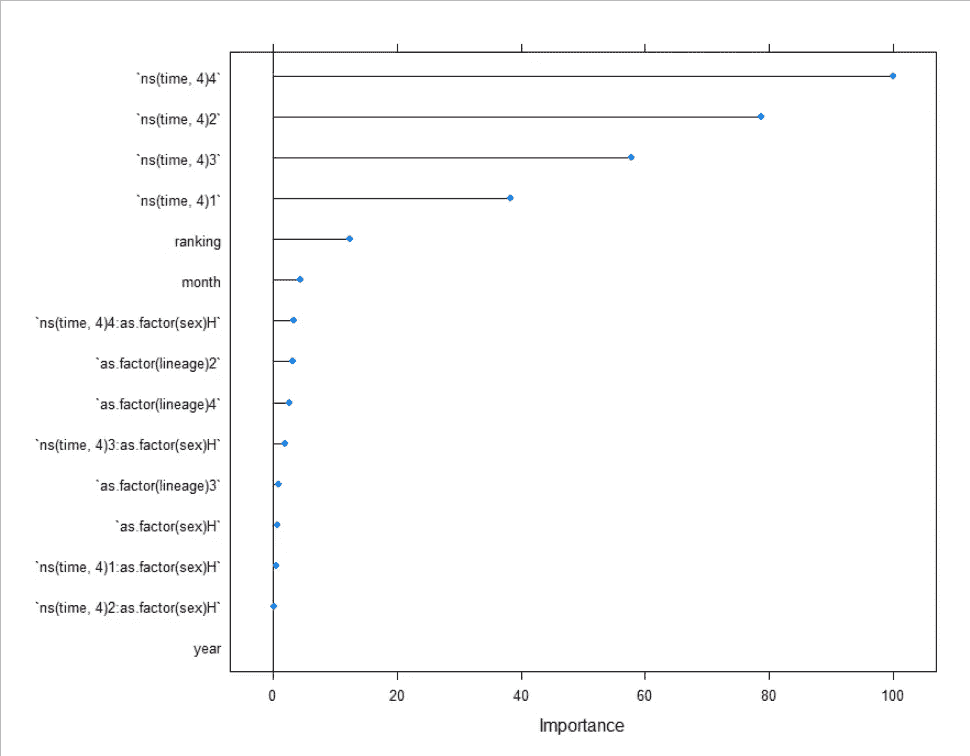

From the variable importance plot, it is clear to see, that the parameters of interest is age, which is normal since it is a proxy of past bodyweight. Then there is a big drop and we see ranking coming up, which is also a combination of past performance. At the bottom the rest. Seeing this, I can already see that the model itself will either perform badly, or overfit.

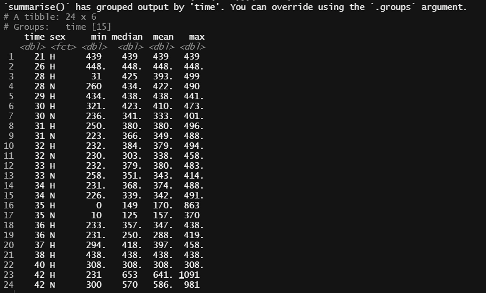

Mean / median residuals are for sure worse in this model than the previous models. That is to be expected, since these residuals are based on the test dataset.

让我们建立一个惩罚模型，但这一次重点是屠宰时的重量。最终，这就是我们想要预测的，但是这样做只能得到模型的一部分，因为我们更喜欢预测一批动物何时达到特定的重量。因此，前面的模型是这个练习的真正目的，但是让我们也来看看这个模型。

```
pm1 <- train(pesorealBW~.-batch, data=training, 
             preProcess = c("center", "scale"),
             method = "glmnet", trControl = tr) plot(varImp(pm1))
pm1pred<-predict(pm1, testing)pm1values<-data.frame(obs=testing$pesorealBW, 
                      pred=pm1pred,
                      batch=testing$batch,
                      sex=testing$sex, 
                      year=testing$year,
                      lineage=testing$lineage,
                      month=testing$month,
                      vaccine=testing$vaccine,
                      feed=testing$feed)ggplot(pm1values, aes(obs,pred,colour=sex, group=sex)) +
  geom_point(alpha=0.5) + 
  geom_smooth(method=lm, se=FALSE,linetype="dashed", size=0.5)+ 
  geom_abline(slope=1, linetype="dashed") +
  facet_wrap(~lineage) + theme_bw()
```

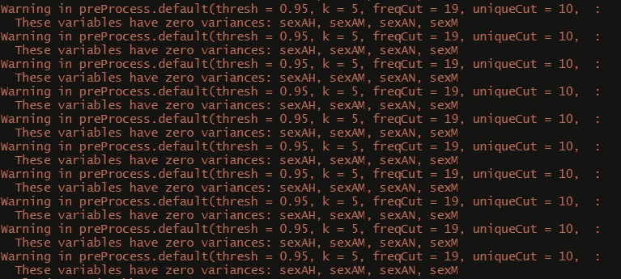

Not good.

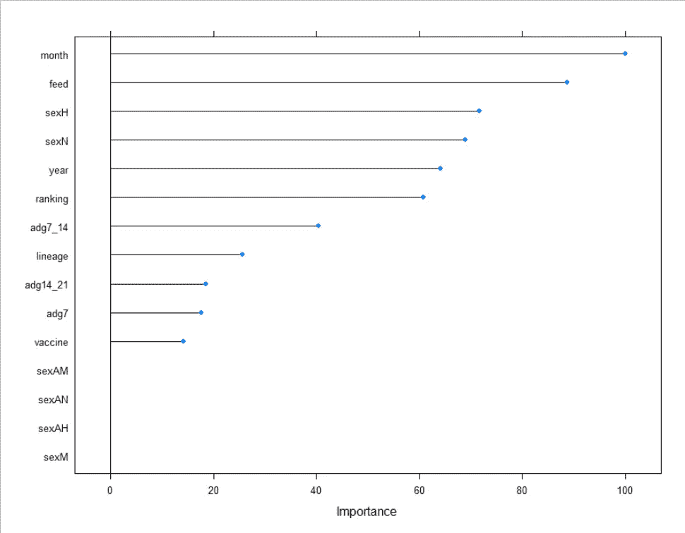

Quite a different variable importance plot, compared to the previous model. Here, it seems that month of shipping, the feed, sex and year are most influential.

老实说，预测看起来不太好。让我们重试这个练习，首先找出是什么导致了建模过程中的许多错误。很有可能是我在创建数据集时，在某个地方搞砸了。

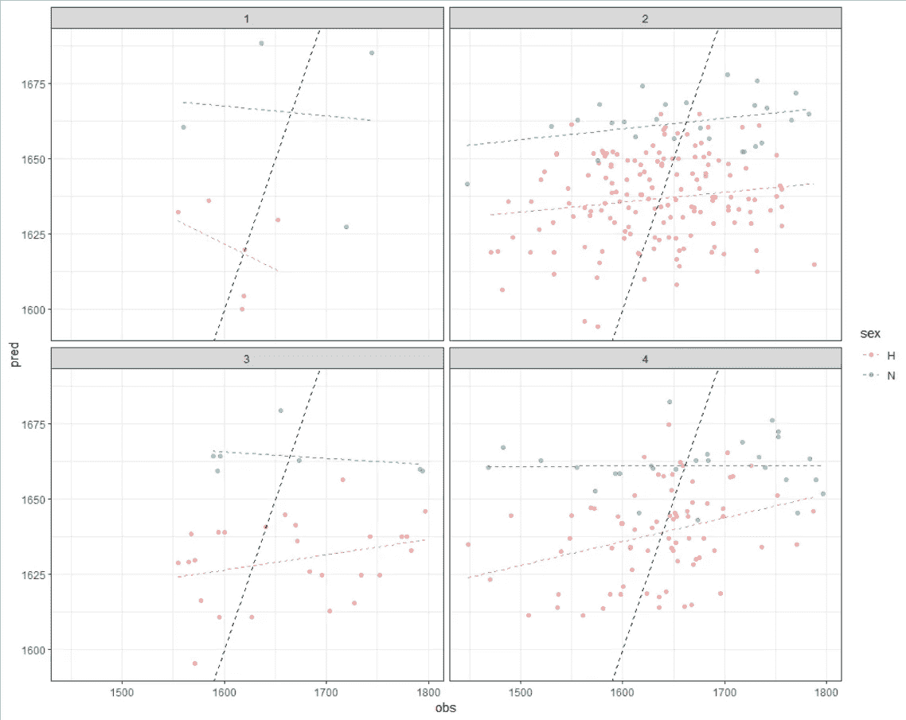

```
marsgrid<-expand.grid(.degree = 1:2, .nprune = 2:38)
set.seed(100)
mars1 <- training%>%
  dplyr::select(bw, ranking, sex, time)%>%
  tidyr::drop_na()%>%
  dplyr::filter(sex =="H" | sex =="N")%>%
  caret::train(bw~., 
               data=., 
               method = "earth",
               preProcess = c("center", "scale"),
               trControl=tr, 
               tuneGrid = marsgrid)
summary(mars1)
plot(varImp(mars1))
plot(mars1, which = 1)
saveRDS(mars1, "mars1.rds")
```

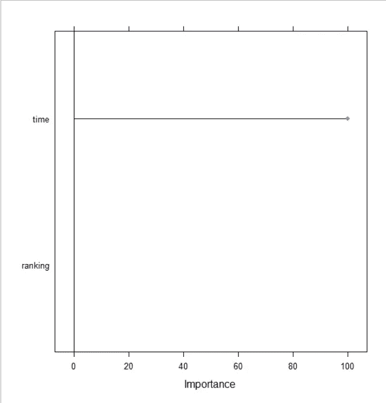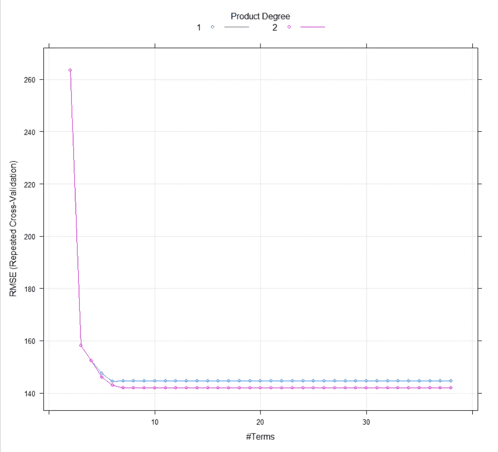

```
mars1$finalModel %>%
  coef() %>%  
  broom::tidy() 
```

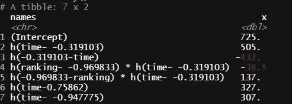

```
ms1pred<-predict(mars1, testing)
ms1values<-data.frame(obs=testing$bw, 
                      pred=ms1pred,
                      sex=testing$sex,
                      time=testing$time,
                      year=testing$year,
                      lineage=testing$lineage,
                      month=testing$month,
                      vaccine=testing$vaccine,
                      feed=testing$feed)
ms1values$diff<-ms1values$y-ms1values$obs
ms1values$diff<-replace(ms1values$diff, which(ms1values$time != ms1values$age),NA)
# plot model results
ggplot(ms1values, aes(obs,y,colour=sex, group=sex)) +
  geom_point(alpha=0.5) + 
  geom_smooth(method=lm, se=FALSE,linetype="dashed", size=1)+ 
  geom_abline(slope=1, linetype="dashed") +
  facet_wrap(~lineage) + theme_bw()
```

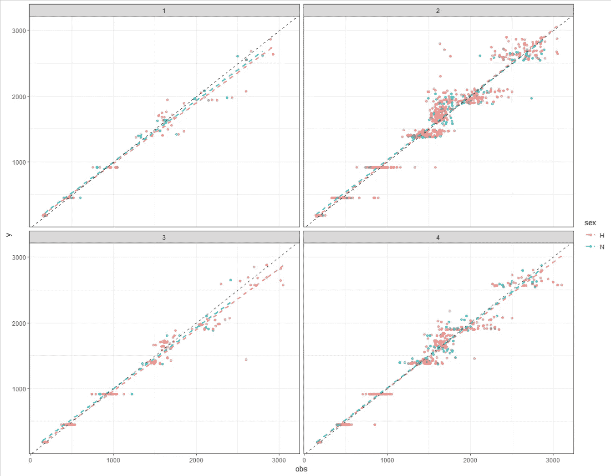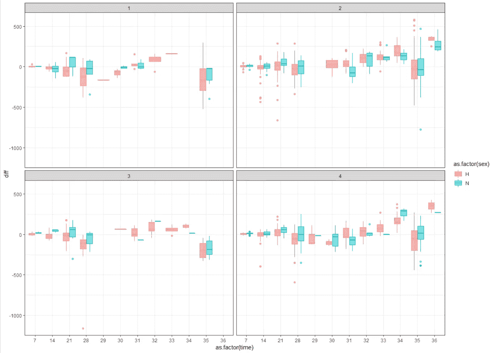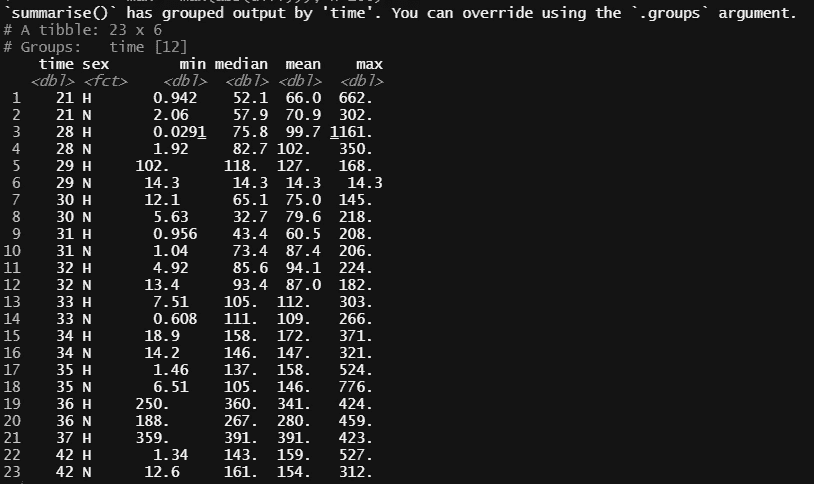

```
newdat<-expand.grid(time    = seq(1,42,by=1), 
                    ranking = 42, 
                    sex = "H")
pred<-as.data.frame(predict(mars1, newdat))
time <- rownames(pred)
rownames(pred) <- NULL
data <- cbind(time,pred)
obs <-datalong%>%dplyr::filter(ranking == 42 & sex == "H")
ggplot()+
  geom_line(data=obs, aes(x=time, y=bw, color="Observed"))+
  geom_point(data=obs, aes(x=time, y=bw), col="red")+
  geom_point(data=obs, aes(x=age, y=pesorealBW), col="purple", 
  size=4)+
  geom_line(data=data, aes(x=as.numeric(time), y=y, 
  color="Predicted"), 
            lty=2)+
  geom_point(data=data, aes(x=as.numeric(time), y=y), col="blue")+
  theme_bw()+
  labs(x="Time", 
       y="Bodyweight", 
       col="")
```

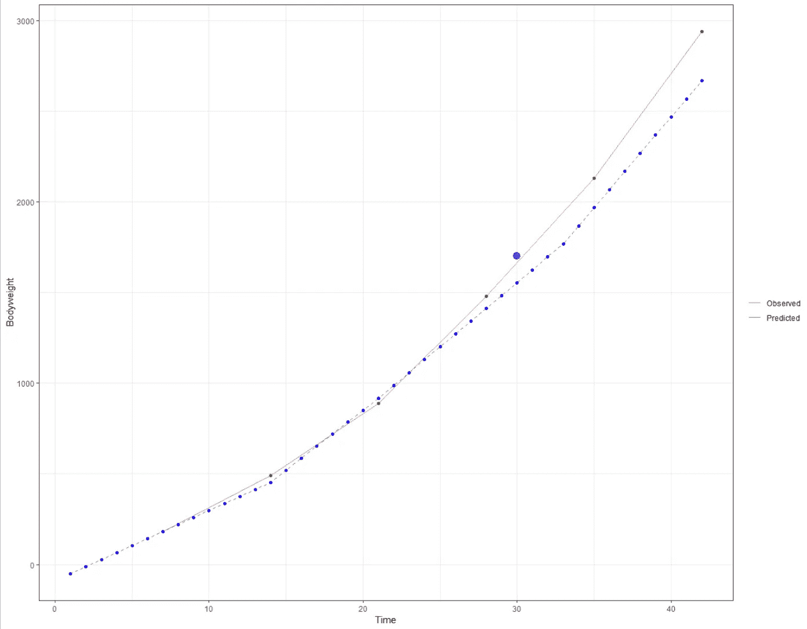

The prediction are off. In fact, a straight line between the last observed value and the next observed would give a better prediction on the bodyweight measured at the slaughterhouse. What surprises me, is that the weight is actually above the average daily gain line, which could mean that the last observed weight is not enough. Or that the weighing at the farm and the slaughterhouse is done differently. That is a substantial problem for the predictions if that truly is the case.

```
newdat<-expand.grid(time    = seq(1,42,by=1), 
                    ranking = seq(1,95,by=1), 
                    sex = "H")
pred<-as.data.frame(predict(mars1, newdat))
data<-cbind(newdat, pred)
obs <-datalong%>%dplyr::filter(sex == "H" & ranking>30 & ranking <43)
data<-data%>%dplyr::filter(ranking>30 & ranking<43)
table(obs$ranking)
table(data$ranking)
ggplot()+
  geom_line(data=obs, aes(x=time, y=bw, color="Observed", group=batch), alpha=0.5)+
  geom_point(data=obs, aes(x=age, y=pesorealBW, group=batch, col="Slaughterweight"), 
             size=3, alpha=0.8)+
  geom_point(data=data, aes(x=as.numeric(time), y=y, color="Predicted"))+
  theme_bw()+
  facet_wrap(~ranking, ncol=4)+
  labs(x="Time", 
       y="Bodyweight", 
       col="")
```

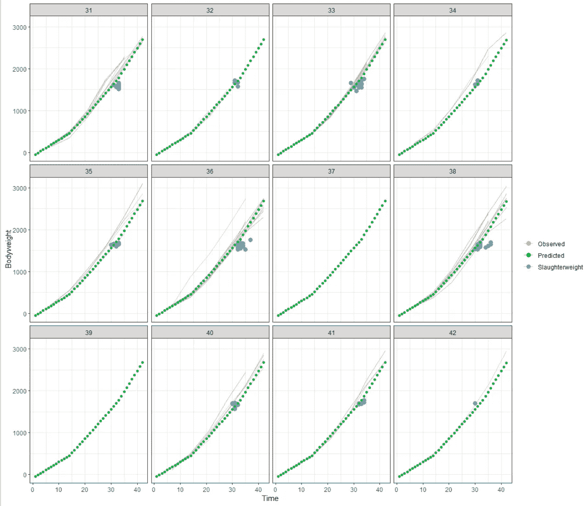

That does not look too bad actually.

到目前为止，我一直致力于预测体重，尤其是屠宰时的体重。但这并不是我们试图回答的主要问题。我们试图回答的问题是:

> “什么时候送鸟，以便它们到达时达到理想的体重”

为了建立这样一个模型，我们需要有极限，而这些极限取决于动物的尺寸和性别。此外，限制非常狭窄。让我展示给你看。

```
data%>%
  filter(size=='A')%>%
  filter(sex=='H' | sex=='N')%>%
  select(sex,year,batch, month,pesorealBW,
         lineage,vaccine,feed,ranking,adg7,adg7_14,adg14_21)%>%
  dplyr::mutate(LG = ifelse(sex=="H", 1550, 1650),
                UG = ifelse(sex=="H", 1600, 1700))%>%
  dplyr::mutate(Goal_achieved = ifelse(pesorealBW>=LG & pesorealBW<=UG, 1, 0))%>%
  ggplot(., aes(x= pesorealBW, y=factor(ranking), color=as.factor(Goal_achieved)))+
  geom_point()+
  theme_bw()+
  facet_wrap(~sex)+
  labs(x="Weight at slaughter", 
       y="Ranking",
       col="Goal Achieved")
```

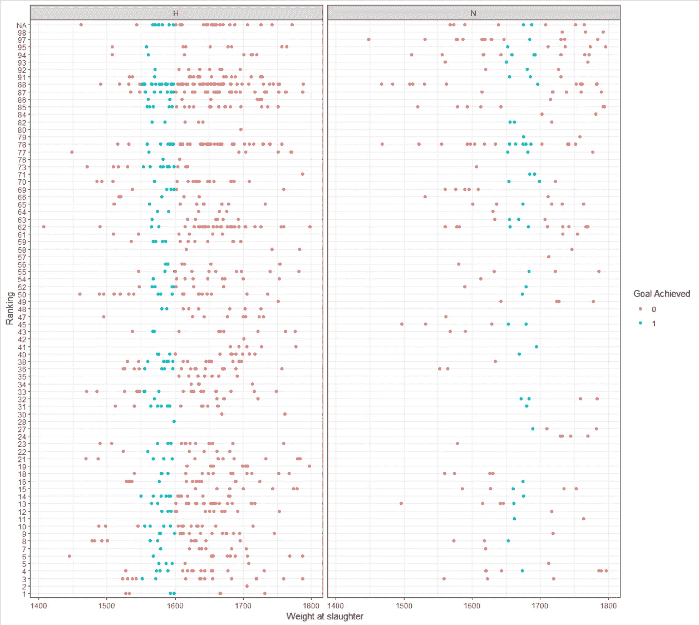

Looking at this plot it clearly shows that ranking does not necessarily provide useful information. Also, the margins set are often not met.

我可以很容易地从这个图开始，但我没有这样做，因为我想通过模拟增长来了解模型会如何发展。然而，现在我可以看到发货成功达到目标的频率。我可以做一个分类器，看看什么有助于实现目标，什么没有。我不确定这样的模型是否对场景本身有特别的帮助，但是让我们试一试。

```
trainIndex <- caret::createDataPartition(modeldata$Goal_achieved, 
                                         p = .6, 
                                         list = FALSE, 
                                         times = 1)
wideTrain <- modeldata[ trainIndex,];dim(wideTrain)
wideTest  <- modeldata[-trainIndex,];dim(wideTest)fitControl <- caret::trainControl(
  method = "repeatedcv",
  number = 20,
  repeats = 20)set.seed(998)
cl <- makePSOCKcluster(6)
registerDoParallel(cl)gbmGrid <-  expand.grid(interaction.depth = c(1:20), 
                        n.trees = (1:50)*100, 
                        shrinkage = 0.1,
                        n.minobsinnode = 10)
gbmFit1 <- caret::train(Goal_achieved ~ ., 
                        data = wideTrain, 
                        method = "gbm",
                        trControl = fitControl,
                        verbose = FALSE, 
                        tuneGrid = gbmGrid)
summary(gbmFit1)
saveRDS(gbmFit1, "gbmFit1.rds")
plot(gbmFit1)  
plot(gbmFit1, metric = "Kappa")
plot(gbmFit1, metric = "Kappa", plotType = "level",
     scales = list(x = list(rot = 90)))
ggplot(gbmFit1) + theme_bw()
```

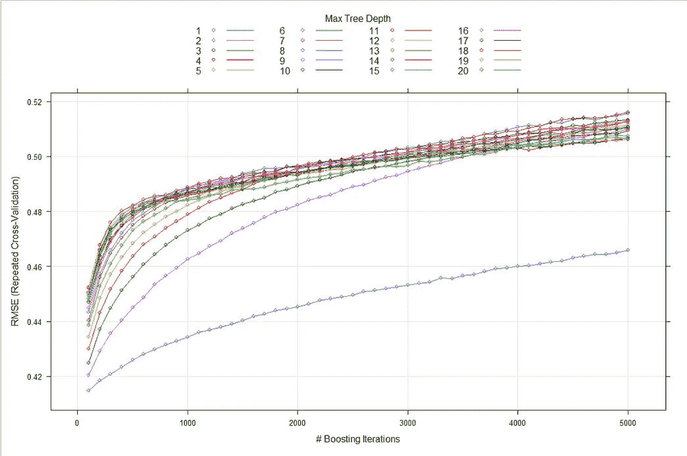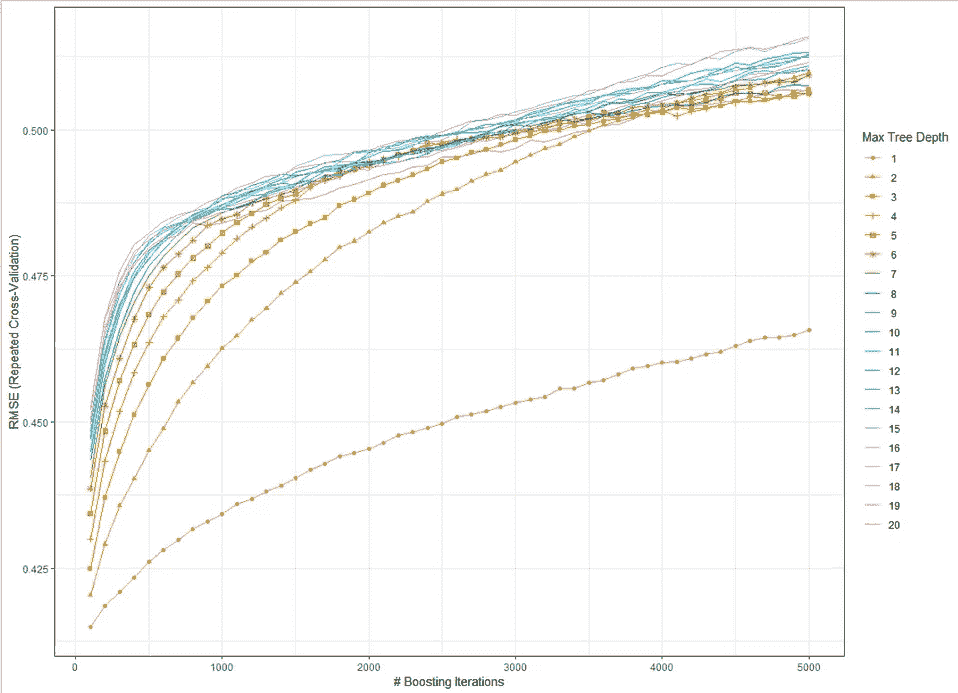

从这个模型中，我们可以得到一个混淆矩阵，它将向我们显示测试集上的预测等于测试集中的观察的次数。

```
pred<-predict(gbmFit1, 
              newdata = wideTest)%>%
  as.data.frame()%>%
  dplyr::mutate(Goal_achieved = ifelse(.<=0.5, 0, 1))class(pred$Goal_achieved)
class(wideTest$Goal_achieved)wideTest$Goal_achieved<-as.factor(wideTest$Goal_achieved)
pred$Goal_achieved<-as.factor(pred$Goal_achieved)caret::confusionMatrix(data = pred$Goal_achieved, 
                       reference = wideTest$Goal_achieved)
```

这很有趣，值得仔细看看。模型的准确率几乎达到 80%这很好，因为它是偶然变得更好的。然而，如果你仔细观察，该模型实际上几乎没有增加任何东西，因为它所做的(经过繁琐的计算)是预测几乎每一批都不会达到目标。除了两个。现在，如果我自己做，不用看，我会和模特一样好。因此，这个模型没有增加任何东西。

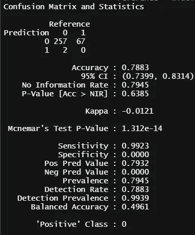

这也意味着我需要回去探索数据集中的一些变量与是否达到目标之间的关系。请记住，动物必须体重的界限是非常小的，通常情况下，这个目标是达不到的。所以这绝对是值得的，但也是相当困难的。

```
data%>%
  filter(size=='A')%>%
  filter(sex=='H' | sex=='N')%>%
  select(sex,year,batch, month,pesorealBW,
         lineage,vaccine,feed,ranking,adg7,adg7_14,adg14_21)%>%
  dplyr::mutate(LG = ifelse(sex=="H", 1550, 1650),
                UG = ifelse(sex=="H", 1600, 1700))%>%
  dplyr::mutate(Goal_achieved = ifelse(pesorealBW>=LG & pesorealBW<=UG, 1, 0))%>%
  ggplot(., aes(x= adg7_14, y=adg14_21, 
                size=pesorealBW, 
                color=as.factor(Goal_achieved)))+
  geom_point(alpha=0.5)+
  theme_bw()+
  facet_wrap(~sex, scales="free")+
  labs(x="ADG from 7 to 14 days", 
       y="ADG from 14 to 21 days",
       col="Goal Achieved", 
       size="Weight at slaughter")
```

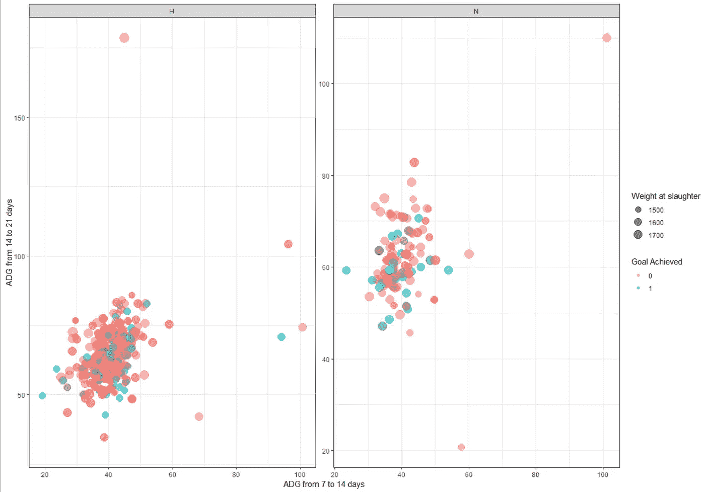

Relationship between average daily gain in the earliest phase, average daily gain in later phases, the weight at slaughter and if the goal was achieved or not. Nothing clear shows up.

```
data%>%
  filter(size=='A')%>%
  filter(sex=='H' | sex=='N')%>%
  select(sex,year,batch, month,pesorealBW,
         lineage,vaccine,feed,ranking,adg7,adg7_14,adg14_21, adg21_28)%>%
  dplyr::mutate(LG = ifelse(sex=="H", 1550, 1650),
                UG = ifelse(sex=="H", 1600, 1700))%>%
  dplyr::mutate(Goal_achieved = ifelse(pesorealBW>=LG & pesorealBW<=UG, 1, 0))%>%
  ggplot(., aes(x= adg14_21, y=adg21_28, 
                size=pesorealBW, 
                color=as.factor(Goal_achieved)))+
  geom_point(alpha=0.5)+
  theme_bw()+
  facet_wrap(~sex, scales="free")+
  labs(x="ADG from 14 to 21 days", 
       y="ADG from 21 to 28 days",
       col="Goal Achieved", 
       size="Weight at slaughter")data%>%
  filter(size=='A')%>%
  filter(sex=='H' | sex=='N')%>%
  select(sex,year,batch, month,pesorealBW,
         lineage,vaccine,feed,ranking,adg7,adg7_14,adg14_21, adg21_28, cv)%>%
  dplyr::mutate(LG = ifelse(sex=="H", 1550, 1650),
                UG = ifelse(sex=="H", 1600, 1700))%>%
  dplyr::mutate(Goal_achieved = ifelse(pesorealBW>=LG & pesorealBW<=UG, 1, 0))%>%
  ggplot(., aes(x= cv, y=adg21_28, 
                size=pesorealBW, 
                color=as.factor(Goal_achieved)))+
  geom_point(alpha=0.5)+
  theme_bw()+
  facet_wrap(~sex, scales="free")+
  labs(x="Coefficient of variation", 
       y="ADG from 21 to 28 days",
       col="Goal Achieved", 
       size="Weight at slaughter")
```

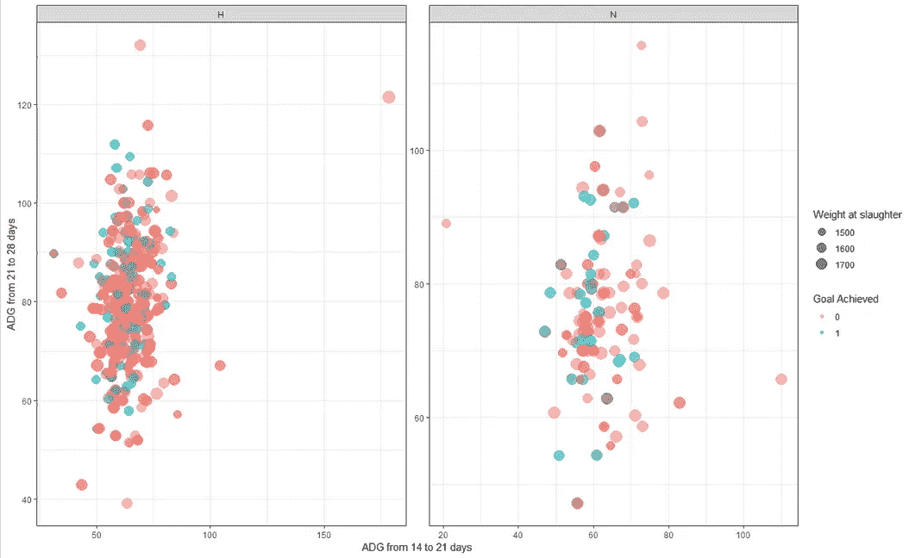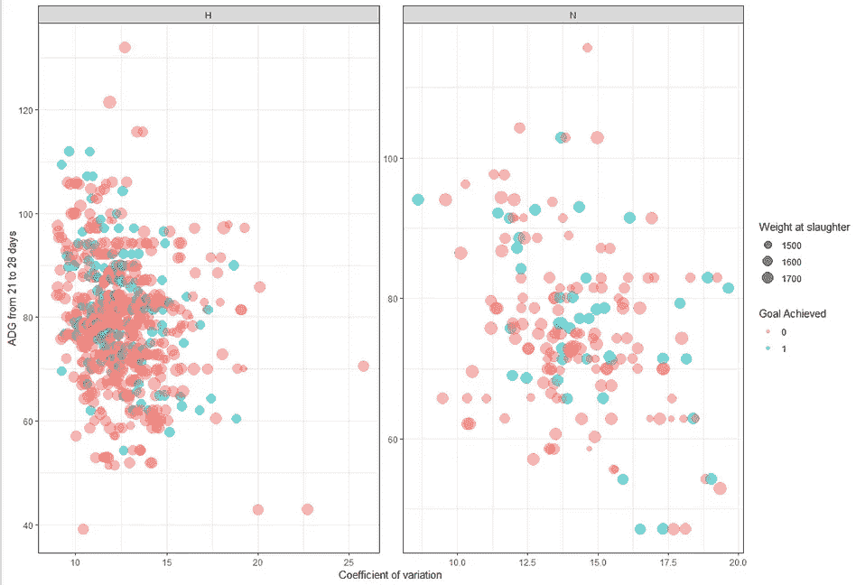

No real relationships visible either.

让我们再次运行随机森林模型，但是改变指定结果的方式，并且改变训练的控制机制。我要求模型基于 ROC 值进行训练，并且结果确实是一个两级因素。

```
modeldata$Goal_achieved<-factor(modeldata$Goal_achieved,
                                   levels = c(0,1),
                                   labels=c("no", "yes") )
fitControl <- caret::trainControl(
  method = "cv", classProbs = TRUE,
  summaryFunction = twoClassSummary)
rbmFit1 <- caret::train(Goal_achieved ~ ., 
                        data = wideTrain, 
                        method = "rf", 
                        metric = "ROC",
                        tuneLength = 20,
                        trControl = fitControl,
                        verbose = FALSE)
```


Funny how the sensitivity stays quite high, but the specificity does not. That is a direct consequence of the many zeros in the classification matrix (goal not achieved) and the model actually predicting most of the time that the goal was indeed not achieved.

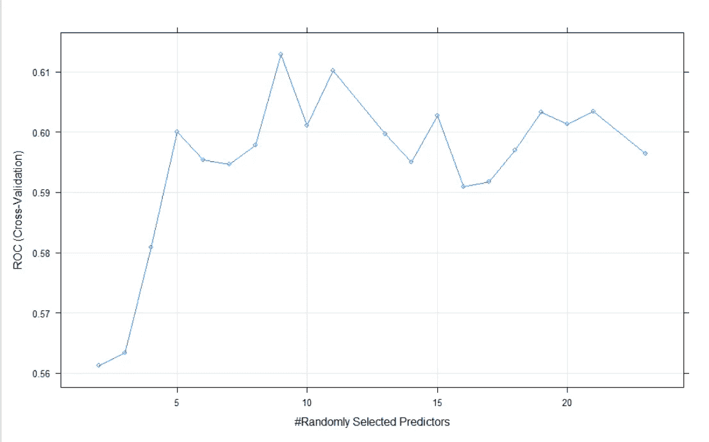

Clearly shows a very bad ROC-curve

在机器学习和分类中，提升曲线是评估模型的标准方式。就像 ROC 曲线一样。与只随机选择案例的模型相比，提升图是显示我们的模型如何执行的简单方式。您需要在提升图中指定的是您感兴趣的型号和响应百分比。在这个例子中，我使用了 60%,这在一个分类器中意味着我将看到仅用 60%的数据我能走多远。在下面的图表中，你可以看到情况并不乐观。

```
lift_results    <- data.frame(Class = wideTest$Goal_achieved)
lift_results$RF <- predict(rbmFit1, wideTest, type = "prob")[,"yes"]
lift_obj <- lift(Class ~ RF, data = lift_results)
plot(lift_obj, values = 60, auto.key = list(columns = 2,
                                            lines = TRUE,
                                            points = FALSE))
ggplot(lift_obj, values = 60)+theme_bw()
```

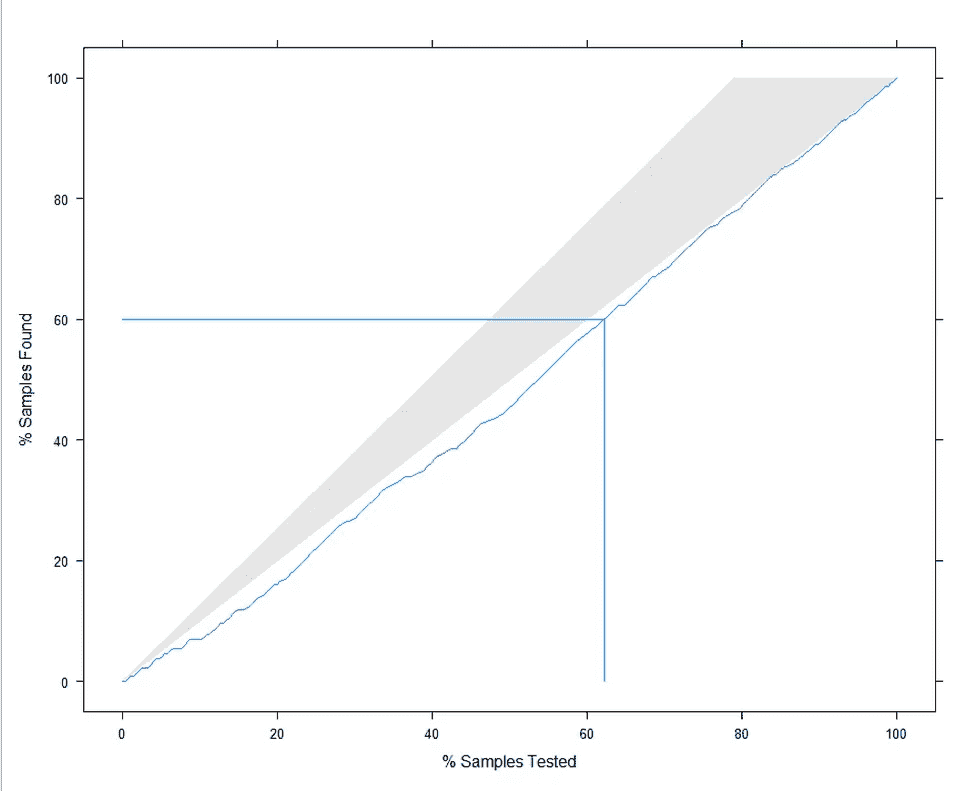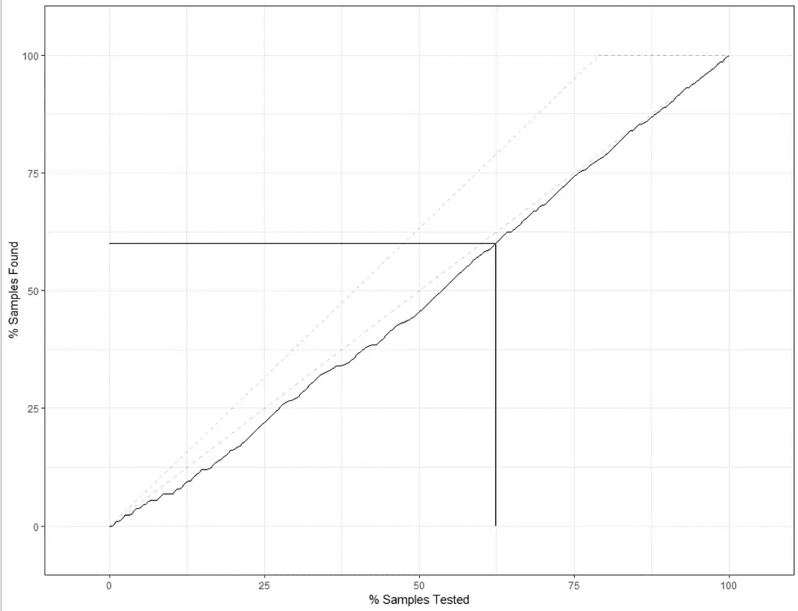

The lift curves (plotted two different ways) showing that just selecting cases at random would not be a bad strategy. There really is not a specific set or group that would benefit me most.

我们也可以用校准曲线来绘制。校准曲线显示了我预测的最佳概率分布位置。

```
cal_obj <- calibration(Class ~ RF,
                       data = lift_results,
                       cuts = 13)
plot(cal_obj, type = "l", auto.key = list(columns = 1,
                                          lines = TRUE,
                                          points = FALSE))
ggplot(cal_obj)+theme_bw()
```

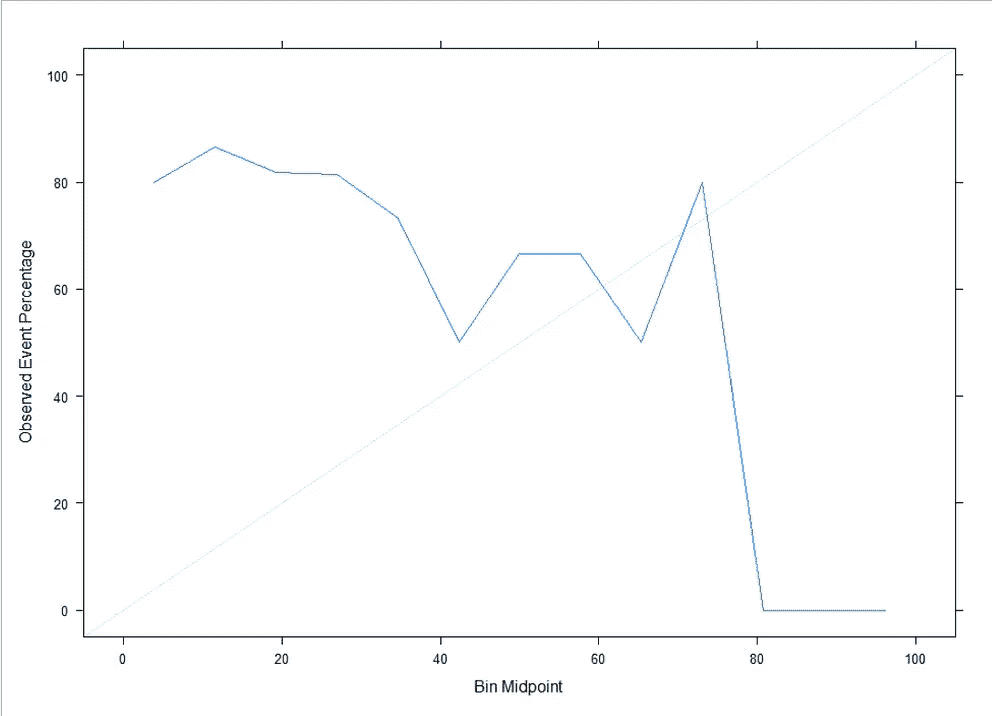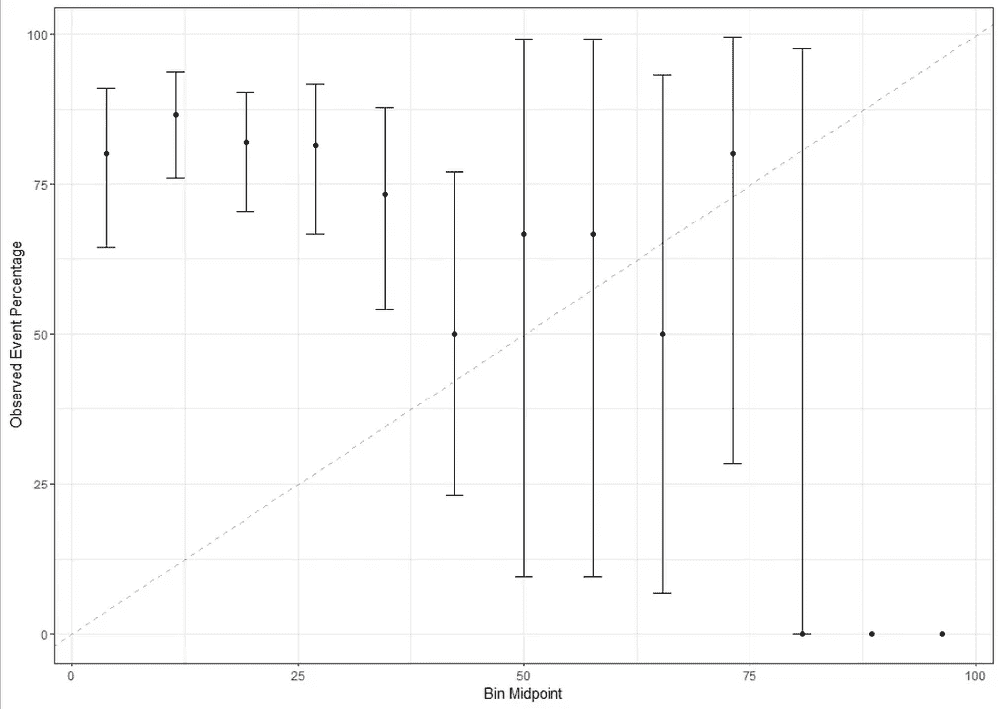

You would normally like the predictions to follow on the dotted line, but that is not happening. It does not seem that my model is adding much at all.

虽然我几乎可以 100%肯定地预测不同的模型不会增加多少，但我无论如何都会这样做，并选择了一个袋装 AdaBoost 模型。如果数据不足以与感兴趣的结果联系起来，即使只是为了显示复杂的算法也不会增加多少。

```
trainIndex <- caret::createDataPartition(modeldata$Goal_achieved, 
                                         p = .8, 
                                         list = FALSE, 
                                         times = 1)
abmFit1 <- caret::train(Goal_achieved ~ ., 
                        data = wideTrain, 
                        method = "AdaBag", 
                        metric = "ROC",
                        trControl = fitControl,
                        verbose = FALSE)
```

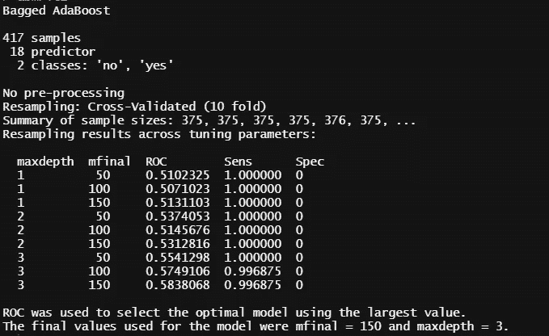

Same issues as Random Forest model.

现在我们可以比较这两个模型的升力和校准曲线。

```
lift_results    <- data.frame(Class = wideTest$Goal_achieved)
lift_results$RF <- predict(rbmFit1, wideTest, type = "prob")[,"yes"]
lift_results$AB <- predict(abmFit1, wideTest, type = "prob")[,"yes"]
lift_obj <- lift(Class ~ RF +AB, data = lift_results)
plot(lift_obj, values = 60, auto.key = list(columns = 2,
                                            lines = TRUE,
                                            points = FALSE))
ggplot(lift_obj, values = 60)+theme_bw()cal_obj <- calibration(Class ~ RF + AB,
                       data = lift_results,
                       cuts = 13)
plot(cal_obj, type = "l", auto.key = list(columns = 1,
                                          lines = TRUE,
                                          points = FALSE))
ggplot(cal_obj)+theme_bw()
```

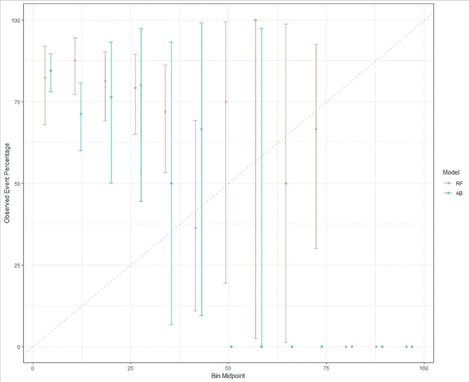

Does not add a thing.

```
resamps <- resamples(list(RBM = rbmFit1,
 ABM = abmFit1))
summary(resamps)
bwplot(resamps, layout = c(3, 1))
```

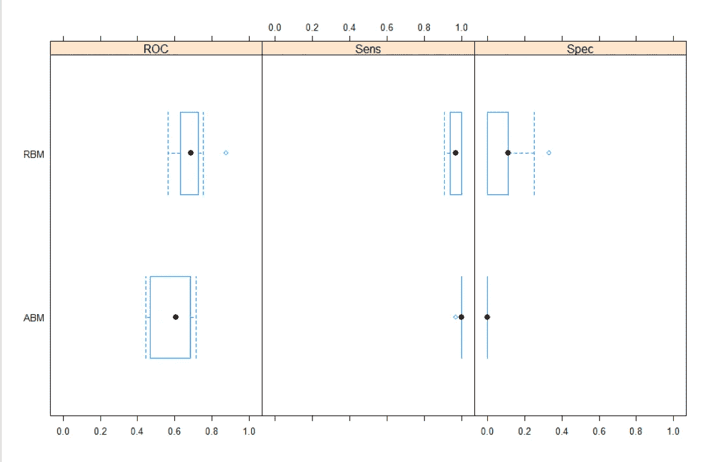

The Random Forest model seems to be better, but I would not really prefer one over the other.

让我们比较一下每个模型认为重要的变量。

```
rbmImp <- varImp(rbmFit1, scale = FALSE); plot(rbmImp)
abmImp <- varImp(abmFit1, scale = FALSE); plot(abmImp)
```

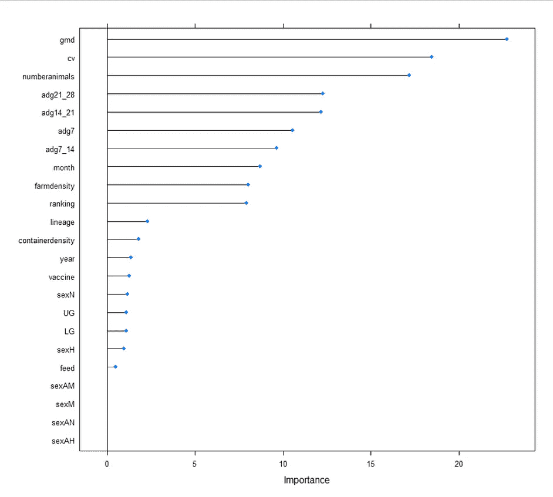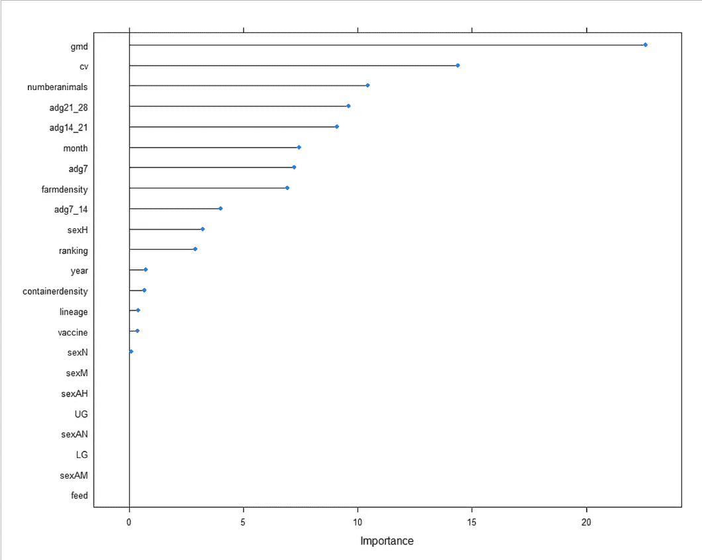

They are looking at the same variables in pretty much the same way.

也许我遗漏了一些东西，所以一切都要从头开始。问题是，我真的需要预测一批动物何时应该被发送，这意味着我需要包括动物特征、农场特征和运输特征。

```
data%>%
  filter(size=='A')%>%
  filter(sex=='H' | sex=='N')%>%
  dplyr::select(sex,year,batch, month,pesorealBW,
         lineage,vaccine,feed,ranking,adg7,adg7_14,adg14_21, adg21_28, cv, 
         gmd, numberanimals)%>%
  dplyr::mutate(LG = ifelse(sex=="H", 1550, 1650),
                UG = ifelse(sex=="H", 1600, 1700))%>%
  dplyr::mutate(Goal_achieved = ifelse(pesorealBW>=LG & pesorealBW<=UG, 1, 0))%>%
  ggplot(., aes(x=cv, y=gmd, 
                size=numberanimals, 
                color=as.factor(Goal_achieved)))+
  geom_point(alpha=0.5)+
  theme_bw()+
  facet_wrap(~sex, scales="free")+
  labs(x="Coefficient of variation", 
       y="Growth per Day",
       col="Goal Achieved", 
       size="Number of animals")
```

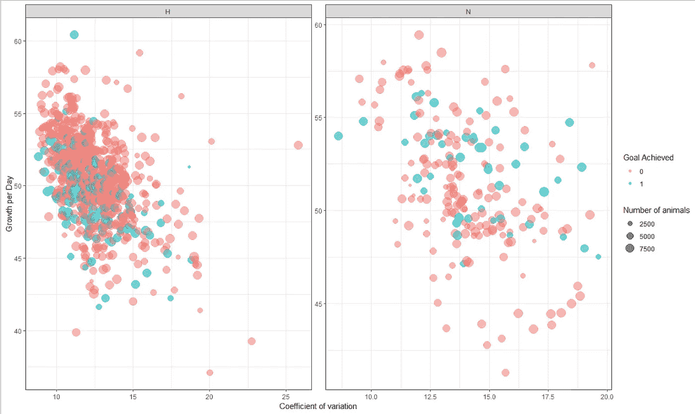

```
data%>%
  filter(size=='A')%>%
  filter(sex=='H' | sex=='N')%>%
  dplyr::select(sex, pesorealBW, tiempoayunogranja, tiempocarga, 
                tiempoespera, tiempototal, 
                tiempotransp)%>%
  dplyr::mutate(LG = ifelse(sex=="H", 1550, 1650),
                UG = ifelse(sex=="H", 1600, 1700))%>%
  dplyr::mutate(Goal_achieved = ifelse(pesorealBW>=LG & pesorealBW<=UG, 1, 0))%>%
  ggplot(., aes(x=tiempocarga, y=tiempotransp, 
                size=tiempototal, 
                color=as.factor(Goal_achieved)))+
  geom_point(alpha=0.5)+
  theme_bw()+
  facet_wrap(~sex, scales="free")+
  labs(x="Load time", 
       y="Transport Time",
       col="Goal Achieved", 
       size="Total time")
```

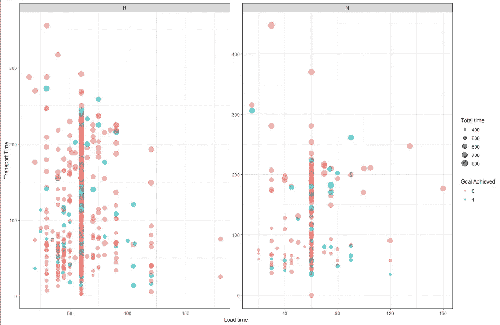

我将在这个组合中添加一个不同的变量，一个可能确实非常重要的变量。在被送到屠宰场之前，屠宰场的人会来“测量”这些鸟。看什么时候发。当它们到达时，将通过测量卡车的重量并除以鸟的数量来测量它们。因此，我们在发送前进行测量( *pesoestimBW)* ，在屠宰场进行测量(*pesore LBW*)。这种差异( *peso_diff* )非常重要，因为它可以表明在给定的时间内体重的减少或增加。正差异意味着运输后的鸟比运输前重。负的重量表示鸟的体重减轻了。或者，至少，测量是不可比的。然而，我们不知道屠宰场的技术人员何时对它们进行评估。总而言之，这是一个棘手的测量。

```
data%>%
  filter(size=='A')%>%
  filter(sex=='H' | sex=='N')%>%
  dplyr::select(sex, pesorealBW, pesoestimBW, peso_diff, tiempototal)%>%
  dplyr::mutate(LG = ifelse(sex=="H", 1550, 1650),
                UG = ifelse(sex=="H", 1600, 1700))%>%
  dplyr::mutate(Goal_achieved = ifelse(pesorealBW>=LG & pesorealBW<=UG, 1, 0))%>%
  ggplot(., aes(x=pesorealBW, y=peso_diff, 
                size=tiempototal, 
                color=as.factor(Goal_achieved)))+
  geom_point(alpha=0.5)+
  theme_bw()+
  facet_wrap(~sex, scales="free")+
  labs(x="Bodyweight measured at slaughterhouse", 
       y="Difference between bodyweight measured prior to and at slaughterhouse",
       col="Goal Achieved", 
       size="Total time")
```

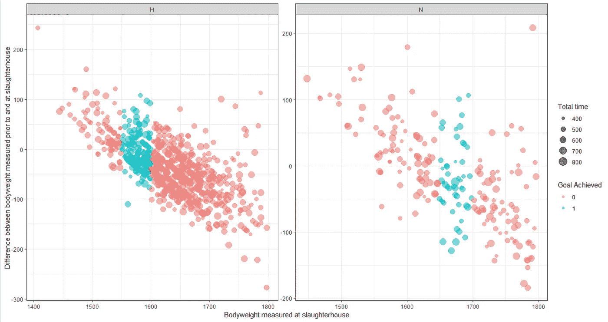

This seems to show something. Now, the colors are a bit tricky, since they indicate if a goal is met or not, and the x-axis is the weight at slaughter. However, the weight at slaughter does correlate with the difference between what is measured before and after (at slaughterhouse) transport. And so it seems that after a certain bodyweight, the animals have a higher weight at the slaughterhouse then when measured by the technician. Which makes sense, since these measurements do not take place at the same time.

我们是否可以看得更全面一些，通过观察总平均日增长( *gmd* )和运输时间(*tiempotoat*)，同时考虑变异系数(cv)和测量差异( *peso_diff* )？

```
data%>%
  filter(size=='A')%>%
  filter(sex=='H' | sex=='N')%>%
  dplyr::select(sex, pesorealBW, pesoestimBW, peso_diff, tiempototal, adg21_28, age, gmd, cv)%>%
  dplyr::mutate(LG = ifelse(sex=="H", 1550, 1650),
                UG = ifelse(sex=="H", 1600, 1700))%>%
  dplyr::mutate(Goal_achieved = ifelse(pesorealBW>=LG & pesorealBW<=UG, 1, 0))%>%
  ggplot(., aes(x=gmd, y=tiempototal, 
                size=cv, 
                color=peso_diff))+
  geom_point(alpha=0.8)+
  theme_bw()+
  viridis::scale_color_viridis(option="magma")+
  facet_wrap(~Goal_achieved, scales="free")+
  labs(x="Growth per Day", 
       y="Total time to slaughterhouse",
       col="Difference measurement", 
       size="Coefficient of Variation")
```

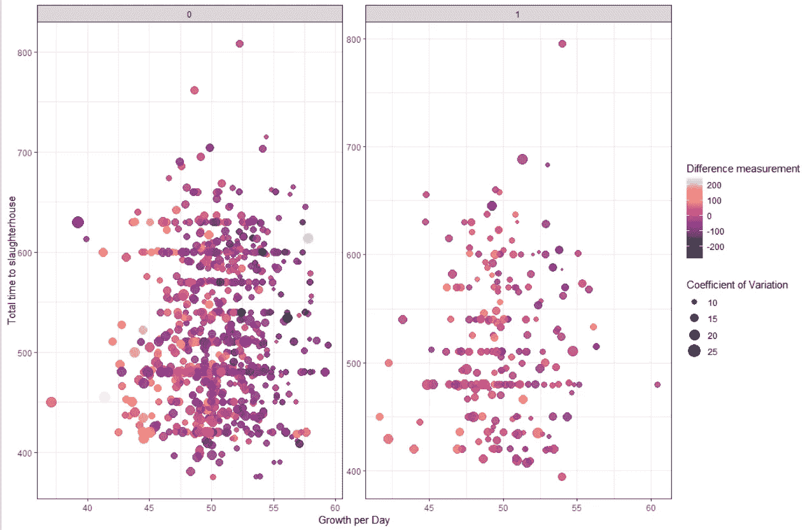

Does not show a clear relationship to be honest, besides, perhaps, from the difference in estimates being much higher in the group that did not achieve their goal.

让我们更深入地探讨一下，估计体重和实现体重目标之间的差异。

```
data%>%
  filter(size=='A')%>%
  filter(sex=='H' | sex=='N')%>%
  dplyr::select(sex, pesorealBW, pesoestimBW, peso_diff, tiempototal, adg21_28, age, gmd, cv)%>%
  dplyr::mutate(LG = ifelse(sex=="H", 1550, 1650),
                UG = ifelse(sex=="H", 1600, 1700))%>%
  dplyr::mutate(Goal_achieved = ifelse(pesorealBW>=LG & pesorealBW<=UG, 1, 0))%>%
  ggplot(., aes(x=peso_diff, 
                fill=factor(Goal_achieved)))+
  geom_density(alpha=0.8)+
  facet_wrap(~sex)+
  theme_bw()+
  labs(x="Difference measurement", 
       y="Density",
       fill="Goal achieved")
```

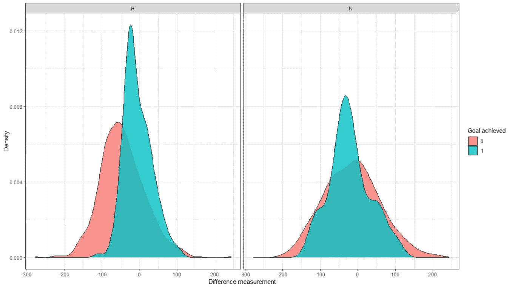

Clearly shows that those who had their goals achieve had a much smaller spread. That assessment, prior to sending, IS important.

我们能否将运输前后的精确测量与实现的目标联系起来。

```
data%>%
  filter(size=='A')%>%
  filter(sex=='H' | sex=='N')%>%
  dplyr::select(sex, pesorealBW, pesoestimBW, peso_diff, tiempototal, adg21_28, age, gmd, cv)%>%
  dplyr::mutate(LG = ifelse(sex=="H", 1550, 1650),
                UG = ifelse(sex=="H", 1600, 1700))%>%
  dplyr::mutate(Goal_achieved = ifelse(pesorealBW>=LG & pesorealBW<=UG, 1, 0))%>%
  ggplot(., aes(x=pesoestimBW, 
                y=pesorealBW, 
                col=factor(Goal_achieved)))+
  geom_point(alpha=0.8)+
  facet_wrap(~sex)+
  theme_bw()+
  labs(x="Body weight measured before transport", 
       y="Body weight measured after transport",
       col="Goal Achieved")
```

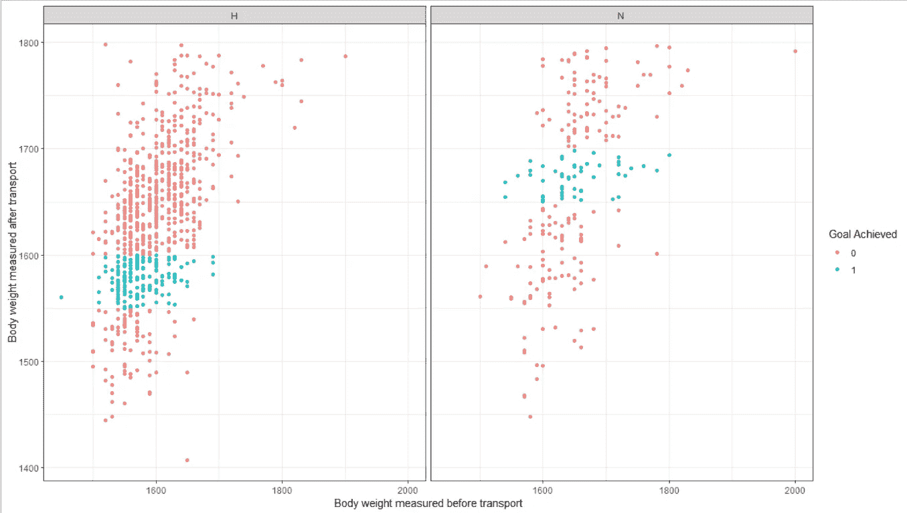

Well, to some extent it is not difficult. Those who already were too high in their bodyweight, during that measurement, did not achieve their goal. But it seems that having a bodyweight lower than the goal does increase you chances of being on target.

我们能连接更多的点吗？

```
data%>%
  filter(size=='A')%>%
  filter(sex=='H' | sex=='N')%>%
  dplyr::select(sex, pesorealBW, pesoestimBW, peso_diff, tiempototal, adg21_28, day28, age, gmd, cv)%>%
  dplyr::mutate(LG = ifelse(sex=="H", 1550, 1650),
                UG = ifelse(sex=="H", 1600, 1700))%>%
  dplyr::mutate(Goal_achieved = ifelse(pesorealBW>=LG & pesorealBW<=UG, 1, 0))%>%
  dplyr::filter(age>25 & day28<1700)%>%
  ggplot(., aes(x=day28, 
                y=pesoestimBW, 
                size=age, 
                col=peso_diff))+
  geom_point(alpha=0.8)+
  facet_wrap(~Goal_achieved)+
  viridis::scale_color_viridis(option="turbo")+
  theme_bw()+
  labs(x="Weight at Day 28", 
       y="Body weight measured before transport",
       col="Difference before and after transport", 
       size="Age")
```

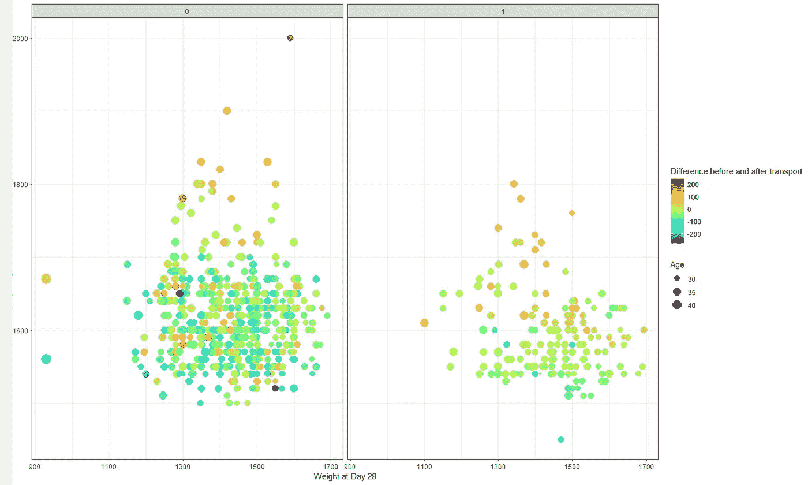

Does not seem to be the case, except, that the goal was more achieved when the difference in estimates is smaller and the body weight measures before transport was lower. That does not have to mean that the weight at day 28 has to be lower.

作为最后一次尝试，让我们在引导环境中使用 1000 次重采样来提升模型。

```
fitControl <- caret::trainControl(
  method = "boot", number=1000, classProbs = TRUE,
  summaryFunction = twoClassSummary)rbmFit1 <- caret::train(Goal_achieved ~ ., 
                        data = wideTrain, 
                        method = "rf", 
                        metric = "ROC",
                        tuneLength = 20,
                        trControl = fitControl,
                        verbose = FALSE)
abmFit1 <- caret::train(Goal_achieved ~ ., 
                        data = wideTrain, 
                        method = "AdaBag", 
                        metric = "ROC",
                        trControl = fitControl,
                        verbose = FALSE)lift_results    <- data.frame(Class = wideTest$Goal_achieved)
lift_results$RF <- predict(rbmFit1, wideTest, type = "prob")[,"yes"]
lift_results$AB <- predict(abmFit1, wideTest, type = "prob")[,"yes"]
lift_obj <- lift(Class ~ RF +AB, data = lift_results)
ggplot(lift_obj, values = 60)+theme_bw()resamps <- resamples(list(RBM = rbmFit1,
                          ABM = abmFit1))
summary(resamps)
bwplot(resamps, layout = c(3, 1))
```

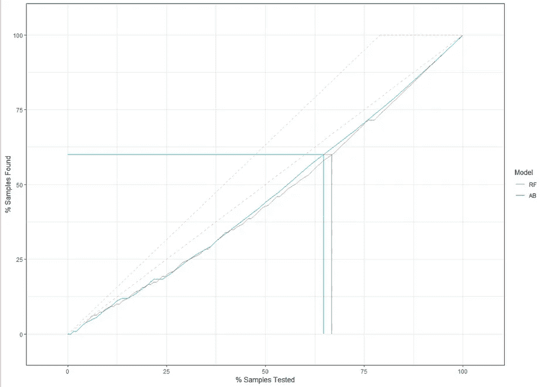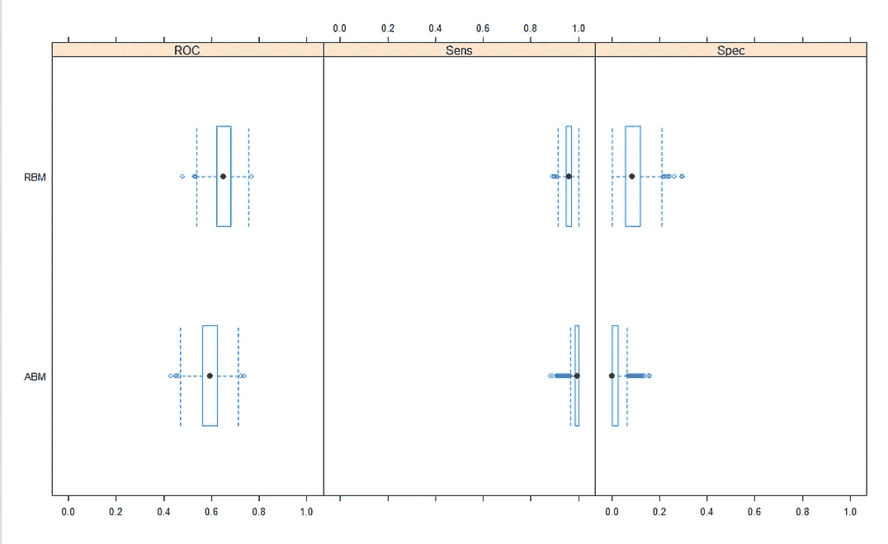

Does not add much and from all of this, I believe that a classifier that can predict when the goal is achieve does not add much. At least not with the data I have. Or perhaps I am just not good at what I do. That is always a possibility.

我将做最后一次迂回，回到估计屠宰时测得的体重，看看我是否能预测到。

```
modeldata<-data%>%
  filter(size=='A')%>%
  filter(sex=='H' | sex=='N')%>%
  dplyr::select(sex,year,month,pesorealBW,lineage,
         vaccine,feed,ranking,day7, day14, day21, day28, cv,
         farmdensity, containerdensity, numberanimals,gmd,tiempocarga, 
         tiempoespera, tiempototal)%>%
  tidyr::drop_na()
trainIndex <- caret::createDataPartition(modeldata$pesorealBW, 
                                         p = .7, 
                                         list = FALSE, 
                                         times = 1)
wideTrain <- modeldata[ trainIndex,];dim(wideTrain)
wideTest  <- modeldata[-trainIndex,];dim(wideTest)fitControl <- caret::trainControl(method='repeatedcv', 
                                  number=10, 
                                  repeats=3, 
                                  search='grid')gridControl <- expand.grid(.mtry = c(sqrt(ncol(wideTest))))
modellist <- list()for (ntree in c(500,1000,1500,2000,2500,3000,3500,4000)){
  set.seed(123)
rbmFit2 <- caret::train(pesorealBW ~ ., 
                        data = wideTrain, 
                        method = "rf",
                        trControl = fitControl,
                        verbose = FALSE, 
                        tuneGrid = gridControl,
                        ntree=ntree)
key <- toString(ntree)
modellist[[key]] <- rbmFit2
}results <- resamples(modellist)
summary(results)
dotplot(results)
```

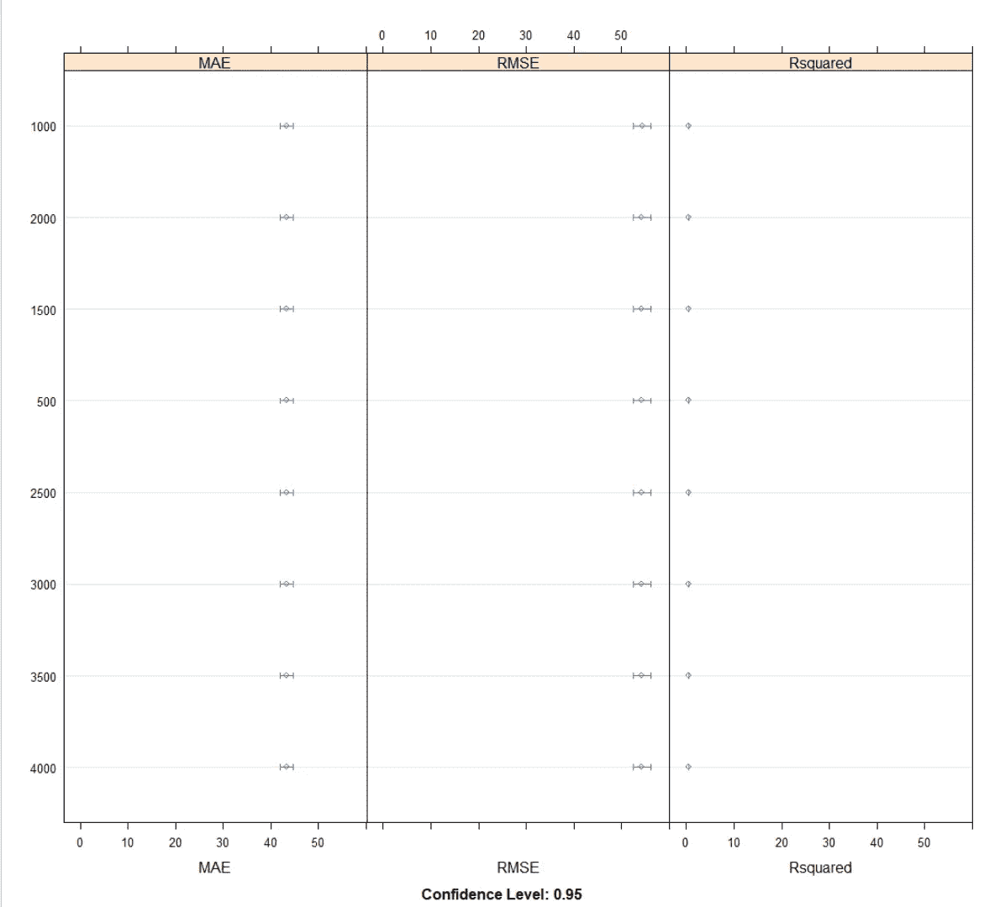

现在我们知道扩展树不会有太多好处，我们可以继续使用基本的随机森林模型。

```
fitControl <- caret::trainControl(method='repeatedcv', 
                                  number=10, 
                                  repeats=3,
                                  allowParallel = TRUE)
gridControl <- expand.grid(.mtry=c(1:15))
rbmFit2 <- caret::train(pesorealBW ~ ., 
                        data = wideTrain, 
                        method = "rf",
                        trControl = fitControl,
                        verbose = FALSE, 
                        tuneGrid = gridControl)summary(rbmFit2)
plot(rbmFit2)
```

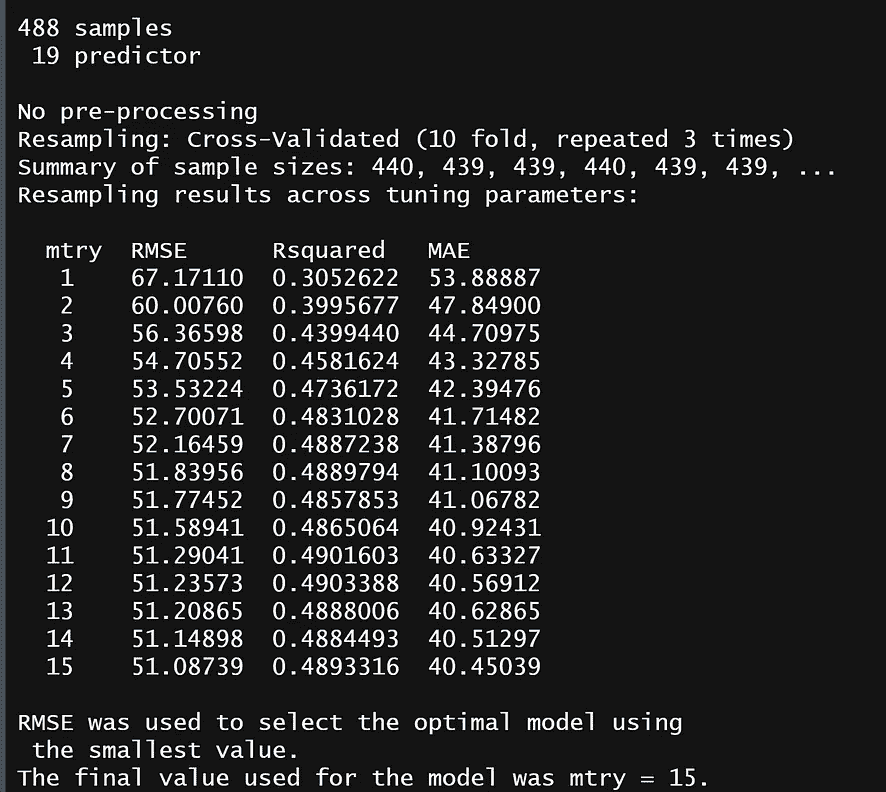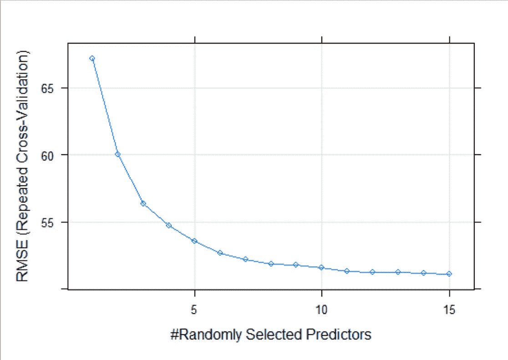

Performance of the model based on the number of predictors completed.

一旦我看到校准图的样子，评估就完成了。

```
wideTest$pred<-predict(rbmFit2, wideTest)
ggplot(wideTest, 
 aes(x=pesorealBW,
 y=pred, 
 col=pesorealBW-pred))+
 geom_point()+
 geom_smooth(fill=”blue”, alpha=0.2)+
 geom_abline(intercept=0, slope=1, lty=2, col=”black”)+
 viridis::scale_color_viridis(option=”magma”)+
 theme_bw()+
 xlim(1400,1800)+
 ylim(1400,1800)+
 labs(x=”Observed bodyweight at slaughter”, 
 y=”Predicted bodyweight at slaugheter”,
 col=”Difference between observed and predicted”)+
 theme(legend.position=”bottom”)
```

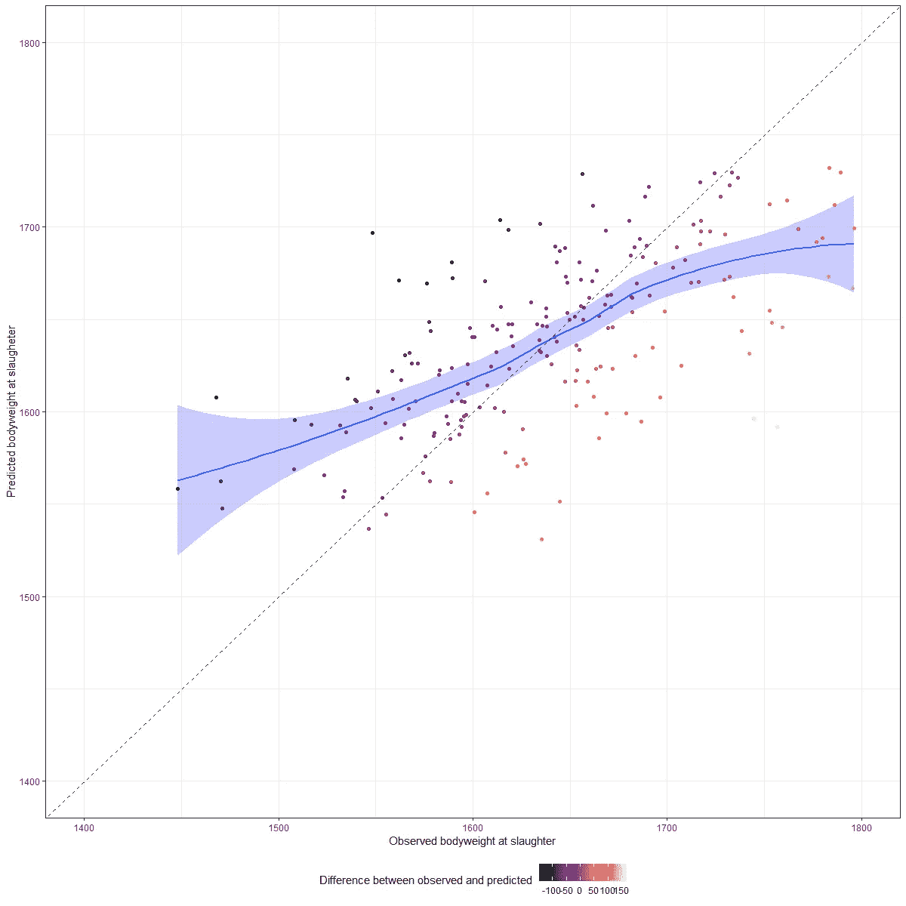

Not too good to be honest. In the middle it is okay, but at the bottom and at the end, the predictions go off.

这就是我现在要离开这个例子的地方。当然，在数据分析方面，我们还可以做得更多。例如，我们可以将预测生长曲线的模型、预测实现目标的模型和预测屠宰场重量的模型结合起来，但目前我认为这是多余的。也许我花时间观察农场和屠宰场之间的距离更好，或者我更深入地研究要素本身，寻找最大限度利用它们的方法。

最后，老实说，我真的相信没有更多的收获，但我可能总是错的。至少，这应该提醒我们，仅仅为了应用机器学习而应用机器学习是不够的。

保重！

[](/mlearning-ai/mlearning-ai-submission-suggestions-b51e2b130bfb) [## Mlearning.ai 提交建议

### 如何成为 Mlearning.ai 上的作家

medium.com](/mlearning-ai/mlearning-ai-submission-suggestions-b51e2b130bfb)