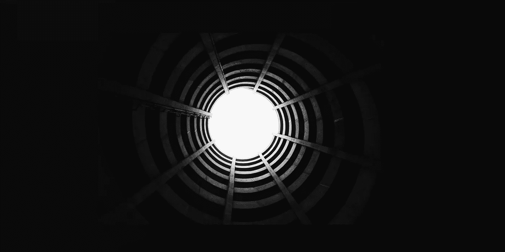

# 长短期记忆网络正在消亡:什么正在取代它？

> 原文：<https://medium.com/mlearning-ai/long-short-term-memory-networks-are-dying-whats-replacing-it-5ff3a99399fe?source=collection_archive---------0----------------------->

Source: [Unsplash](https://unsplash.com/photos/LAmdXNnCM7g)

## LSTM 的兴衰

长短期记忆——LSTM——网络已经成为深度学习的一个主要部分，作为递归神经网络的一个更好的变体而得到推广。随着机器学习研究的加速，方法似乎来来去去越来越快，LSTM 似乎已经开始走出自己的路了。