# 寻找鸡的一致性

> 原文：<https://medium.com/mlearning-ai/looking-for-uniformity-in-chickens-763ca9c18a1e?source=collection_archive---------6----------------------->

## 通过使用混合模型和 R

W 母鸡建模动物大部分时间感兴趣的结果是生长、采食量和饲料转化率。然而，从商业上来说，一批或一群的一致性同样令人感兴趣，如果不是更多的话。这也是很难实现的，因为动物在成长过程中有偏离的趋势。就像人类一样。

因此，我现在向你们展示的不是生长模型，而是我如何试图在一个商业数据集上模拟鸡的一致性。因此，我不能分享数据集，但我会尽可能展示数据的结构。

```
rm(list = ls())#### LIBRARIES ####
library(lme4)
library(ggplot2)
library(rms)
library(plyr)
library(reshape2)
library(boot)
library(sjPlot)
library(sjstats)
library(sjmisc)
library(interval)
library(AICcmodavg)
library(parallel) 
library(gridExtra)
library(coefplot) 
library(coda)      
library(aods3)     
library(plotMCMC) 
library(bbmle)     
library(nlme)
library(merTools)
library(RLRsim) 
library(pbkrtest)
library(multcomp)
library(lsmeans)
library(multcompView)
library(lattice)
library(splines)
library(lmtest)
library(mgcv)
library(gamm4)
library(car)
library(grid)
library(varComp)### DATA MANAGEMENT ####
library(readxl)
Uniformity_P07700_03_NPB70_ <- read_excel("Uniformity P07700-03 NPB70 .xlsx")
Uniformity<-Uniformity_P07700_03_NPB70_
rm(Uniformity_P07700_03_NPB70_)
str(Uniformity)
attach(Uniformity)
Uniformity$TT<-as.factor(Uniformity$TT)
Uniformity$Block<-as.factor(Uniformity$Block)
Uniformity$Room<-as.factor(Uniformity$Room)
Uniformity$BOX<-as.factor(Uniformity$BOX)
length(Uniformity$n)
length(Uniformity$Label)
length(Uniformity$day)
colnames(Uniformity)[7]<-"Time"
colnames(Uniformity)[8]<-"BW"
Uniformity$BW<-as.numeric(gsub(",","",Uniformity$BW ,
                               fixed=TRUE))
Uniformity$BWkg<-Uniformity$BW/1000
head(Uniformity)
```

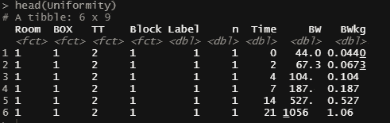

```
Uniformity$number<-rep(1:7,each=7, length.out=2240)TREATmelt<-ddply(Uniformity, c("Time", "TT"), summarise,
                 N = sum(!is.na(BWkg)),
                 Mis = sum(is.na(BWkg)),
                 Mean = round(mean(BWkg, na.rm=T),3),
                 Median = round(median(BWkg, na.rm=T),3),
                 SD = round(sd(BWkg, na.rm=T),3),
                 SE = round(sd(BWkg, na.rm=T) / sqrt(N),5),
                 LCI = round(Mean - (2*SE),3), 
                 HCI = round(Mean + (2*SE),3))UniformityCOMPL<-Uniformity[!is.na(Uniformity$BWkg),]
TREATmelt2<-ddply(UniformityCOMPL, c("Time", "TT"), summarise,
                 N = sum(!is.na(BWkg)),
                 Mis = sum(is.na(BWkg)),
                 Mean = round(mean(BWkg, na.rm=T),3),
                 Median = round(median(BWkg, na.rm=T),3),
                 SD = round(sd(BWkg, na.rm=T),3),
                 SE = round(sd(BWkg, na.rm=T) / sqrt(N),5),
                 LCI = round(Mean - (2*SE),3), 
                 HCI = round(Mean + (2*SE),3),
                 CV=100*(SD/Mean))TREATmelt_BW<-ddply(Uniformity, c("Time", "TT"), summarise,
                 N = sum(!is.na(BW)),
                 Mis = sum(is.na(BW)),
                 Mean = round(mean(BW, na.rm=T),3),
                 Median = round(median(BW, na.rm=T),3),
                 SD = round(sd(BW, na.rm=T),3),
                 SE = round(sd(BW, na.rm=T) / sqrt(N),5),
                 LCI = round(Mean - (2*SE),3), 
                 HCI = round(Mean + (2*SE),3))
BLOCKmelt<-ddply(Uniformity, c("Time", "Block"), summarise,
                 N = sum(!is.na(BWkg)),
                 Mis = sum(is.na(BWkg)),
                 Mean = round(mean(BWkg, na.rm=T),3),
                 Median = round(median(BWkg, na.rm=T),3),
                 SD = round(sd(BWkg, na.rm=T),3),
                 SE = round(sd(BWkg, na.rm=T) / sqrt(N),5),
                 LCI = round(Mean - (2*SE),3), 
                 HCI = round(Mean + (2*SE),3))
BOXmelt<-ddply(Uniformity, c("Time", "BOX"), summarise,
                 N = sum(!is.na(BWkg)),
                 Mis = sum(is.na(BWkg)),
                 Mean = round(mean(BWkg, na.rm=T),3),
                 Median = round(median(BWkg, na.rm=T),3),
                 SD = round(sd(BWkg, na.rm=T),3),
                 SE = round(sd(BWkg, na.rm=T) / sqrt(N),5),
                 LCI = round(Mean - (2*SE),3), 
                 HCI = round(Mean + (2*SE),3))
```

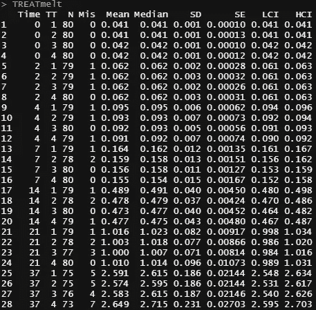

让我们更深入地看看缺失的数据。上面的图并没有暗示大量的遗漏，但是它们会影响均匀度的估计。

```
Z<-!is.na(Uniformity_wide[,7:13])
Uniformity_wide[ ,"nr_asses"]<- as.numeric(rowSums(Z))last.observed <- function (x, time = NULL) {
  if (is.null (time)) {
    time <- 1:length (x)}
  dropout <- sapply (1:length(x),
                     function (i, y) all(y[i:length(y)]), is.na (x))
  ifelse (any (dropout), time[which(dropout)[1]-1], time[length(x)])}
otime<-c(0,02,04,07,14,21,37)
Uniformity_wide$last.observed <- apply(Uniformity_wide[,7:13], 1, last.observed)
table(Uniformity_wide$last.observed)
Uniformity_wide$miss<-ifelse(Uniformity_wide$last.observed==7&Uniformity_wide$nr_asses==7, "NoMissing",                             ifelse(Uniformity_wide$last.observed<7&Uniformity_wide$nr_asses<7,"Mono", "NonMono"))
Uniformity_wide <- dcast(Uniformity, Room+BOX+TT+Block+Label+n ~ Time, value.var="BW")
Uniformity<-merge(Uniformity, Uniformity_wide[,6])
colnames(Uniformity)[11]<-"Missing"
Uniformity$Missing<-as.factor(Uniformity$Missing)MISSINGmelt<-ddply(Uniformity, c("Time", "Missing"), summarise,
               N = sum(!is.na(BWkg)),
               Mis = sum(is.na(BWkg)),
               Mean = round(mean(BWkg, na.rm=T),3),
               Median = round(median(BWkg, na.rm=T),3),
               SD = round(sd(BWkg, na.rm=T),3),
               SE = round(sd(BWkg, na.rm=T) / sqrt(N),5),
               LCI = round(Mean - (2*SE),3), 
               HCI = round(Mean + (2*SE),3))Uniformity$number<-NULL
```

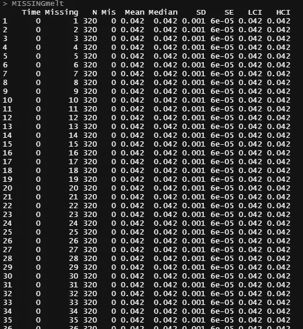

Not a lot of missing.

```
theme_set(theme_bw())
myx<-scale_x_continuous(breaks=c(0,2,4,7,21,37))
myy<-scale_y_continuous(breaks = seq(0, 3, by = 1))
ggplot(UniformityCOMPL, aes(x=Time, y=BWkg, colour=TT, group=UniformityCOMPL$n))+
  myx+
  myy+
  geom_line(colour="grey80")+
  stat_summary(aes(group=TT),fun.y="mean", geom="line",lwd=1.5)theme_set(theme_bw())
myx<-scale_x_continuous(breaks=c(0,2,4,7,21,37))
myy<-scale_y_continuous(breaks = seq(35, 3500, by = 25))
ggplot(subset(TREATmelt_BW,Time%in%c(0,2,4,7)), aes(x=Time, y=Mean, colour=TT))+
  myx+
  myy+
  geom_line(lwd=1)+
  # geom_ribbon(aes(ymin=LCI, ymax=HCI, fill=TT), alpha=0.1)+
  theme(panel.grid.major = element_blank(), panel.grid.minor = element_blank())+
  labs(title = "Growth over Time between Treatments", y="BW (gram)", x="Time")
```

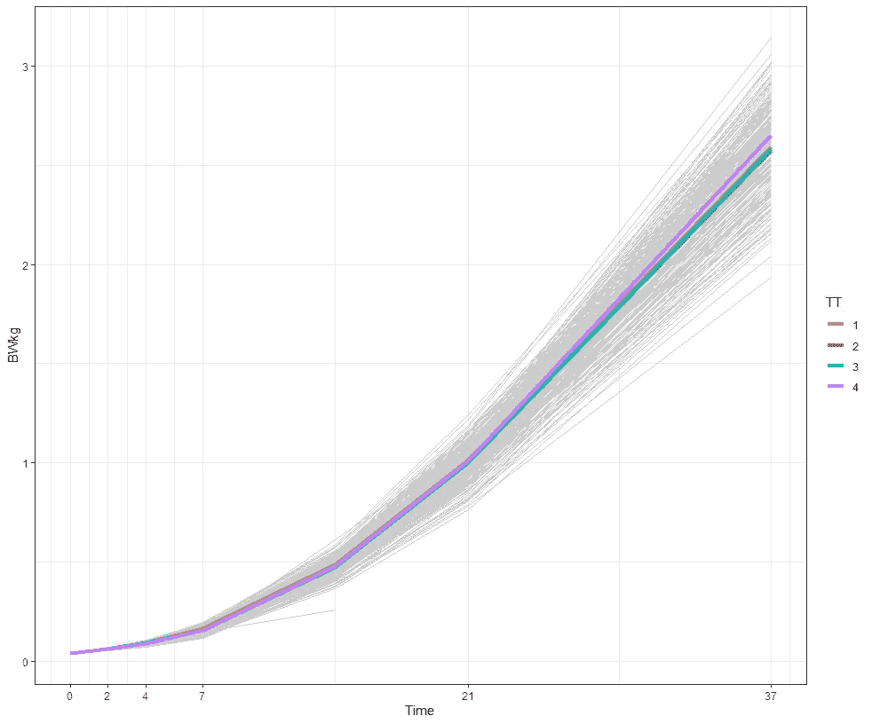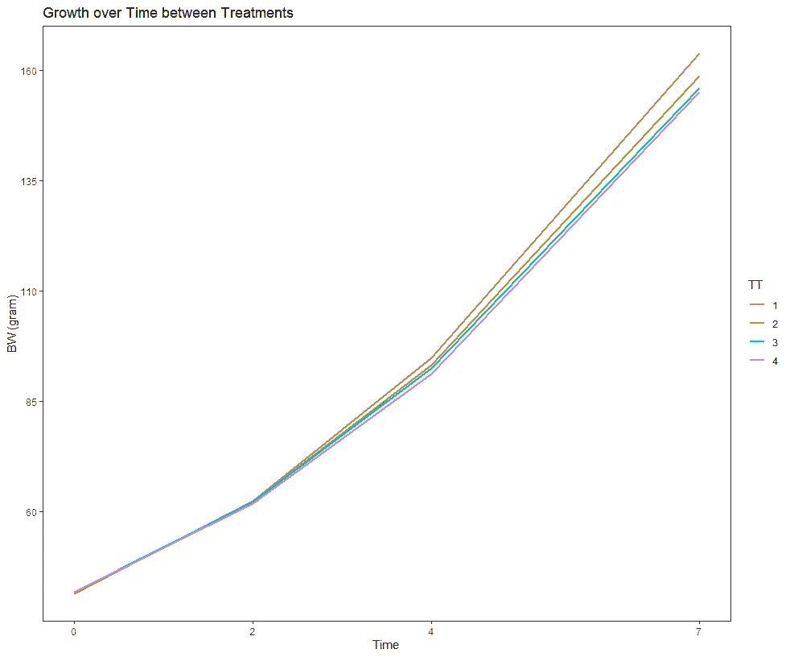

Graphs showing how the chickens diverge in their bodyweight (BW) as they grow. This is a real problem to uniformity but also to be expected. Variance is often exponetntially related to growth. Next to that, a plot showing the mean treatment values in the beginning.

```
theme_set(theme_bw())
myx<-scale_x_continuous(breaks=c(0,2,4,7,21,37))
myy<-scale_y_continuous(breaks = seq(35, 3500, by = 25))
ggplot(UniformityCOMPL, aes(x=Time, y=BW, colour=TT))+
  geom_boxplot()+
  facet_wrap(~Time, ncol=3, scales = "free")
```

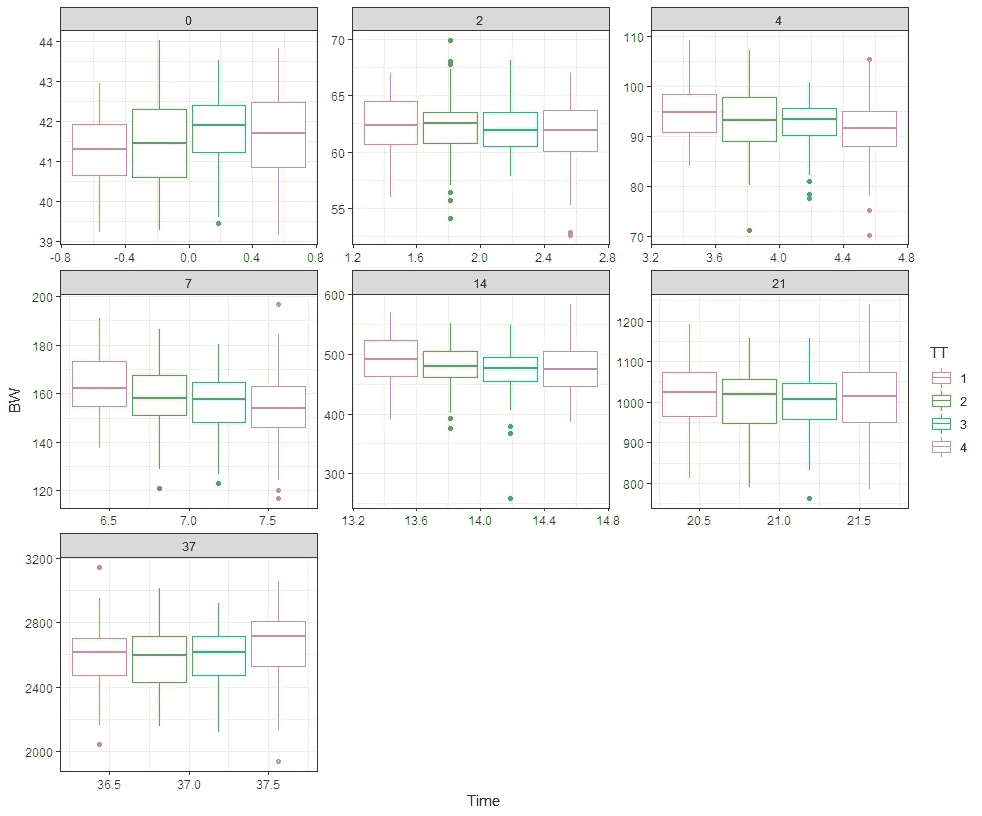

Treatment comparisons and uniformity across time-points.

```
theme_set(theme_bw())
myx<-scale_x_continuous(breaks=c(0,2,4,7,21,37))
myy<-scale_y_continuous(breaks = seq(0, 3, by = 0.1))
ggplot(BLOCKmelt, aes(x=Time, y=Mean, colour=Block))+
  myx+
  myy+
  geom_line(lwd=1)+
  geom_ribbon(aes(ymin=LCI, ymax=HCI, fill=Block), alpha=0.1)
```

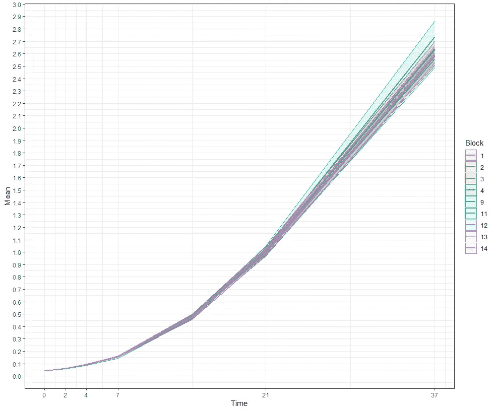

Across blocks

```
theme_set(theme_bw())
myx<-scale_x_continuous(breaks=c(0,2,4,7,21,37))
myy<-scale_y_continuous(breaks = seq(0, 3, by = 0.1))
ggplot(BOXmelt, aes(x=Time, y=Mean, colour=BOX))+
  myx+
  myy+
  geom_line(lwd=1)+
  geom_ribbon(aes(ymin=LCI, ymax=HCI, fill=BOX), alpha=0.1)
```

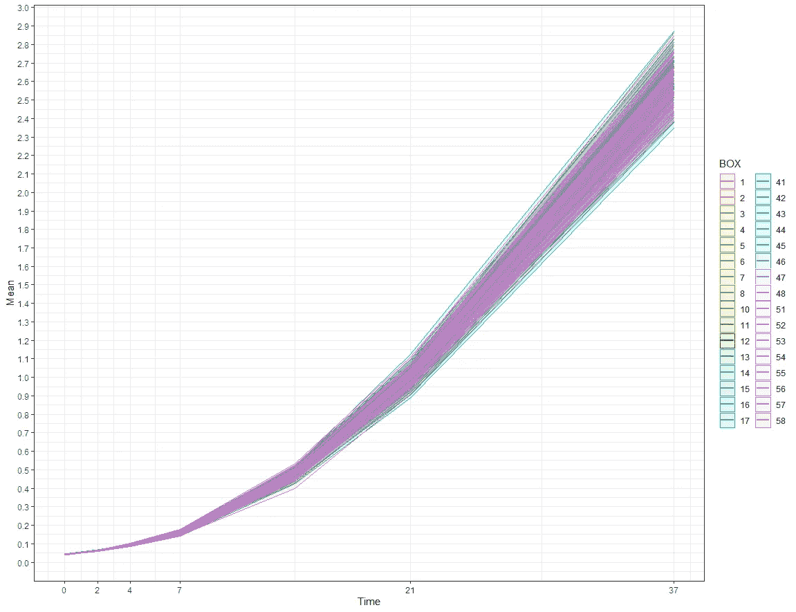

Across pens or here BOX

```
theme_set(theme_bw())
myx<-scale_x_continuous(breaks=c(0,2,4,7,21,37))
myy<-scale_y_continuous(breaks = seq(0, 3, by = 0.1))
ggplot(MISSINGmelt, aes(x=Time, y=Mean, colour=Missing))+
  myx+
  myy+
  geom_line(lwd=1) + 
  theme(legend.position="none")
```

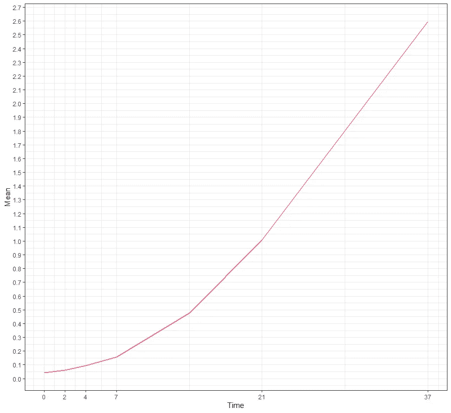

And the mean number of missing across time. Nothing to really worry about.

```
xyplot(BWkg~Time|n, data=Uniformity,
       panel = function(x, y, ...) {
         panel.grid()
         panel.xyplot(x, y)
         panel.lmline(x, y, lty = 2, col="black")
         panel.loess(x, y, lty = 2, col="red")
         panel.abline(0, 0)
       } )xyplot(BWkg~Time|TT, data=Uniformity,
       panel = function(x, y, ...) {
         panel.grid()
         panel.xyplot(x, y)
         panel.lmline(x, y, lty = 2, col="black")
         panel.loess(x, y, lty = 2, col="red")
         panel.abline(0, 0)
       } )xyplot(BWkg~Time|BOX, data=Uniformity,
       panel = function(x, y, ...) {
         panel.grid()
         panel.xyplot(x, y)
         panel.lmline(x, y, lty = 2, col="black")
         panel.loess(x, y, lty = 2, col="red")
         panel.abline(0, 0)
       } )xyplot(BWkg~Time|Missing, data=Uniformity,
       panel = function(x, y, ...) {
         panel.grid()
         panel.xyplot(x, y)
         panel.lmline(x, y, lty = 2, col="black")
         panel.loess(x, y, lty = 2, col="red")
         panel.abline(0, 0)
       } )
```

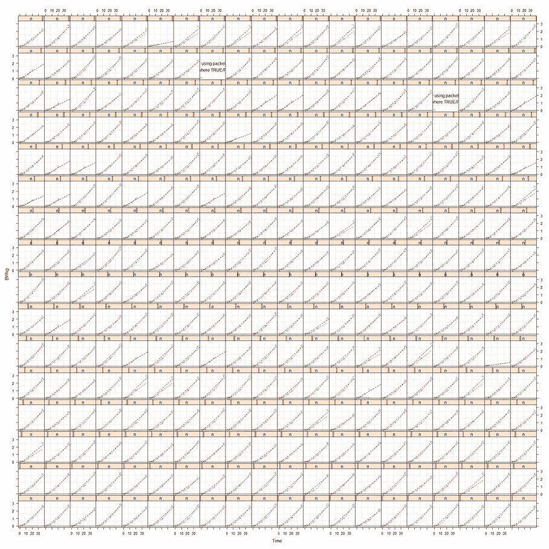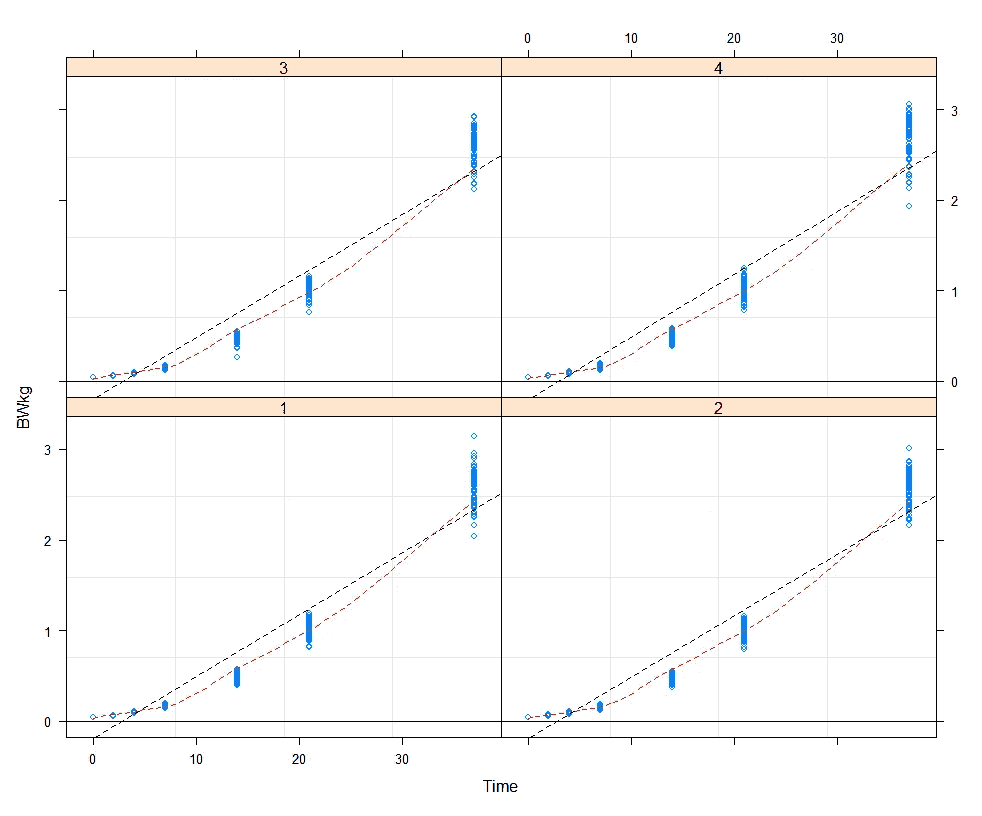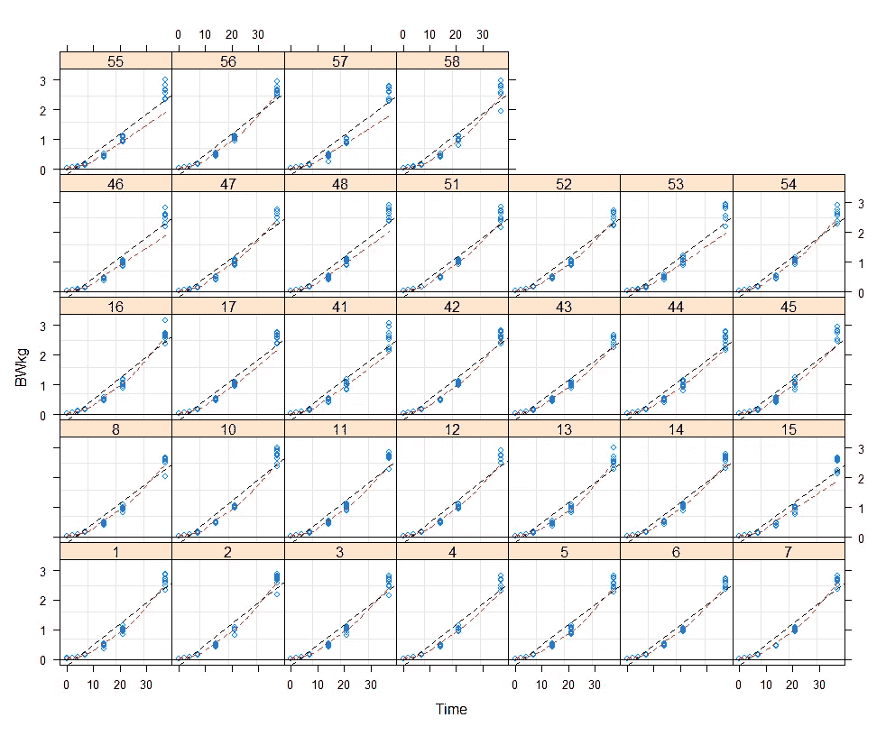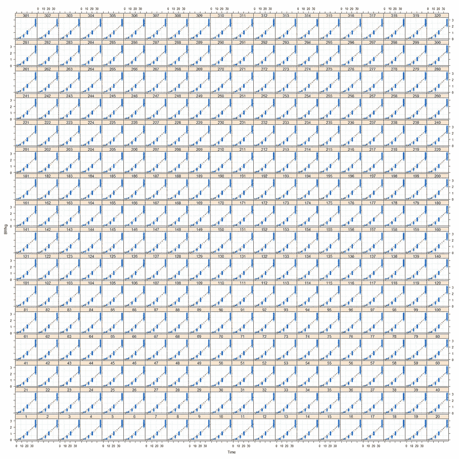

Plots looking for differences in animals, blocks, boxes, treatments.

```
histogram(~UniformityCOMPL$BW|UniformityCOMPL$Time, breaks=20,scales=list(relation="free")) # data looks mostly normal
```

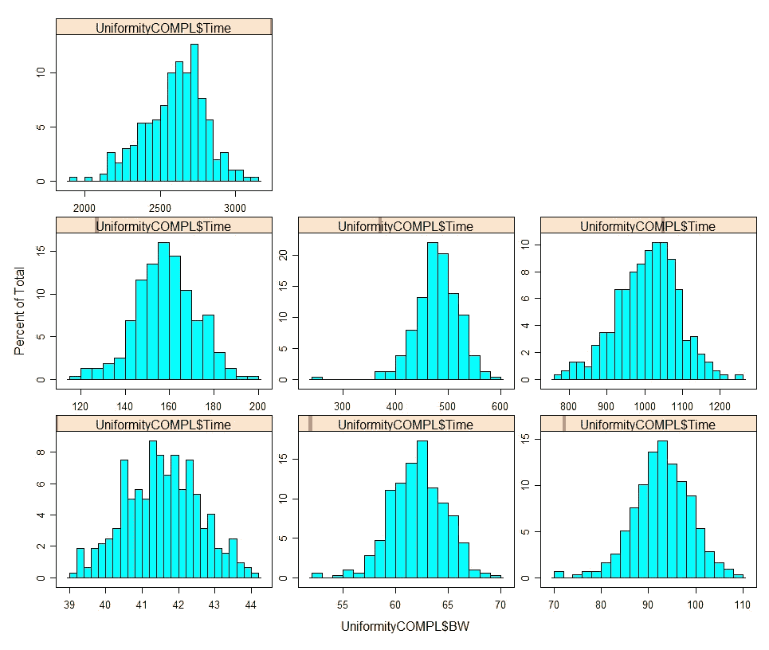

Uniformity check of BW per time. The scales are different, so the variances does increase as weight increases, but the structure is the same. No hint at a [mixed distribution.](https://blog.devgenius.io/mixture-component-zero-inflated-and-hurdle-models-44c5e6fe5d7f)

处理随时间推移而增加的方差或一般意义上的方差的最佳方法之一是应用转换。这里，我使用 Box-Cox。

```
fit.lm<-lm(BWkg~ns(Time,3)*TT+Room, data=UniformityCOMPL)
bc1<-boxcox(fit.lm,lambda=seq(-2,2,by=0.1),plotit=T)
which.max(bc1$y)
LV<-bc1[1]$x[as.numeric(which.max(bc1$y))]
LV # -0.1818182 -> better log transform
p1<-powerTransform(BWkg~ns(Time,3)*TT+Room, data=UniformityCOMPL)
summary(p1)
```

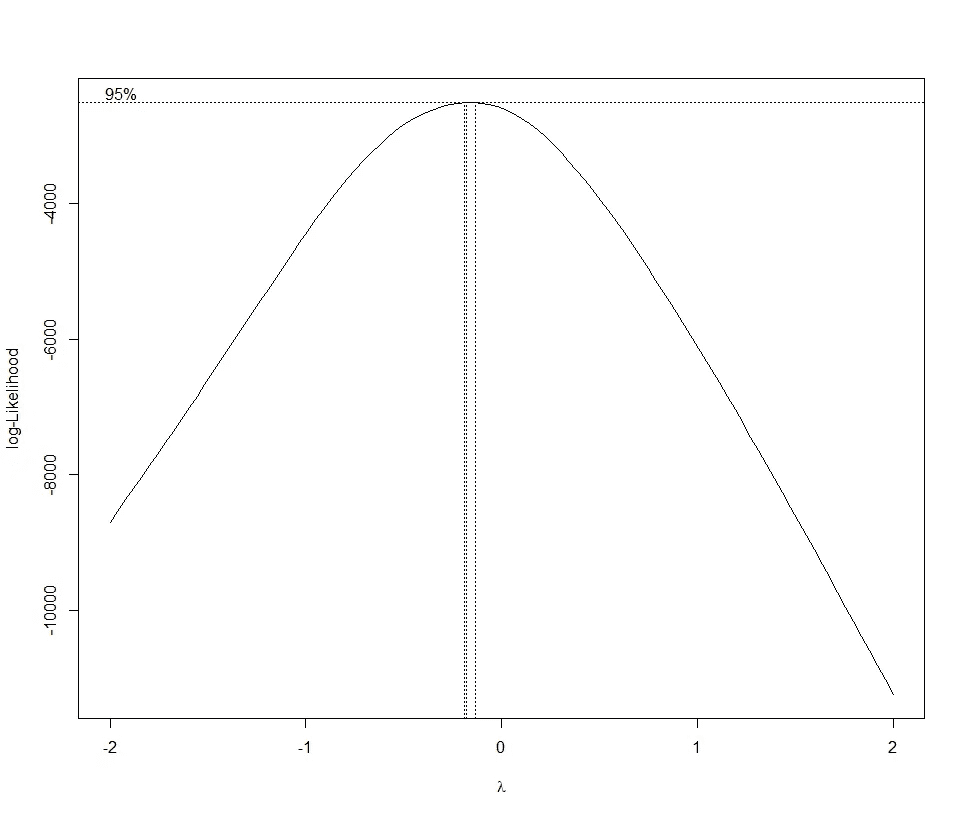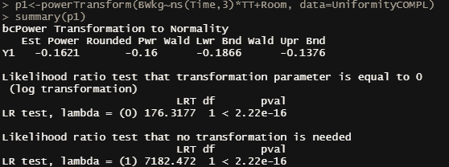

```
symbox(~BW,data=UniformityCOMPL) 
```

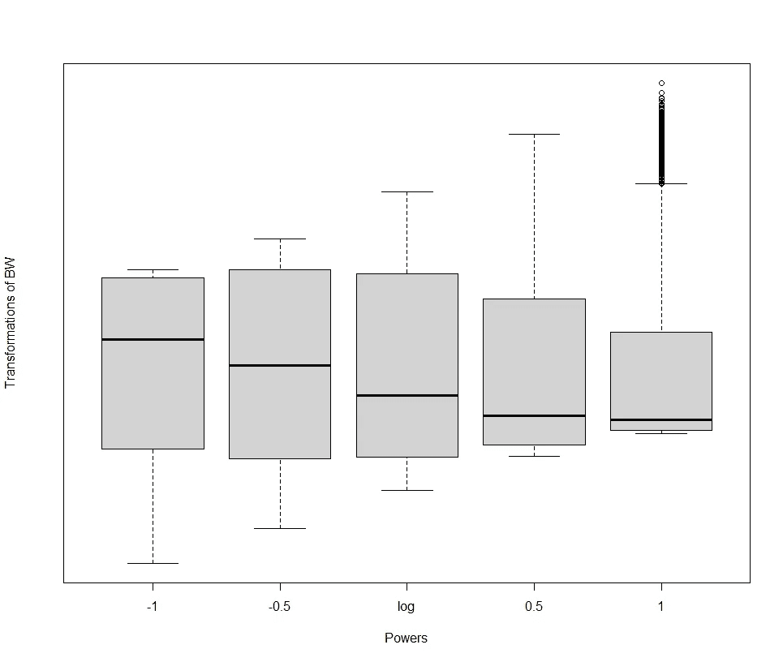

```
histogram(~sqrt(UniformityCOMPL$BW)|UniformityCOMPL$Time, breaks=20,scales=list(relation="free")) 
histogram(~log(UniformityCOMPL$BW)|UniformityCOMPL$Time, breaks=20,scales=list(relation="free"))
```

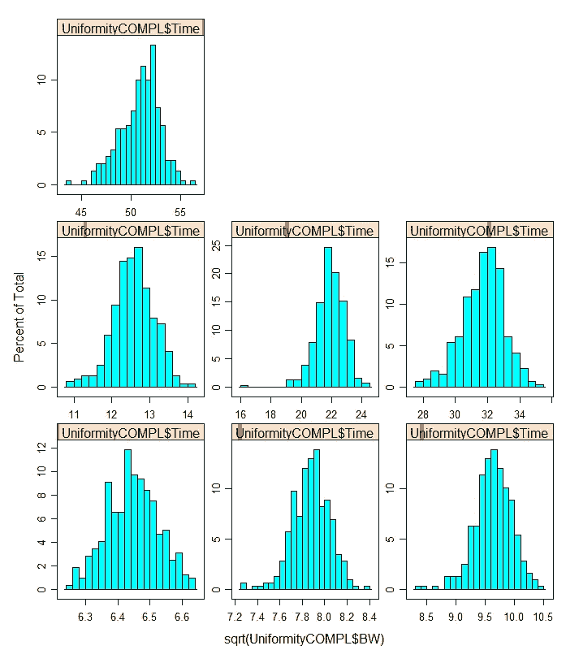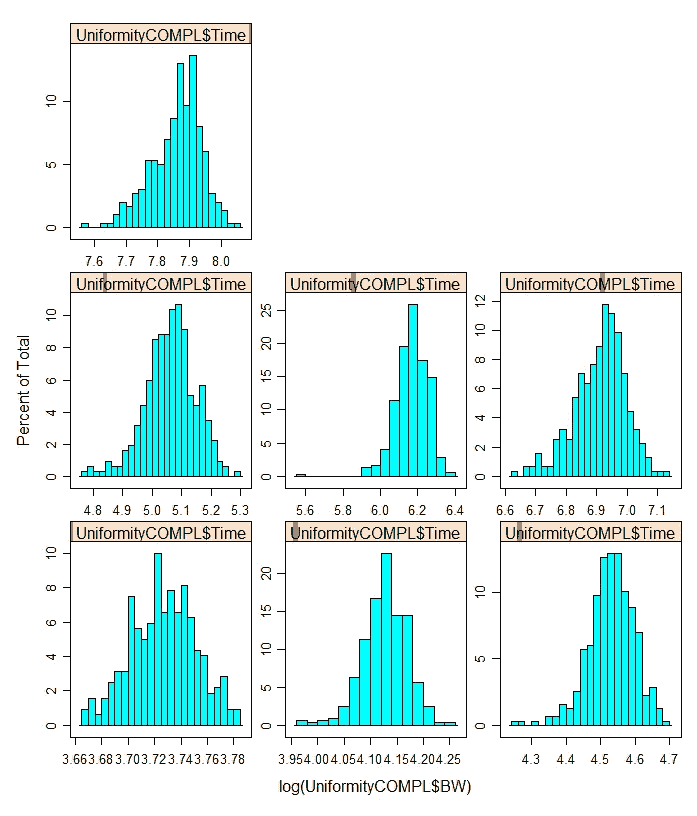

Log transformation seems best, which makes sense. To counteract an exponential you can best employ a log. Multiplication will become addition, and division becomes subtraction.

```
bwplot(~sqrt(UniformityCOMPL$BW)|UniformityCOMPL$Time, breaks=20,scales=list(relation="free")) 
bwplot(UniformityCOMPL$Time~log(UniformityCOMPL$BW)) 
bwplot(UniformityCOMPL$Time~sqrt(UniformityCOMPL$BW))
```

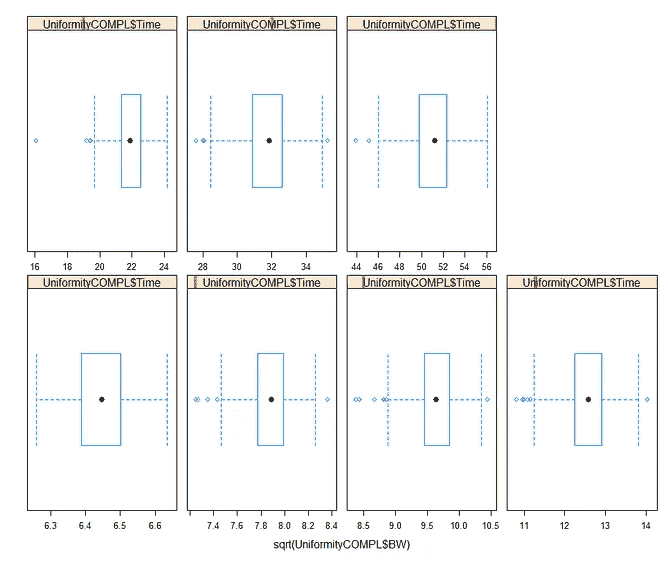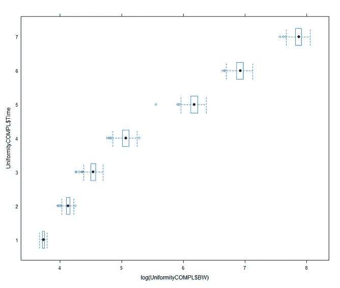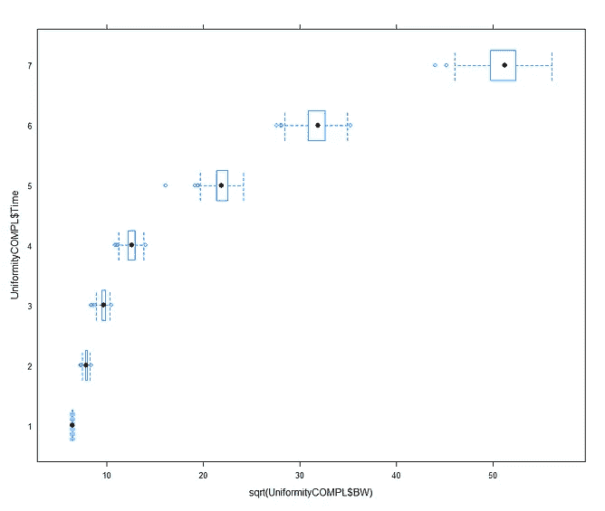

The middle graph, the log transform, shows almost equal variance on the raw data.

```
fit.lm2<-lm(BWkg~ns(Time,3)*TT+Room+as.factor(n), data=UniformityCOMPL) 
bc2<-boxcox(fit.lm2,lambda=seq(-2,2,by=0.1),plotit=T)
bc2[1]$x[as.numeric(which.max(bc2$y))] # -0.1414141
```


Also in this model the log transform is best.

```
fitbc<-lm((BWkg^LV-1/LV)~ns(Time,2)*TT+Room, data=UniformityCOMPL) # TRANSFORMATION SEEMS TO DEAL WITH IT ALL 
fitlog<-lm(log(BWkg)~ns(Time,3)*TT+Room, data=UniformityCOMPL)
fitsqrt<-lm(sqrt(BWkg)~ns(Time,3)*TT+Room, data=UniformityCOMPL)
fitreciproc<-lm(BWkg/1~ns(Time,3)*TT+Room, data=UniformityCOMPL)par(mfrow=c(3,4))
plot(fit.lm, which=2, main="BW")
plot(fit.lm, which=1, main="BW")
plot(fitbc, which=2, main="BW_bc") 
plot(fitbc, which=1, main="BW_bc") 
plot(fitlog, which=2, main="BW_log") 
plot(fitlog, which=1, main="BW_log") 
plot(fitsqrt, which=2, main="BW_sqrt")
plot(fitsqrt, which=1, main="BW_sqrt")
plot(fitreciproc, which=2, main="BW_sqrt")
plot(fitreciproc, which=1, main="BW_sqrt")
```


This time, however, the exact Box-Cox seems to be the best. So lambda is not zero, but -0.1414141\. This does make a difference it seems.

```
## BACKTRANSFORMATION when Lambda is negative
# when lambda = -0.50 or reciprocal square root
par(mfrow=c(2,1))
attach(UniformityCOMPL)
y<-1/(BWkg^(0.5)) # when lambda = -0.50 or reciprocal square root
x=1/y^(1/0.5) # back transformation involves exponential which is the opposite of square root 
plot(x-BWkg) ## gives the same results, difference is practically zero 
## When Lambda is -0.1
UniformityCOMPL$BWkg_bc<-1/(BWkg^(0.1))
x=1/UniformityCOMPL$BWkg_bc^(1/0.1)
plot(x-BWkg)
summary(x-BWkg)
```

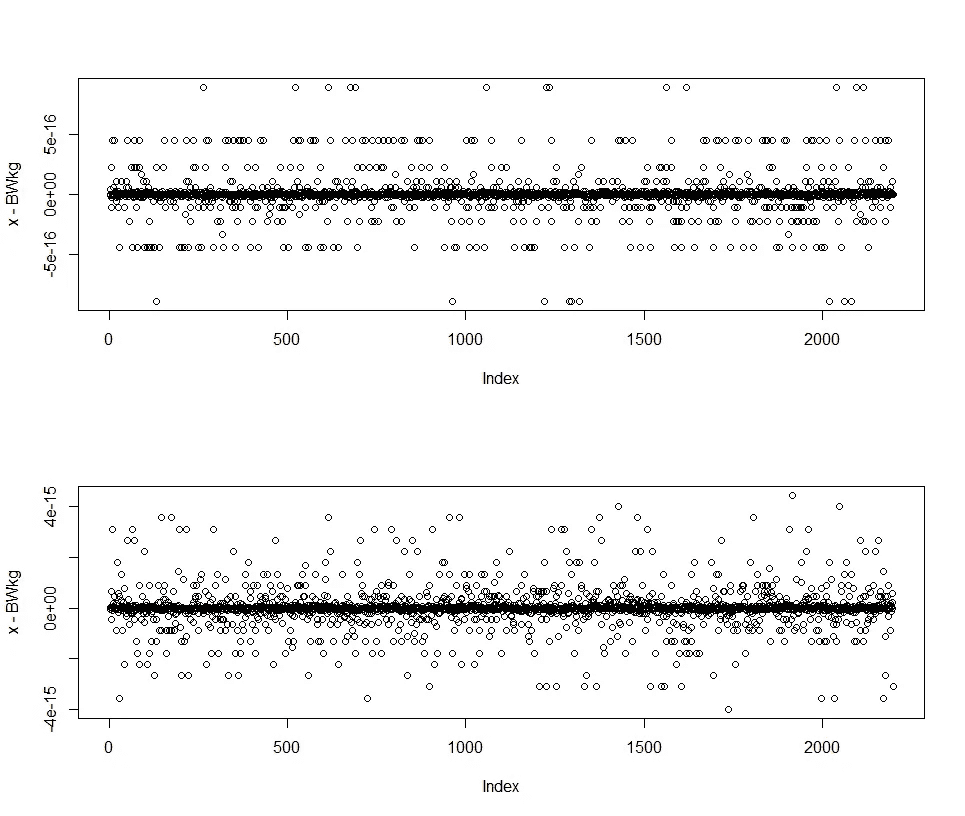

```
#### MODEL BUILDING #####
#### LM ####
fitlm<-lm(BWkg~Time*TT, data=Uniformity)
fitlm2<-lm(BWkg~ns(Time,2)*TT, data=Uniformity)
fitlm3<-lm(BWkg~ns(Time,3)*TT, data=Uniformity) # spline with 2 knots does nothing extra, so leave it at ns,2
fitlm4<-lm(BWkg~ns(Time,2)*TT+as.factor(n)-1, data=Uniformity)#### LMER ####
fit.lmer<-lmer(BWkg~ns(Time,2)+TT+Room+(ns(Time,2)|BOX/n), data=UniformityCOMPL)
fit2.lmer<-lmer(BWkg~ns(Time,2)+TT+Room+(1|Block)+(0+ns(Time,2)|BOX/n), data=UniformityCOMPL)
fit3.lmer<-lmer(BWkg~ns(Time,2)*TT+Room+(ns(Time,2)|BOX/n), data=UniformityCOMPL)
fit4.lmer<-lmer(BWkg~ns(Time,2)*TT+Room+(1|Block)+(0+ns(Time,2)|BOX/n), data=UniformityCOMPL)
#fit5.lmer<-lmer(BWkg~ns(Time,2)*TT+Room+(ns(Time,2)|Block/BOX/n), data=UniformityCOMPL) # convergence issues 
#fit6.lmer<-lmer(BWkg~ns(Time,2)*TT+Room+(ns(Time,2)|Block/BOX/n), data=UniformityCOMPL, control = lmerControl(optimizer="Nelder_Mead"))  # convergence issues 
#fit7.lmer<-lmer(BWkg~ns(Time,2)*TT+Room+(ns(Time,2)|Block)+ (ns(Time,2)|BOX/n),data=UniformityCOMPL) # convergence issues 
fit8.lmer<-lmer(BWkg~ns(Time,2)*TT+Room+(1|BOX)+(0+ns(Time,2)|n),data=UniformityCOMPL) 
fit9.lmer<-lmer(BWkg~ns(Time,2)+TT+(ns(Time,2)|BOX/n),data=UniformityCOMPL)### See if interaction effect is worth including 
KRSumFun <- function(object, objectDrop, ...) {
  krnames <- c("ndf","ddf","Fstat","p.value","F.scaling")
  r <- if (missing(objectDrop)) {
    setNames(rep(NA,length(krnames)),krnames)
  } else {
    krtest <- KRmodcomp(object,objectDrop)
    unlist(krtest$stats[krnames])
  }
  attr(r,"method") <- c("Kenward-Roger via pbkrtest package")
  r
}
drop1(fit3.lmer,test="user",sumFun=KRSumFun)
### Compare models via AIC
AICctab(fit.lmer, 
        fit2.lmer, 
        fit3.lmer, 
        fit4.lmer,
        fit8.lmer,
        fit9.lmer) 
```

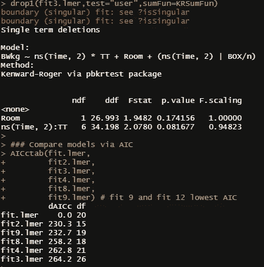

**fit.lmer** has thelowest AIC

```
final.model2<-lmer(log(BWkg)~1+ns(Time,2)+TT+(ns(Time,2)|BOX/n),data=UniformityCOMPL)
fit15.lmer<-lmer(log(BWkg)~ns(Time,3)*TT+Room+(ns(Time,3)|Block/BOX/n),data=UniformityCOMPL) 
fit16.lmer<-lmer(log(BWkg)~ns(Time,4)*TT+Room+(ns(Time,4)|Block/BOX/n),data=UniformityCOMPL) 
anova(final.model2, fit15.lmer, fit16.lmer) # fit15.lmer better model
```

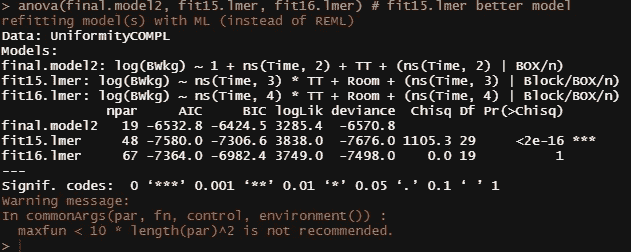

**fit15.lmer** fits best

```
UniformityCOMPL$BWlog<-log(UniformityCOMPL$BW)
fit.lme<-lme(BWlog~ns(Time,3)*TT+Room,
             random=~ns(Time,3)|Block/BOX/n,
             data=UniformityCOMPL,
             correlation = corCAR1(),
             method="REML",
             control=lmeControl(opt="optim",maxIter=1000000, msMaxIter = 10000))
summary(fit.lme)final.model<-lmer(log(BW)~ns(Time,3)*TT+Room+(ns(Time,3)|Block/BOX/n),data=UniformityCOMPL) 
summary(final.model)
```

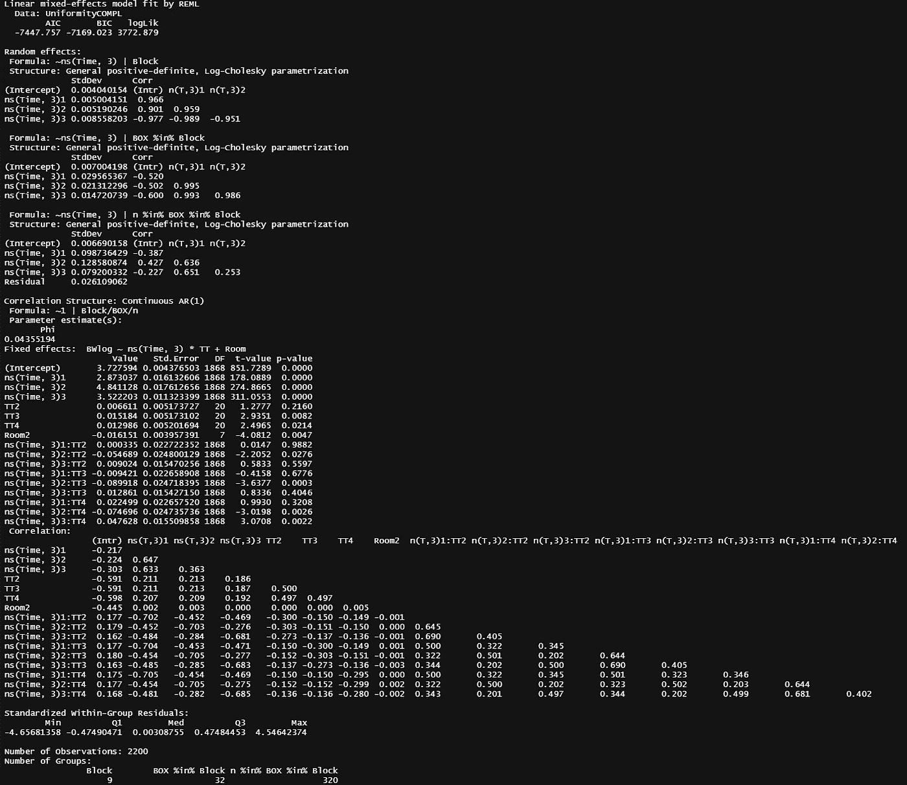

What a model!!!! Perhaps not the best of models to have, although I am sure it will impress some people. In a research setting, such a model can be O.K., but if you create a prediction model like this you are bound to run into problems when a new dataset emerges.

```
final.model<-lmer(log(BW)~ns(Time,3)*TT+Room+(Time|Block/BOX/n),data=UniformityCOMPL) 
summary(final.model)
fit.gls<-gls(BW~TT*Time,correlation=corAR1(form=~Time|BOX/n), data=UniformityCOMPL)
UniformityCOMPL$fit.gls<-fitted(fit.gls)
UniformityCOMPL$fit<-exp(fitted(final.model))ggplot(UniformityCOMPL, aes(x=Time, group=n))+
  geom_point(aes(y=BW))+geom_line(aes(y=BW))+
  geom_point(aes(y=fit), color="red", alpha=0.5)+geom_line(aes(y=fit),color="red", alpha=0.5)+
  geom_point(aes(y=fit.gls),color="blue", alpha=0.5)+geom_line(aes(y=fit.gls),color="blue", alpha=0.5)+
  facet_wrap(~BOX)+
  theme_bw()
```

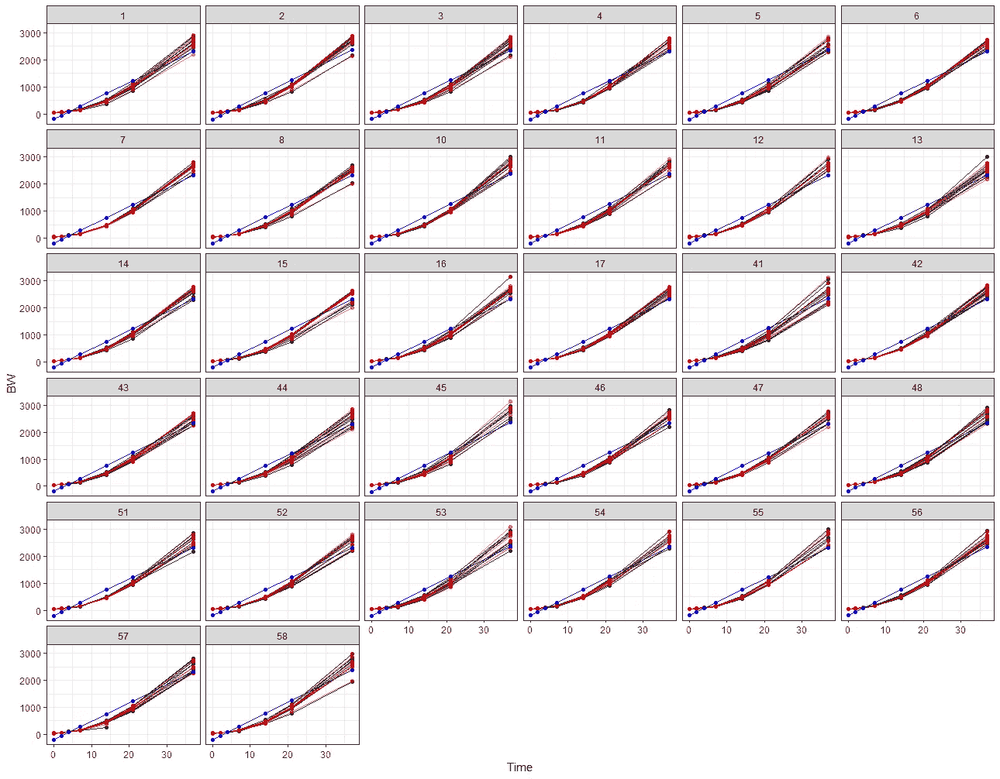

The log model with the spline effect of time fits better then a liner model using an autocorrelation matrix to model the error term.

为了突出如何搜索有影响的观察，我使用了 **fit8.1.lmer** ，因为独立的随机效应，影响。我似乎不能做嵌套的随机效果。

```
inf.N<-influence.ME::influence(fit8.lmer, group="n") 
plot(inf.N, which="cook", cutoff=4/length(unique(UniformityCOMPL$n))) 
sum(cooks.distance(inf.N, sort=TRUE)- 4/length(unique(UniformityCOMPL$n))>0)
```


A couple but nothing to be worried about.

```
inf.BOX<-influence.ME::influence(fit8.lmer, group="BOX") 
plot(inf.BOX, which="cook", cutoff=4/length(unique(UniformityCOMPL$BOX))) 
sum(cooks.distance(inf.BOX, sort=TRUE)
4/length(unique(UniformityCOMPL$BOX))>0) 
```

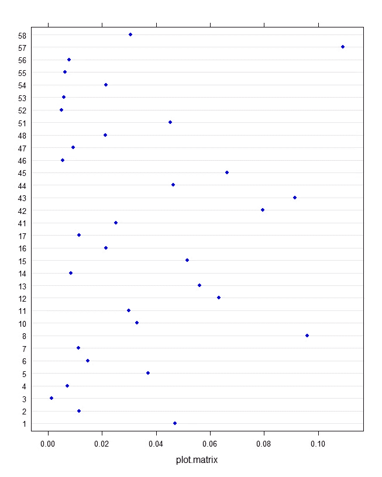

Looking good.

现在， **lme** 软件包的伟大之处，尤其是在寻找一致性时，是寻找方差-协方差矩阵，它能最好地帮助你对相关误差建模。您需要这样一个矩阵的事实已经告诉您，一致性可能是一个问题。

为了评估异质性，您可以拟合异质性误差项协方差矩阵。如果这个模型比没有模型的预测数据更好，那么这就是异质性的一个暗示。

让我们来看看伦敦金属交易所能提供什么。

```
fit8.1.lme<-lme(BWkg~1+ns(Time,2)+TT,
                data=UniformityCOMPL,
                random=~ns(Time,2)|BOX/n,
                method="ML",
                control=lmeControl(opt="optim",maxIter=1000000, msMaxIter = 10000))### Autocorrelation --> dealing with issues of independence
## Correlogram not realy suited for unequal time distances
par(mfrow=c(3,2))
plot(acf(resid(fit8.1.lme)))
plot(pacf(resid(fit8.1.lme))) 
E1<-residuals(fit8.1.lme, type="normalized")
plot(E1) # actually looks quite ok
```

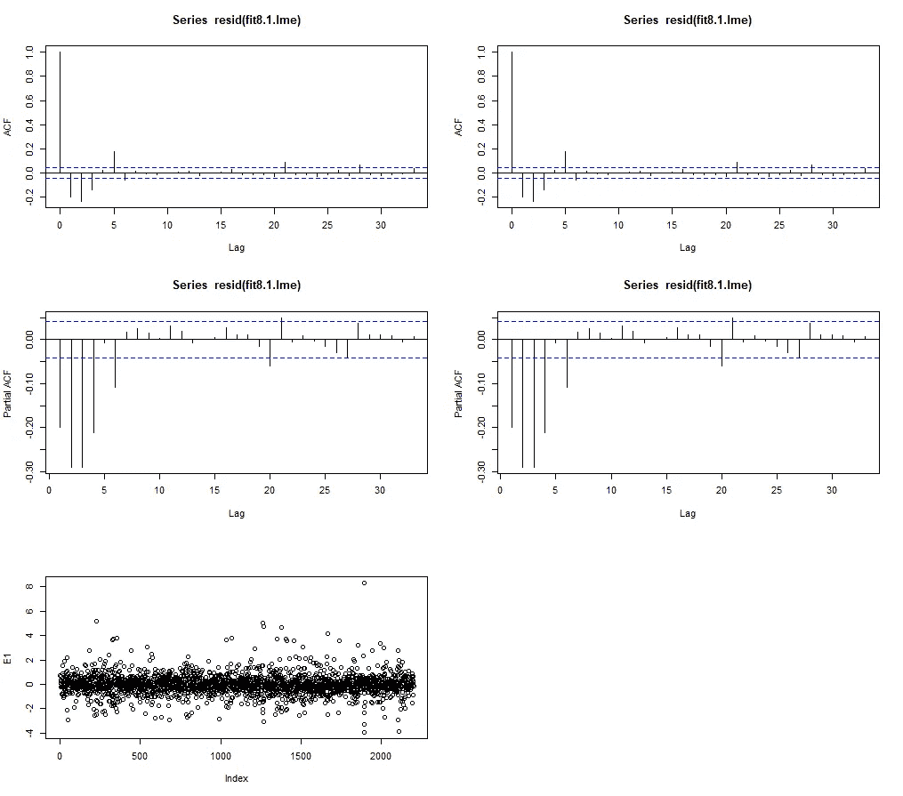

There for sure is a need to model the autocorrelation present in the data.

```
fit8.lme.cor<-lme(BWkg~1+ns(Time,2)+TT,
                     data=UniformityCOMPL,
                     random=~ns(Time,2)|BOX/n,
                     correlation=corCAR1(form=~Time),
                     method="REML",
                     control=lmeControl(opt="optim",maxIter=100000000, msMaxIter = 1000000))
summary(fit8.lme.cor) # phi = 0.8843306 
AICctab(fit8.1.lme, fit8.lme.cor) 
par(mfrow=c(2,1))
acf(residuals(fit8.lme.cor)) # almost gone
acf(residuals(fit8.1.lme))
```

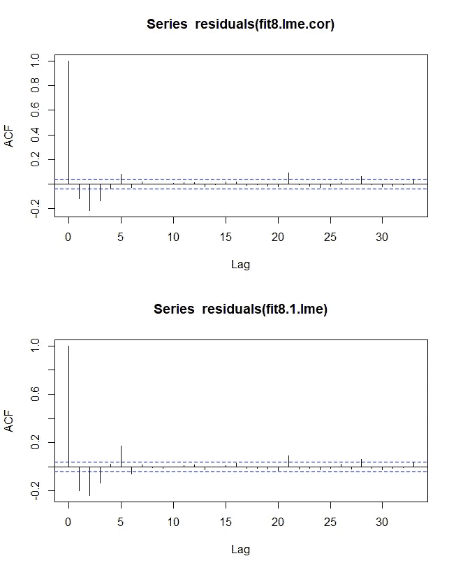

Including a covariance matrix on the error does decrease the autocorrelations, as you might expect.

```
# corCompSymm   compound symmetry 
# corSymm       general 
# corAR1        autoregressive of order 1 
# corCAR1       continuous-time AR(1) 
# corARMA       autoregressive-moving average 
# corExp        exponential 
# corGaus       Gaussian 
# corLin        linear 
# corRatio      rational quadratic 
# corSpher      sphericalfit8.gls<-gls(BWkg~ns(Time,2)+TT, data=UniformityCOMPL)
vario<-Variogram(fit8.gls,form=~Time, robust=TRUE, resType="pearson", maxDist = 37) # now it does work 
plot(vario, smooth=TRUE) # quite some autocorrelation
```

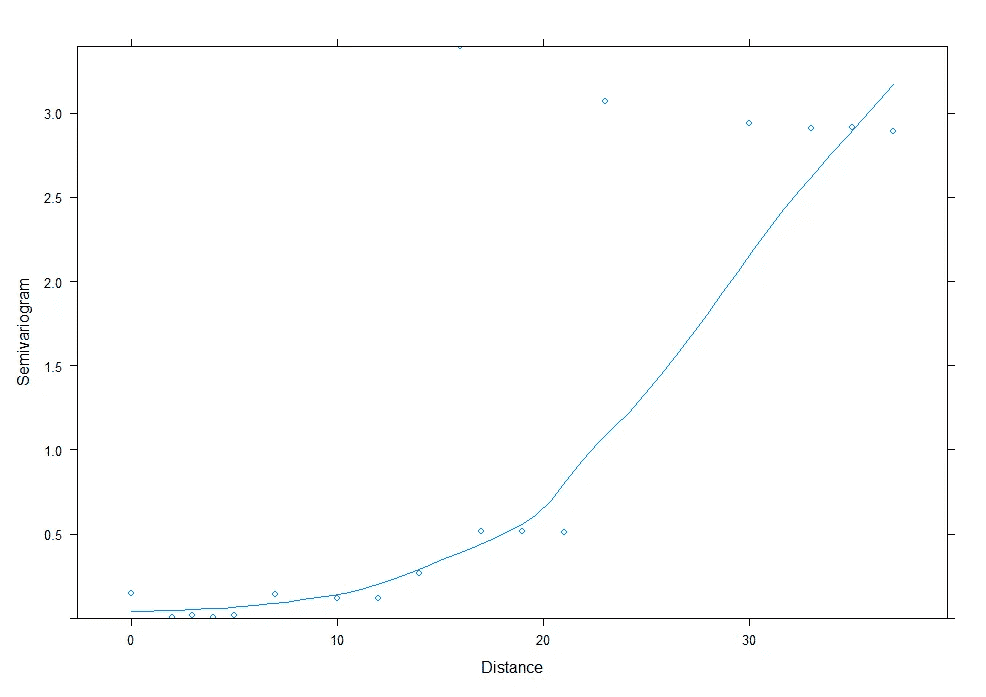

```
fit.corAR1<-gls(BWkg~ns(Time,2)+TT, correlation=corAR1(0.8, form=~Time|BOX/n), data=UniformityCOMPL)
fit.corARMA<-gls(BWkg~ns(Time,2)+TT, correlation=corARMA(c(0.8, 0.2), form=~Time|BOX/n, p=1,q=1), data=UniformityCOMPL)
fit.corCAR1<-gls(BWkg~ns(Time,2)+TT,correlation=corCAR1(form=~Time|BOX/n), data=UniformityCOMPL)
fit.corCompSymm<-gls(BWkg~ns(Time,2)+TT,correlation=corCompSymm(form=~Time), data=UniformityCOMPL)
fit.corSymm<-gls(BWkg~ns(Time,2)+TT,correlation=corSymm(form=~1|BOX/n), data=UniformityCOMPL)AIC(fit8.gls, fit.corAR1, fit.corARMA, fit.corCAR1, fit.corCompSymm,fit.corSymm)
```

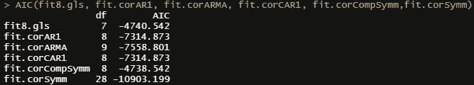

**fit.corSymm** is best.

```
plot(fit.corSymm) 
```

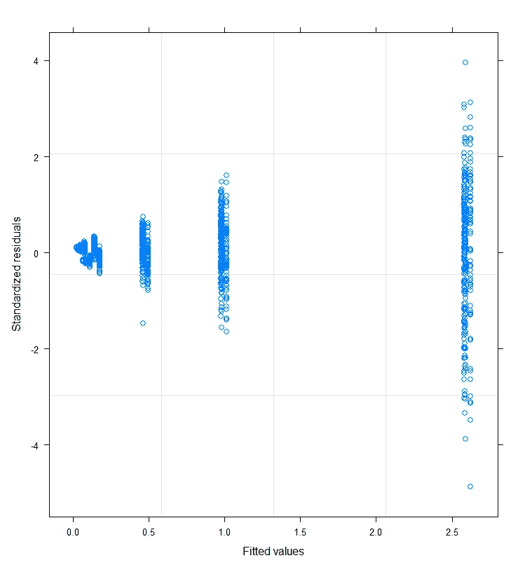

Residuals are horrible — heterogenous as can be

```
rmse(fit8.gls); 
rmse(fit.corAR1); 
rmse(fit.corARMA); 
rmse(fit.corCAR1); 
rmse(fit.corCompSymm); 
rmse(fit.corSymm);
rmse(fit8.lme.cor)
```

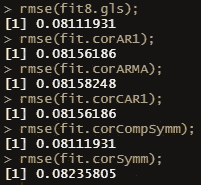

And it does not have the lowest RMSE. But then again, they are all pretty close so take your pick.

```
par(mfrow=c(3,2))
qqp(resid(fit8.gls), main="fit8.gls") 
qqp(resid(fit.corAR1),main="fit.corAR1 ")
qqp(resid(fit.corARMA), main="fit.corARMA")
qqp(resid(fit.corCAR1 ), main="fit.corCAR1 ") 
qqp(resid(fit.corCompSymm), main="fit.corCompSymm")
qqp(resid(fit.corSymm), main="fit.corSymm")
```

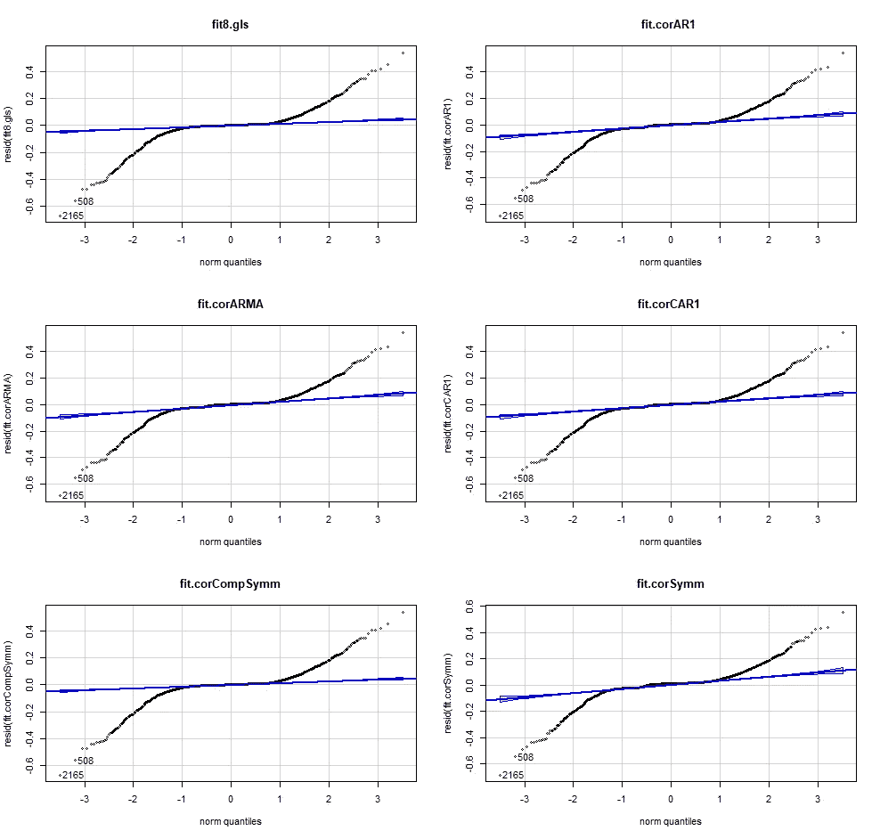

All these transformations do not lead to a satisfactory solution → no changes in normality of residuals

```
par(mfrow=c(3,2))
plot(fitted(fit8.gls), resid(fit8.gls, type="normalized"),main="fit8.2.gls");abline(h=c(-2,0,2), lty=2, col="red")  
plot(fitted(fit.corAR1), resid(fit.corAR1, type="normalized"),main="fit.corAR1");abline(h=c(-2,0,2), lty=2, col="red")  
plot(fitted(fit.corARMA), resid(fit.corARMA, type="normalized"),main="fit.corARMA");abline(h=c(-2,0,2), lty=2, col="red")  
plot(fitted(fit.corCAR1), resid(fit.corCAR1, type="normalized"),main="fit.corCAR1");abline(h=c(-2,0,2), lty=2, col="red")  
plot(fitted(fit.corCompSymm), resid(fit.corCompSymm, type="normalized"),main="fit.corCompSymm");abline(h=c(-2,0,2), lty=2, col="red")  
plot(fitted(fit.corSymm), resid(fit.corSymm, type="normalized"),main="fit.corSymm");abline(h=c(-2,0,2), lty=2, col="red") 
plot(fit.corSymm)
```

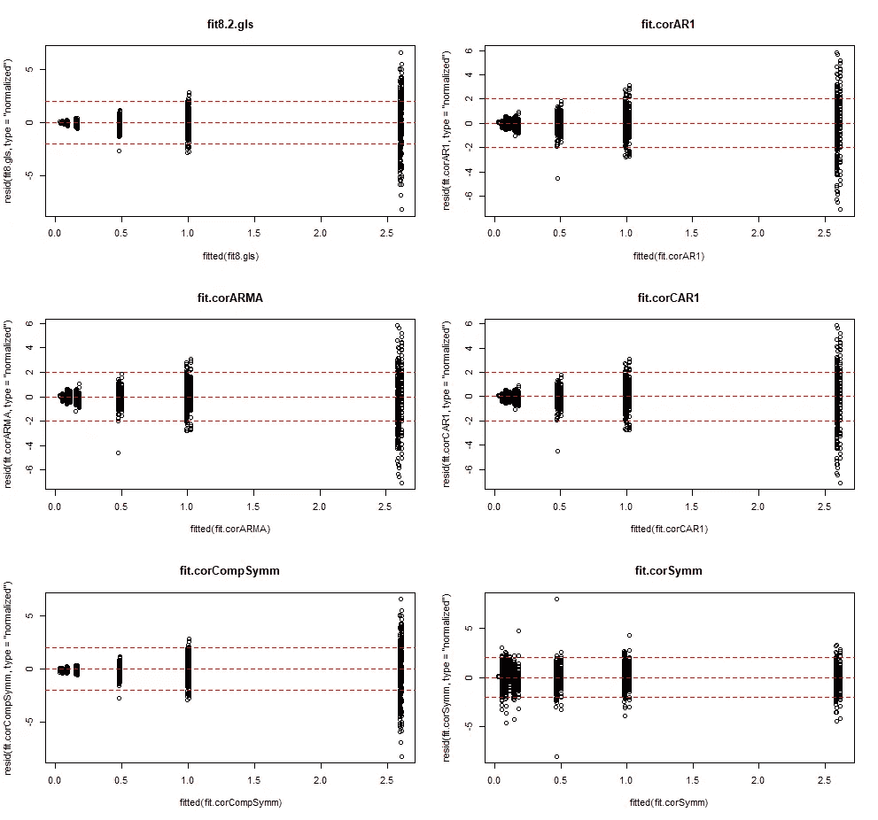

But the residuals do seem to be within the standard boundaries. So, now it makes sense why **fit.corSymm** was the best model to chose from.

```
xyplot(BWkg~Time|n, data = UniformityCOMPL, 
       strip = FALSE, aspect = "xy", pch = 16, cex=0.2, grid = TRUE,
       panel = function(x, y, ..., fit, subscripts) {
         panel.grid()
         panel.xyplot(x, y)
         panel.lmline(x, y, lty = 2, col="black")
         ypred<-fitted(fit.corAR1)[subscripts]
         panel.lines(x, ypred, lty = 3, col = "red")
         ypred2<-fitted(fit.corARMA)[subscripts]
         panel.lines(x, ypred2, lty = 4, col = "blue")
         ypred3<-fitted(fit.corCAR1)[subscripts]
         panel.lines(x, ypred3, lty = 5, col = "green")
         ypred4<-fitted(fit.corCompSymm)[subscripts]
         panel.lines(x, ypred4, lty = 6, col = "orange")
         ypred5<-fitted(fit.corSymm)[subscripts]
         panel.lines(x, ypred5, lty = 7, col = "pink")
         panel.abline(0, 0)
       } )
```

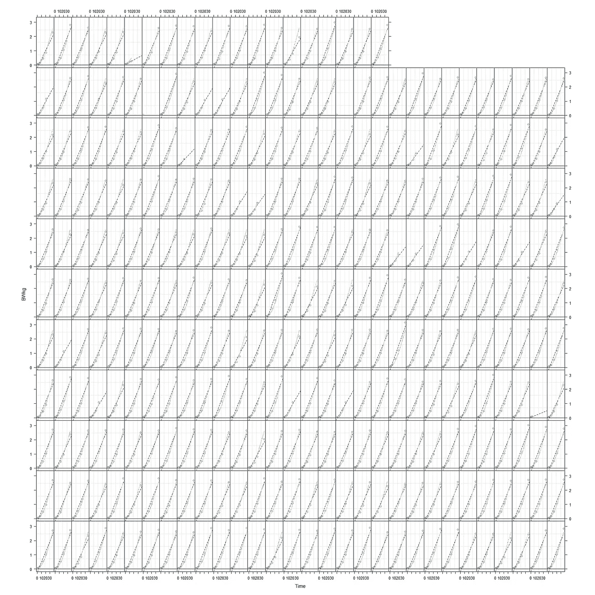

XYplot showing the fit of the models for each chick included in the study.

让我们继续讨论更复杂的协方差矩阵。

```
fit.corSpher<-gls(BWkg~ns(Time,2)+TT,correlation=corSpher(form=~Time|BOX/n), data=UniformityCOMPL)
fit.corSpatial<-gls(BWkg~ns(Time,2)+TT,correlation=corSpatial(form=~Time|BOX/n), data=UniformityCOMPL)
fit.corRatio<-gls(BWkg~ns(Time,2)+TT,correlation=corRatio(form=~Time|BOX/n), data=UniformityCOMPL)
fit.corExp<-gls(BWkg~ns(Time,2)+TT,correlation=corExp(form=~Time|BOX/n, nugget=TRUE), data=UniformityCOMPL)
fit.corGaus<-gls(BWkg~ns(Time,2)+TT,correlation=corGaus(form=~Time|BOX/n), data=UniformityCOMPL)### Homogeneity of Variance
vfIdent<-varIdent(form=~1|as.factor(Time))
vfPower<-varPower(form=~Time|BOX)
vfExp<-varExp(form=~Time|BOX)
vfExp2<-varExp(form=~Time)
vfConstPower<-(form=~Time|BOX)
vfComb<-varComb()fit_nlme_varIdent<-lme(BWkg~ns(Time,2)+TT, # There were 29 warnings 
                      data=UniformityCOMPL,
                      random=~ns(Time,2)|BOX/n,
                      weights = vfIdent,
                      method="REML",
                      control=lmeControl(opt="optim", maxIter=1000000, msMaxIter = 10000))
fit_nlme_varExp<-lme(BWkg~ns(Time,2)+TT, # There were 50 or more warnings (use warnings() to see the first 50)
                     random=~ns(Time,2)|BOX/n,
                     weights=vfExp,
                     method="REML",
                     data=UniformityCOMPL,
                     control=lmeControl(opt="optim", maxIter=1000000, msMaxIter = 10000))par(mfrow=c(3,1))
qqp(resid(fit8.lmer), main="fit8.lmer") 
qqp(resid(fit_nlme_varIdent),main="fit_nlme_varIdent")
qqp(resid(fit_nlme_varExp), main="fit_nlme_varExp")
```

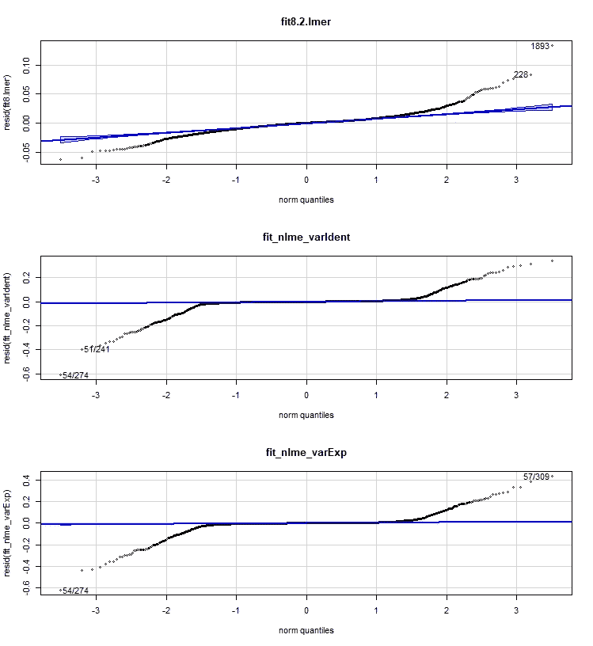

It seems the lmer fit is the best which is kind of funny since no covariance matrix on the error is included in thet model. The rest has some very heavy tails.

```
par(mfrow=c(3,1))
plot(fitted(fit8.1.lme), resid(fit8.1.lme, type="normalized"),main="fit8.1.lme"); abline(h=c(-2,0,2), lty=2, col="red") 
plot(fitted(fit_nlme_varIdent), resid(fit_nlme_varIdent, type="normalized"),main="fit_nlme_varIdent"); abline(h=c(-2,0,2), lty=2, col="red") 
plot(fitted(fit_nlme_varExp), resid(fit_nlme_varExp, type="normalized"),main="fit_nlme_varExp"); abline(h=c(-2,0,2), lty=2, col="red")
```

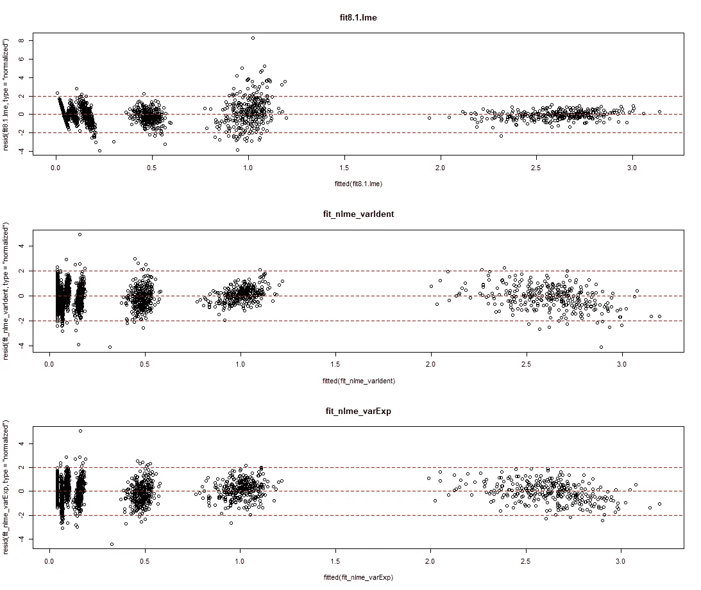

But Ilike the residuals from the **lme** models much more than the **lmer** model. The difference we are seeing is probably due to the **lmer** having a more heavy random effect included whilst the **lme** models have covariance matrices on the error.

```
xyplot(BWkg~Time|n, data = UniformityCOMPL, 
       strip = FALSE, aspect = "xy", pch = 16, cex=0.2, grid = TRUE,
       panel = function(x, y, ..., fit, subscripts) {
         panel.grid()
         panel.xyplot(x, y)
         panel.lmline(x, y, lty = 2, col="black")
         ypred<-fitted(fit8.1.lme)[subscripts]
         panel.lines(x, ypred, col = "red")
         ypred2<-fitted(fit_nlme_varIdent)[subscripts]
         panel.lines(x, ypred2, col = "blue")
         ypred3<-fitted(fit_nlme_varExp)[subscripts] # predict the worse
         panel.lines(x, ypred3, col = "green")
         panel.abline(0, 0)
       } )
```

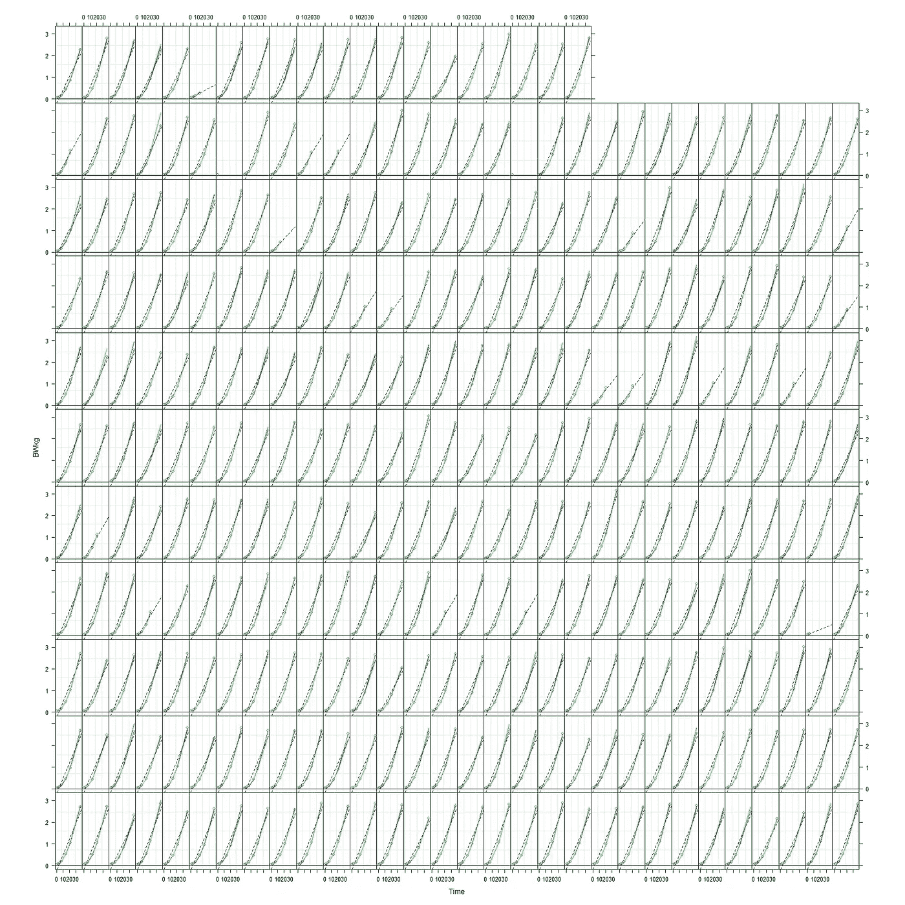

And the prediction on the individual animals coming from the three lme models —**fit8.1.lm**, **fit_nlme_varIdent** and **fit_nlme_varExp**.

```
fit.corSymm.vfExp2<-gls(BWkg~ns(Time,2)+TT,
                 weights=vfExp2,
                 correlation=corSymm(form=~1|BOX/n), 
                 data=UniformityCOMPL)anova(fit.corSymm, fit.corSymm.vfExp2)
```

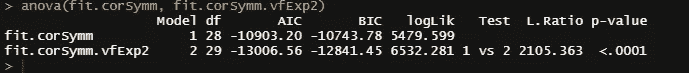

```
plot(fit.corSymm.vfExp2) 
qqnorm(resid(fit.corSymm.vfExp2)) 
```

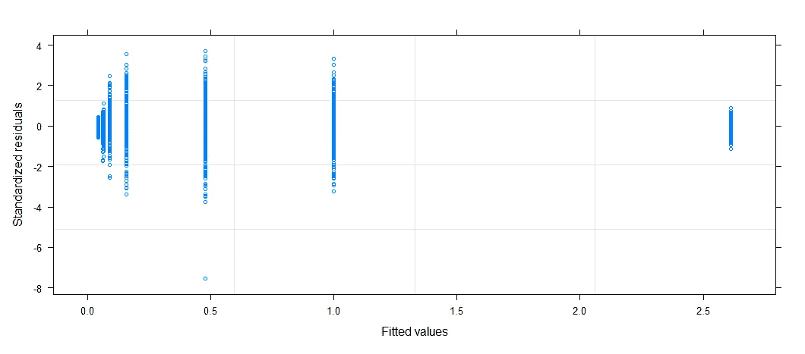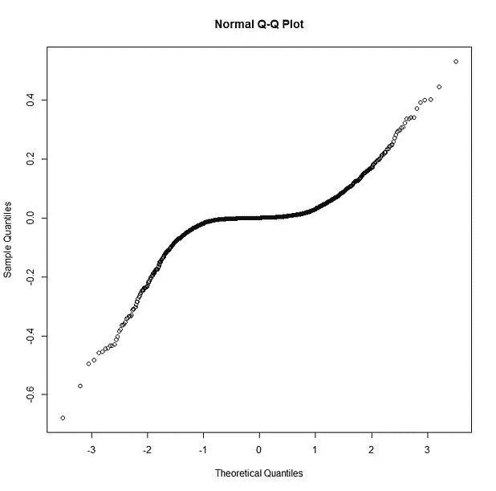

Not really good.

```
AIC(fit.corSymm, fit.corSymm.vfExp2)
```

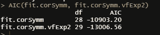

Although that model is preferred. It makes you wonder about the usefulness of such information metrics.

如果你想更仔细地看看这种模型下的矩阵，看看吧。我刚拍了一张超大型矩阵的照片。像这样的协方差是异质的，因为我希望它对于盒子里的动物是不同的( *BOX/n* )。可能是过度杀戮。当然过度拟合，但无论如何预测模型不是我的意图。

```
cs1<-corSymm(form=~1|BOX/n)
cs1CorSymm <- Initialize(cs1, data = UniformityCOMPL)
cs1CorSymm
corMatrix(cs1CorSymm )
```

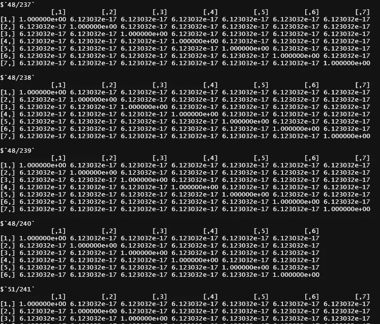

```
ar1<-corCAR1(form=~Time|BOX/n)
ar1<-Initialize(ar1, data = UniformityCOMPL)
ar1 # phi=0.2
```

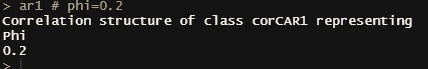

```
ARMA1<-corARMA(c(0.8, 0.2), form=~Time|BOX/n, p=1,q=1)
ARMA1<-Initialize(ARMA1, data = UniformityCOMPL)
corMatrix(ARMA1)
```

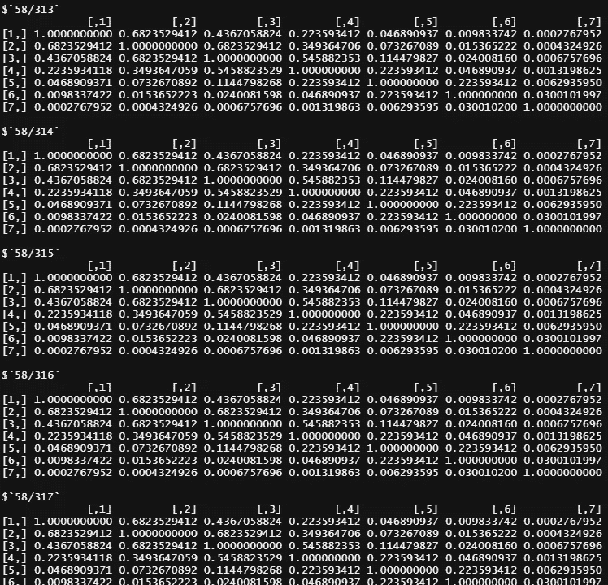

也许我应该选择伽玛模型，而不是高斯模型。Gamma 模型在建模方差方面非常出色，因为它们有一个零边界，并且在给定正确参数值的情况下，将大部分分布放在接近该数字的顶部。

```
fit8.2.glmer<-glmer(BWkg~ns(Time,2)+TT+
                      (ns(Time,2)|BOX),
                    family=Gamma(link="inverse"),
                    control = glmerControl(optimizer = "bobyqa", nAGQ = 10),
                    data=UniformityCOMPL)
plot(fit8.2.glmer)
summary(fit8.2.glmer) # extreme correlations
```

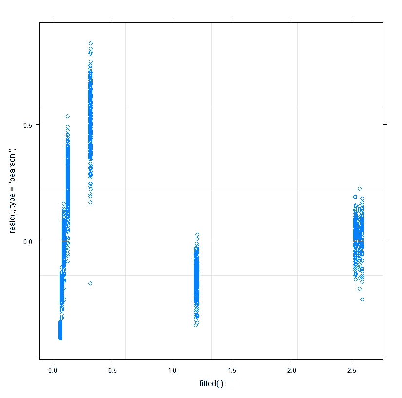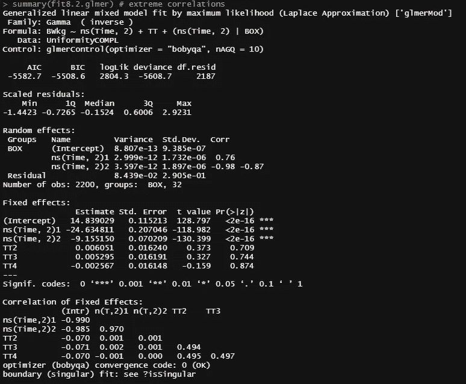

Nope, not what I needed.

```
g <- fitdistr(UniformityCOMPL$BWkg, "gamma")
qqp(resid(fit8.2.glmer), "gamma",shape = g$estimate[[1]], rate = g$estimate[[2]]) 
qqnorm(resid(fit8.2.glmer));qqline(resid(fit8.2.glmer)) 
bwplot(UniformityCOMPL$Time~resid(fit8.2.glmer)) UniformityCOMPL$BOXnum<-as.numeric(UniformityCOMPL$BOX)
```

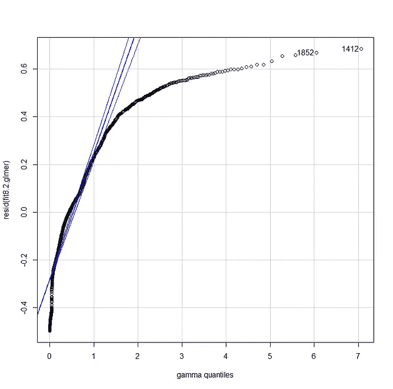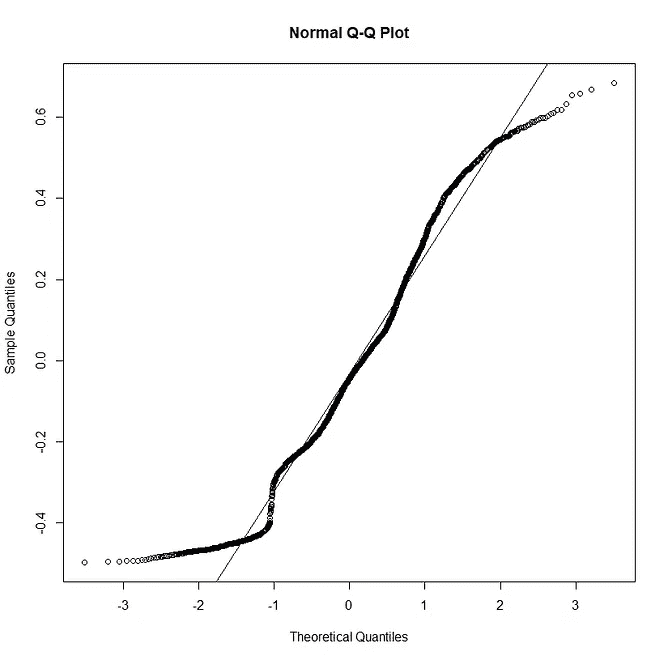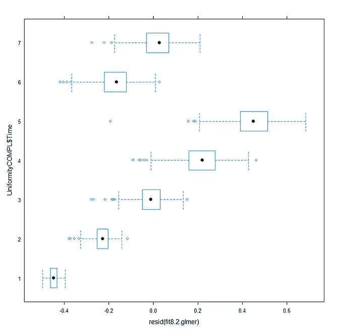

Not all to be fitted via a Gamma distribution.

或许到最后，还是坚持 fit_15.lmer 模式就好了。毕竟，那是最重要的模型。让我们看看效果如何。

```
#### MODEL EVALUATION ####
fit_15.lmer<-lmer(log(BW)~ns(Time,3)*TT+Room+(ns(Time,3)|Block/BOX/n),data=UniformityCOMPL) 
fit_15.lmer.aug <- augment(fit_15.lmer.aug)
myx<-scale_x_continuous(breaks=c(0,2,4,7,21,37))
g1<-ggplot(fit_15.lmer.aug, aes(.fitted, .resid))+
  geom_point()+
  stat_smooth(method="loess")+
  geom_hline(yintercept=0, col="red", linetype="dashed")+
  xlab("Fitted values")+
  ylab("Residuals")+
  ggtitle("Fitted vs Residuals")+
  theme_bw()+ theme(axis.text.x=element_blank(),axis.ticks.x=element_blank(),panel.grid.major = element_blank(), panel.grid.minor = element_blank())g2<-ggplot(fit_15.lmer.aug, aes(x=.resid))+
  geom_histogram(aes(y=..density..),colour="black", fill="white")+
  geom_density(alpha=.2, fill="#FF6666")+
  xlab("Residuals")+
  ylab("Density")+
  ggtitle("Histogram Residuals")+
  theme_bw()+
theme(axis.text.x=element_blank(),axis.ticks.x=element_blank(),panel.grid.major = element_blank(), panel.grid.minor = element_blank())
vec<-resid(fit_15.lmer.aug); y <- quantile(vec[!is.na(vec)], c(0.25, 0.75)); x <- qnorm(c(0.25, 0.75)); slope <- diff(y)/diff(x); int <- y[1L] - slope * x[1L]g3<-ggplot(fit_15.lmer.aug, aes(sample=.resid))+
  geom_qq()+
  geom_abline(slope=slope, intercept=int, col="red", lty=2, lwd=1)+
  xlab("Theoretical")+
  ylab("Empirical")+
  ggtitle("QQ-PLot Residuals")+
  theme_bw()+  theme(axis.text.x=element_blank(),axis.ticks.x=element_blank(),panel.grid.major = element_blank(), panel.grid.minor = element_blank())g4<-ggplot(UniformityCOMPL, aes(x=log(BW), y=fitted(fit_15.lmer), colour=log(BW)-fitted(fit_15.lmer)))+
  geom_abline(intercept=0, slope=1, lty=2, col="black", lwd=1)+
  geom_point()+
  scale_colour_gradient2(low="red",mid="blue",high="red")+
  labs(title = "Calibration", y="Predicted", x="Observed", colour="Difference")+
  theme_bw()+  theme(axis.text.x=element_blank(),axis.ticks.x=element_blank(),panel.grid.major = element_blank(), panel.grid.minor = element_blank())g5<-ggplot(fit_15.lmer.aug, aes(as.factor(UniformityCOMPL$TT),.resid))+
  geom_boxplot()+
  geom_hline(yintercept=0, col="red", linetype="dashed")+
  xlab("Treatment")+
  ylab("Residuals")+
  ggtitle("Residuals vs Treatment")+
  theme_bw()+  theme(axis.text.x=element_blank(),axis.ticks.x=element_blank(),panel.grid.major = element_blank(), panel.grid.minor = element_blank())g6<-ggplot(fit_15.lmer.aug, aes(as.factor(UniformityCOMPL$Time),.resid, group=as.factor(UniformityCOMPL$Time)))+
  geom_boxplot()+
  geom_hline(yintercept=0, col="red", linetype="dashed")+
  xlab("Time")+
  ylab("Residuals")+
  ggtitle("Residuals vs Time")+
  theme_bw()+ theme(axis.text.x=element_blank(),axis.ticks.x=element_blank(),panel.grid.major = element_blank(), panel.grid.minor = element_blank())g7<-ggplot(fit_15.lmer.aug, aes(as.factor(UniformityCOMPL$BOX),.resid, group=UniformityCOMPL$BOX))+
  geom_boxplot()+
  geom_hline(yintercept=0, col="red", linetype="dashed")+
  xlab("Box")+
  ylab("Residuals")+
  ggtitle("Residuals vs Box")+ theme_bw()+theme(axis.text.x=element_blank(),axis.ticks.x=element_blank(),panel.grid.major = element_blank(), panel.grid.minor = element_blank())g8<-ggplot(fit_15.lmer.aug, aes(x=as.factor(UniformityCOMPL$n),y=.resid, group=UniformityCOMPL$n))+
  geom_boxplot()+
  geom_hline(yintercept=0, col="red", linetype="dashed")+
  xlab("N")+
  ylab("Residuals")+
  ggtitle("Residuals vs N")+
  theme_bw()+ theme(axis.text.x=element_blank(),axis.ticks.x=element_blank(),panel.grid.major = element_blank(), panel.grid.minor = element_blank())
gh<-grid.arrange(g1,g2,g3,g4,g5,g6,g7,g8,nrow=4,ncol=2,top=textGrob("Diagnostics Model",gp=gpar(cex=2)))
```

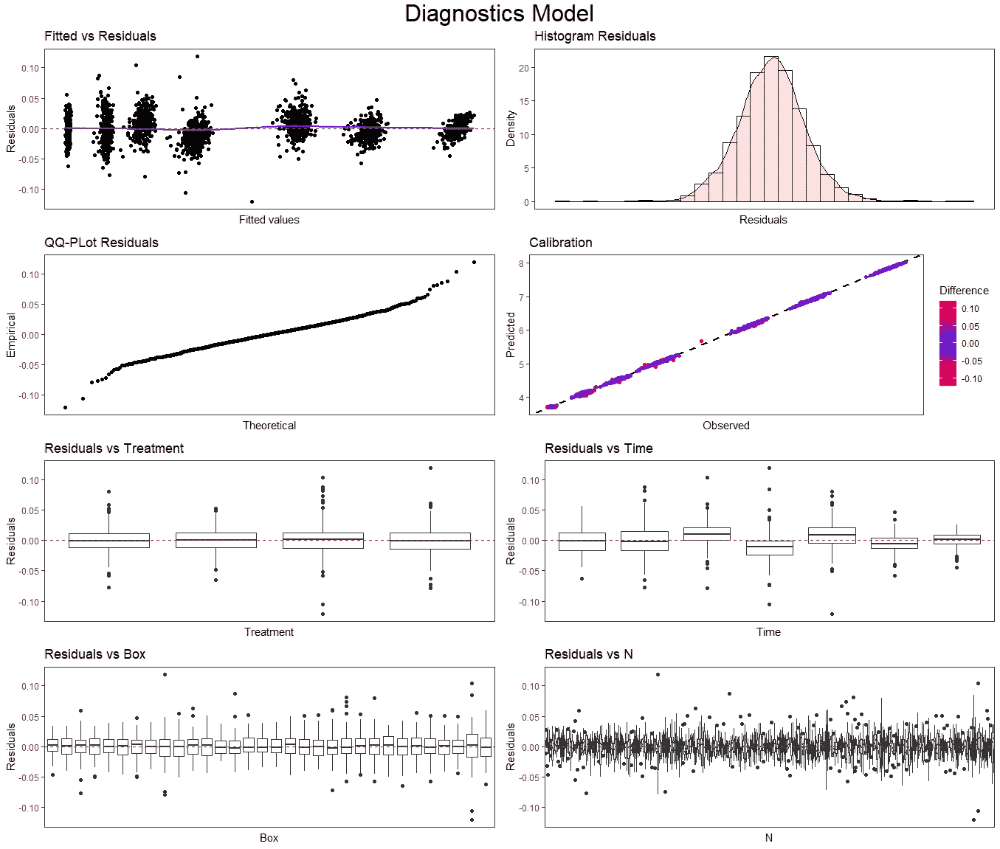

Looking good!

```
xyplot(BWkg~Time|n, data = UniformityCOMPL, 
       strip = FALSE, aspect = "xy", pch = 16, cex=0.2, grid = TRUE,
       panel = function(x, y, ..., fit, subscripts) {
         panel.grid()
         panel.xyplot(x, y)
         panel.lmline(x, y, lty = 2, col="black")
         panel.loess(x, y, lty = 2, col="red")
         ypred<-exp(fitted(fit15.lmer))[subscripts]
         panel.lines(x, ypred, col = "orange")
                  panel.abline(0, 0)
       },
       xlab = "Time",  ylab = "BW (kg)",key=list(space="top",
                                                 lines=list(col=c("black","red", "orange"), lwd=1),
                                                 text=list(c("Linear Regression", "LOESS", "Mixed Model"), columns=1)))
```

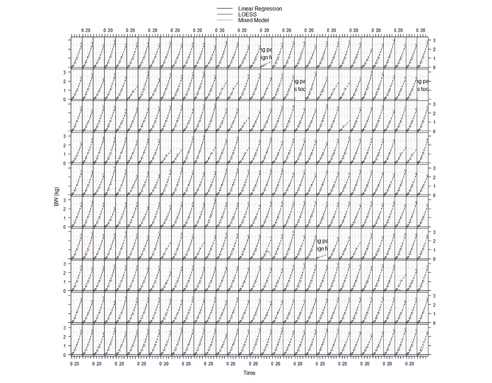

Looking good again!

由于 LSMEAN 是一个横截面比较，我们并没有真正对误差项建模，因此不应从这样的模型中导出 LSMEANS。我仍然可以告诉你如何比较 r 中的处理值。

```
UniformityCOMPL$fit<-exp(fitted(fit15.lmer))
theme_set(theme_bw())
ggplot(UniformityCOMPL, aes(x=as.factor(Time), y=BW, colour=TT, group=TT))+
  stat_summary(fun.y=mean,geom="line", lwd=3, alpha=0.5, color="black")+
  stat_summary(aes(y=fit, colour=TT),fun.y=mean,geom="line", lwd=1)+
  stat_summary(fun.y=mean,geom="point", lwd=3, alpha=0.5, color="black")+
  stat_summary(aes(y=fit, colour=TT),fun.y=mean,geom="point", lwd=1)+
  xlab("Time")+
  facet_wrap(~TT, ncol=2)+
theme(axis.text.x=element_blank(),axis.ticks.x=element_blank(),panel.grid.major = element_blank(), panel.grid.minor = element_blank())
```

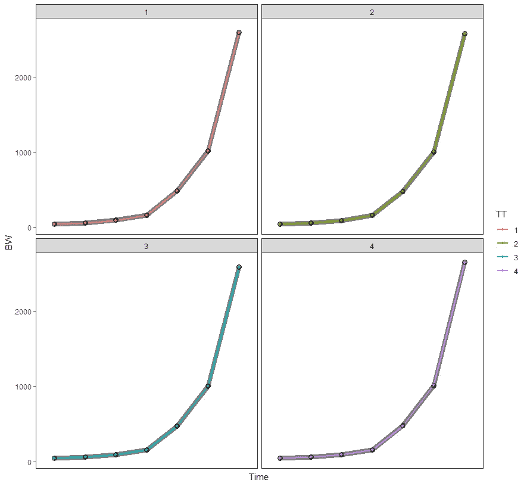

Overall fit of the model is good. The mean values.

```
lsmeans::lsmip(final.model, TT ~ Time,cov.reduce = FALSE) 
fit.lsm<-lsmeans::lsmeans(final.model, ~TT|Time, cov.reduce=FALSE, mode="Kenward-Roger")
pair.fitlsm<-pairs(fit.lsm)
summary(pair.fitlsm, type="response")
plot(pair.fitlsm, intervals = TRUE, int.adjust = "none", comparisons = TRUE)
```

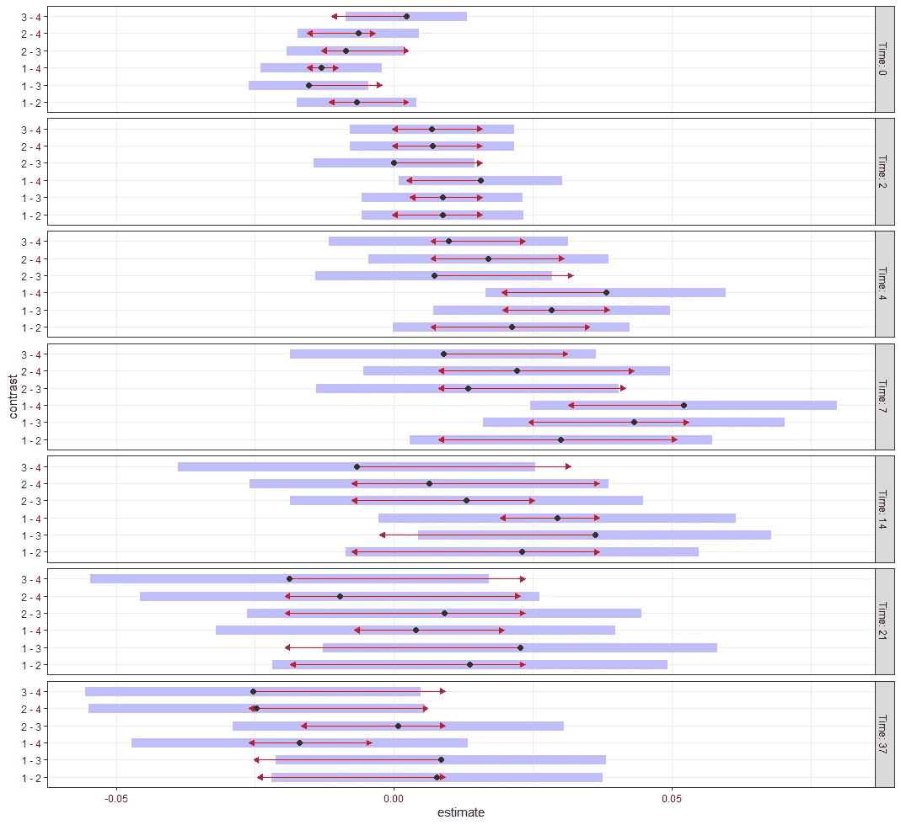

If a confidence interval (purple) does not contain zero it is significant.

```
## Final model 2
fit.lsm2<-lsmeans::lsmeans(final.model2, ~TT|Time, cov.reduce=FALSE, mode="Kenward-Roger")
pair.fitlsm2<-pairs(fit.lsm2)
plot(pair.fitlsm2, intervals = TRUE, int.adjust = "none", comparisons = TRUE)
```

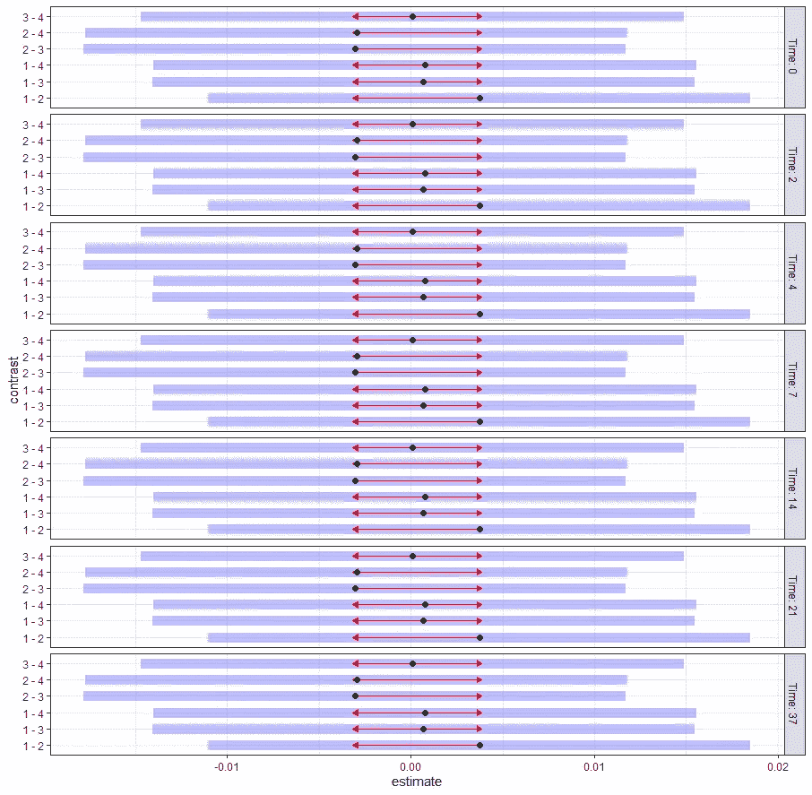

As you can see, LSMEANS and thus comparisons between treatments are model dependent. Heavily so.

以上的比较我不喜欢。它们是每次治疗比较的差异。偶然发现的可能性像这样呈指数增长，而且它没有向你展示不同治疗之间的差异实际上是如何随时间变化的。

为了对此进行建模，我使用了一个名为 final.model2 的模型，并使用 bootstrapping 创建了一个显示随时间变化的分布图(正常比例、对数比例和比率)。代码很重，但情节应该是不言自明的。

尽情享受吧！

```
#### PREDICTION ####
## Create new prediction dataframe
#Expand dataframe to create predictions for timepoints in between day 0 and day 42 and expand to day 100 
pdata<-subset(UniformityCOMPL[,c(1:7)], Time==0)
dim(pdata)
pdata<-as.data.frame(sapply(pdata, rep.int, times=38))
pdata$id<-NULL
pdata<-pdata[order(pdata$n),]
row.names(pdata)<-NULL
pdata$Time<-rep(c(0:37),320)
pdata<-as.data.frame(pdata)
pdata$TT<-as.factor(pdata$TT)
pdata$BOX<-as.factor(pdata$BOX)
pdata$Room<-as.factor(pdata$Room)
pdata$Time<-as.numeric(pdata$Time)
pdata$n<-as.numeric(pdata$n)
str(pdata)### MODEL
final.model2<-lmer(log(BW)~ns(Time,3)*TT+Room+(ns(Time,3)|n),data=UniformityCOMPL)
summary(final.model2)
RMSE.merMod(final.model); RMSE.merMod(final.model2) # almost no difference in terms of residuals
fixef(final.model)-fixef(final.model2) 
```

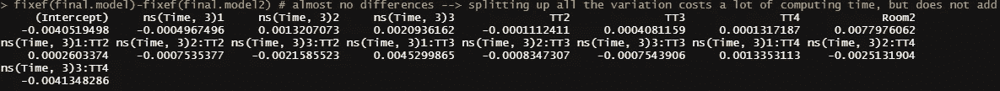

```
### BOOTSTRAP
options(nwarnings = 10000) 
nc <- detectCores()
cl <- makeCluster(rep("localhost", nc))mySumm <- function(.) {
  predict(., pdata,re.form=NULL, allow.new.levels=TRUE)
}pred<-bootMer(final.model, 
               mySumm, 
               nsim=5000, 
               use.u=FALSE, 
               type="parametric",
               .progress="win")pred2<-bootMer(final.model2, 
              mySumm, 
              nsim=5000, 
              use.u=FALSE, 
              type="parametric",
              .progress="win")## Bootstrap diagnostics on BootMer ouput
png("Bootstrap fit2.png", widt=10, height=10, units = 'in', res = 600)
plot(pred2)
dev.off()
attr(pred,"boot.fail.msgs")
```

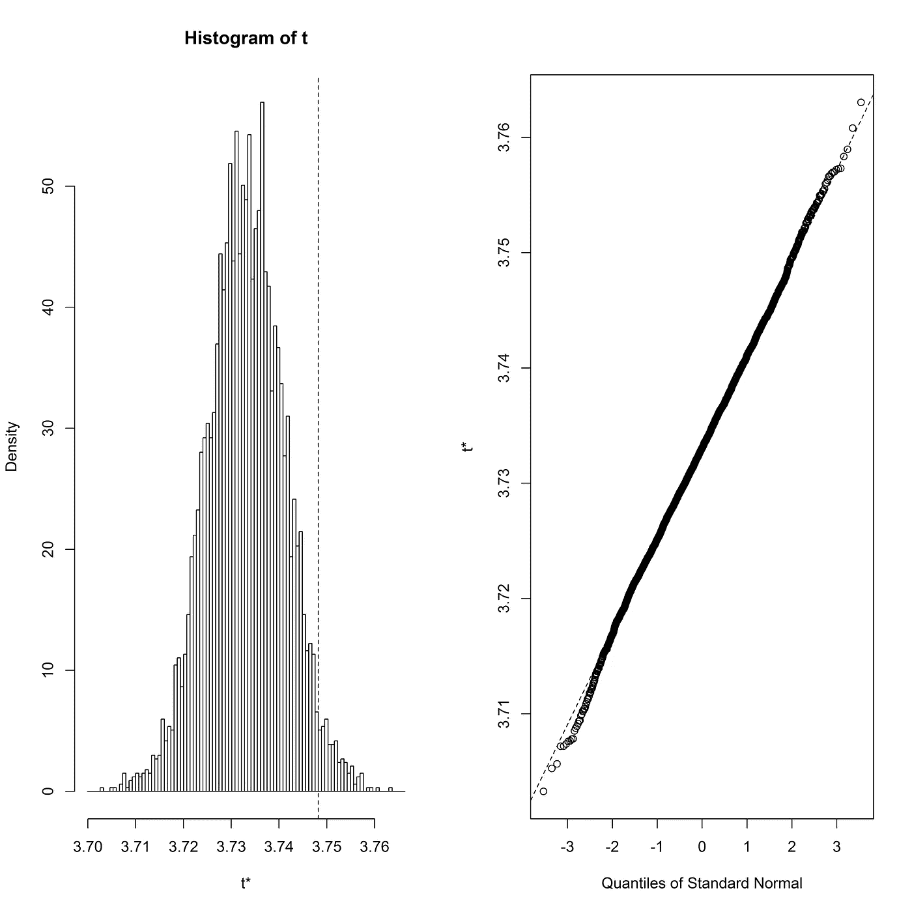

```
### Save bootstraps in dataframe 
bootstrapped<-as.data.frame(pred2$t)
bootstrapped<-as.data.frame(t(bootstrapped))
bootstrapped<-cbind(bootstrapped,pdata[,c(4,7)]) # bind treatment and time
write.csv(bootstrapped, "bootstrapped5000.csv")
dim(bootstrapped)
str(bootstrapped)
colnames(bootstrapped)### CREATE RESULTS for AVERAGE BW DIFFERENCES BETWEEN TREATMENTS 
## ncol -->number of timepoints
## nrow -->number of bootstraps 
T1.Mean.boot=matrix(ncol=38, nrow=5000)
T2.Mean.boot=matrix(ncol=38, nrow=5000)
T3.Mean.boot=matrix(ncol=38, nrow=5000)
T4.Mean.boot=matrix(ncol=38, nrow=5000)
for (j in 0:37){
  for (i in 1:5000){
    T1.Mean.boot[i,j+1]<-mean(bootstrapped[,i][bootstrapped$TT==1&bootstrapped$Time==j]) # j+1 needed if Time starts at zero
    T2.Mean.boot[i,j+1]<-mean(bootstrapped[,i][bootstrapped$TT==2&bootstrapped$Time==j])
    T3.Mean.boot[i,j+1]<-mean(bootstrapped[,i][bootstrapped$TT==3&bootstrapped$Time==j])
    T4.Mean.boot[i,j+1]<-mean(bootstrapped[,i][bootstrapped$TT==4&bootstrapped$Time==j])
  }
}
T1.Mean.boot<-as.data.frame(T1.Mean.boot) # means for treatment 1 for each bootstrap sample and each timepoint
T2.Mean.boot<-as.data.frame(T2.Mean.boot) 
T3.Mean.boot<-as.data.frame(T3.Mean.boot)
T4.Mean.boot<-as.data.frame(T4.Mean.boot)
colnames(T1.Mean.boot)<-seq(0,37,by=1)
colnames(T2.Mean.boot)<-seq(0,37,by=1)
colnames(T3.Mean.boot)<-seq(0,37,by=1)
colnames(T4.Mean.boot)<-seq(0,37,by=1)
diffMEAN.T2T1.boot<-as.data.frame(T2.Mean.boot-T1.Mean.boot) 
diffMEAN.T3T1.boot<-as.data.frame(T3.Mean.boot-T1.Mean.boot)
diffMEAN.T4T1.boot<-as.data.frame(T4.Mean.boot-T1.Mean.boot)### Create dataframe to plot differences per time-point
## T2T1
sumBoot <- function(merBoot) {
  return(
    data.frame(fit = apply(diffMEAN.T2T1.boot, 2, function(x) as.numeric(quantile(x, probs=.5, na.rm=TRUE))),
               lwr = apply(diffMEAN.T2T1.boot, 2, function(x) as.numeric(quantile(x, probs=.025, na.rm=TRUE))),
               upr = apply(diffMEAN.T2T1.boot, 2, function(x) as.numeric(quantile(x, probs=.975, na.rm=TRUE)))))}
diffMEAN.T2T1.dist<-sumBoot(diffMEAN.T2T1.boot) # diff.dist$fit[1] equals median(diff.boot$1)
library(data.table)
diffMEAN.T2T1.dist<-setDT(diffMEAN.T2T1.dist, keep.rownames = TRUE)[]
diffMEAN.T2T1.dist<-as.data.frame(diffMEAN.T2T1.dist)
colnames(diffMEAN.T2T1.dist)[1]<-"Day"
colnames(diffMEAN.T2T1.dist)[2]<-"Difference BW T2T1"
colnames(diffMEAN.T2T1.dist)[3]<-"LCI T2T1 BW"
colnames(diffMEAN.T2T1.dist)[4]<-"HCI T2T1 BW"
diffMEAN.T2T1.dist$Day<-as.numeric(diffMEAN.T2T1.dist$Day)
diffMEAN.T2T1.dist$`Difference BW T2T1`<-as.numeric(diffMEAN.T2T1.dist$`Difference BW T2T1`)
diffMEAN.T2T1.dist$`LCI T2T1 BW`<-as.numeric(diffMEAN.T2T1.dist$`LCI T2T1 BW`)
diffMEAN.T2T1.dist$`HCI T2T1 BW`<-as.numeric(diffMEAN.T2T1.dist$`HCI T2T1 BW`)# Histograms to diagnose bootstrapped samples
par (mfrow=c(4,4))
bootstraps<-as.numeric(sample(colnames(diffMEAN.T2T1.boot),16))
for (j in bootstraps){
  h=hist(diffMEAN.T2T1.boot[,j],breaks=30,freq=FALSE,xlab="BW difference", main="", ylab="Probability") 
  abline(v=0, col="orange", lwd=2)
  abline(v=as.numeric(quantile(diffMEAN.T2T1.boot[,j], probs=.5, na.rm=TRUE)),col="red", lwd=2)
  abline(v=as.numeric(quantile(diffMEAN.T2T1.boot[,j], probs=.025, na.rm=TRUE)),col="red", lwd=2) # Lower bootstrapped percentile interval
  abline(v=as.numeric(quantile(diffMEAN.T2T1.boot[,j], probs=.975, na.rm=TRUE)),col="red", lwd=2) # Upper bootstrapped percentile intervals
  lines(density(diffMEAN.T2T1.boot[,j]), col="blue", lwd=2)
  xfit<-as.numeric(seq(min(diffMEAN.T2T1.boot[,j]),max(diffMEAN.T2T1.boot[,j]),length=length(diffMEAN.T2T1.boot[,j])))  
  yfit<-as.numeric(dnorm(xfit,mean=mean(diffMEAN.T2T1.boot[,j]),sd=sd(diffMEAN.T2T1.boot[,j]))) # correct if i use probability
  lines(xfit, yfit, col="green", lwd=2)}# QQ-plots to diagnose bootstrapped samples
par (mfrow=c(3,3))
bootstraps<-as.numeric(sample(colnames(diffMEAN.T2T1.boot),9))
for (j in bootstraps){
  qqp(diffMEAN.T2T1.boot[,j],ylab=NULL, xlab=NULL, lwd=1, cex=1) 
  }## T3T1
sumBoot <- function(merBoot) {
  return(
    data.frame(fit = apply(diffMEAN.T3T1.boot, 2, function(x) as.numeric(quantile(x, probs=.5, na.rm=TRUE))),
               lwr = apply(diffMEAN.T3T1.boot, 2, function(x) as.numeric(quantile(x, probs=.025, na.rm=TRUE))),
               upr = apply(diffMEAN.T3T1.boot, 2, function(x) as.numeric(quantile(x, probs=.975, na.rm=TRUE)))))}
diffMEAN.T3T1.dist<-sumBoot(diffMEAN.T3T1.boot) # diff.dist$fit[1] equals median(diff.boot$1)
library(data.table)
diffMEAN.T3T1.dist<-setDT(diffMEAN.T3T1.dist, keep.rownames = TRUE)[]
diffMEAN.T3T1.dist<-as.data.frame(diffMEAN.T3T1.dist)
colnames(diffMEAN.T3T1.dist)[1]<-"Day"
colnames(diffMEAN.T3T1.dist)[2]<-"Difference BW T3T1"
colnames(diffMEAN.T3T1.dist)[3]<-"LCI T3T1 BW"
colnames(diffMEAN.T3T1.dist)[4]<-"HCI T3T1 BW"
diffMEAN.T3T1.dist$Day<-as.numeric(diffMEAN.T3T1.dist$Day)
diffMEAN.T3T1.dist$`Difference BW T3T1`<-as.numeric(diffMEAN.T3T1.dist$`Difference BW T3T1`)
diffMEAN.T3T1.dist$`LCI T3T1 BW`<-as.numeric(diffMEAN.T3T1.dist$`LCI T3T1 BW`)
diffMEAN.T3T1.dist$`HCI T3T1 BW`<-as.numeric(diffMEAN.T3T1.dist$`HCI T3T1 BW`)# Histograms to diagnose bootstrapped samples
par (mfrow=c(4,4))
bootstraps<-as.numeric(sample(colnames(diffMEAN.T3T1.boot),16))
for (j in bootstraps){
  #for (i in 1:length(bootstraps)){
  h=hist(diffMEAN.T3T1.boot[,j],breaks=20,freq=FALSE, xlab="BW difference", main="", ylab="Probability") 
  abline(v=0, col="orange", lwd=2)
  abline(v=as.numeric(quantile(diffMEAN.T3T1.boot[,j], probs=.5, na.rm=TRUE)),col="red", lwd=2)
  abline(v=as.numeric(quantile(diffMEAN.T3T1.boot[,j], probs=.025, na.rm=TRUE)),col="red", lwd=2) # Lower bootstrapped percentile interval
  abline(v=as.numeric(quantile(diffMEAN.T3T1.boot[,j], probs=.975, na.rm=TRUE)),col="red", lwd=2) # Upper bootstrapped percentile intervals
  lines(density(diffMEAN.T3T1.boot[,j]), col="blue", lwd=2)
  xfit<-as.numeric(seq(min(diffMEAN.T3T1.boot[,j]),max(diffMEAN.T3T1.boot[,j]),length=length(diffMEAN.T3T1.boot[,j])))  
  yfit<-as.numeric(dnorm(xfit,mean=mean(diffMEAN.T3T1.boot[,j]),sd=sd(diffMEAN.T3T1.boot[,j]))) # correct if i use probability
  lines(xfit, yfit, col="green", lwd=2)}# QQ-plots to diagnose bootstrapped samples
par (mfrow=c(3,3))
bootstraps<-as.numeric(sample(colnames(diffMEAN.T3T1.boot),9))
for (j in bootstraps){
  qqp(diffMEAN.T3T1.boot[,j],ylab=NULL, xlab=NULL, lwd=1, cex=1) 
}## T4T1
sumBoot <- function(merBoot) {
  return(
    data.frame(fit = apply(diffMEAN.T4T1.boot, 2, function(x) as.numeric(quantile(x, probs=.5, na.rm=TRUE))),
               lwr = apply(diffMEAN.T4T1.boot, 2, function(x) as.numeric(quantile(x, probs=.025, na.rm=TRUE))),
               upr = apply(diffMEAN.T4T1.boot, 2, function(x) as.numeric(quantile(x, probs=.975, na.rm=TRUE)))))}
diffMEAN.T4T1.dist<-sumBoot(diffMEAN.T4T1.boot) # diff.dist$fit[1] equals median(diff.boot$1)
library(data.table)
diffMEAN.T4T1.dist<-setDT(diffMEAN.T4T1.dist, keep.rownames = TRUE)[]
diffMEAN.T4T1.dist<-as.data.frame(diffMEAN.T4T1.dist)
colnames(diffMEAN.T4T1.dist)[1]<-"Day"
colnames(diffMEAN.T4T1.dist)[2]<-"Difference BW T4T1"
colnames(diffMEAN.T4T1.dist)[3]<-"LCI T4T1 BW"
colnames(diffMEAN.T4T1.dist)[4]<-"HCI T4T1 BW"
diffMEAN.T4T1.dist$Day<-as.numeric(diffMEAN.T4T1.dist$Day)
diffMEAN.T4T1.dist$`Difference BW T4T1`<-as.numeric(diffMEAN.T4T1.dist$`Difference BW T4T1`)
diffMEAN.T4T1.dist$`LCI T4T1 BW`<-as.numeric(diffMEAN.T4T1.dist$`LCI T4T1 BW`)
diffMEAN.T4T1.dist$`HCI T4T1 BW`<-as.numeric(diffMEAN.T4T1.dist$`HCI T4T1 BW`)# Histograms to diagnose bootstrapped samples
par (mfrow=c(4,4))
bootstraps<-as.numeric(sample(colnames(diffMEAN.T4T1.boot),16))
for (j in bootstraps){
  #for (i in 1:length(bootstraps)){
  h=hist(diffMEAN.T4T1.boot[,j],breaks=20,freq=FALSE, xlab="BW difference", main="", ylab="Probability") 
  abline(v=0, col="orange", lwd=2)
  abline(v=as.numeric(quantile(diffMEAN.T4T1.boot[,j], probs=.5, na.rm=TRUE)),col="red", lwd=2)
  abline(v=as.numeric(quantile(diffMEAN.T4T1.boot[,j], probs=.025, na.rm=TRUE)),col="red", lwd=2) # Lower bootstrapped percentile interval
  abline(v=as.numeric(quantile(diffMEAN.T4T1.boot[,j], probs=.975, na.rm=TRUE)),col="red", lwd=2) # Upper bootstrapped percentile intervals
  lines(density(diffMEAN.T4T1.boot[,j]), col="blue", lwd=2)
  xfit<-as.numeric(seq(min(diffMEAN.T4T1.boot[,j]),max(diffMEAN.T2T1.boot[,j]),length=length(diffMEAN.T4T1.boot[,j])))  
  yfit<-as.numeric(dnorm(xfit,mean=mean(diffMEAN.T4T1.boot[,j]),sd=sd(diffMEAN.T4T1.boot[,j]))) # correct if i use probability
  lines(xfit, yfit, col="green", lwd=2)}# QQ-plots to diagnose bootstrapped samples
par (mfrow=c(3,3))
bootstraps<-as.numeric(sample(colnames(diffMEAN.T4T1.boot),9))
for (j in bootstraps){
  qqp(diffMEAN.T4T1.boot[,j],ylab=NULL, xlab=NULL, lwd=1, cex=1) 
}## Plot differences in BW between Treatment 2 & Treatment 1 for each day 
# Log scale
theme_set(theme_bw())
myx<-scale_x_continuous(breaks = seq(0, 37, by = 1))
myy<-scale_y_continuous(breaks = seq(-1,1,by=0.01))
gBW_trans_T2T1<-ggplot(diffMEAN.T2T1.dist, aes(x=Day, y=`Difference BW T2T1`))+
  myx+
  myy+
  geom_line(lwd=1)+
  geom_ribbon(aes(ymin=`LCI T2T1 BW`, ymax=`HCI T2T1 BW`), alpha=0.3, fill="orange")+
  geom_hline(yintercept=0,colour="red", lwd=1, lty=2)+
  theme(panel.grid.major = element_blank(), panel.grid.minor = element_blank())+
  labs(title = "BW Difference Treatment 2vs1 (log)", y="BW difference (grams)", x="Day")# Original scale
theme_set(theme_bw())
myx<-scale_x_continuous(breaks = seq(0, 37, by = 1))
myy<-scale_y_continuous(breaks = seq(-1,2,by=0.01))
gBW_orig_T2T1<-ggplot(diffMEAN.T2T1.dist, aes(x=Day, y=exp(`Difference BW T2T1`)))+
  myx+
  myy+
  geom_line(lwd=1)+
  geom_ribbon(aes(ymin=exp(`LCI T2T1 BW`), ymax=exp(`HCI T2T1 BW`)), alpha=0.3, fill="orange")+
  geom_hline(yintercept=1,colour="red", lwd=1, lty=2)+
  theme(panel.grid.major = element_blank(), panel.grid.minor = element_blank())+
  labs(title = "BW Ratio Treatment 2vs1 ", y="BW Ratio (grams)", x="Day")
gBWT2T1<-grid.arrange(gBW_trans_T2T1,gBW_orig_T2T1,nrow=2,ncol=1,top=textGrob("BW compared by treatment",gp=gpar(cex=2)))
ggsave(gBWT2T1,filename = "BW Difference T2T1 .png", width=16, height=16, dpi=600)
```

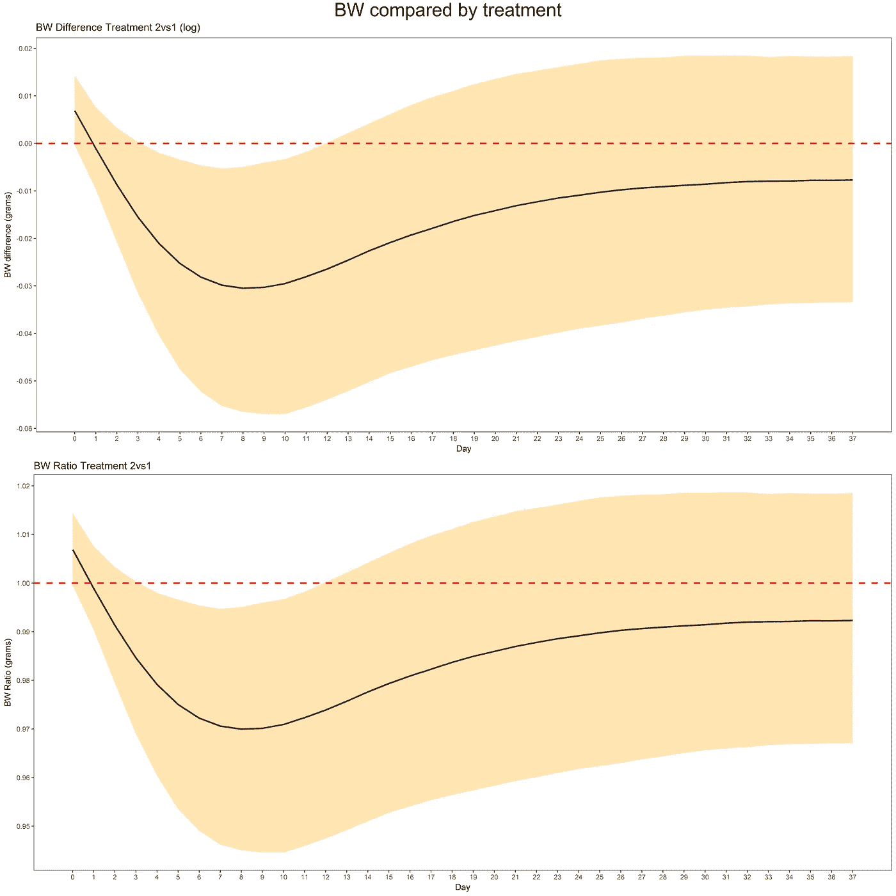

##绘制每天治疗 3 和治疗 1 之间的体重差异

```
 # Tranformed scale
theme_set(theme_bw())
myx<-scale_x_continuous(breaks = seq(0, 37, by = 1))
myy<-scale_y_continuous(breaks = seq(-1,1,by=0.01))
gBW_trans_T3T1<-ggplot(diffMEAN.T3T1.dist, aes(x=Day, y=`Difference BW T3T1`))+
  myx+
  myy+
  geom_line(lwd=1)+
  geom_ribbon(aes(ymin=`LCI T3T1 BW`, ymax=`HCI T3T1 BW`), alpha=0.3, fill="orange")+
  geom_hline(yintercept=0,colour="red", lwd=1, lty=2)+
  theme(panel.grid.major = element_blank(), panel.grid.minor = element_blank())+
  labs(title = "BW Difference Treatment 3vs1 (log)", y="BW difference (grams)", x="Day")
# Original scale
theme_set(theme_bw())
myx<-scale_x_continuous(breaks = seq(0, 37, by = 1))
myy<-scale_y_continuous(breaks = seq(-1,2,by=0.01))
gBW_orig_T3T1<-ggplot(diffMEAN.T3T1.dist, aes(x=Day, y=exp(`Difference BW T3T1`)))+
  myx+
  myy+
  geom_line(lwd=1)+
  geom_ribbon(aes(ymin=exp(`LCI T3T1 BW`), ymax=exp(`HCI T3T1 BW`)), alpha=0.3, fill="orange")+
  geom_hline(yintercept=1,colour="red", lwd=1, lty=2)+
  theme(panel.grid.major = element_blank(), panel.grid.minor = element_blank())+
  labs(title = "BW Ratio Treatment 3vs1 ", y="BW Ratio (grams)", x="Day")
gBWT3T1<-grid.arrange(gBW_trans_T3T1,gBW_orig_T3T1,nrow=2,ncol=1,top=textGrob("BW compared by treatment",gp=gpar(cex=2)))
ggsave(gBWT3T1,filename = "BW Difference T3T1 .png", width=16, height=16, dpi=600)## Plot differences in BW between Treatment 4 & Treatment 1 for each day 
# Tranformed scale
theme_set(theme_bw())
myx<-scale_x_continuous(breaks = seq(0, 37, by = 1))
myy<-scale_y_continuous(breaks = seq(-1,1,by=0.01))
gBW_trans_T4T1<-ggplot(diffMEAN.T4T1.dist, aes(x=Day, y=`Difference BW T4T1`))+
  myx+
  myy+
  geom_line(lwd=1)+
  geom_ribbon(aes(ymin=`LCI T4T1 BW`, ymax=`HCI T4T1 BW`), alpha=0.3, fill="orange")+
  geom_hline(yintercept=0,colour="red", lwd=1, lty=2)+
  theme(panel.grid.major = element_blank(), panel.grid.minor = element_blank())+
  labs(title = "BW Difference Treatment 4vs1 (log)", y="BW difference (grams)", x="Day")
# Original scale
theme_set(theme_bw())
myx<-scale_x_continuous(breaks = seq(0, 37, by = 1))
myy<-scale_y_continuous(breaks = seq(-1,2,by=0.01))
gBW_orig_T4T1<-ggplot(diffMEAN.T4T1.dist, aes(x=Day, y=exp(`Difference BW T4T1`)))+
  myx+
  myy+
  geom_line(lwd=1)+
  geom_ribbon(aes(ymin=exp(`LCI T4T1 BW`), ymax=exp(`HCI T4T1 BW`)), alpha=0.3, fill="orange")+
  geom_hline(yintercept=1,colour="red", lwd=1, lty=2)+
  theme(panel.grid.major = element_blank(), panel.grid.minor = element_blank())+
  labs(title = "BW Ratio Treatment 4vs1 ", y="BW Ratio (grams)", x="Day")
gBWT4T1<-grid.arrange(gBW_trans_T4T1,gBW_orig_T4T1,nrow=2,ncol=1,top=textGrob("BW compared by treatment",gp=gpar(cex=2)))
ggsave(gBWT4T1,filename = "BW Difference T4T1 .png", width=16, height=16, dpi=600)gBW_trans<-grid.arrange(gBW_orig_T2T1,gBW_orig_T3T1,gBW_orig_T4T1,nrow=3,ncol=1,top=textGrob("BW compared by treatment",gp=gpar(cex=2)))
ggsave(gBW_trans,filename = "BW Ratio all treatments.png", width=16, height=16, dpi=600)
```

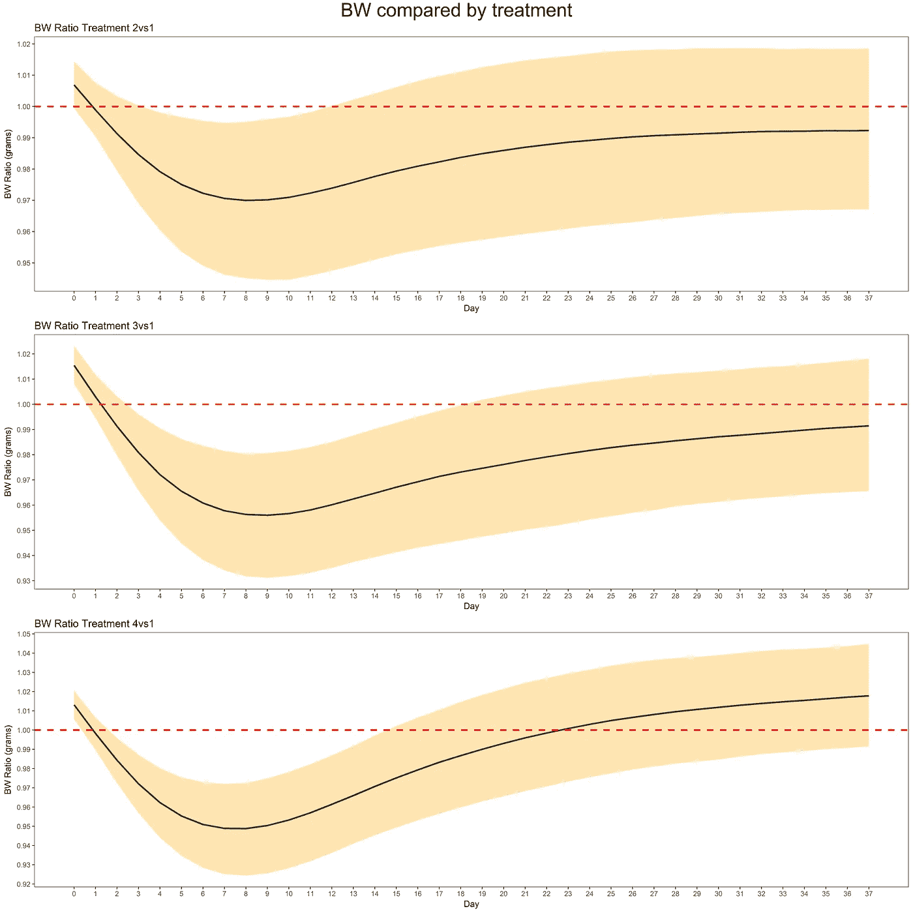[](/mlearning-ai/mlearning-ai-submission-suggestions-b51e2b130bfb) [## Mlearning.ai 提交建议

### 如何成为 Mlearning.ai 上的作家

medium.com](/mlearning-ai/mlearning-ai-submission-suggestions-b51e2b130bfb)