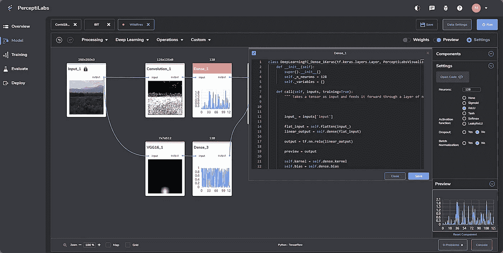
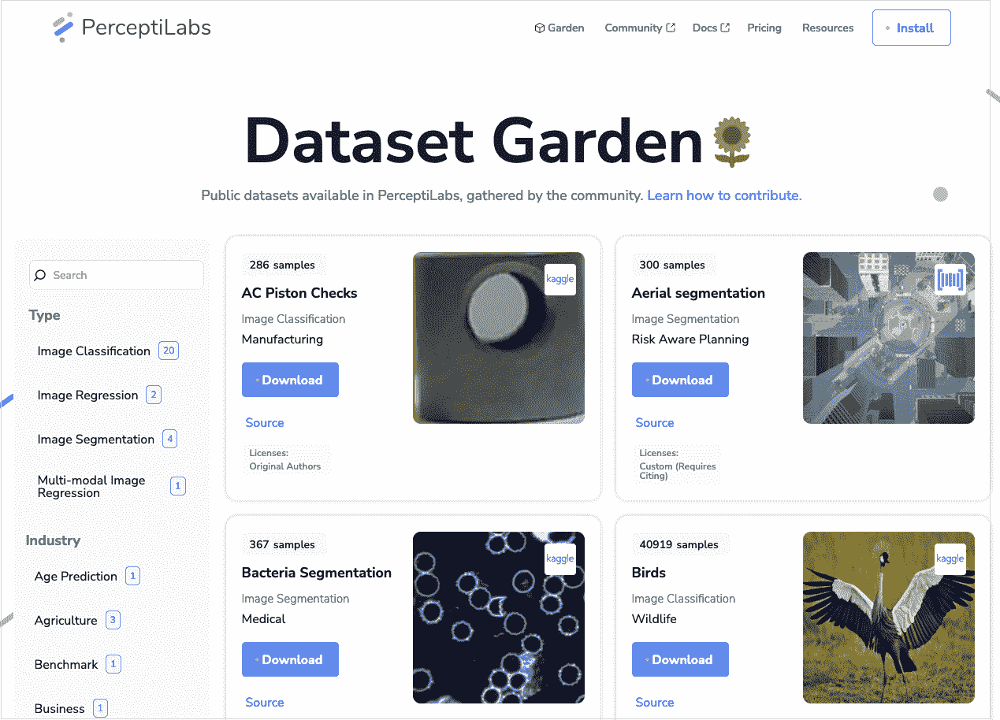
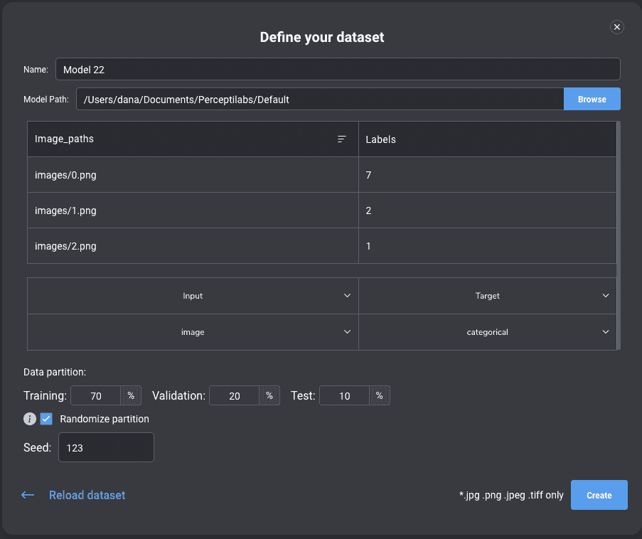

# 低代码:张量流的最佳途径

> 原文：<https://medium.com/mlearning-ai/low-code-the-best-approach-for-tensorflow-d6e0b461d0a6?source=collection_archive---------0----------------------->

Overview of PerceptiLabs GUI (Image [source](http://www.perceptilabs.com)).

根据这份 [Gartner 报告](https://www.gartner.com/doc/reprints?id=1-27I04ZJT&ct=210921&st=sb)，到 2025 年，企业开发的 70%的新应用将使用低代码应用平台(LCAP)。有充分的理由，正如报告所述，它使*企业能够快速交付新的解决方案，并实现业务能力的现代化*。

这对我们来说并不意外。从一开始，我们就采用了一种*低代码*的方法来提高您的深度学习(DL)工作流生产力，为令人眼花缭乱的快速建模提供工具，并更快地创建工作模型。PerceptiLabs 的低代码方法也使得 DL 对于不同背景和技术能力的 DL 实践者来说不那么令人生畏。

PerceptiLabs 的可视化 API 通过将预先生成的代码封装在连接在一起的组件中，消除了编写原始 TensorFlow 代码的复杂性。然后，您可以通过 GUI 调整设置，并有选择地修改组件代码。让我们仔细看看这些低代码特性。

# **模型生成**

创建新 DL 模型的最有效方法之一是从围绕现有数据集构建的良好的*基线*模型开始。这可以让您更快地启动和运行，甚至可以由非技术 DL 从业者启动。这就是为什么 PerceptiLabs 会为你生成模型。您可以从您现有的数据集开始，或者使用我们的[数据集花园](https://www.perceptilabs.com/dataset-garden)中的一个公开可用的数据集，如图 1 所示:

*Figure 1 — Screenshot of PerceptiLabs’ Dataset Garden (Image* [*source*](http://www.perceptilabs.com)*).*

或者，您可以从我们的[模型花园](https://www.perceptilabs.com/model-garden)导入一个现有的模型。

当使用您自己的数据集时，只需通过一个 [CSV 文件](https://docs.perceptilabs.com/perceptilabs/advanced/csv-file-format)将您的数据映射到您的标签，然后将它与数据样本一起加载到 PerceptiLabs 中。如果您使用 Dataset Garden 中的数据集，PerceptiLabs 会为您处理这个问题。

我们的[数据向导](https://docs.perceptilabs.com/perceptilabs/advanced/ui-overview/data-wizard)，如下图 2 所示，配置模型将如何使用您的数据，并提供可选的预处理设置(例如，调整图像大小):

*Figure 2 — Screenshot of PerceptiLabs’ Data Wizard.*

这提供了以下好处:

*   一个[声明性的](https://en.wikipedia.org/wiki/Declarative_programming)工作流，在这里你预先关注定义和解决一个 DL 问题，而不是底层的代码基础设施。您最终得到一个完全工作的模型，其中所有的代码都已经为您编写好了。
*   该模型包括*良好的*起点设置，可以作为[迁移学习](https://blog.perceptilabs.com/when-to-use-transfer-learning-in-image-processing/)的良好基础。
*   模型的代码和项目设置都存储在一个地方，可以通过一个 GUI 应用程序轻松访问。

您可以通过 GUI 快速实例化给定数据集的新模型(例如，在调整每个模型时比较它们的性能)。然而，使用传统的纯代码方法，您必须复制、修改并重新运行您的代码来完成这一点。

# **代码分割**

开发人员通过将他们的代码划分成逻辑组或模块来分而治之解决问题。PerceptiLabs 的组件基于这一思想，封装了 TensorFlow 代码，用于常见的 DL 建模结构，如神经网络、层和操作。组件通过它们的输入和输出插口连接在一起，以可视化方式编程*端到端的数据流和转换。非程序员可以将模型视为流程图，而程序员可以快速定位模型特定部分的代码，而不是费力地通过源代码文件的存储库。*

每个组件都提供了显示其如何转换输入数据的即时可视化，因此您可以在每个组件的基础上查看每个更改的效果。当您使用第一个数据样本更改模型时，PerceptiLabs 通过不断地重新运行模型来促进这一点。这避免了在看到结果之前重新运行整个模型的需要。然后，您可以决定何时使用整个数据集来定型模型。通过分离训练过程，你可以快速建模。

PerceptiLabs 的模型可视化可以统一您的 DL 团队，因为它提供了一种通用的*可视化语言*，不同 DL 技能水平的利益相关者可以围绕这种语言进行协作。此外，它有助于模型的可解释性，这在设计和后期部署期间是有益的。

# **GUI 特性和可选编码**

像调整模型设置这样的小变化可以通过 GUI 来完成。这意味着如果你不想写代码，你就不必写，而且在大多数情况下你也不需要写。因此，非技术团队成员可以轻松地对模型进行实验和迭代，而无需深入研究其代码。

为了更加灵活，您可以修改组件代码或编写自己的定制组件来扩展 PerceptiLabs。非开发人员可以可视化地创作 TensorFlow 模型，而有抱负的开发人员可以随意查看由 PerceptiLabs 生成的 TensorFlow 代码，以了解其结构。这些特性有助于沟通不同团队成员带来的各种观点。

每个人都可以访问模型导出和部署过程。与 TensorFlow 以编程方式执行导出的纯代码方法不同，PerceptiLabs 将其简化为几次按钮点击。您可以导出到 TensorFlow 或针对 TensorFlow Lite 进行优化。您还可以部署到 Gradio 和 FastAPI 目标，这两个目标生成模型和围绕它构建的完全工作的示例应用程序。随着时间的推移，我们将增加新的目标，比如我们即将推出的对[open vino](https://docs.openvino.ai)的支持。您可以随时通过在我们的[功能请求论坛](https://forum.perceptilabs.com/c/feature-requests/12)发帖，让我们知道您想看什么。

# **调试功能**

我们有一些很酷的功能来调试模型，这些功能与我们的低代码方法一致。

在[建模工具](https://docs.perceptilabs.com/perceptilabs/advanced/ui-overview/modeling-tool)中，具有无效设置(如不正确的输入尺寸)的组件被突出显示，以显示模型设计问题。类似地，组件可视化是可视化隔离需要修改的转换的好方法。对于更专业的 DL 实践者来说，代码编辑器可以立即识别并突出显示编译错误。

# **对你的下一个 DL 项目采取低代码的方法**

准备好提高您的 DL 工作流生产力并快速获得工作模式了吗？

*   按照我们的[快速入门指南](https://docs.perceptilabs.com/perceptilabs/getting-started/quickstart-guide)开始使用我们的免费版 PerceptiLabs。
*   然后遵循我们的[基本图像识别](https://docs.perceptilabs.com/perceptilabs/tutorials/basic-image-recognition)教程，这是一个很好的 hello-world 风格的模型，可以尝试 PerceptiLabs 的低代码方法。

 [## Mlearning.ai 提交建议

### 如何成为 Mlearning.ai 上的作家

medium.com](/mlearning-ai/mlearning-ai-submission-suggestions-b51e2b130bfb)