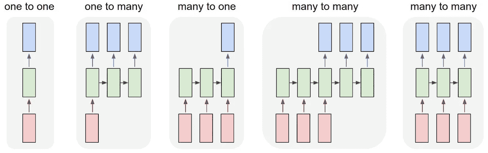
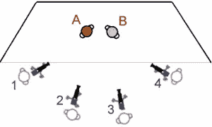
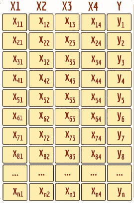
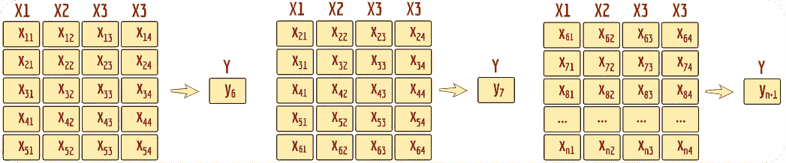
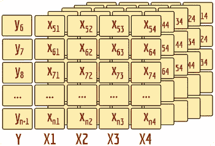
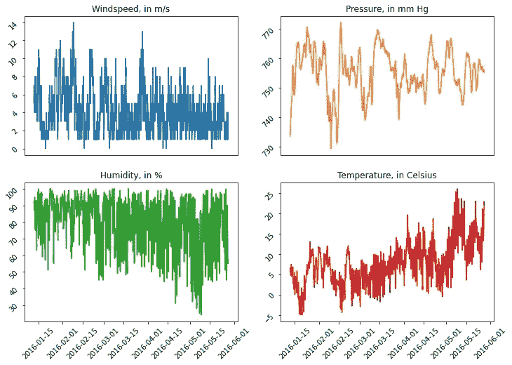

# LSTM 和克拉斯。多对一架构中的数据整形。

> 原文：<https://medium.com/mlearning-ai/lstm-with-keras-data-reshaping-in-many-to-one-architecture-c7d3669e3a5c?source=collection_archive---------0----------------------->

Image source: [Andrej Karpathy](http://karpathy.github.io/2015/05/21/rnn-effectiveness/)

尝试为我的大学任务实现 LSTM 神经网络时，我面临着将数据拟合到用 Keras 框架制作的模型中的问题:需要将输入数据转换为适合维度的框架(LSTM 层可接受的输入形状)。因此，本教程可能有助于节省时间的初学者谁想要使用 LSTM 建筑的力量。

举个例子，让我们使用多机位的电影制作方法:

[https://en.wikipedia.org/wiki/Multiple-camera_setup](https://en.wikipedia.org/wiki/Multiple-camera_setup)

基于该图像，我们的数据将包括 4 个视频信号或 4 个稳定图像序列(例如每秒 25 帧)。现在，让我们假设在一些信号(图像)预处理之后，来自每个摄像机的每个帧可以被表示为一些数字(例如，与前一帧相比，在当前帧中已经改变的像素数)。所以最后，我们的数据将具有以下形式:

其中 X1、X2、X3、X4 是表示来自 4 个视频摄像头的视频帧之间的变化的变量，Y 是某个目标(例如，定义对象 A 和 B 在当前帧是否移动的二进制变量)。

将视频帧序列视为时间序列数据是很自然的，因此仅基于 4 个数据帧(X71、X72、X73、X74)来预测例如帧 7 (Y7)处的 Y 是不够的:在先前帧的 k 长度序列中应该有额外的有用信息。K-length 意味着我们取 k 个以前的帧，把它们当作一个样本。此外，仅基于先前帧而不包括第 x7 帧来预测 Y7 更现实。示意性地，对于 k=5，上述数据应转换如下:

或者更简洁地说:

因此，代替(n，p)形状的数据，其中 n 是帧(行)的数量，p 是预测器(列)的数量，我们将适合(n-k-1，k，p)形状的 LSTM 模型数据，其中 k 是预测 Y 的下一个值所需的先前帧序列的长度。目标也将具有 n-k-1 个数据点，因为首先，我们将数据移动一行来预测“下一帧”事件，在第二个，我们需要至少 k 个第一行来预测 Y 因此，对于 X 和 Y，可能的行的总数将是 n-k-1。

让我们用真实的数据来看看这是如何实现的。为了避免对 4 个网络摄像头的视频数据进行大量转换，我将使用距离 Chievres 机场(比利时)最近的气象站的 4 个时间序列气象测量值。它是[“家电能源预测数据集”](http://archive.ics.uci.edu/ml/datasets/Appliances+energy+prediction)的一部分。

导入库，加载数据集，并打印表头:

正如我们所看到的，这些数据代表了从 2016 年 1 月 11 日开始的 4.5 个月中以 10 分钟为间隔记录的 4 种不同天气测量的 19735 次观测:

目标呢？在这里，我们可以设定很多目标，我选择了预测未来 10 分钟的温度是否会高于当前温度的想法:

现在我们需要一个函数将原始数据转换成一组 k 长度的序列，并带有相应的目标——如前所述。

这个函数的输入应该是带有原始数据的 NumPy 数组，其中最后一列是目标变量。输出将是具有(n-k，k，p)形状的预测器的矩阵和具有(n-k，)形状的目标向量。由于我们之前删除了最后一行，与初始数据相比，输出矩阵的真实形状是(n-k-1，k，p)。在这种情况下，在开始时，我们看到了具有(19735，5)形状的表，但是现在我们有了(19724，10，4)作为预测器和(19724，)作为目标。

以下函数有助于检查“create_lstm_data”函数是否工作正常:

我们可以发现，LSTM 数据的第 0 行包含一个 5 长度的序列，它对应于原始数据中的第 0:4 行。LSTM 数据的第 0 行的目标是 0，这对应于初始数据的“T_out”列中第 5 行与第 4 行的比较:“T_out”在第 5 个指数时低于第 4 个指数，这意味着在下一个间隔中温度没有增加，因此目标变量被设置为“0”。对 LSTM 数据的第 100 行进行相同的检查。

接下来，我们定义训练集、有效集和测试集:

为了建立一个 LSTM 神经网络，我使用了 Keras 框架。一般模型设置如下:

*   1 个 LSTM 层，100 个单元，默认 [Keras 层参数](https://keras.io/api/layers/recurrent_layers/lstm/)；
*   1 具有 2 个单元和 sigmoid 激活函数的稠密层(正如我们正在处理的二元分类)；
*   学习率为 0.01 的 Adam 优化器；
*   二元交叉熵损失函数；
*   如果在当前时期，模型在验证集上显示出最佳精度，则保存模型；
*   如果在最后 20 个周期内，验证损失没有减少，则停止训练。

请注意:

*   LSTM 层的输入形状设置为(k，p ),其中 k 是序列的长度，p 是预测值的数量；
*   按照模型设置的要求，目标向量用一键编码进行变换。

最后，由于我们不知道 k 的“真实”值，即序列的长度，使用它可以最好地预测目标，我将把训练-验证过程包装到循环中:在每个循环中，新的 k 将用于转换数据和训练模型。

此外，添加内部循环来训练和测试每个 k 长度的“num_init”个模型:这些循环的测试精度存储在列表中，然后计算特定 k 长度的平均精度分数。这样做是为了减少偶然的“超差”或“超好”初始层权重的影响。此外，最小最大值定标器被应用于数据，以便[改进和加快训练过程。](https://machinelearningmastery.com/how-to-improve-neural-network-stability-and-modeling-performance-with-data-scaling/)

最后，我们绘制图表，其中 x 轴是插入模型的 k 长度值，y 轴是每个 k 长度的“num_init”模型初始化的平均准确度分数:

下面是一个图表，显示了每 k 长度训练和测试一次的 LSTM 模型的准确度分数:正如我们在这里看到的，50 长度的序列“偶尔”会获得最高的准确度。

而不是结论:

*   LSTM 模型是处理时间序列数据的有力工具；
*   一旦理解了数据应该如何转换并适合模型，LSTM 模型的实现就不那么复杂了。