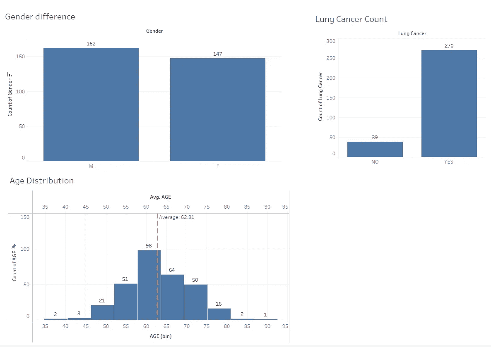
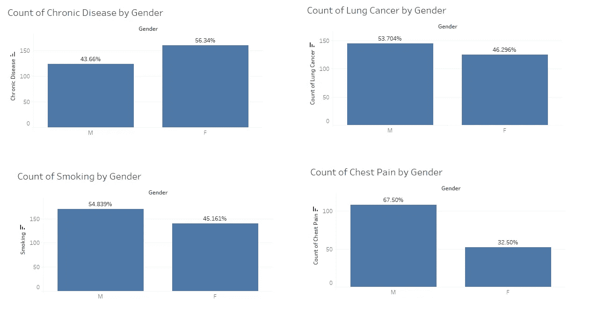
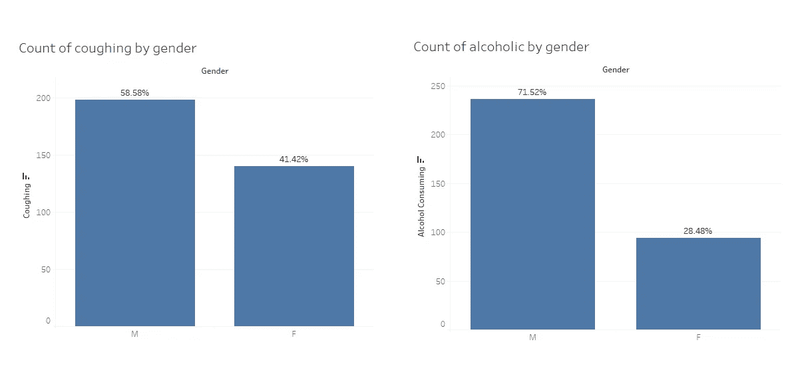

# 肺癌分析

> 原文：<https://medium.com/mlearning-ai/lung-cancer-analysis-2a7fc51209af?source=collection_archive---------4----------------------->

## 分析有多少人患有肺癌

# 介绍

这份报告包含了对肺癌患者的分析，我们可以从中了解有多少人患有肺癌。

我从数据中提取了一些有趣的信息，例如比较数据的性别、年龄分布，有多少人患有肺癌，以及肺癌发生的原因是什么，来自哪些特定条件？

让我们先从描述性统计分析开始，然后我们可以继续推论。

# 数据集

我使用的数据来自 [Kaggle 肺癌](https://www.kaggle.com/datasets/nancyalaswad90/lung-cancer)数据集
它有 16 列/维度。

1.性别:字符串 M 或 L
2。年龄:整数
3。吸烟:整数 1(否)或 2(是)
4。黄手指:整数 1(否)或 2(是)
5。焦虑:整数 1(否)或 2(是)
6。同伴压力:整数 1(否)或 2(是)
7。慢性病:整数 1(否)或 2(是)
8。疲劳:整数 1(否)或 2(是)
9。过敏:整数 1(否)或 2(是)
10。喘息:整数 1(否)或 2(是)
11。饮酒:整数 1(否)或 2(是)
12。咳嗽:整数 1(否)或 2(是)
13。气短:整数 1(否)或 2(是)
14。吞咽困难:整数 1(否)或 2(是)
15。胸痛:整数 1(否)或 2(是)
16。肺癌:是或否

# 见识

## 数据的分布

根据图形，我们可以看到**男性**参与者多于**女性。**

正态分布的平均年龄约为 **62.81** 表示已经足够老了，该数据分布到老年人年龄。我们可以得出结论，这些数据主要是从老年人那里收集的。

从总数据中，我们知道大约 270 人患肺癌，大约 87%。

> 我们可以说，这些数据主要来自 55-65 岁的人群，其中 87%患有肺癌。

让我们看看来自人民的肺癌数据。

## 按性别分列的肺癌患者数据比例

从图中我们知道，在 **270** 肺癌患者中，男性参与者约为 **53.7%** ，女性为 **46.25%** 。

男性吸烟者在 **54.83%** 左右，女性吸烟者在 **45.161%左右。**

患有慢性病的男性约为 **43.6%** ，女性约为 **56.34%** 。

有胸痛症状的男性约为 **67.5%** ，女性约为 **32.5%** 。

> 从上面的描述性统计中，我们可以得出结论，男性更有可能患有肺癌，他们也有像胸部疼痛这样的症状。
> 
> 但是，尽管女性也积极吸烟，但她们不像男性那样感觉到症状。
> 
> 为什么会这样？如果吸烟会让你患肺癌，为什么男性比女性更容易患肺癌？
> 
> 会不会是来自另一个因素？

**研究导致肺癌的其他变量**

从我观察的其他变量来看，我发现男性参与者是酗酒者，与女性参与者相比，约占 71.52%。

男性参与者也倾向于咳嗽，这可能会给我们之前的可疑假设带来答案。

现在我们知道**肺癌**可能不是来自吸烟者，因为女性参与者比男性参与者少，但它可能来自酗酒者，因为我们知道与女性相比，男性是 71.52%的酗酒者，这可能给我们问题的答案。

# 摘要

我们已经做了描述性统计，并从数据中推断出一个结论，即**肺癌**大多发生在男性而非女性，在一定条件下，男性也是酗酒者和吸烟者。

我们还知道，只有吸烟与肺癌没有关系**可能有这种可能性，但这种可能性很低，酗酒者也有更高的几率。**

**专攻肺癌的医生应该尝试治疗有吸烟习惯和酗酒的病人。**

# **项目链接**

**我将附上我的 Tableau 仪表板在这里，所以你可以看看，并发挥左右。 [**项目**](https://public.tableau.com/app/profile/bee.bee.wijaya/viz/LungCancerAnalysis_16648091469630/LungCancerStory)**

# **信用**

**Pacmann.ai 教会了我很多东西，让我可以创作这个报告，并与大家分享。**

**Kaggle 提供了一个查找数据集的好地方。**

**这个画面提供了一个我们可以用来可视化数据的平台。**

** [## Mlearning.ai 提交建议

### 如何成为 Mlearning.ai 上的作家

medium.com](/mlearning-ai/mlearning-ai-submission-suggestions-b51e2b130bfb)**