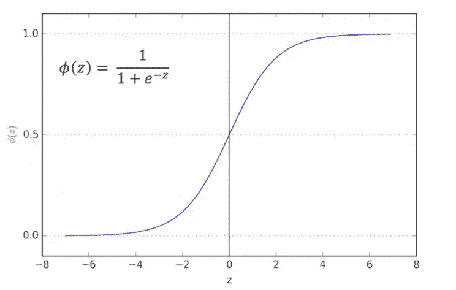
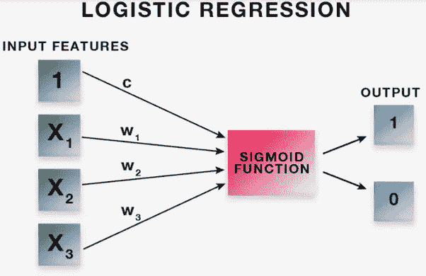
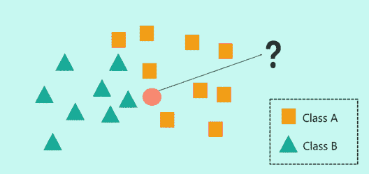
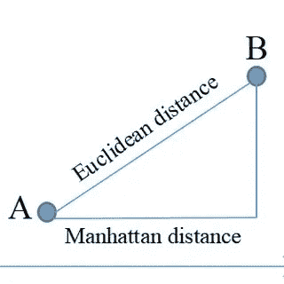
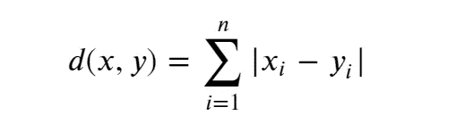
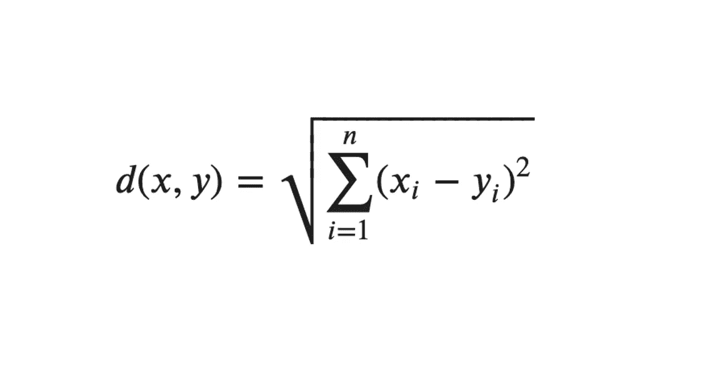
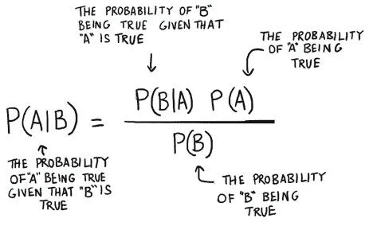
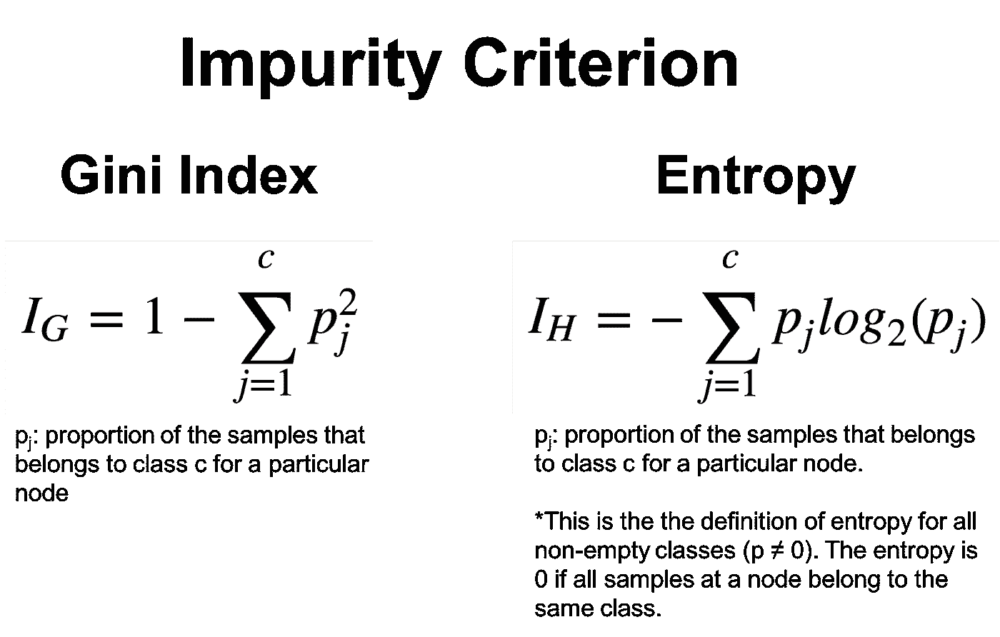

# 机器学习 101:万物分类

> 原文：<https://medium.com/mlearning-ai/machine-learning-101-all-things-classification-ee6dff9c2af5?source=collection_archive---------9----------------------->

在上一篇文章中，我谈到了不同类型的回归，这一次我们将深入分类和它的不同类型

分类是一种受监督的学习算法，它用于预测离散值，如您是否患有癌症，是否是垃圾邮件，您属于 3 个经济类别中的哪一个，但基本上它将输入数据映射到特定的预定义类别，如恶性或良性(在肿瘤检测中)。正如我在上一篇文章中提到的，我将讨论分类算法中的逻辑回归，除此之外，我们还将看看其他一些算法，如决策树、KNN 和朴素贝叶斯

# 逻辑回归

逻辑回归类似于线性回归，只是它预测事物是真还是假，而不是像线性回归那样用一条线来拟合数据，这里是一条 S 形曲线，称为 Sigmoid 函数，虽然逻辑回归给你真或假的概率，但它主要用于二元分类问题，现在它的工作原理是如果它为真的概率大于 50%，它为真，否则它为假。正是这种使用连续和离散测量来提供概率和分类样本的能力使其成为一种流行的分类算法，除了二元分类之外，还有许多其他类型的逻辑回归，如多项逻辑回归(许多类)、有序逻辑回归(多个有序类)。

sigmoid 函数是我们用来计算某事为真或为假的概率的函数，sigmoid 函数中的“x”由变量的加权和表示，下图进一步解释了这一过程的工作原理

# k-最近邻

在 KNN，数据点的值由其周围的值决定，它基于多数获胜原则，如果有 5 个最近邻，其中 3 个属于 A 类，一个属于 B 类，一个属于 C 类，未知数据点将被分类为属于 A 类。K 最近邻算法中的 K 给出了我们必须考虑的邻居数量，因此如果 K=5，您将考虑 5 个邻居，现在我们已经了解了 KNN 的 K，让我们了解最近邻是如何计算的

有几种方法可以识别最近的邻居，我将解释 2 种最常见的方法

**曼哈顿距离**

曼哈顿距离是使用笛卡尔坐标差的绝对和来计算的

**欧几里德距离**

欧几里得距离是使用笛卡尔坐标的差之和的平方来计算的，在 Sklearn 库中，这是计算 KNN 的默认度量。

现在没有办法知道数据集中 K 的最佳值是多少，因此确定最佳精度的最佳方法是将这些值放入一个循环中，并绘制 K 值与精度的关系曲线

# 朴素贝叶斯

有许多类型的朴素贝叶斯算法，我将集中讨论多项式朴素贝叶斯分类，其他类型的朴素贝叶斯将在另一篇文章中讨论

朴素贝叶斯算法是围绕贝叶斯定理建模的，下图计算了假设 B 发生的概率，朴素贝叶斯分类器假设所有属性对结果的贡献相等，即它们都具有相同的权重，没有属性更重要或更不重要，这就是为什么我们称之为“朴素”

# 决策树分类

决策树顾名思义就是做决策的树，这种算法遵循基于规则的方法。该算法所做的是，它使用所有的特征来创建是/否问题，并继续分割决策，直到所有的数据点被隔离在它们各自的类中，该树中的第一个节点被称为根，最底部的节点被称为叶节点

现在，你如何创建这些问题，本质上是如何分裂一棵树，为此我们使用一个损失函数来比较分裂前后的分布，即基尼不纯度和熵，目标是最小化这些函数，以便获得更好的分裂。

*下一次我将写关于推荐系统的文章，如果你喜欢这篇文章，请投赞成票，如果你不喜欢，请让我知道我应该做些什么:)*

 [## Mlearning.ai 提交建议

### 如何成为 Mlearning.ai 上的作家

medium.com](/mlearning-ai/mlearning-ai-submission-suggestions-b51e2b130bfb) 

🔵 [**成为作家**](/mlearning-ai/mlearning-ai-submission-suggestions-b51e2b130bfb)