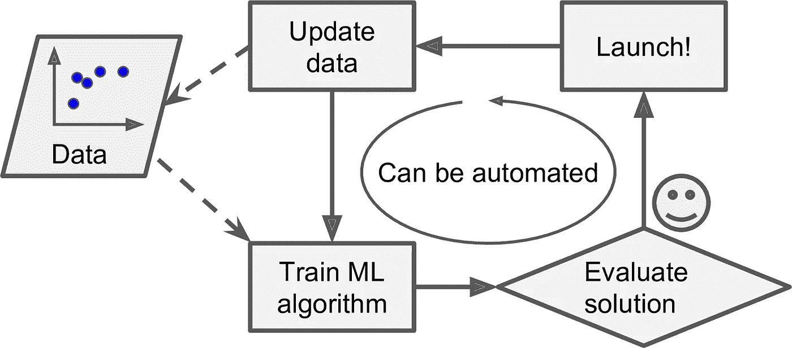

# 机器学习— 101(第一部分)

> 原文：<https://medium.com/mlearning-ai/machine-learning-101-part-ede174428453?source=collection_archive---------5----------------------->


这个博客的想法是尽可能地删除行话。概述机器学习以及我们选择它的原因。

我正在用 Sklearn 和 TensorFlow 阅读一本名为[的手把手的机器学习的书，我想把我在这里读到的东西作为一种实践(自私)或教别人我学到的东西。](https://www.oreilly.com/library/view/hands-on-machine-learning/9781492032632/)

让我们跳进来吧

# 什么是机器学习？

**一个研究领域，给予计算机学习的能力，而不需要明确的编程。**

这个定义已经足够了，你几乎在任何地方都能听到。

让我们一劳永逸地理解它与传统编程的区别，

例如，我们邮件中的垃圾邮件过滤器是基于机器学习原理工作的。给定垃圾邮件的示例(由用户)和非垃圾邮件的示例(普通邮件)，用机器学习编程的垃圾邮件过滤器能够标记出即将到来的垃圾邮件。

好吧，你可以问我，Ash，我也可以用传统编程来做这件事’。

你当然可以，但是想想能让你轻松工作的事情？你还在努力吗？

# 传统编程的工作原理(垃圾邮件过滤器)

首先，我们得想办法通知程序**垃圾邮件是什么样子的。在我们的电子邮件中，我们可能会有一些单词或短语(如 4U、信用卡、免费、神奇等..)这往往会出现在邮件的主题部分。甚至可能是发件人姓名、邮件正文等一些奇怪的术语…**


from Hands-on ML book

然后我们将为我们注意到的每个模式编写一个算法，

```
if ('4U' in mail_txt):
	return 'SPAM MAIL' 
else:
	return 'Easy! Good one'
```

好吧，不要评价我的编程技能，我试图让它容易理解。同样，对于据说要通知**的模式数量，垃圾邮件**也将进行类似的处理。

在我们的邮件列表中添加太多奇怪的术语或模式，程序可能会变成一长串复杂的规则。

好吧，如果垃圾邮件发送者注意到他们所有包含 ***4U*** 的电子邮件都被阻止了怎么办？他们发现你有多聪明。他们可以改变一点惯例，从 ***4U*** 到 ***来代替* *U*** ，这就绕过了你做的程序。

我们之前编写的代码甚至没有 0.0001%的机会检测到单词的这种变化。如果垃圾邮件制造者继续绕过您的垃圾邮件过滤器，您将需要不断编写新的规则。

# 机器学习如何减轻垃圾邮件过滤器？

机器学习比那些垃圾邮件发送者聪明，说实话，它自动学习哪些单词和短语应该是***垃圾邮件或者不是*** 但是学习 ***垃圾邮件*** 和 ***非垃圾邮件中单词的异常频繁模式。***

例如，机器学习足够智能，可以理解垃圾邮件中包含的单词，如(4U、信用卡、免费、神奇等..)被您标记为垃圾邮件，因此，如果邮件包含这类单词，将被视为**垃圾邮件。**

这就是为什么有时正常邮件会出现在垃圾邮件区。这让我们明白机器学习**不可能** 100%准确，它们会犯一些错误。

但是他们简化了这个过程，这就是我们想要的，很少的损失是可管理的，你提供给他们更多的潜在模式，他们学得更好，这意味着 ***更多的数据*。**



from Hands-on ML book

然后，当垃圾邮件发送者变得聪明时，机器学习会非常聪明地注意到例如 *4U* 在用户标记的垃圾邮件中变得异常频繁，并且它在没有人工干预的情况下开始标记它们。

# 机器学习有很大用处的地方。

*   为了简化问题，现有的解决方案需要很多长的规则列表，例如，我们当时看到的垃圾邮件过滤器。ML 算法可以简化代码，性能优于传统方法。
*   程序用来适应新数据的场景，机器学习系统能够毫不费力地做到这一点。
*   深入了解复杂的问题和大量的数据。

# ML 的应用示例

*   在脑部扫描中检测肿瘤，也就是 ***语义* *分割***(ml 问题的一种)。这里对图像中的每个像素进行分类。
*   推荐客户可能感兴趣的产品， ***推荐者* *系统*。每个人都去过亚马逊，盯着一些产品，他们像幽灵一样跟着我们，无论我们在哪个网站或任何应用程序上投放广告。在这种情况下，您过去的购买序列被视为数据。**
*   为一个游戏建造智能机器人， ***强化学习*。例如在国际象棋中，如果你下错了一步，那么你的训练代理(机器人)足够聪明，能够理解这是一步错误的棋。简单地说，它通过反复试验来学习。**
*   就像我们如何训练一只小狗或小猫，给它们食物，让它们学会一种习惯或一些动作。

当我读这本书的时候，我会把它写出来。希望你喜欢这个，如果你留下你的反馈，这将有助于我找出我错在哪里。

祝您愉快！不断学习机器学习🤖