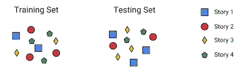

# 机器学习— 101(第二部分)

> 原文：<https://medium.com/mlearning-ai/machine-learning-101-part-ii-d6b8cf2ac493?source=collection_archive---------6----------------------->

欢迎再次回来，冠军，希望你已经阅读了之前的博客，这是 ML 101 的第一部分，如果没有，那么在这里阅读[机器学习-101(第一部分)](/datadriveninvestor/machine-learning-101-part-ede174428453)。

所以，在之前的博客中，我们遇到了一个关于 ML 是什么的基本直觉。现在我们将窥视一下关于**的数据。**

我们还没有谈到对任何数据科学问题都非常重要的数据。永远记住，机器学习只是一个傀儡，它无所事事。傀儡操纵者(**数据**)做着繁重的工作。

# 数据

在所有的机器学习问题中，有三种数据:

*   训练数据(或)分割
*   验证数据(或)分割
*   测试数据(或)分割

Credits to [Daniel Bourke](https://www.youtube.com/channel/UCr8O8l5cCX85Oem1d18EezQ)

在开始之前，想象一下你如何准备考试的场景。记住这一点，可能有助于我们更好地理解这些分歧。

# 训练数据(或)分割

我们的机器学习模型最初安装在**训练集**中。我们总是在**训练台上**训练我们的模特，这是我们的模特学习的地方。

简单来说，在参加考试之前，我们通常会做好准备。这包括学习材料、模拟测试等..

我们为准备考试而消耗的**学习资料(或)课程资料**可以称为**培训集。在这里，你将通过学习考试所需的各种知识得到训练，这将是你考试前准备的第一步。**

这通常是我们整个数据集的一个子集，实际上，人们将他们数据的 75%作为一个训练集。有了这 75% 的数据，我们将训练我们的模型，让它达到最佳状态。

# 验证数据(或)分割

我们学到了一些东西，但我们必须评估自己，弄清楚我们准备得有多好，不是吗？

在机器学习中，我们使用一个**验证集**来调整我们的模型。换句话说，我们在这里调整我们的模型，并对其进行评估，以找出他们做得好不好？他们学得好吗？

这被认为是机器学习的重要一步，驱使我们进入一个叫做**泛化的重要话题。**要说一个 ML 模型做得好或者有效，它应该能够**很好地概括。**

> ***泛化*** *:机器学习模型对它以前没有见过的数据表现良好的能力。*

我们的模型应该能够在以前没有见过的数据上表现良好。这就像你在参加考试前经历的模拟测试一样。在这一阶段，你要解决你在学习中没有遇到的不同问题。

当我们解决问题的时候，我们可以评估我们的立场。如果我们的表现很差，那么我们回去消耗更多的材料，并再次回到模拟测试。这确实是一个反复的过程。

我们使用**验证集，**作为我们的模拟测试，以查看我们的模型学习得如何。如果它不学习，我们将进入我们的训练集进行一些更改，再次训练它们，并再次评估验证集。

在调整模型**超参数**时，用于提供模型拟合训练数据集的无偏评估的数据样本被称为**验证集**。

现在，把**超参数**想象成一个烤箱，在这里你可以调整烤箱和烹饪食物。我会在以后的博客中回到这个话题。

# 测试数据(或)分割

这是在机器学习项目工作流程结束之前保持不变的集合。在对数据进行训练和调整之后，您将在这里评估模型并比较结果。

数据样本用于对符合训练数据集的**最终模型**进行无偏评估。这是一组用于评估绩效的示例。

当你使用测试集估计**泛化**错误时，你的估计会过于乐观，你会推出一个性能不如我们预期的系统。这被称为**数据窥探偏差。**

打个比方，测试集就是你的**考试**本身。在那里你出现并表演你在准备过程中学到和练习的任何东西。

# 事情要搞清楚

*   术语**测试集**和**验证集**有时在工业和学术界使用时会颠倒其含义。
*   在错误的用法中，“测试集”变成了**开发集**,“验证集”是用于**评估完全指定的分类器(或)模型的性能**的独立集。
*   **永远不要在测试数据上训练，**如果你在你的评估指标上看到令人惊讶的好结果，这可能是一个信号，表明你在测试集上意外地**训练了**。
*   不要选择与训练集特征不同的测试集。

这是一个关于我们将如何分割数据的基本介绍，我故意漏掉了某些东西，并在另一系列博客中解释了它们。

诸如交叉验证、超参数调整、过拟合和欠拟合等将会出现。希望你喜欢！留下反馈。我们的目标是让事情变得更简单，这也是我试图用这些博客做的事情。

祝您愉快！