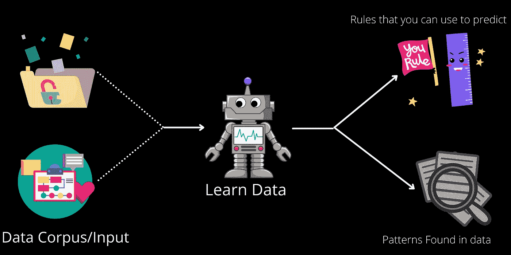
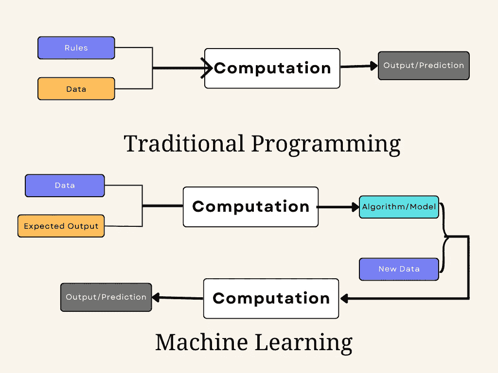
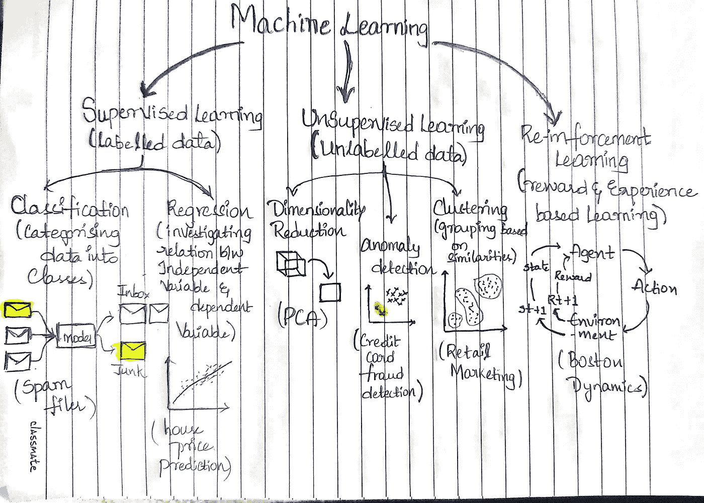

# 机器学习

> 原文：<https://medium.com/mlearning-ai/machine-learning-3050fc7759c7?source=collection_archive---------10----------------------->

Image Credits: Author

当大多数人听到“机器学习”时，他们可能会想象一个机器人在做一些事情，或者像《终结者》这样的电影中的虚构角色，这取决于你问的是谁。但是机器学习不是未来的幻想，它已经在这里了。事实上，它从几十年前就存在于我们周围的一些专门应用中，比如邮件中的垃圾邮件过滤器。在这篇文章中，我们将进一步探讨机器学习，从什么到为什么，你也将使用一个实际的数据集来尝试自己。

# 什么是机器学习？

首先，我们将看到一些正式的定义

> **机器学习** ( **ML** )是一个研究领域，致力于理解和建立“学习”的方法，即利用数据来提高一些任务集的性能的方法。—维基百科。
> 
> **机器学习(ML)** 是一个研究领域，它赋予计算机在没有明确编程的情况下学习的能力。— **作者塞缪尔，1959 年**
> 
> 如果由 **P** 测量的计算机程序在 **T** 上的性能随着经验 **E** 而提高，则称该计算机程序从关于某些任务 **T** 和某些性能测量 **P** 的经验 **E** 中学习。汤姆·米切尔，1997 年

当你第一次听到这些定义时，你可能会感到不知所措，但不要担心，把它们想象成某种智能系统，它理解底层数据模式并据此采取行动。你现在最关心的可能是 ***ML 系统是如何征服传统编程的？***

Image Credits: Author

让我们探索一下 ML 是如何在传统编程无法解决问题的地方使用的。假设您正在为组织的**垃圾邮件防护**创建一个过滤器。

*   **传统的编程方式
    -** 研究问题。
    **-** 写一些检测垃圾邮件的规则。
    **-** 评估结果可能导致两种情景:
    1 .如果它通过了所有的测试条件，启动算法。
    2。否则重写先前遗漏的规则。

这种方法真的有助于检测所有潜在的垃圾邮件吗？这个问题的答案显然是否定的，每次新的垃圾邮件出现时，我们都必须改变和适应新的规则，这是令人厌倦的、耗时的，并且增加了程序的行数。在这种情况下，ML 确实可以帮助我们。

*   **ML 编程方式
    -** 研究问题。
    **-** 搜集相关史料。
    **-** 使机器学习方法适应数据的性质和种类。
    **-** 拟合数据，评估算法性能。
    1。如果它表现良好，发布模型。
    2。否则，使用更新的数据或一些错过的用例重新调整模型。

***现在你可能会想，即使我们在这里调优，那又有什么不同呢？*** 这个问题的答案是，每当我们在 ML 中看到一个新的例子时，我们可以自动化模型来适应变化和学习，而不是制定规则，因为它不能识别一些新的情况。*最大似然法的主要好处是，它可以通过过去的经验或通过数据拟合得到的知识发现以前未知的数据。*

## 注 ML 在以下情况下最佳:

*   当前解决方案需要大量手工调整或大量规则的问题:ML 可能会提高性能并使代码更简单。
*   不断变化的环境:机器学习系统可以适应新数据。
*   获得关于困难问题和大量数据的知识。

## 使用 ML 时，我们需要解决我们的问题吗？

由于每个挑战都有独特的解决方案，ML 还为我们提供了几个桶，根据我们使用的数据类型对我们的问题进行分类。

Image Credits: Author

# 结论:

最后，我们生活在一个智能系统漫游的时代，智能系统在我们的口袋、手和房子里，帮助我们通过简单的命令和点击来做更简单、更容易的事情，如 google photos 为我们收集照片、垃圾邮件过滤器、亚马逊、网飞的产品和电影推荐等。希望这篇文章已经用可理解的格式介绍了 ML，我希望能收到您的回复。

 [## Mlearning.ai 提交建议

### 如何成为 Mlearning.ai 上的作家

medium.com](/mlearning-ai/mlearning-ai-submission-suggestions-b51e2b130bfb)