# 机器学习

> 原文：<https://medium.com/mlearning-ai/machine-learning-84a2958d9cce?source=collection_archive---------1----------------------->

## 将这些点连接起来

## ML 概述


[Image by Freepik](https://www.freepik.com/)

你认为**特斯拉汽车**和**线性回归之间有什么共同点？** **特斯拉**，一辆**执行高度复杂的深度学习算法**的汽车，同时以如此巨大的**精度和速度**运行近**60 英里/小时**，而**线性回归**基本上是一条**最佳拟合线😂(恕我直言 LR)。**

答案与每个机器学习或深度学习算法的**最小单元**有关。正如我们所知，“**物质的最小单位是原子。**

在这篇文章中，我们将了解机器学习的不同概念和算法，以及它们是如何产生的。这是一种基于直觉的方法。简而言之，它帮助我们了解一个特定的算法是如何和为什么发生的，并连接不同概念之间的联系。

# 描述—

*   机器学习的应用。
*   机器学习的直观方法(边做边学)。
*   **机器学习的最小单元**。
*   如何决定选择哪种算法/模型？

在直接进入主题之前，让我们先看看机器学习的应用，以便让我们的思维进入 ML 世界。

# 机器学习的应用

**简单来说，就是无处不在，**

*   从你的 **Snapchat** ，到 **Instagram Feed** ，
*   复杂的**特斯拉汽车**，到我最喜欢的**之一谷歌搜索..对于 MCQ 的(😈😏)**
*   几个月前，预测第三次浪潮的兴起。
*   **语法上**帮助我为这篇文章写正确的**拼写**。

我们可以有更多的…

# 边做边学

假设我们想要解决一个环境问题，或者说**我们想要制造一辆自动驾驶汽车**。

让我们试着想出一个能做到这一点的算法。

```
**class** Some_Algorithm:
     '''
     '''
```

如果我们试图创造一辆能像人类一样驾驶的汽车，**很明显它必须拥有像人类一样的能力，也就是说**我们的代码应该是这样的——

## 1.它可以从过去的经验中吸取教训

在我们的情况下，这意味着汽车(算法)应该记住或学习它过去的经验，如

> 前面红灯:停
> 
> 如果路向左:燕鸥向左
> 
> 如果前方有动物/人:停止

这个特殊的例子被称为—

# 监督学习

在这些中，我们的算法**从给定的**问题/状态/情况**和它们各自的**答案中学习**。**当将来它发现问题时，它能够根据自己的学习来解决问题。

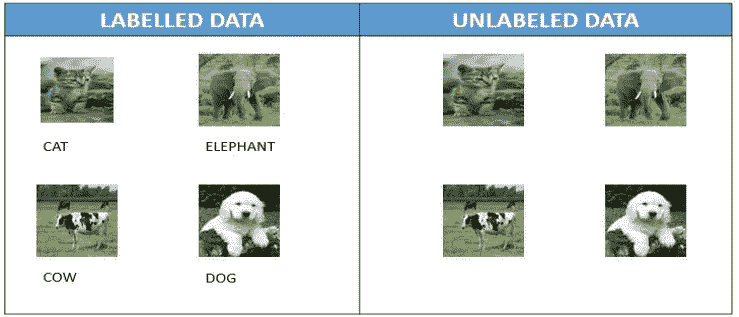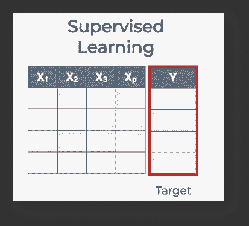

## 2.组合相似的对象

很明显，我们不会编写**一些代码来处理宝马**汽车，而为法拉利编写**不同的代码，我知道这听起来可能很愚蠢，但是，自动驾驶汽车不知道宝马和法拉利**之间的**关系，甚至不知道行人或动物**之间的关系。

我的观点是，我们必须想出一种算法，能够识别宝马、法拉利等属于同一类别，而动物和帕斯特里恩属于不同类别，以便根据它们的特定类别做出相应的决定。这就是所谓的

# 无监督学习

在这种情况下，我们**没有被提供任何解决方案/标签**，并且应该**基于某些类型的相似性**将对象聚集在一起。相似性可以基于任何属性，如颜色、形状、距离等。

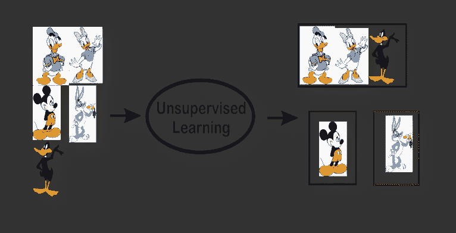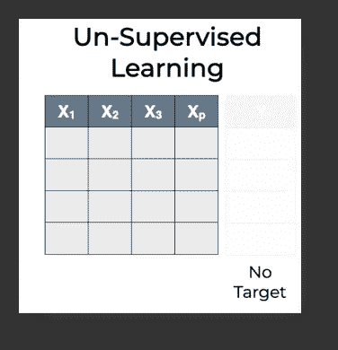

## 3.亨德尔大量的不确定性

从目前来看，需要注意的变量很多，比如搜索**不同类型的物体**、**将其分组**、处理**不同类型的天气状况**、**处理湿滑泥泞的道路**、**还有其他超速行驶的汽车、**等等。有太多的变数需要注意。编写处理所有这些场景的代码是不可能的。

因此，我们应该创建一个可以自己学习东西的算法，而不用为每个方面编写代码。这被称为—

# 强化学习

在这里，我们编写了一个算法，它将为完成特定的**动作**提供特定类型的**奖励**。例如，有一个左转，但汽车右转，然后我们会给汽车(算法)一个 **-ve 奖励，**，而如果它左转，它将被授予 **+ve 奖励**。因此，基本上我们的算法将尝试**减少-ve 奖励**并尝试**获得+ve 奖励**，在此过程中，它学习在不同情况下采取行动。(显然，在现实生活中，我们不能让汽车像这样学习，所以我们在模拟中进行这个过程)

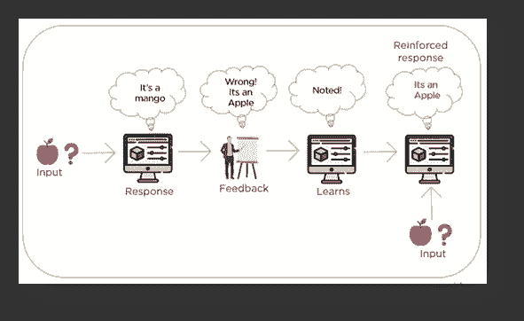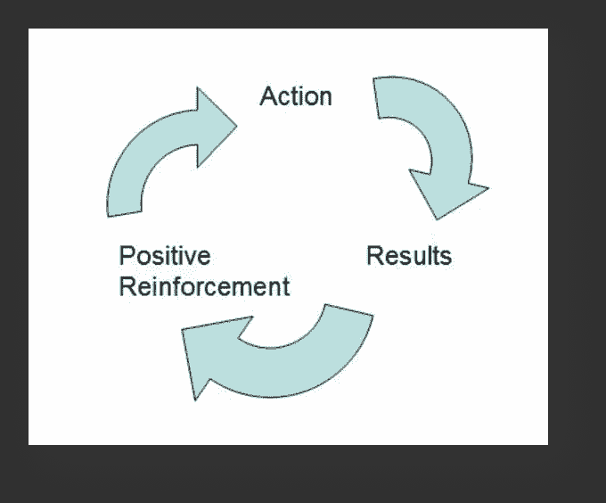

# 算法的结构

```
**class MachineLearning**: **def** Supervised_Learning**(** Situation**,** Answers **):
           return** model **def** Unsupervised_Learning**(** Situation **):
           return** model **def** Reinforcement_Learning**(** Situation **):
           return** model
```

# 最小单位

现在你知道了机器学习的不同方法，让我们来回答以下问题。
你认为**特斯拉汽车**和**线性回归**有什么共同点？

因此，对于要解决的每个问题，都有一些输入要提供给算法学习。这个已知的输入被称为**数据**。这些数据可以被视为 **CSV** 或**图表。**

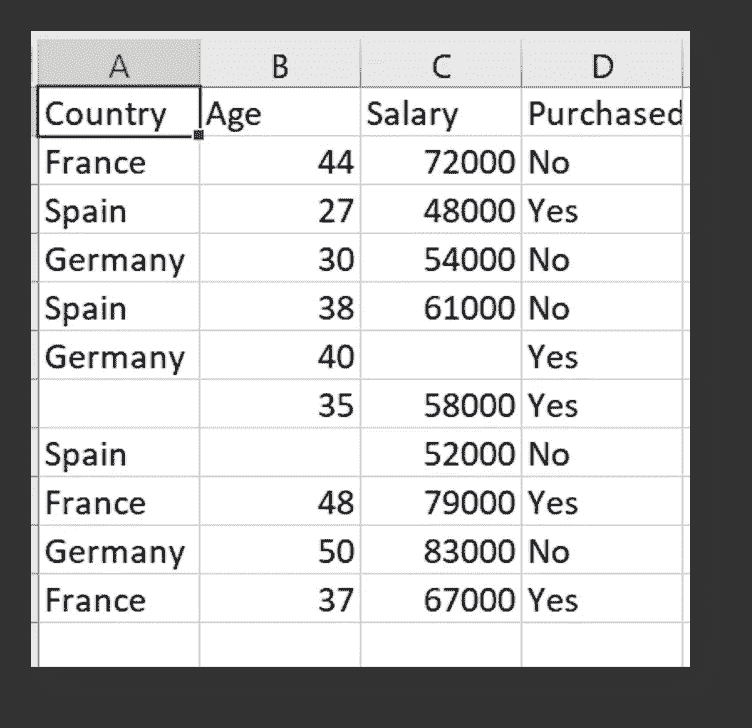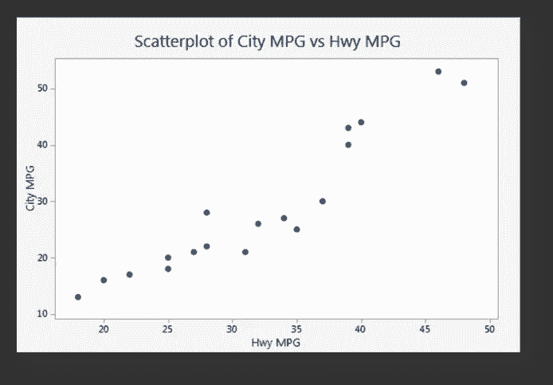

**Same Data Can be represented as CSV or Graph**

所以答案是在每一个最小规模的 ml 算法中，我们必须

## **1。要么想出一条可以遵循数据分布模式的线。**

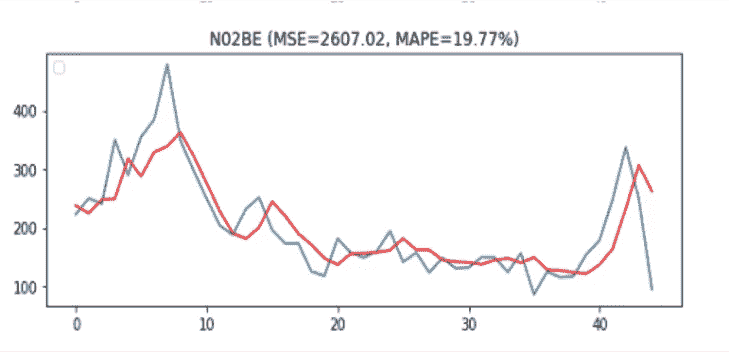

**Sales of medicine per day**

## 2.想出能够区分不同集群的线条呈现图形。

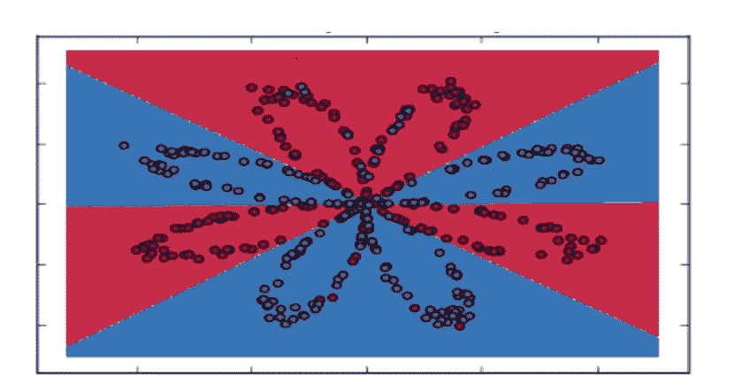

**Distinguishing classes using Neural Network**

无论是有监督的，无监督的，还是幕后的强化学习，他们都在试图建立这条线。在某种程度上，我们可以称这条线为决策线/边界。

决策边界有两种类型——

1.  **线性**
2.  **非线性**

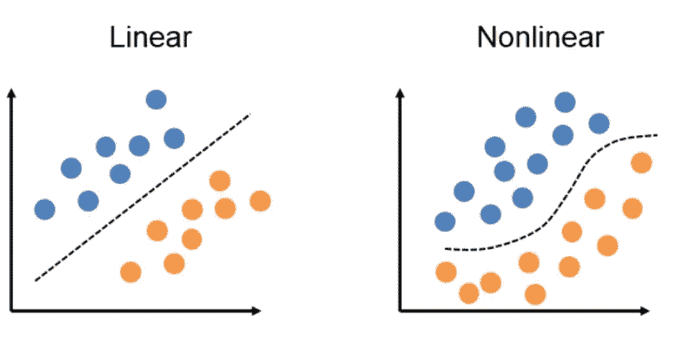

[Image by shopoutyifa](https://www.shopoutyifa.top/)

如你所知，最终我们需要选择一个生成这个**决策线/边界**的算法来解决机器学习问题。

但是，**既然我们知道了不同的算法做出决策的界限！！**

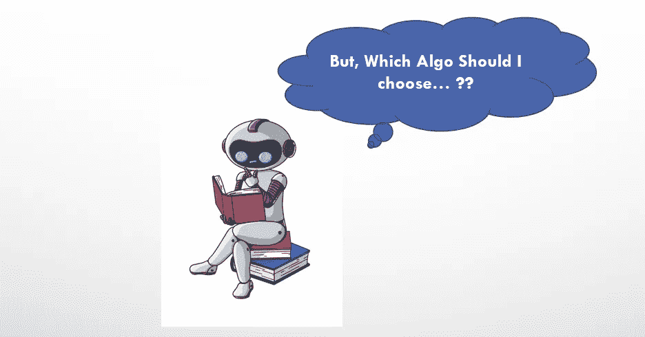

要知道选择哪种**算法/模型**，问问自己这些问题——

## Q1。你正在解决哪种类型的问题？

*   是有监督的，无监督的，还是强化学习的问题？

## Q2。问问自己目标是什么？？

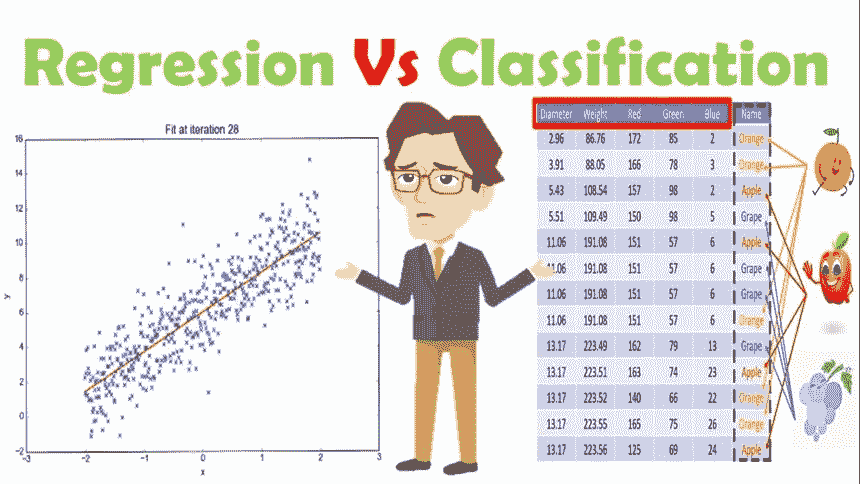

## **Q3。你的数据是线性可分的还是非线性的？**

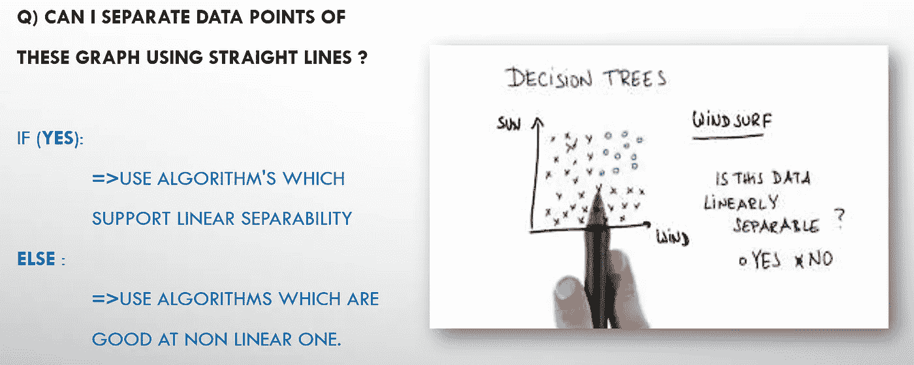

# 结论—

我们已经看到了如何直观地处理**监督**、**非监督**和**强化**学习算法。我们还看到，无论是**神经网络**还是**线性回归**，相同的方法都适用于较小的规模。最后，我们学习了选择更好的**模型/算法**的步骤。

如果你觉得这种直观的方法和信息有帮助，考虑离开👏😄。