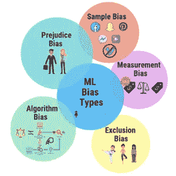
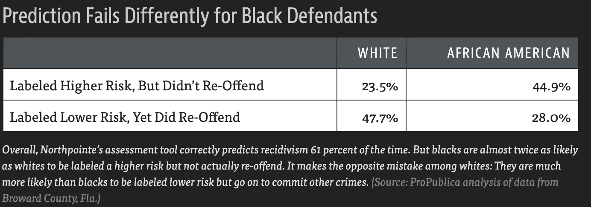
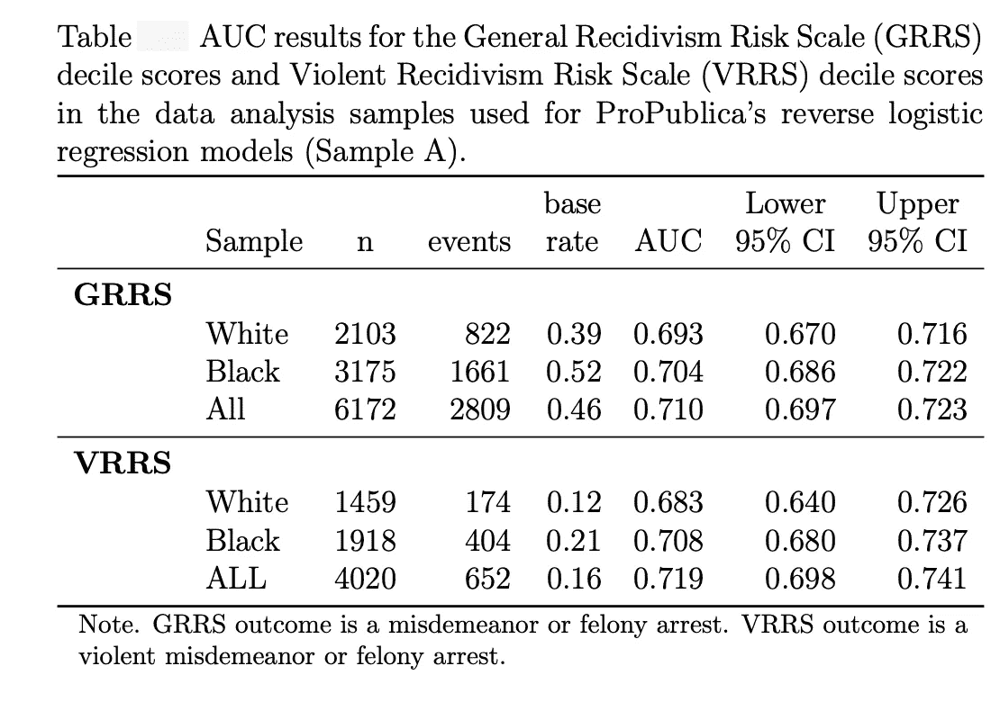

# 机器学习/人工智能偏见

> 原文：<https://medium.com/mlearning-ai/machine-learning-ai-bias-eb2b854a0f9d?source=collection_archive---------1----------------------->

Image Source: [https://predera.com/reimagining-ai-building-togetherness-with-bias-monitoring/](https://predera.com/reimagining-ai-building-togetherness-with-bias-monitoring/)

今天，深度学习算法在基于人工智能的应用中得到了广泛应用。这些算法发现数据中的模式，并被用于做出影响人们生活的决策。

但是这些模型是完全公平的，没有偏见的吗？

作为人类，我们理解公平。我们有责任确保我们的算法是公平的。

## 什么是公平？

*   平等待遇
*   保持公正

## 为什么没有偏见很重要？

*   偏见可以改变决定
*   一个错误的结果可能会毁掉一个人的一生

为了理解现实生活中偏见的含义，让我们看看刑事司法系统中的机器偏见。

独立、非营利、调查性新闻网站 ProPublica 在 2016 年发表了一篇关于机器偏见的[文章](https://www.propublica.org/article/machine-bias-risk-assessments-in-criminal-sentencing)。它揭露了用来预测未来罪犯的软件中的种族偏见。

执法部门可以做出的最重要的预测之一是一个人再次犯罪的可能性。它被称为**再犯罪率，**即**，**重新犯罪的可能性

当在刑事司法(或一般情况下)中使用人工智能时，种族偏见可能会成为一个巨大的问题。这可能会带来毁灭性的不公平后果。为了避免这种情况，我们不得不问一下预测是否公平。

[**COMPAS**](http://www.northpointeinc.com/files/technical_documents/FieldGuide2_081412.pdf) **(替代制裁的矫正罪犯管理概况)**是美国司法系统使用的一种算法，用于评估罪犯成为**累犯**即再次犯罪的可能性。

这种算法给违法者分配一个 COMPAS 分数，以预测他们是否会再次犯罪。ProPublica 发现，该系统预测非裔美国人比其他种族更有可能再次犯罪。

Source: [https://www.propublica.org/article/machine-bias-risk-assessments-in-criminal-sentencing](https://www.propublica.org/article/machine-bias-risk-assessments-in-criminal-sentencing)

波登犯了一个小偷小摸，并有一个轻微的轻罪记录，从她是一个少年。普拉特是一个更老练的罪犯，他曾因武装抢劫和其他一些指控入狱。

但是根据 COMPAS 评分(本质上是一种风险评估), Borden 被评为高风险，Prater 被评为低风险。

然而，两年后，计算机算法被发现做出了错误的预测。博登没有犯任何新的罪行。另一方面，Prater 因抢劫被判 8 年徒刑。

根据 ProPublica 的说法，COMPAS 模型的预测失败了，因为它错误地预测了非裔美国人被告的较高累犯率和白人的较低累犯率。

Source: [https://www.propublica.org/article/machine-bias-risk-assessments-in-criminal-sentencing](https://www.propublica.org/article/machine-bias-risk-assessments-in-criminal-sentencing)

Northpointe(创建 COMPAS 的公司)做了一个技术分析来反驳 ProPublica 关于种族偏见的文章。他们使用 ProPublica 分析过的相同数据进行了技术分析，以解决 ProPublica 文章中提出的关于 COMPAS 风险量表对黑人和白人的公平性的问题。

Source: [http://go.volarisgroup.com/rs/430-MBX-989/images/ProPublica_Commentary_Final_070616.pdf](http://go.volarisgroup.com/rs/430-MBX-989/images/ProPublica_Commentary_Final_070616.pdf)

该表显示了样本数据集中一般累犯风险量表(GRRS)和暴力累犯风险量表(VRRS)的 [AUC](https://developers.google.com/machine-learning/crash-course/classification/roc-and-auc) 结果。此样本数据是两年数据框架的子集(GRRS 的*一般累犯数据框架和 VRRS 的*暴力累犯数据框架)，应用了 ProPublica 使用的过滤器。

**GRRS 分析:**白人的 AUC 为 0.693 (0.670，0.716)。黑人的 AUC 为 0.704 (0.686，0.722)。比较黑人和白人各自 ROC 曲线下面积的测试表明面积没有显著差异(p=0.438)。

**VRRS 分析:**白人的 AUC 为 0.683 (0.640，0.726)。黑人的 AUC 为 0.708 (0.680，0.737)。比较黑人和白人各自 ROC 曲线下面积的测试表明面积没有显著差异(p=0.383)。

Northpointe 在他们有数据支持的技术评论和分析中，计算了目标人群中黑人和白人的预测值，并得出结论，他们的模型没有偏见。

## **我们如何检测和减轻机器学习模型中的偏差？**

偏见可能会在模型构建的任何阶段出现——理解/构建问题、收集数据或准备数据。

机器偏见是一个很难解决的问题，但科学界正在努力解决这个问题。根据《麻省理工技术评论》上的一篇文章[,人工智能研究人员正在使用各种方法来减轻人工智能偏见:](https://www.technologyreview.com/2019/02/04/137602/this-is-how-ai-bias-really-happensand-why-its-so-hard-to-fix/)

*   帮助[检测](https://arxiv.org/abs/1805.12002)并减轻训练数据中隐藏偏差的算法。(例如: [AI 公平 360](http://aif360.mybluemix.net/) )
*   算法[减轻](https://www.technologyreview.com/the-download/612502/ai-has-a-culturally-biased-worldview-that-google-has-a-plan-to-change/)模型学习到的偏差，而不考虑数据质量
*   让公司对更公平的结果负责的过程。性别差异
*   讨论出公平的不同定义(例如: [AI Fairness 360](http://aif360.mybluemix.net/)

根据欧盟人工智能高级专家组[的指导方针](https://digital-strategy.ec.europa.eu/en/library/ethics-guidelines-trustworthy-ai)，我们可以通过制作我们的机器学习模型来减少偏见:

*   合法——遵守所有适用的法律法规
*   稳健——既从技术角度出发，又考虑到其社会环境
*   道德——尊重道德原则和价值观

好消息是，我们现在知道人工智能偏见是一个具有重大后果的真实问题，并正在朝着正确的方向采取措施以找到解决方案。

## 来源

*   [https://www . propublica . org/article/machine-bias-risk-assessments-in-criminal-pending](https://www.propublica.org/article/machine-bias-risk-assessments-in-criminal-sentencing)
*   [*https://www . equiv ant . com/response-to-propublica-democrating-accuracy-equity-and-predictive-parity/*](https://www.equivant.com/response-to-propublica-demonstrating-accuracy-equity-and-predictive-parity/)
*   [*http://go . volarisgroup . com/RS/430-MBX-989/images/ProPublica _ commentation _ Final _ 070616 . pdf*](http://go.volarisgroup.com/rs/430-MBX-989/images/ProPublica_Commentary_Final_070616.pdf)
*   [*http://www . north pointe Inc . com/files/publications/Criminal-Justice-Behavior-compas . pdf*](http://www.northpointeinc.com/files/publications/Criminal-Justice-Behavior-COMPAS.pdf)
*   [*https://www . technology review . com/2019/02/04/137602/this-is-how-ai-bias-really-happens and-why-its-so-hard-to-fix/*](https://www.technologyreview.com/2019/02/04/137602/this-is-how-ai-bias-really-happensand-why-its-so-hard-to-fix/)
*   [*https://towards data science . com/is-your-machine-learning-model-biased-94 F9 ee 176 b 67*](https://towardsdatascience.com/is-your-machine-learning-model-biased-94f9ee176b67)
*   [*https://www . top tal . com/artificial-intelligence/remeding-ai-bias*](https://www.toptal.com/artificial-intelligence/mitigating-ai-bias)

Divya Sikka 是 Inspirit AI 学生大使项目的学生大使。Inspirit AI 是一个大学预科浓缩计划，通过在线直播课程让全球好奇的高中生接触人工智能。了解更多关于 https://www.inspiritai.com/**。**