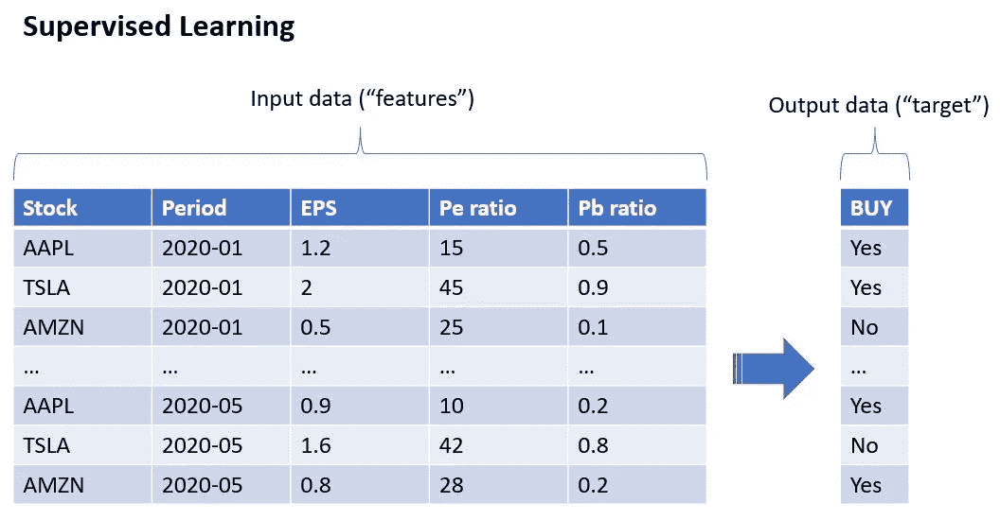

# 机器学习和股票交易

> 原文：<https://medium.com/mlearning-ai/machine-learning-and-stock-trading-ebf9a87c4297?source=collection_archive---------2----------------------->

## 在股票市场上利用数据和算法的力量

Photo by [Stephen Dawson](https://unsplash.com/@dawson2406?utm_source=medium&utm_medium=referral) on [Unsplash](https://unsplash.com?utm_source=medium&utm_medium=referral)

他的帖子面向对机器学习和股票交易感兴趣的人。目标是向读者提供什么是机器学习以及如何在股票市场上使用机器学习的概述。

这是一个高层次的帖子，没有任何代码或技术解释。我打算在其他帖子中更深入地探讨技术细节，敬请关注！

# 什么是机器学习？🤖

机器学习(ML)是人工智能的一个分支，它使用算法和数据来做出决策。

最直接的 ML 形式被称为 S *监督学习。*在*监督机器学习*中，计算机“学习”一些输入变量(称为“特征”)和输出变量(称为“目标”)之间的关系，以预测未来。

例如，股票的历史表现(如每股收益、市盈率或市净率)可以用作输入变量。
输出变量可以是表明股票是否有正回报的指标(买入/不买入)。

在这种情况下，算法将从前几年的数据中学习，然后能够建议某只股票未来是否可能有正回报。
即回答所有投资者最有价值的问题:*该不该买这只股票？*

下图说明了这个概念。

# ML 在交易中有什么优势？👍

*   ML 模型通过经验提高了它们的性能，并且可以处理大量的数据
*   他们可以找出人类难以理解的非常复杂的关系
*   他们基于数据而非情绪做出决策，帮助投资者保持头脑清醒

# 可以使用什么样的功能？🥗

历史价格、公司基本面、天气数据、新闻、Reddit 线索…

几乎任何东西都可以用在 ML 中。最棘手的部分是能够将所有这些数据转化为算法可以理解的东西。

这是数据科学家花费大部分时间的地方:准备数据和运行分析以选择性能最佳的一组特征。

# 算法的目标是什么？🎯

简而言之，创建目标有两种主要方式:

*   *回归*:预测一个固定期间(例如下个月)结束时的实际股票收益)= > [+12%]
*   *分类*:股票在未来一段时期(月、季)是否会有高于 10%的回报？= >【是/否】

更复杂的目标可以使用止盈或止损阈值来建立，例如由德普拉多提出的三重障碍法就是一个非常有趣的方法

选择一个好的目标很重要，这取决于手头的数据和总体目标。在我的策略中，我同时使用了回归和分类(使用更复杂的设置)。

# 最后🔚

这是对机器学习及其用于股票交易的快速介绍。

当然，在构建一个好的 ML 模型的过程中还有很多事情要做。在后面的文章中，我打算更深入地研究 ML 的一些技术方面。

这是我在 Medium 上的第一篇帖子，如果你有任何问题或评论，请发表评论！😃

你也可以在交易平台 [eToro](https://etoro.tw/3xnzHLj) 上关注我，在那里我将机器学习作为我投资策略的核心。

*此帖子包含社交交易平台* [*eToro*](https://etoro.tw/3xnzHLj) 的附属链接

 [## Mlearning.ai 提交建议

### 如何成为 Mlearning.ai 上的作家

medium.com](/mlearning-ai/mlearning-ai-submission-suggestions-b51e2b130bfb)