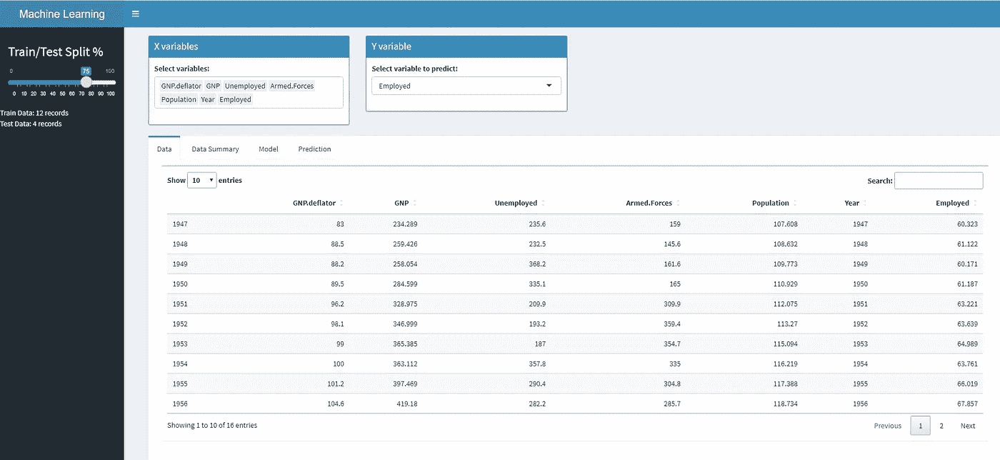
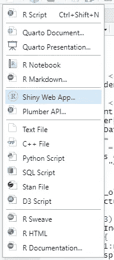
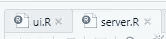
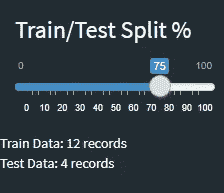
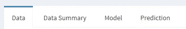
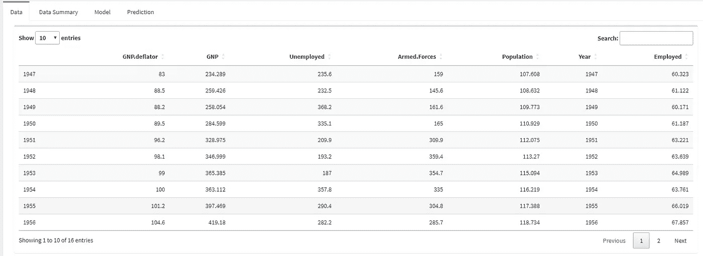
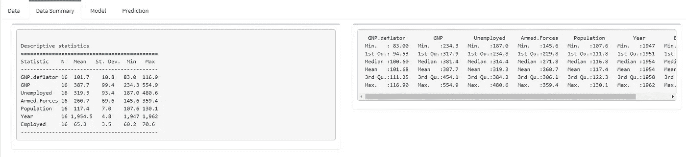
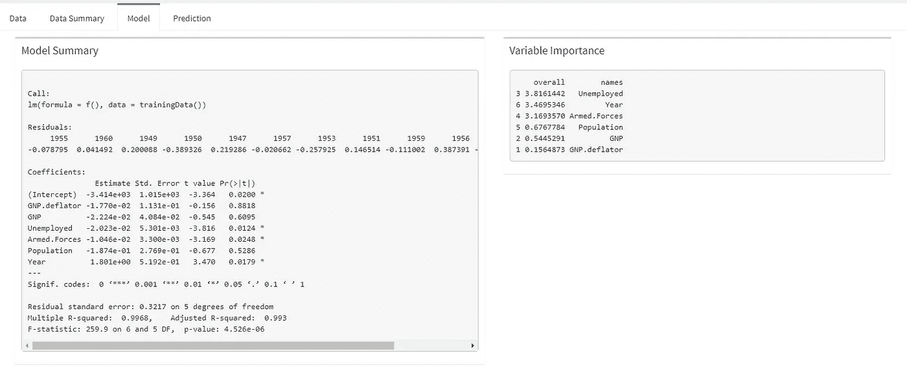
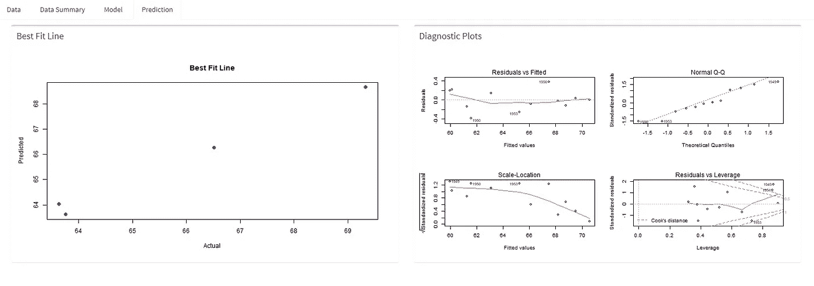

# 带 Shiny 的机器学习 App

> 原文：<https://medium.com/mlearning-ai/machine-learning-app-with-shiny-8c088f2f4646?source=collection_archive---------3----------------------->


[https://appsilon.com/scaling-and-infrastructure-why-is-my-shiny-app-slow/](https://appsilon.com/scaling-and-infrastructure-why-is-my-shiny-app-slow/)

本文将介绍如何使用 R Studio 构建一个闪亮的应用程序。此外，还将讨论 Shiny 是什么以及使用 Shiny 的好处。本演练的先决条件如下:

*   R 的安装
*   R Studio 的安装
*   安装用于 R Studio 演示的包

要查看本演练中使用的文件，请使用下面的我的 GitLab 或 GitHub 库:

git lab—[https://gitlab.com/rshowrav/machine_learning_shiny_demo](https://gitlab.com/rshowrav/machine_learning_shiny_demo)

GitHub—【https://github.com/rshowrav/machine_learning_shiny_demo 

## 什么是闪亮的？

Shiny 是 Posit(以前的 R Studio)开发的一个包，可以帮助用 R 或 Python 轻松构建 web 应用程序。此外，有一个开源的服务器可以发布和维护这些内容。闪亮的应用程序可以使用 CSS 主题、htmlwidgets 和 Javascript 动作进行扩展。通过本演练，您将看到使用它是多么简单。

## 演练

本演练将使用 R-Studio 提供的数据集 Longley 数据集。这是一个经济回归数据集。数据集有七个经济变量(GNP .平减指数、GNP、失业、武装部队、人口、年份和就业)。我们的最终输出将如下所示:



1.  在 R Studio 中选择新的闪亮网络应用



2.第一步会给你以下两个文件。第一个是用户界面(ui。r)而第二个是针对服务器(Server。r)。清理这些文件。



3.在用户界面文件中，使用以下代码加载以下库(注意:如果尚未完成，请安装)。

```
library(shiny)
library(shinydashboard)
library(maps)
library(dplyr)
library(leaflet)
library(shinycssloaders)
library(shinythemes)
library(datadigest)
library(rio)
library(DT)
library(stargazer)
```

4.使用下面的代码在服务器文件中做同样的事情。

```
library(shiny)
library(shinydashboard)
library(maps)
library(dplyr)
library(leaflet)
library(ggplot2)
library(tidyverse)
library(DT)
library(plotly)
library(corrplot)
library(caret)
library(stargazer)
```

5.用户界面是使用下面的代码构建的。

```
dashboardPage(
  dashboardHeader(title = "Machine Learning Demo", dropdownMenuOutput("msgOutput")),
  dashboardSidebar(
    sliderInput(
      "Slider",
      label = h3("Train/Test Split %"),
      min = 0,
      max = 100,
      value = 75
    ),
    textOutput("cntTrain"),
    textOutput("cntTest"),
    br()
  ),
  dashboardBody(
    fluidPage(
      box(
        selectInput(
          "SelectX",
          label = "Select variables:",
          choices = names(longley),
          multiple = TRUE,
          selected = names(longley)
        ),
        solidHeader = TRUE,
        width = "3",
        status = "primary",
        title = "X variables"
      ),
      box(
        selectInput("SelectY", label = "Select variable to predict:", choices = names(longley)),
        solidHeader = TRUE,
        width = "3",
        status = "primary",
        title = "Y variable"
      )
    ),

    fluidPage(  

      tabBox(
        id = "tabset",
        height = "1000px",
        width = 12,

        tabPanel("Data",
                 box(withSpinner(DTOutput(
                   "Data"
                 )), width = 12)),
        tabPanel(
          "Data Summary",
          box(withSpinner(verbatimTextOutput("Summ")), width = 6),
          box(withSpinner(verbatimTextOutput("Summ_old")), width = 6)
        ),
        tabPanel(
          "Model",
          box(
            withSpinner(verbatimTextOutput("Model")),
            width = 6,
            title = "Model Summary"
          ),
          box(
            withSpinner(verbatimTextOutput("ImpVar")),
            width = 5,
            title = "Variable Importance"
          )
        ),
        tabPanel(
          "Prediction",
          box(withSpinner(plotOutput("Prediction")), width = 6, title = "Best Fit Line"),
          box(withSpinner(plotOutput("residualPlots")), width = 6, title = "Diagnostic Plots")
        )
      )
    )
  )
)
```

在开始之前，让我们了解一下这段代码的每一部分都在做什么。

dashboardPage()中编码的第一部分代码构建了用户界面的以下两个部分



我们的代码 fluidpage()的下一部分构建了以下选项卡:



在 fluidpage()中，您会发现 tabbox()，它构建了如下所示的每个选项卡:

**数据**



**数据汇总**



**型号**



**预测**



6.既然我们已经构建了用户界面，我们需要一种与服务器通信的方法。接下来，我们使用下面的代码更新服务器文件。请注意，下面的内容与我们编写 R 文件的方式没有什么不同。这将创建一个接受输入、输出和会话的函数。我们的输入是朗利数据本身。输入的值由 X 和 Y 变量的用户输入以及训练和测试分割来定义。输出是我们在选项卡中看到的已定义的视觉效果或表格结构，即数据本身、描述性统计数据(数据摘要选项卡)、模型结果(模型选项卡)和模型诊断(预测选项卡)。会话是自动定义的，除非放在 Shiny 服务器中。

```
# Define server logic required to draw a histogram

shinyServer(function(input, output, session) {

  InputDataset <- reactive({
    longley
  })

  InputDataset_model <- reactive({
    if (is.null(input$SelectX)) {
      dt <- longley
    }
    else{
      dt <- longley[, c(input$SelectX)]
    }

  })

  observe({
    lstname <- names(InputDataset())
    updateSelectInput(session = session,
                      inputId = "SelectY",
                      choices = lstname)
  })

  splitSlider <- reactive({
    input$Slider / 100
  })
  output$Summ <-
    renderPrint(
      stargazer(
        InputDataset(),
        type = "text",
        title = "Descriptive statistics",
        digits = 1,
        out = "table1.txt"
      )
    )
  output$Summ_old <- renderPrint(summary(InputDataset()))
  output$structure <- renderPrint(str(InputDataset()))

  set.seed(123)  # setting seed to reproduce results of random sampling
  trainingRowIndex <-
    reactive({
      sample(1:nrow(InputDataset_model()),
             splitSlider() * nrow(InputDataset_model()))
    })# row indices for training data

  trainingData <- reactive({
    tmptraindt <- InputDataset_model()
    tmptraindt[trainingRowIndex(), ]
  })

  testData <- reactive({
    tmptestdt <- InputDataset_model()
    tmptestdt[-trainingRowIndex(),]
  })

  output$cntTrain <-
    renderText(paste("Train Data:", NROW(trainingData()), "records"))
  output$cntTest <-
    renderText(paste("Test Data:", NROW(testData()), "records"))

  output$Data <- renderDT(InputDataset())

  cormat <- reactive({
    round(cor(InputDataset()), 1)
  })
  output$Corr <-
    renderPlot(corrplot(
      cormat(),
      type = "lower",
      order = "hclust",
      method = "number"
    ))

  #Linear Regression

  f <- reactive({
    as.formula(paste(input$SelectY, "~."))
  })

  Linear_Model <- reactive({
    lm(f(), data = trainingData())
  })

  output$Model <- renderPrint(summary(Linear_Model()))
  output$Model_new <-
    renderPrint(
      stargazer(
        Linear_Model(),
        type = "text",
        title = "Model Results",
        digits = 1,
        out = "table1.txt"
      )
    )

  Importance <- reactive({
    varImp(Linear_Model(), scale = FALSE)
  })

  tmpImp <- reactive({

    imp <- as.data.frame(varImp(Linear_Model()))
    imp <- data.frame(overall = imp$Overall,
                      names   = rownames(imp))
    imp[order(imp$overall, decreasing = T),]

  })

  output$ImpVar <- renderPrint(tmpImp())

  price_predict <- reactive({
    predict(Linear_Model(), testData())
  })

  tmp <- reactive({
    tmp1 <- testData()
    tmp1[, c(input$SelectY)]
  })

  actuals_preds <-
    reactive({
      data.frame(cbind(actuals = tmp(), predicted = price_predict()))
    })

  Fit <-
    reactive({
      (
        plot(
          actuals_preds()$actuals,
          actuals_preds()$predicted,
          pch = 16,
          cex = 1.3,
          col = "blue",
          main = "Best Fit Line",
          xlab = "Actual",
          ylab = "Predicted"
        )
      )
    })

  output$Prediction <- renderPlot(Fit())

  output$residualPlots <- renderPlot({
    par(mfrow = c(2, 2)) # Change the panel layout to 2 x 2
    plot(Linear_Model())
    par(mfrow = c(1, 1)) # Change back to 1 x 1

  })

  output$digest <- renderExplorer({

    explorer(data = dd$data, demo = F)

  })  

})
```

**结论**

本演练将提供一个 shell 来构建您自己的模型，该模型可以加载到 Shiny 服务器上。这个简单的构建可以帮助监控模型并对其进行诊断。Shiny 提供了这些简单的功能，可以在开源环境中轻松构建 web 应用。

*请注意，我仍然是一个新的媒体作者。我感谢你能提供的任何建议和支持。反馈越多，我就越能改进要讨论的主题和各种方法，以确保我的文章真正提供有意义的见解。*

[](/mlearning-ai/mlearning-ai-submission-suggestions-b51e2b130bfb) [## Mlearning.ai 提交建议

### 如何成为 Mlearning.ai 上的作家

medium.com](/mlearning-ai/mlearning-ai-submission-suggestions-b51e2b130bfb)