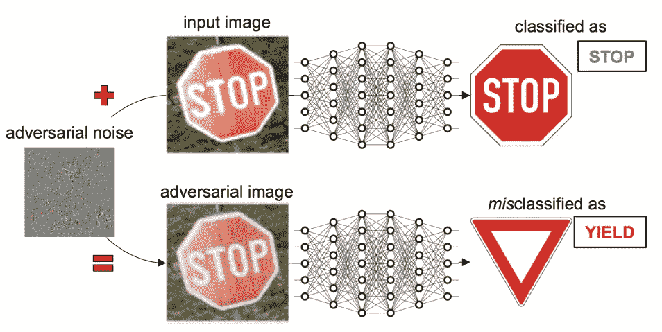
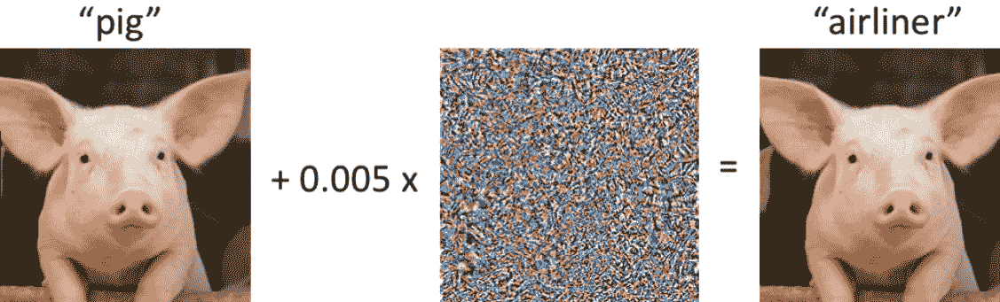
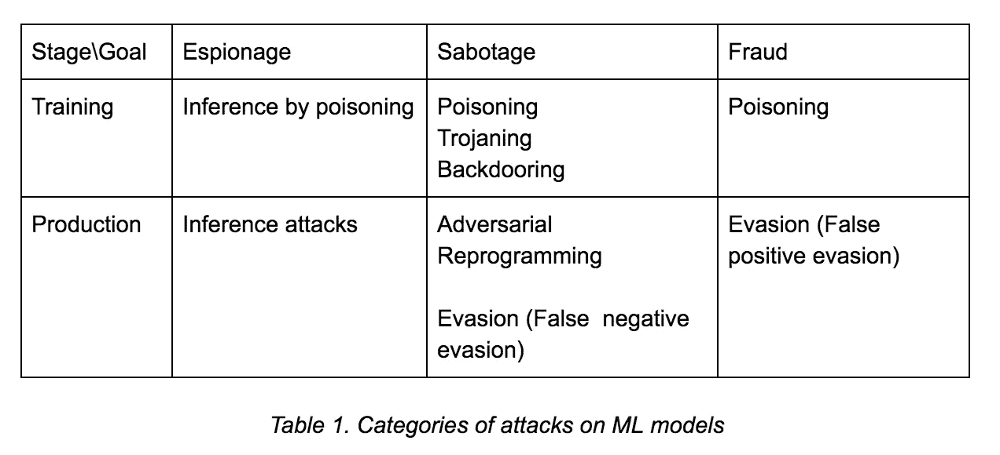
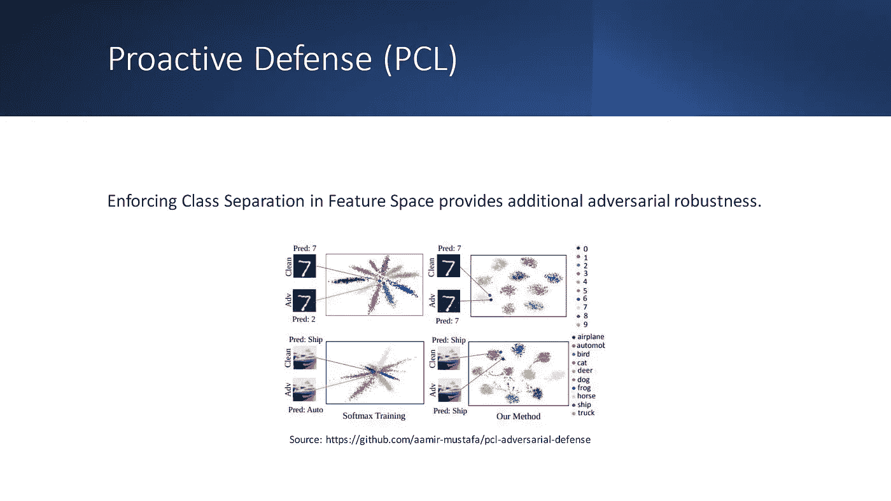

# 机器学习攻击

> 原文：<https://medium.com/mlearning-ai/machine-learning-attack-a92c5359b36d?source=collection_archive---------5----------------------->

破坏 ML 模型|对抗性机器学习|安全措施

Adversarial attack

机器学习模型确实会被黑！！

…

..

是的，你没看错。与任何其他软件类似，机器学习模型可以被黑客攻击和破坏，以破坏应用程序的预期用途。作为一名数据科学家、机器学习工程师或用户，了解不同的攻击和一些可能的解决方案是有用的。

让我们开始，首先探索一些安全攻击的例子…

*   人脸欺骗——人脸识别模型可能会错误地将照片验证为一个人
*   用带有附加噪声的类别(比如猪)的图像呈现的图像分类模型可能被欺骗来预测其他类别(比如客机)

adversarial example

您可能想知道这种攻击是否有任何特定的类别？？好吧，让我们了解一下主要的类别和减少每一类攻击的方法。

可以基于攻击者的预期目标(间谍、破坏、欺诈)和机器学习生命周期中的攻击阶段(培训、生产)来定义对 ML 模型的攻击类别。分别是**规避、投毒、木马、后门、重编程和推理攻击**。

attacks

> 规避、投毒、推理攻击是最常见的。我们将在[简报](https://towardsdatascience.com/how-to-attack-machine-learning-evasion-poisoning-inference-trojans-backdoors-a7cb5832595c)中探索它们

1.  **闪避攻击**

创建扰动样本来误导验证，而不影响模型本身。例如，犯罪分子可以使用逃避攻击来误导人脸识别系统(例如，戴上类似于另一个人的面具)。任何受干扰的样本(看起来像好的输入样本，但实际上在推理时引入了噪声的输入)都可能破坏模型的性能和可靠性。

2.**中毒发作**

一种对抗性攻击，将精心设计的样本注入到**训练数据**中，以改变系统对特定样本或模式的响应和行为。

3.**探索攻击(模型窃取)/推理攻击**

试图窃取关于模型的知识。它不会直接影响模型行为，但是获得的知识可能会造成潜在的攻击威胁。攻击者打算探索系统，例如模型或数据，以获取任何可能派上用场的信息。

> Python 使用 [**SecML**](https://secml.readthedocs.io/en/v0.15/#getting-started) **为安全评估提供了一个有趣的实现。**它配备了规避和中毒对抗性机器学习攻击

**防御**

防御的目标可以是主动的，也可以是被动的。主动防御试图优化人工智能系统，使其对某些输入更加鲁棒，而反应防御旨在检测潜在的安全问题，如改变分布或敌对样本。从广义上来说，主动防御是在训练时应用的，通过训练对某些类型的攻击和输入的鲁棒性。反应性防御，另一方面，处理测试时的防御或推理

一些主要使用的防御方法如下

*   **在特征空间中实施类别分离:**

Proactive defense — enforcing class separation

它试图用对立的输入来训练模型，迫使类簇在一定距离处形成，并最小化对立输入的错误分类的机会。

*   **猴子测试**:一种软件测试，在软件中注入随机输入，目的是破解软件。它有助于识别关键漏洞。这是一种反应性防御。

防御攻击领域是一个活跃的研究领域，并且正在被[广泛探索](https://towardsdatascience.com/adversarial-attacks-in-machine-learning-and-how-to-defend-against-them-a2beed95f49c)。意识到这种攻击的本质是减少其几率的第一步。

**结论**

机器学习被广泛应用于商业、公共服务和政府组织，包括国防。攻击者可能会妨碍各种关键应用程序。我们需要确保我们的人工智能系统的可信度。攻击的性质不断演变，因此行业需要强调针对此类攻击的防御研究，并帮助开发能够成功和失败都很优雅的系统。

> *感谢您的阅读！！我，Sourav Agarwal，打算用数据灌输意识和授权决策。*

## *“学习和创新齐头并进。成功的傲慢是认为你昨天所做的足以应付明天。”——威廉·波拉德*

*沐浴你的❤，跟随它成为持续学习之旅的一部分。我们将共同利用数据来增强决策能力。*

 [## Mlearning.ai 提交建议

### 如何成为 Mlearning.ai 上的作家

medium.com](/mlearning-ai/mlearning-ai-submission-suggestions-b51e2b130bfb)